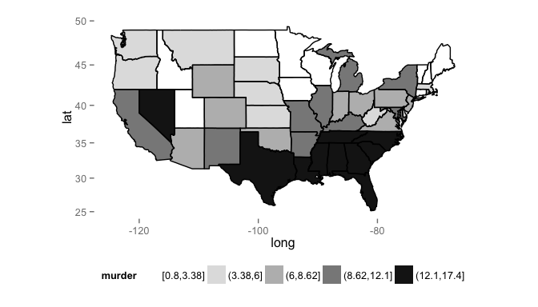

# R Choropleth Demo: US Arrests for Murder by State
Brian High  
Nov. 10th, 2015  

This [code](https://www3.amherst.edu/~nhorton/r2/examples/advanced.R) example was found the [book](https://www.crcpress.com/Using-R-and-RStudio-for-Data-Management-Statistical-Analysis-and-Graphics/Horton-Kleinman/9781482237368):

> Horton, Nicholas J, and Ken Kleinman. *Using R 
> and Rstudio for Data Management, Statistical 
> Analysis, and Graphics*. Boca Raton, Florida: 
> CRC Press, 2015.

We have modified the original script by using a different code block for loading packages and by converting to an Rmd source document.

## Load Packages


```r
# Install packages (if necessary)
for (pkg in c("ggmap", "dplyr")) {
    if (! suppressWarnings(require(pkg, character.only=TRUE)) ) {
        install.packages(pkg, repos="http://cran.fhcrc.org", dependencies=TRUE)
        if (! suppressWarnings(require(pkg, character.only=TRUE)) ) {
            stop(paste0(c("Can't load package: ", pkg, "!"), collapse = ""))
        }
    }
}
```

## Load Data


```r
# From: https://www3.amherst.edu/~nhorton/r2/examples/advanced.R
USArrests.st = mutate(USArrests, 
                      region=tolower(rownames(USArrests)),
                      murder = cut_number(Murder, 5))
us_state_map = map_data('state')
map_data = merge(USArrests.st, us_state_map, by="region")
map_data = arrange(map_data, order)
```

## Generate Choropleth Map


```r
# From: https://www3.amherst.edu/~nhorton/r2/examples/advanced.R
p0 = ggplot(map_data, aes(x=long, y=lat, group=group)) +
    geom_polygon(aes(fill = murder)) +
    geom_path(colour='black') +
    theme(legend.position = "bottom", 
          panel.background=element_rect(fill="transparent",
                                        color=NA)) +
    scale_fill_grey(start=1, end =.1) + coord_map();
plot(p0)
```

 
