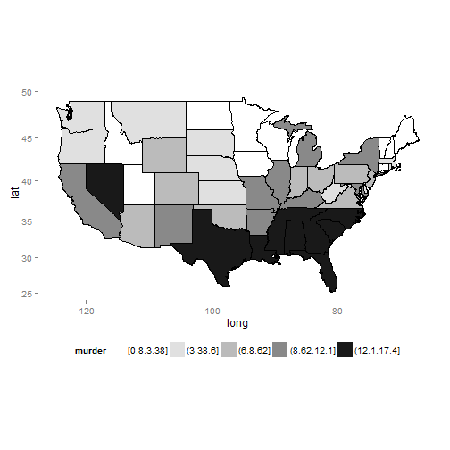

```
## 
## 
## processing file: choropleth_murder.Rmd
```

```
## Error in parse_block(g[-1], g[1], params.src): duplicate label 'choro0'
```

```r
# From: https://www3.amherst.edu/~nhorton/r2/examples/advanced.R
library(ggmap); library(dplyr)
USArrests.st = mutate(USArrests, 
                      region=tolower(rownames(USArrests)),
                      murder = cut_number(Murder, 5))
us_state_map = map_data('state')
map_data = merge(USArrests.st, us_state_map, by="region")
map_data = arrange(map_data, order)
head(select(map_data, region, Murder, murder, long, lat, group, order))
```

```
##    region Murder      murder      long      lat group order
## 1 alabama   13.2 (12.1,17.4] -87.46201 30.38968     1     1
## 2 alabama   13.2 (12.1,17.4] -87.48493 30.37249     1     2
## 3 alabama   13.2 (12.1,17.4] -87.52503 30.37249     1     3
## 4 alabama   13.2 (12.1,17.4] -87.53076 30.33239     1     4
## 5 alabama   13.2 (12.1,17.4] -87.57087 30.32665     1     5
## 6 alabama   13.2 (12.1,17.4] -87.58806 30.32665     1     6
```

```r
# From: https://www3.amherst.edu/~nhorton/r2/examples/advanced.R
p0 = ggplot(map_data, aes(x=long, y=lat, group=group)) +
    geom_polygon(aes(fill = murder)) +
    geom_path(colour='black') +
    theme(legend.position = "bottom", 
          panel.background=element_rect(fill="transparent",
                                        color=NA)) +
    scale_fill_grey(start=1, end =.1) + coord_map();
plot(p0)
```

 

