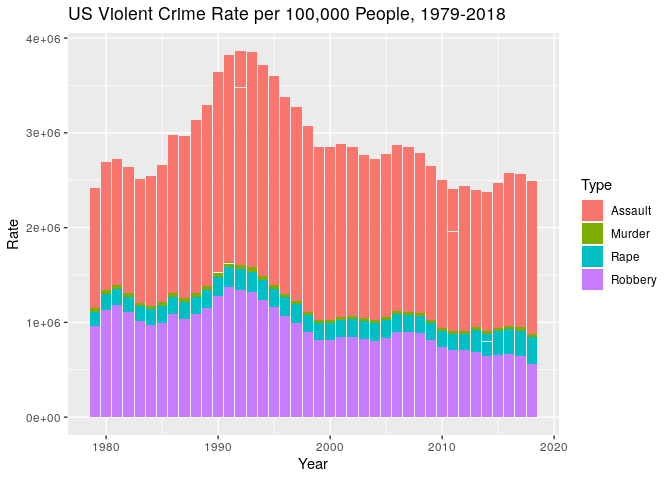

Explore US state crime estimates from the the US DOJ, FBI Uniform Crime 
Reporting (UCR) Program using the Crime Data Explorer (CDE) web interface. Plot
property crime and violent crime for the nation and by state. Use motion charts
to allow dynamic visualization of variables changing over time.

## Data Sources

Link to the FBI Crime Data Explorer (CDE):

* https://crime-data-explorer.fr.cloud.gov/downloads-and-docs

### Data are not entirely comparable

* Changes in reporting from year to year, etc., make comparisons problematic.

### Caution against ranking

The United States Department of Justice says:

"Many entities—news media, tourism agencies, and other groups with an interest 
in crime in our Nation—use figures from the Uniform Crime Reporting (UCR) 
Program to compile rankings of cities and counties.  These rankings, however, 
are merely a quick choice made by the data user; they provide no insight into 
the many variables that mold the crime in a particular town, city, county, 
state, region, or other jurisdiction.  Consequently, these rankings lead to 
simplistic and/or incomplete analyses that often create misleading perceptions
adversely affecting cities and counties, along with their residents."

From: http://www.ucrdatatool.gov/ranking.cfm

## Configure document rendering

Set `knitr` options for nicer rendering this document.


```r
library(knitr)
opts_chunk$set(tidy = FALSE, cache = FALSE, error = TRUE)
```

## Load packages

Load the R packages you will need, installing any that you are missing.


```r
# Load packages
if (! suppressPackageStartupMessages(require(pacman))) {
  install.packages('pacman', repos = 'http://cran.us.r-project.org')
}
pacman::p_load(readr, stringr, tidyr, ggplot2, googleVis, httr, dplyr)
```

## Data Management

### Prepare the data folder

Create the data folder if it does not already exist.


```r
# Create the data folder if needed.
datadir <- "data/doj_ucr"
dir.create(file.path(datadir), showWarnings = FALSE, recursive = TRUE)
```

### Load the crime data

If you have the tidied data file, use that, or if not, use the original data
file. Failing that, download the data from the DOJ and tidy the data.


```r
# Load the crime data into a single data frame.
datafile <- paste(datadir, "CrimeStatebyState.csv", sep = "/")
if (file.exists(datafile) == TRUE) {
  # Read the data file into a data frame.
  us.crime <- read_csv(datafile)
} else {
  # Download the data file.
  csv.url <- paste("http://s3-us-gov-west-1.amazonaws.com",
                   "cg-d4b776d0-d898-4153-90c8-8336f86bdfec",
                   "estimated_crimes_1995_2018.csv", sep = "/")
  res <- GET(csv.url, write_disk(datafile, overwrite = TRUE))
  
  # Read the data file.
  us.crime <- read_csv(datafile)
}
```

## Find the timespan in years

Find minimum and maximum years for dataset timespan. Use this for plot titles.


```r
states <- tibble(state = state.name, state_abbr = state.abb)
us.crime <- us.crime %>% left_join(states, by = c('state_abbr')) %>% 
  mutate(state = ifelse(state_abbr == "DC", "District of Columbia", state)) %>% 
  mutate(state = ifelse(is.na(state_abbr) == TRUE, "United States-Total", state))
min.max.years <- us.crime %>% 
  filter(state != "United States-Total") %>% group_by(state) %>% 
    summarise(min.year = min(year), max.year = max(year))

min.states.year <- min(min.max.years$min.year)
max.states.year <- max(min.max.years$max.year)

max.us.year <- max(us.crime[us.crime$state == "United States-Total", "year"])
min.us.year <- min(us.crime[us.crime$state == "United States-Total", "year"])
```

## Crime rate in the US

Prepare the data.


```r
# Subset just the two US totals of major crime groups: violent and property.
crime.groups <- c("year", "violent_crime", "property_crime")
us.crime.groups <- us.crime[us.crime$state == "United States-Total", 
                            crime.groups]

# Remove "_crime" from variable names and capitalize the names.
names(us.crime.groups) <- str_to_title(gsub("_crime", "", names(us.crime.groups)))

# Transform data structure to "long" format for plotting.
us.crime.groups.long <- gather(us.crime.groups, Type, Rate, -Year)
```

Make a stacked bar plot.


```r
# Make a bar plot of violent crime versus property crime in the US.
ggplot(us.crime.groups.long, aes(x = Year, y = Rate, fill = Type)) +
  geom_bar(stat = 'identity') + 
  ggtitle(paste("US Crime Rate per 100,000 People, ",
                min.us.year, "-", max.us.year, sep = ""))
```

<!-- -->

## Property crime rate in the US

Prepare the data.


```r
# Subset the property crimes.
property <- c("year", "property_crime", "burglary", 
              "larceny", "motor_vehicle_theft", 
              "state", "population")
us.property.crime.by.state <- us.crime %>% select(property) %>% as_tibble()

# Rename crime names (capitalize them).
property <- c("Year", "Property", "Burglary", "Larceny", "Motor_Vehicle_Theft",
             "State", "Population")
names(us.property.crime.by.state) <- property

# Subset to only see US totals not by-state values.
us.property.crime <- us.property.crime.by.state %>%
  filter(State == "United States-Total")

# Transform data structure to "long" form for plotting.
us.property.crime.long <- gather(us.property.crime.by.state, Type, Rate, 
                                 Burglary, Larceny, Motor_Vehicle_Theft)
```

Make a stacked bar plot.


```r
# Make a bar plot of property crime in the US by crime.
ggplot(us.property.crime.long, aes(x = Year, y = Rate, fill = Type)) +
  geom_bar(stat = 'identity') + 
  ggtitle(paste("US Property Crime Rate per 100,000 People, ", 
                min.us.year, "-", max.us.year, sep = ""))
```

<!-- -->

## Violent crime rate in the US

Prepare the data.


```r
# Subset the violent crimes.
violent <- c("year", "homicide", "rape_legacy", "rape_revised", "robbery", 
             "aggravated_assault", "violent_crime", "state", "population")
us.violent.crime.by.state <- us.crime %>% select(violent) %>% as_tibble()

# Rename and capitalize variable names.
violent <- c("Year", "Murder", "Rape_Legacy", "Rape_Revised", "Robbery", 
             "Assault", "Violent", "State", "Population")
names(us.violent.crime.by.state) <- violent

# Combine Rape variables into a single variable, preferring Rape_Revised.
us.violent.crime.by.state <- us.violent.crime.by.state %>% 
  mutate(Rape = ifelse(is.na(Rape_Revised), Rape_Legacy, Rape_Revised))

# Subset to only see US totals not by-state values.
us.violent.crime <- us.violent.crime.by.state %>% 
  filter(State == "United States-Total")

# Transform data structure to "long" form for plotting.
us.violent.crime.long <- us.violent.crime.by.state %>% 
           gather(Type, Rate, Murder, Rape, Robbery, Assault)
```

Make a stacked bar plot.


```r
# Make a bar plot of violent crime in the US by crime.
ggplot(us.violent.crime.long, aes(x = Year, y = Rate, fill = Type)) +
  geom_bar(stat = 'identity') + 
  ggtitle(paste("US Violent Crime Rate per 100,000 People, ", 
                min.us.year, "-", max.us.year, sep = ""))
```

<!-- -->

## US property crime by state

Make a "Motion Chart" of violent crime in the US by state and crime.


```r
# Configure googleVis options.
op <- options(gvis.plot.tag = 'chart')
```

Subset the data and create a plot title variable.


```r
# Subset to only see US states and not the national totals.
us.property.crime.by.state <- us.property.crime.by.state %>% 
  filter(State != "United States-Total") %>%  
  distinct(State, Year, .keep_all = TRUE) %>% as_tibble()

# Make a plot title to use in next heading.
plot.title <- paste("US Property Crime Rate by State per 100,000 People, ", 
  min.states.year, "-", max.states.year, sep = "")
```

### US Property Crime Rate by State per 100,000 People


```r
plot(gvisMotionChart(data = us.property.crime.by.state, idvar = "State", 
                     timevar = "Year", colorvar = "Property",
                     xvar = "Motor_Vehicle_Theft", yvar = "Burglary", 
                     sizevar = "Population",
                     options = list(title = plot.title)))
```

<!-- MotionChart generated in R 3.6.1 by googleVis 0.6.4 package -->
<!-- Wed Oct 16 16:10:05 2019 -->


<!-- jsHeader -->
<script type="text/javascript">
 
// jsData 
function gvisDataMotionChartID3f134e25ad02 () {
var data = new google.visualization.DataTable();
var datajson =
[
 [
"Alaska",
1979,
23193,
5616,
15076,
2501,
406000
],
[
"Alaska",
1980,
22930,
5545,
14916,
2469,
440142
],
[
"Alaska",
1981,
24634,
5479,
16310,
2845,
412000
],
[
"Alaska",
1982,
24479,
5204,
16672,
2603,
438000
],
[
"Alaska",
1983,
25889,
5720,
17085,
3084,
479000
],
[
"Alaska",
1984,
27468,
6184,
18140,
3144,
5e+05
],
[
"Alaska",
1985,
27588,
6209,
18220,
3159,
521000
],
[
"Alaska",
1986,
30307,
6204,
20879,
3224,
534000
],
[
"Alaska",
1987,
25841,
5093,
18195,
2553,
525000
],
[
"Alaska",
1988,
22566,
4321,
15911,
2334,
513000
],
[
"Alaska",
1989,
22567,
4358,
15811,
2398,
527000
],
[
"Alaska",
1990,
25457,
4919,
17428,
3110,
550043
],
[
"Alaska",
1991,
29000,
5582,
20375,
3043,
570000
],
[
"Alaska",
1992,
28816,
5170,
20728,
2918,
587000
],
[
"Alaska",
1993,
28795,
4893,
21201,
2701,
599000
],
[
"Alaska",
1994,
29947,
4848,
21824,
3275,
606000
],
[
"Alaska",
1995,
30097,
5055,
21891,
3151,
604000
],
[
"Alaska",
1996,
28667,
5118,
20557,
2992,
607000
],
[
"Alaska",
1997,
27840,
4276,
20780,
2784,
609000
],
[
"Alaska",
1998,
25316,
4098,
18611,
2607,
614000
],
[
"Alaska",
1999,
23099,
3787,
16654,
2658,
619500
],
[
"Alaska",
2000,
23087,
3899,
16838,
2350,
626932
],
[
"Alaska",
2001,
23160,
3847,
16695,
2618,
633630
],
[
"Alaska",
2002,
24118,
3908,
17739,
2471,
641482
],
[
"Alaska",
2003,
24386,
3874,
18051,
2461,
648280
],
[
"Alaska",
2004,
22172,
3773,
16159,
2240,
657755
],
[
"Alaska",
2005,
23975,
4131,
17249,
2595,
663253
],
[
"Alaska",
2006,
23975,
4155,
17284,
2536,
670053
],
[
"Alaska",
2007,
23096,
3734,
16929,
2433,
683478
],
[
"Alaska",
2008,
20090,
3237,
15225,
1628,
686293
],
[
"Alaska",
2009,
20538,
3600,
15251,
1687,
698473
],
[
"Alaska",
2010,
20259,
3105,
15535,
1619,
714146
],
[
"Alaska",
2011,
19094,
2852,
14854,
1388,
723860
],
[
"Alaska",
2012,
20037,
2950,
15565,
1522,
730307
],
[
"Alaska",
2013,
21211,
2917,
16599,
1695,
737259
],
[
"Alaska",
2014,
20334,
3150,
15445,
1739,
737046
],
[
"Alaska",
2015,
20806,
3511,
15249,
2046,
737709
],
[
"Alaska",
2016,
24876,
4053,
17766,
3057,
741522
],
[
"Alaska",
2017,
26203,
4167,
17782,
4254,
739786
],
[
"Alaska",
2018,
24339,
3979,
16364,
3996,
737438
],
[
"Alabama",
1979,
144372,
48517,
83791,
12064,
3769000
],
[
"Alabama",
1980,
173191,
58952,
102029,
12210,
3861466
],
[
"Alabama",
1981,
173411,
56811,
105471,
11129,
3916000
],
[
"Alabama",
1982,
165048,
49531,
104740,
10777,
3943000
],
[
"Alabama",
1983,
145890,
42485,
94279,
9126,
3959000
],
[
"Alabama",
1984,
138487,
39970,
89198,
9319,
3990000
],
[
"Alabama",
1985,
140115,
41612,
88108,
10395,
4021000
],
[
"Alabama",
1986,
151191,
46974,
93396,
10821,
4053000
],
[
"Alabama",
1987,
158918,
48927,
99260,
10731,
4083000
],
[
"Alabama",
1988,
165209,
50920,
103282,
11007,
4127000
],
[
"Alabama",
1989,
166244,
47224,
106771,
12249,
4118000
],
[
"Alabama",
1990,
169974,
44585,
111336,
14053,
4040587
],
[
"Alabama",
1991,
184882,
51873,
118151,
14858,
4089000
],
[
"Alabama",
1992,
181837,
49053,
117801,
14983,
4136000
],
[
"Alabama",
1993,
171598,
45578,
111878,
14142,
4187000
],
[
"Alabama",
1994,
178015,
44064,
119951,
14000,
4219000
],
[
"Alabama",
1995,
179294,
43586,
120967,
14741,
4253000
],
[
"Alabama",
1996,
181803,
42821,
123350,
15632,
4273000
],
[
"Alabama",
1997,
186809,
43786,
127616,
15407,
4319000
],
[
"Alabama",
1998,
177779,
41965,
120943,
14871,
4352000
],
[
"Alabama",
1999,
171398,
38648,
119616,
13134,
4369862
],
[
"Alabama",
2000,
180539,
40331,
127399,
12809,
4447100
],
[
"Alabama",
2001,
173253,
40642,
119992,
12619,
4468912
],
[
"Alabama",
2002,
180400,
42578,
123932,
13890,
4478896
],
[
"Alabama",
2003,
182241,
43245,
124039,
14957,
4503726
],
[
"Alabama",
2004,
182340,
44666,
123650,
14024,
4525375
],
[
"Alabama",
2005,
177393,
43473,
120780,
13140,
4548327
],
[
"Alabama",
2006,
181249,
44780,
121451,
15018,
4599030
],
[
"Alabama",
2007,
184082,
45379,
124465,
14238,
4627851
],
[
"Alabama",
2008,
190416,
50411,
126539,
13466,
4661900
],
[
"Alabama",
2009,
178007,
48844,
118072,
11091,
4708708
],
[
"Alabama",
2010,
168828,
42484,
115564,
10780,
4785401
],
[
"Alabama",
2011,
173192,
51119,
111411,
10662,
4803689
],
[
"Alabama",
2012,
168878,
47481,
111523,
9874,
4817528
],
[
"Alabama",
2013,
161835,
42410,
108862,
10563,
4833996
],
[
"Alabama",
2014,
154087,
39723,
104223,
10141,
4846411
],
[
"Alabama",
2015,
144785,
35265,
99182,
10338,
4853875
],
[
"Alabama",
2016,
143259,
34045,
97498,
11716,
4860545
],
[
"Alabama",
2017,
143774,
31270,
99707,
12797,
4875120
],
[
"Alabama",
2018,
137700,
28841,
95747,
13112,
4887871
],
[
"Arkansas",
1979,
70949,
21457,
45267,
4225,
2180000
],
[
"Arkansas",
1980,
79390,
25559,
49558,
4273,
2284037
],
[
"Arkansas",
1981,
79972,
24732,
50959,
4281,
2294000
],
[
"Arkansas",
1982,
81259,
24547,
52450,
4262,
2291000
],
[
"Arkansas",
1983,
74563,
22380,
48140,
4043,
2328000
],
[
"Arkansas",
1984,
71554,
20810,
46807,
3937,
2349000
],
[
"Arkansas",
1985,
76372,
22207,
49957,
4208,
2359000
],
[
"Arkansas",
1986,
83729,
24429,
54677,
4623,
2372000
],
[
"Arkansas",
1987,
91537,
25743,
60862,
4932,
2388000
],
[
"Arkansas",
1988,
91962,
26443,
60363,
5156,
2422000
],
[
"Arkansas",
1989,
98213,
28738,
63084,
6391,
2406000
],
[
"Arkansas",
1990,
101897,
28464,
66630,
6803,
2350725
],
[
"Arkansas",
1991,
108677,
29093,
71487,
8097,
2372000
],
[
"Arkansas",
1992,
100402,
26214,
66288,
7900,
2399000
],
[
"Arkansas",
1993,
102231,
26646,
67767,
7818,
2424000
],
[
"Arkansas",
1994,
103115,
26911,
68478,
7726,
2453000
],
[
"Arkansas",
1995,
102780,
24763,
69935,
8082,
2484000
],
[
"Arkansas",
1996,
104790,
23925,
73010,
7855,
2510000
],
[
"Arkansas",
1997,
105759,
25568,
72253,
7938,
2523000
],
[
"Arkansas",
1998,
96271,
23559,
65525,
7187,
2538000
],
[
"Arkansas",
1999,
92283,
21692,
63927,
6664,
2551373
],
[
"Arkansas",
2000,
98115,
21443,
69740,
6932,
2673400
],
[
"Arkansas",
2001,
99106,
22196,
69590,
7320,
2694698
],
[
"Arkansas",
2002,
101171,
23229,
71129,
6813,
2706268
],
[
"Arkansas",
2003,
99084,
25016,
68061,
6007,
2727774
],
[
"Arkansas",
2004,
110911,
30151,
74242,
6518,
2750000
],
[
"Arkansas",
2005,
112914,
30118,
75510,
7286,
2775708
],
[
"Arkansas",
2006,
112025,
31864,
72646,
7515,
2810872
],
[
"Arkansas",
2007,
112130,
32035,
73096,
6999,
2834797
],
[
"Arkansas",
2008,
110360,
33912,
69905,
6543,
2855390
],
[
"Arkansas",
2009,
109078,
34753,
68228,
6097,
2889450
],
[
"Arkansas",
2010,
103820,
32463,
65796,
5561,
2921588
],
[
"Arkansas",
2011,
110430,
34016,
70645,
5769,
2938582
],
[
"Arkansas",
2012,
109389,
32673,
70982,
5734,
2949828
],
[
"Arkansas",
2013,
106477,
30369,
70430,
5678,
2958765
],
[
"Arkansas",
2014,
99452,
24816,
69001,
5635,
2966835
],
[
"Arkansas",
2015,
97391,
22851,
68720,
5820,
2977853
],
[
"Arkansas",
2016,
98092,
23814,
67091,
7187,
2988231
],
[
"Arkansas",
2017,
94419,
22369,
64795,
7255,
3002997
],
[
"Arkansas",
2018,
87793,
19193,
61487,
7113,
3013825
],
[
"Arizona",
1979,
177977,
48916,
116976,
12085,
2450000
],
[
"Arizona",
1980,
204193,
58527,
132814,
12852,
2715357
],
[
"Arizona",
1981,
196575,
57655,
127469,
11451,
2793000
],
[
"Arizona",
1982,
189161,
53861,
124723,
10577,
2860000
],
[
"Arizona",
1983,
174740,
49440,
114721,
10579,
2963000
],
[
"Arizona",
1984,
182670,
52327,
118604,
11739,
3053000
],
[
"Arizona",
1985,
207591,
59585,
135720,
12286,
3187000
],
[
"Arizona",
1986,
221015,
63278,
143845,
13892,
3317000
],
[
"Arizona",
1987,
222663,
55059,
153296,
14308,
3386000
],
[
"Arizona",
1988,
237808,
54773,
167121,
15914,
3466000
],
[
"Arizona",
1989,
265284,
59284,
181574,
24426,
3556000
],
[
"Arizona",
1990,
265229,
61206,
172375,
31648,
3665228
],
[
"Arizona",
1991,
252559,
60281,
159987,
32291,
3750000
],
[
"Arizona",
1992,
243629,
54095,
158053,
31481,
3832000
],
[
"Arizona",
1993,
264371,
57684,
172689,
33998,
3936000
],
[
"Arizona",
1994,
294273,
60157,
190649,
43467,
4075000
],
[
"Arizona",
1995,
316355,
59762,
207763,
48830,
4218000
],
[
"Arizona",
1996,
284964,
55630,
188300,
41034,
4428000
],
[
"Arizona",
1997,
299323,
60077,
195045,
44201,
4555000
],
[
"Arizona",
1998,
280001,
56473,
183137,
40391,
4669000
],
[
"Arizona",
1999,
255401,
49423,
167731,
38247,
4778332
],
[
"Arizona",
2000,
271811,
51902,
176705,
43204,
5130632
],
[
"Arizona",
2001,
293874,
54821,
186850,
52203,
5306966
],
[
"Arizona",
2002,
318296,
59087,
201541,
57668,
5441125
],
[
"Arizona",
2003,
314335,
58613,
198725,
56997,
5579222
],
[
"Arizona",
2004,
291203,
56885,
179012,
55306,
5739879
],
[
"Arizona",
2005,
287345,
56328,
176112,
54905,
5953007
],
[
"Arizona",
2006,
294389,
59418,
178321,
56650,
6166318
],
[
"Arizona",
2007,
287308,
59988,
177076,
50244,
6338755
],
[
"Arizona",
2008,
266653,
58606,
169460,
38587,
6500180
],
[
"Arizona",
2009,
236721,
54308,
155976,
26437,
6595778
],
[
"Arizona",
2010,
226802,
50932,
154137,
21733,
6413158
],
[
"Arizona",
2011,
229896,
54695,
155400,
19801,
6467315
],
[
"Arizona",
2012,
231701,
52911,
159808,
18982,
6551149
],
[
"Arizona",
2013,
223294,
48292,
158036,
16966,
6634997
],
[
"Arizona",
2014,
213406,
43412,
152683,
17311,
6728783
],
[
"Arizona",
2015,
207184,
38010,
152388,
16786,
6817565
],
[
"Arizona",
2016,
207317,
38216,
150618,
18483,
6908642
],
[
"Arizona",
2017,
204999,
37722,
148251,
19026,
7048876
],
[
"Arizona",
2018,
191974,
31532,
141303,
19139,
7171646
],
[
"California",
1979,
1511021,
496310,
847148,
167563,
22696000
],
[
"California",
1980,
1633042,
545138,
913070,
174834,
23532680
],
[
"California",
1981,
1625302,
540806,
921939,
162557,
24159000
],
[
"California",
1982,
1599827,
499466,
935831,
164530,
24724000
],
[
"California",
1983,
1486487,
460460,
867123,
158904,
25174000
],
[
"California",
1984,
1461731,
443094,
857328,
161309,
25622000
],
[
"California",
1985,
1516710,
448506,
890967,
177237,
26365000
],
[
"California",
1986,
1576299,
457698,
913004,
205597,
26981000
],
[
"California",
1987,
1545928,
419969,
896335,
229624,
27663000
],
[
"California",
1988,
1607180,
407631,
933636,
265913,
28168000
],
[
"California",
1989,
1681516,
410468,
972603,
298445,
29063000
],
[
"California",
1990,
1654186,
400392,
951580,
302214,
29760021
],
[
"California",
1991,
1726391,
424656,
986120,
315615,
30380000
],
[
"California",
1992,
1716137,
427491,
968534,
320112,
30867000
],
[
"California",
1993,
1678884,
414182,
945407,
319295,
31211000
],
[
"California",
1994,
1622102,
384257,
929640,
308205,
31431000
],
[
"California",
1995,
1536830,
353895,
902456,
280479,
31589000
],
[
"California",
1996,
1385135,
312212,
830457,
242466,
31878000
],
[
"California",
1997,
1312367,
299240,
784405,
228722,
32268000
],
[
"California",
1998,
1188791,
269012,
724262,
195517,
32667000
],
[
"California",
1999,
1053285,
223814,
660991,
168480,
33145121
],
[
"California",
2000,
1056183,
222293,
651855,
182035,
33871648
],
[
"California",
2001,
1134189,
232273,
697739,
204177,
34600463
],
[
"California",
2002,
1176484,
238428,
715692,
222364,
35001986
],
[
"California",
2003,
1215086,
242274,
731486,
241326,
35462712
],
[
"California",
2004,
1227194,
245903,
728687,
252604,
35842038
],
[
"California",
2005,
1200531,
250521,
692467,
257543,
36154147
],
[
"California",
2006,
1159988,
247230,
669103,
243655,
36457549
],
[
"California",
2007,
1112510,
237850,
654526,
220134,
36553215
],
[
"California",
2008,
1080996,
237811,
650656,
192529,
36756666
],
[
"California",
2009,
1009433,
230198,
615402,
163833,
36961664
],
[
"California",
2010,
981939,
228857,
600558,
152524,
37338198
],
[
"California",
2011,
973822,
230075,
596905,
146842,
37683933
],
[
"California",
2012,
1049465,
245767,
635090,
168608,
37999878
],
[
"California",
2013,
1018907,
232058,
621557,
165292,
38431393
],
[
"California",
2014,
947193,
202669,
592673,
151851,
38792291
],
[
"California",
2015,
1024914,
197404,
656517,
170993,
38993940
],
[
"California",
2016,
1002070,
188304,
637010,
176756,
39296476
],
[
"California",
2017,
987063,
176679,
642019,
168365,
39399349
],
[
"California",
2018,
941618,
164632,
621775,
155211,
39557045
],
[
"Colorado",
1979,
180984,
49741,
117898,
13345,
2772000
],
[
"Colorado",
1980,
195872,
58455,
124514,
12903,
2878407
],
[
"Colorado",
1981,
202119,
60197,
129658,
12264,
2963000
],
[
"Colorado",
1982,
200230,
53260,
134873,
12097,
3045000
],
[
"Colorado",
1983,
193070,
48101,
133271,
11698,
3139000
],
[
"Colorado",
1984,
191104,
49619,
128859,
12626,
3178000
],
[
"Colorado",
1985,
208336,
56480,
137868,
13988,
3231000
],
[
"Colorado",
1986,
212626,
58531,
138219,
15876,
3267000
],
[
"Colorado",
1987,
197225,
50580,
132266,
14379,
3296000
],
[
"Colorado",
1988,
187719,
45503,
128331,
13885,
3290000
],
[
"Colorado",
1989,
184692,
41475,
128195,
15022,
3317000
],
[
"Colorado",
1990,
182106,
39822,
128172,
14112,
3294394
],
[
"Colorado",
1991,
186235,
39117,
132717,
14401,
3377000
],
[
"Colorado",
1992,
186684,
37853,
131169,
17662,
3470000
],
[
"Colorado",
1993,
176856,
36011,
124787,
16058,
3566000
],
[
"Colorado",
1994,
175808,
33843,
127600,
14365,
3656000
],
[
"Colorado",
1995,
185705,
35001,
136184,
14520,
3747000
],
[
"Colorado",
1996,
180218,
34436,
130576,
15206,
3823000
],
[
"Colorado",
1997,
166902,
30994,
119801,
16107,
3893000
],
[
"Colorado",
1998,
163189,
31231,
115871,
16087,
3971000
],
[
"Colorado",
1999,
151002,
26979,
109228,
14795,
4056133
],
[
"Colorado",
2000,
156937,
27133,
112843,
16961,
4301261
],
[
"Colorado",
2001,
170887,
28533,
121360,
20994,
4430989
],
[
"Colorado",
2002,
180054,
31678,
125193,
23183,
4501051
],
[
"Colorado",
2003,
179706,
32394,
124496,
22816,
4547633
],
[
"Colorado",
2004,
180322,
33010,
123308,
24004,
4601821
],
[
"Colorado",
2005,
188449,
34746,
127602,
26101,
4663295
],
[
"Colorado",
2006,
163439,
32411,
110372,
20656,
4753377
],
[
"Colorado",
2007,
145808,
28633,
100519,
16656,
4861515
],
[
"Colorado",
2008,
139340,
28054,
97937,
13349,
4939456
],
[
"Colorado",
2009,
134196,
26637,
95079,
12480,
5024748
],
[
"Colorado",
2010,
135001,
26196,
97534,
11271,
5047692
],
[
"Colorado",
2011,
132781,
25725,
96054,
11002,
5116302
],
[
"Colorado",
2012,
139355,
26163,
101091,
12101,
5189458
],
[
"Colorado",
2013,
139974,
25075,
102375,
12524,
5272086
],
[
"Colorado",
2014,
135789,
23502,
99688,
12599,
5355588
],
[
"Colorado",
2015,
144044,
23490,
104532,
16022,
5448819
],
[
"Colorado",
2016,
152146,
23825,
108680,
19641,
5530105
],
[
"Colorado",
2017,
152032,
22618,
107470,
21944,
5615902
],
[
"Colorado",
2018,
152163,
21371,
109119,
21673,
5695564
],
[
"Connecticut",
1979,
167131,
48229,
96997,
21905,
3115000
],
[
"Connecticut",
1980,
169283,
52638,
95631,
21014,
3095224
],
[
"Connecticut",
1981,
168790,
52990,
96927,
18873,
3132000
],
[
"Connecticut",
1982,
158532,
44481,
96640,
17411,
3153000
],
[
"Connecticut",
1983,
144437,
39988,
89421,
15028,
3138000
],
[
"Connecticut",
1984,
133573,
35607,
84630,
13336,
3154000
],
[
"Connecticut",
1985,
136572,
36041,
86524,
14007,
3174000
],
[
"Connecticut",
1986,
140411,
38190,
87963,
14258,
3189000
],
[
"Connecticut",
1987,
146958,
39120,
90852,
16986,
3211000
],
[
"Connecticut",
1988,
150455,
39477,
91079,
19899,
3241000
],
[
"Connecticut",
1989,
154119,
40035,
91483,
22601,
3239000
],
[
"Connecticut",
1990,
158867,
40355,
94485,
24027,
3287116
],
[
"Connecticut",
1991,
158770,
39198,
93384,
26188,
3291000
],
[
"Connecticut",
1992,
149535,
36372,
89463,
23700,
3281000
],
[
"Connecticut",
1993,
137443,
32052,
85876,
19515,
3277000
],
[
"Connecticut",
1994,
134030,
29142,
84721,
20167,
3275000
],
[
"Connecticut",
1995,
134188,
29095,
87401,
17692,
3275000
],
[
"Connecticut",
1996,
124924,
27574,
81328,
16022,
3274000
],
[
"Connecticut",
1997,
117505,
24143,
78821,
14541,
3270000
],
[
"Connecticut",
1998,
111978,
21801,
77472,
12705,
3274000
],
[
"Connecticut",
1999,
99894,
19298,
69299,
11297,
3282031
],
[
"Connecticut",
2000,
99033,
17436,
68498,
13099,
3405565
],
[
"Connecticut",
2001,
95299,
17159,
65762,
12378,
3434602
],
[
"Connecticut",
2002,
93426,
17111,
64735,
11580,
3458587
],
[
"Connecticut",
2003,
92981,
16043,
65568,
11370,
3486960
],
[
"Connecticut",
2004,
93942,
15959,
66770,
11213,
3498966
],
[
"Connecticut",
2005,
90270,
15245,
64416,
10609,
3500701
],
[
"Connecticut",
2006,
90638,
15583,
64765,
10290,
3504809
],
[
"Connecticut",
2007,
86528,
15640,
60937,
9951,
3502309
],
[
"Connecticut",
2008,
87210,
15107,
63212,
8891,
3501252
],
[
"Connecticut",
2009,
82625,
15172,
59992,
7461,
3518288
],
[
"Connecticut",
2010,
78259,
15145,
56413,
6701,
3575498
],
[
"Connecticut",
2011,
77205,
15468,
55067,
6670,
3586717
],
[
"Connecticut",
2012,
77169,
14787,
55904,
6478,
3591765
],
[
"Connecticut",
2013,
71274,
12934,
52099,
6241,
3599341
],
[
"Connecticut",
2014,
69326,
12017,
51195,
6114,
3594762
],
[
"Connecticut",
2015,
65610,
10286,
48898,
6426,
3584730
],
[
"Connecticut",
2016,
64875,
10107,
47642,
7126,
3587685
],
[
"Connecticut",
2017,
63646,
8906,
47418,
7322,
3573880
],
[
"Connecticut",
2018,
60055,
7948,
44724,
7383,
3572665
],
[
"District of Columbia",
1979,
45877,
13452,
28819,
3606,
656000
],
[
"District of Columbia",
1980,
50896,
16260,
31068,
3568,
635233
],
[
"District of Columbia",
1981,
53442,
16832,
32845,
3765,
636000
],
[
"District of Columbia",
1982,
52295,
14774,
33435,
4086,
631000
],
[
"District of Columbia",
1983,
45843,
12483,
29405,
3955,
623000
],
[
"District of Columbia",
1984,
42799,
10954,
27471,
4374,
623000
],
[
"District of Columbia",
1985,
39904,
10005,
24874,
5025,
626000
],
[
"District of Columbia",
1986,
42781,
10815,
25861,
6105,
626000
],
[
"District of Columbia",
1987,
42553,
11244,
25012,
6297,
622000
],
[
"District of Columbia",
1988,
49557,
12300,
28624,
8633,
620000
],
[
"District of Columbia",
1989,
49235,
11780,
29164,
8291,
604000
],
[
"District of Columbia",
1990,
50470,
12035,
30326,
8109,
606900
],
[
"District of Columbia",
1991,
49722,
12405,
29182,
8135,
598000
],
[
"District of Columbia",
1992,
50502,
10721,
30663,
9118,
589000
],
[
"District of Columbia",
1993,
51091,
11534,
31495,
8062,
578000
],
[
"District of Columbia",
1994,
48009,
10037,
29711,
8261,
570000
],
[
"District of Columbia",
1995,
52697,
10185,
32319,
10193,
554000
],
[
"District of Columbia",
1996,
51188,
9828,
31385,
9975,
543000
],
[
"District of Columbia",
1997,
41341,
6963,
26809,
7569,
529000
],
[
"District of Columbia",
1998,
37222,
6361,
24360,
6501,
523000
],
[
"District of Columbia",
1999,
33420,
5067,
21701,
6652,
519000
],
[
"District of Columbia",
2000,
33000,
4745,
21655,
6600,
572059
],
[
"District of Columbia",
2001,
35232,
4949,
22313,
7970,
573822
],
[
"District of Columbia",
2002,
36477,
5170,
21708,
9599,
569157
],
[
"District of Columbia",
2003,
32696,
4671,
18119,
9906,
557620
],
[
"District of Columbia",
2004,
26896,
3946,
14542,
8408,
554239
],
[
"District of Columbia",
2005,
26133,
3577,
14836,
7720,
582049
],
[
"District of Columbia",
2006,
27064,
3835,
15908,
7321,
581530
],
[
"District of Columbia",
2007,
28922,
3926,
17390,
7606,
588292
],
[
"District of Columbia",
2008,
30211,
3788,
19958,
6465,
591833
],
[
"District of Columbia",
2009,
28495,
3696,
19267,
5532,
599657
],
[
"District of Columbia",
2010,
28802,
4233,
19514,
5055,
604912
],
[
"District of Columbia",
2011,
29654,
3850,
21347,
4457,
619020
],
[
"District of Columbia",
2012,
30757,
3519,
23575,
3663,
633427
],
[
"District of Columbia",
2013,
31097,
3316,
24547,
3234,
649111
],
[
"District of Columbia",
2014,
34147,
3466,
26898,
3783,
659836
],
[
"District of Columbia",
2015,
31444,
2971,
25208,
3265,
670377
],
[
"District of Columbia",
2016,
32377,
2361,
27089,
2927,
684336
],
[
"District of Columbia",
2017,
29736,
1809,
25340,
2587,
695691
],
[
"District of Columbia",
2018,
30724,
1788,
26343,
2593,
702455
],
[
"Delaware",
1979,
34853,
8890,
23081,
2882,
582000
],
[
"Delaware",
1980,
37482,
9698,
25077,
2707,
594779
],
[
"Delaware",
1981,
36958,
9627,
24759,
2572,
598000
],
[
"Delaware",
1982,
35067,
8698,
23891,
2478,
602000
],
[
"Delaware",
1983,
30378,
7414,
20908,
2056,
606000
],
[
"Delaware",
1984,
28021,
6678,
19747,
1596,
613000
],
[
"Delaware",
1985,
28164,
6826,
19638,
1700,
622000
],
[
"Delaware",
1986,
27881,
6598,
19562,
1721,
633000
],
[
"Delaware",
1987,
29032,
6572,
20453,
2007,
644000
],
[
"Delaware",
1988,
28693,
6868,
19824,
2001,
660000
],
[
"Delaware",
1989,
28998,
6072,
20294,
2632,
673000
],
[
"Delaware",
1990,
31344,
6465,
21922,
2957,
666168
],
[
"Delaware",
1991,
35055,
7668,
24836,
2551,
680000
],
[
"Delaware",
1992,
29126,
6598,
20419,
2109,
689000
],
[
"Delaware",
1993,
29304,
6244,
20853,
2207,
7e+05
],
[
"Delaware",
1994,
29971,
6198,
20828,
2945,
706000
],
[
"Delaware",
1995,
31790,
6491,
22329,
2970,
717000
],
[
"Delaware",
1996,
30643,
5830,
21665,
3148,
725000
],
[
"Delaware",
1997,
36578,
6421,
25904,
4253,
732000
],
[
"Delaware",
1998,
34230,
6395,
24649,
3186,
744000
],
[
"Delaware",
1999,
30922,
5245,
22634,
3043,
753538
],
[
"Delaware",
2000,
29727,
5216,
21360,
3151,
783600
],
[
"Delaware",
2001,
27399,
5144,
19476,
2779,
796599
],
[
"Delaware",
2002,
26967,
5355,
18555,
3057,
805945
],
[
"Delaware",
2003,
27943,
6066,
18933,
2944,
818166
],
[
"Delaware",
2004,
27256,
5669,
19285,
2302,
830069
],
[
"Delaware",
2005,
26245,
5811,
18085,
2349,
841741
],
[
"Delaware",
2006,
29670,
6337,
20449,
2884,
853476
],
[
"Delaware",
2007,
29216,
6420,
20454,
2342,
864764
],
[
"Delaware",
2008,
31385,
6783,
22045,
2557,
873092
],
[
"Delaware",
2009,
29685,
6943,
20836,
1906,
885122
],
[
"Delaware",
2010,
31078,
7550,
21593,
1935,
899792
],
[
"Delaware",
2011,
31163,
7617,
22001,
1545,
908137
],
[
"Delaware",
2012,
30707,
7389,
21880,
1438,
917053
],
[
"Delaware",
2013,
29001,
6299,
21347,
1355,
925240
],
[
"Delaware",
2014,
27915,
5765,
20885,
1265,
935968
],
[
"Delaware",
2015,
25545,
4797,
19555,
1193,
944076
],
[
"Delaware",
2016,
26370,
5028,
19812,
1530,
952698
],
[
"Delaware",
2017,
23430,
3960,
18108,
1362,
957078
],
[
"Delaware",
2018,
22481,
3158,
17847,
1476,
967171
],
[
"Florida",
1979,
607281,
190884,
378099,
38298,
8860000
],
[
"Florida",
1980,
709730,
239825,
424223,
45682,
9567112
],
[
"Florida",
1981,
718470,
241536,
431222,
45712,
10166000
],
[
"Florida",
1982,
684166,
211932,
427462,
44772,
10416000
],
[
"Florida",
1983,
635934,
191902,
400796,
43236,
10680000
],
[
"Florida",
1984,
653429,
198446,
408153,
46830,
10976000
],
[
"Florida",
1985,
753918,
228402,
465792,
59724,
11366000
],
[
"Florida",
1986,
839651,
259331,
510496,
69824,
11675000
],
[
"Florida",
1987,
899167,
271346,
546466,
81355,
12023000
],
[
"Florida",
1988,
967869,
283960,
589215,
94694,
12377000
],
[
"Florida",
1989,
975042,
289254,
583702,
102086,
12671000
],
[
"Florida",
1990,
978944,
280832,
591210,
106902,
12937926
],
[
"Florida",
1991,
977570,
266313,
607222,
104035,
13277000
],
[
"Florida",
1992,
964533,
254755,
598093,
111685,
13488000
],
[
"Florida",
1993,
977363,
251063,
603784,
122516,
13679000
],
[
"Florida",
1994,
991105,
237341,
626578,
127186,
13953000
],
[
"Florida",
1995,
939288,
215657,
612311,
111320,
14166000
],
[
"Florida",
1996,
928273,
219056,
605448,
103769,
14400000
],
[
"Florida",
1997,
915613,
213926,
594492,
107195,
14654000
],
[
"Florida",
1998,
887107,
203105,
579752,
104250,
14916000
],
[
"Florida",
1999,
808674,
181378,
534105,
93191,
15111244
],
[
"Florida",
2000,
780377,
172898,
518298,
89181,
15982378
],
[
"Florida",
2001,
782517,
176052,
516548,
89917,
16373330
],
[
"Florida",
2002,
777236,
177242,
511478,
88516,
16691701
],
[
"Florida",
2003,
757696,
170644,
505489,
81563,
16999181
],
[
"Florida",
2004,
727141,
166332,
482484,
78325,
17385430
],
[
"Florida",
2005,
712998,
164783,
472912,
75303,
17768191
],
[
"Florida",
2006,
721101,
170873,
473774,
76454,
18089888
],
[
"Florida",
2007,
746249,
181836,
490783,
73630,
18251243
],
[
"Florida",
2008,
758889,
188472,
506902,
63515,
18328340
],
[
"Florida",
2009,
712010,
181884,
479867,
50259,
18537969
],
[
"Florida",
2010,
669035,
169119,
458454,
41462,
18838613
],
[
"Florida",
2011,
671200,
170171,
461408,
39621,
19082262
],
[
"Florida",
2012,
632988,
153563,
442095,
37330,
19320749
],
[
"Florida",
2013,
607170,
138915,
433344,
34911,
19600311
],
[
"Florida",
2014,
583774,
121379,
426197,
36198,
19905569
],
[
"Florida",
2015,
570270,
109268,
420341,
40661,
20244914
],
[
"Florida",
2016,
553812,
100325,
410352,
43135,
20656589
],
[
"Florida",
2017,
527125,
88835,
395375,
42915,
20976812
],
[
"Florida",
2018,
486017,
71933,
372919,
41165,
21299325
],
[
"Georgia",
1979,
248641,
81579,
145758,
21304,
5118000
],
[
"Georgia",
1980,
272652,
91773,
160764,
20115,
5400851
],
[
"Georgia",
1981,
282926,
93121,
171170,
18635,
5569000
],
[
"Georgia",
1982,
267097,
84469,
165049,
17579,
5639000
],
[
"Georgia",
1983,
232062,
72614,
143398,
16050,
5732000
],
[
"Georgia",
1984,
234621,
70310,
147251,
17060,
5837000
],
[
"Georgia",
1985,
275070,
81070,
171950,
22050,
5976000
],
[
"Georgia",
1986,
297130,
88695,
182171,
26264,
6104000
],
[
"Georgia",
1987,
324511,
96572,
197302,
30637,
6222000
],
[
"Georgia",
1988,
362376,
103106,
223768,
35502,
6401000
],
[
"Georgia",
1989,
407868,
110215,
255578,
42075,
6436000
],
[
"Georgia",
1990,
389165,
104905,
240623,
43637,
6478216
],
[
"Georgia",
1991,
381165,
100317,
240359,
40489,
6623000
],
[
"Georgia",
1992,
382934,
97402,
246619,
38913,
6751000
],
[
"Georgia",
1993,
378348,
90423,
246849,
41076,
6917000
],
[
"Georgia",
1994,
376926,
81406,
256208,
39312,
7055000
],
[
"Georgia",
1995,
385005,
76324,
264872,
43809,
7201000
],
[
"Georgia",
1996,
416986,
81968,
288803,
46215,
7353000
],
[
"Georgia",
1997,
388155,
81320,
262263,
44572,
7486000
],
[
"Georgia",
1998,
373717,
75720,
255459,
42538,
7642000
],
[
"Georgia",
1999,
359383,
71429,
247834,
40120,
7788240
],
[
"Georgia",
2000,
347630,
68488,
240440,
38702,
8186453
],
[
"Georgia",
2001,
347872,
71799,
238484,
37589,
8405677
],
[
"Georgia",
2002,
346559,
73932,
234591,
38036,
8544005
],
[
"Georgia",
2003,
369589,
79001,
247196,
43392,
8676460
],
[
"Georgia",
2004,
376656,
82992,
249426,
44238,
8918129
],
[
"Georgia",
2005,
378534,
84463,
249594,
44477,
9132553
],
[
"Georgia",
2006,
362712,
85140,
234445,
43127,
9363941
],
[
"Georgia",
2007,
371248,
90294,
238436,
42518,
9544750
],
[
"Georgia",
2008,
387917,
100564,
247709,
39644,
9685744
],
[
"Georgia",
2009,
360985,
98606,
229216,
33163,
9829211
],
[
"Georgia",
2010,
353449,
96947,
226161,
30341,
9712157
],
[
"Georgia",
2011,
357235,
96014,
231543,
29678,
9812460
],
[
"Georgia",
2012,
339473,
86992,
223875,
28606,
9915646
],
[
"Georgia",
2013,
339808,
83459,
229190,
27159,
9994759
],
[
"Georgia",
2014,
339146,
78029,
233359,
27758,
10097132
],
[
"Georgia",
2015,
316013,
68149,
220715,
27149,
10199398
],
[
"Georgia",
2016,
307305,
62715,
218127,
26463,
10313620
],
[
"Georgia",
2017,
297651,
55363,
216252,
26036,
10413055
],
[
"Georgia",
2018,
270738,
45369,
200609,
24760,
10519475
],
[
"Hawaii",
1979,
63664,
16538,
40580,
6546,
915000
],
[
"Hawaii",
1980,
69291,
17822,
45564,
5905,
964680
],
[
"Hawaii",
1981,
61636,
16726,
40699,
4211,
979000
],
[
"Hawaii",
1982,
62906,
16477,
42248,
4181,
994000
],
[
"Hawaii",
1983,
56853,
13636,
38920,
4297,
1023000
],
[
"Hawaii",
1984,
54573,
12609,
38329,
3635,
1039000
],
[
"Hawaii",
1985,
52501,
12164,
37357,
2980,
1054000
],
[
"Hawaii",
1986,
57626,
14218,
39922,
3486,
1062000
],
[
"Hawaii",
1987,
60157,
12515,
43678,
3964,
1083000
],
[
"Hawaii",
1988,
62650,
13726,
44946,
3978,
1093000
],
[
"Hawaii",
1989,
66723,
14939,
47374,
4410,
1112000
],
[
"Hawaii",
1990,
64563,
13611,
46735,
4217,
1108229
],
[
"Hawaii",
1991,
65020,
14011,
47195,
3814,
1135000
],
[
"Hawaii",
1992,
67901,
13006,
50544,
4351,
1160000
],
[
"Hawaii",
1993,
70505,
13310,
51912,
5283,
1172000
],
[
"Hawaii",
1994,
75672,
14029,
55260,
6383,
1179000
],
[
"Hawaii",
1995,
81938,
13832,
59907,
8199,
1187000
],
[
"Hawaii",
1996,
74639,
12781,
54701,
7157,
1184000
],
[
"Hawaii",
1997,
68193,
12741,
48984,
6468,
1187000
],
[
"Hawaii",
1998,
60677,
11169,
43914,
5594,
1193000
],
[
"Hawaii",
1999,
54539,
9421,
40458,
4660,
1185497
],
[
"Hawaii",
2000,
60033,
10665,
43254,
6114,
1211537
],
[
"Hawaii",
2001,
62830,
11162,
44925,
6743,
1227024
],
[
"Hawaii",
2002,
71976,
12722,
49344,
9910,
1240663
],
[
"Hawaii",
2003,
65867,
11409,
44807,
9651,
1248755
],
[
"Hawaii",
2004,
60525,
10827,
41078,
8620,
1262124
],
[
"Hawaii",
2005,
61115,
9792,
42188,
9135,
1273278
],
[
"Hawaii",
2006,
54247,
8724,
37784,
7739,
1285498
],
[
"Hawaii",
2007,
52866,
9089,
37494,
6283,
1283388
],
[
"Hawaii",
2008,
45944,
9404,
31424,
5116,
1288198
],
[
"Hawaii",
2009,
47516,
9244,
33415,
4857,
1295178
],
[
"Hawaii",
2010,
45667,
8706,
31681,
5280,
1363359
],
[
"Hawaii",
2011,
43874,
8165,
31240,
4469,
1378129
],
[
"Hawaii",
2012,
43419,
7653,
31901,
3865,
1390090
],
[
"Hawaii",
2013,
45266,
7777,
32928,
4561,
1408987
],
[
"Hawaii",
2014,
46022,
7470,
33003,
5549,
1420257
],
[
"Hawaii",
2015,
54346,
6557,
42010,
5779,
1431603
],
[
"Hawaii",
2016,
42353,
5983,
30871,
5499,
1428683
],
[
"Hawaii",
2017,
40392,
5549,
29574,
5269,
1424203
],
[
"Hawaii",
2018,
40772,
5631,
29492,
5649,
1420491
],
[
"Iowa",
1979,
119620,
26768,
85023,
7829,
2903000
],
[
"Iowa",
1980,
132200,
31390,
93605,
7205,
2907804
],
[
"Iowa",
1981,
130723,
30925,
93333,
6465,
2897000
],
[
"Iowa",
1982,
115148,
27535,
82568,
5045,
2905000
],
[
"Iowa",
1983,
108587,
26599,
77402,
4586,
2905000
],
[
"Iowa",
1984,
104785,
25357,
74818,
4610,
2910000
],
[
"Iowa",
1985,
107607,
26349,
76835,
4423,
2884000
],
[
"Iowa",
1986,
111633,
27255,
79864,
4514,
2851000
],
[
"Iowa",
1987,
110781,
26010,
80489,
4282,
2834000
],
[
"Iowa",
1988,
108254,
24211,
79447,
4596,
2834000
],
[
"Iowa",
1989,
108349,
24052,
79801,
4496,
2840000
],
[
"Iowa",
1990,
105550,
22448,
78384,
4718,
2776755
],
[
"Iowa",
1991,
107069,
23267,
79030,
4772,
2795000
],
[
"Iowa",
1992,
103459,
21197,
77788,
4474,
2812000
],
[
"Iowa",
1993,
99080,
20562,
73148,
5370,
2814000
],
[
"Iowa",
1994,
94475,
18872,
70507,
5096,
2829000
],
[
"Iowa",
1995,
106504,
21527,
78645,
6332,
2842000
],
[
"Iowa",
1996,
96296,
18954,
71893,
5449,
2852000
],
[
"Iowa",
1997,
99986,
22003,
71301,
6682,
2852000
],
[
"Iowa",
1998,
91272,
19282,
66016,
5974,
2862000
],
[
"Iowa",
1999,
84463,
17012,
62316,
5135,
2869413
],
[
"Iowa",
2000,
86834,
16342,
65118,
5374,
2926324
],
[
"Iowa",
2001,
88634,
16885,
66244,
5505,
2931967
],
[
"Iowa",
2002,
92877,
18643,
68411,
5823,
2935840
],
[
"Iowa",
2003,
87554,
17515,
64400,
5639,
2941976
],
[
"Iowa",
2004,
85775,
17928,
62214,
5633,
2952904
],
[
"Iowa",
2005,
84370,
18147,
60723,
5500,
2965524
],
[
"Iowa",
2006,
84202,
18160,
60998,
5044,
2982085
],
[
"Iowa",
2007,
79133,
17176,
57018,
4939,
2988046
],
[
"Iowa",
2008,
73273,
16598,
52299,
4376,
3002555
],
[
"Iowa",
2009,
70080,
16419,
49757,
3904,
3007856
],
[
"Iowa",
2010,
68740,
16746,
48194,
3800,
3050202
],
[
"Iowa",
2011,
72043,
17573,
50472,
3998,
3064097
],
[
"Iowa",
2012,
70357,
17201,
49116,
4040,
3075039
],
[
"Iowa",
2013,
67976,
15918,
47803,
4255,
3092341
],
[
"Iowa",
2014,
65100,
14363,
46594,
4143,
3109481
],
[
"Iowa",
2015,
64688,
14977,
45328,
4383,
3121997
],
[
"Iowa",
2016,
65888,
15306,
45580,
5002,
3130869
],
[
"Iowa",
2017,
65652,
14711,
45441,
5500,
3143637
],
[
"Iowa",
2018,
53385,
11127,
37571,
4687,
3156145
],
[
"Idaho",
1979,
35766,
9729,
23577,
2460,
905000
],
[
"Idaho",
1980,
42169,
11691,
28243,
2235,
943629
],
[
"Idaho",
1981,
40733,
11255,
27423,
2055,
959000
],
[
"Idaho",
1982,
36902,
9958,
25256,
1688,
965000
],
[
"Idaho",
1983,
35872,
9206,
24979,
1687,
989000
],
[
"Idaho",
1984,
34398,
8751,
24138,
1509,
1001000
],
[
"Idaho",
1985,
36916,
8917,
26170,
1829,
1005000
],
[
"Idaho",
1986,
39964,
10065,
28081,
1818,
1003000
],
[
"Idaho",
1987,
39342,
9748,
27923,
1671,
998000
],
[
"Idaho",
1988,
37345,
8691,
26893,
1761,
999000
],
[
"Idaho",
1989,
37278,
8843,
26825,
1610,
1014000
],
[
"Idaho",
1990,
38069,
8187,
28216,
1666,
1006749
],
[
"Idaho",
1991,
40578,
8582,
30143,
1853,
1039000
],
[
"Idaho",
1992,
39636,
7934,
30023,
1679,
1067000
],
[
"Idaho",
1993,
39161,
7350,
29795,
2016,
1099000
],
[
"Idaho",
1994,
42954,
8147,
32597,
2210,
1133000
],
[
"Idaho",
1995,
47444,
9069,
35560,
2815,
1163000
],
[
"Idaho",
1996,
44532,
8431,
33872,
2229,
1189000
],
[
"Idaho",
1997,
44388,
9175,
32784,
2429,
1210000
],
[
"Idaho",
1998,
42185,
8518,
31385,
2282,
1229000
],
[
"Idaho",
1999,
36363,
7641,
26824,
1898,
1251700
],
[
"Idaho",
2000,
37961,
7330,
28545,
2086,
1293953
],
[
"Idaho",
2001,
38181,
7507,
28285,
2389,
1320585
],
[
"Idaho",
2002,
39128,
7441,
29060,
2627,
1343124
],
[
"Idaho",
2003,
40042,
7837,
29559,
2646,
1367034
],
[
"Idaho",
2004,
38799,
7671,
28389,
2739,
1395140
],
[
"Idaho",
2005,
38556,
8066,
27606,
2884,
1429367
],
[
"Idaho",
2006,
35135,
7545,
25154,
2436,
1466465
],
[
"Idaho",
2007,
34124,
7131,
24727,
2266,
1499402
],
[
"Idaho",
2008,
31940,
6748,
23532,
1660,
1523816
],
[
"Idaho",
2009,
31220,
6682,
23066,
1472,
1545801
],
[
"Idaho",
2010,
31436,
6513,
23594,
1329,
1571102
],
[
"Idaho",
2011,
32875,
6915,
24629,
1331,
1583744
],
[
"Idaho",
2012,
31825,
7240,
23203,
1382,
1595590
],
[
"Idaho",
2013,
30230,
6693,
21999,
1538,
1612843
],
[
"Idaho",
2014,
30440,
6466,
22297,
1677,
1634806
],
[
"Idaho",
2015,
28912,
6124,
20916,
1872,
1652828
],
[
"Idaho",
2016,
29357,
6318,
20962,
2077,
1680026
],
[
"Idaho",
2017,
28557,
5837,
20570,
2150,
1718904
],
[
"Idaho",
2018,
25636,
4940,
18732,
1964,
1754208
],
[
"Illinois",
1979,
593750,
161776,
356062,
75912,
11230000
],
[
"Illinois",
1980,
620107,
177099,
369319,
73689,
11355062
],
[
"Illinois",
1981,
609767,
173142,
366696,
69929,
11455000
],
[
"Illinois",
1982,
579954,
157273,
354106,
68575,
11448000
],
[
"Illinois",
1983,
552857,
148445,
339061,
65351,
11486000
],
[
"Illinois",
1984,
527124,
135068,
324649,
67407,
11511000
],
[
"Illinois",
1985,
530205,
131015,
331030,
68160,
11535000
],
[
"Illinois",
1986,
548311,
136306,
339418,
72587,
11533000
],
[
"Illinois",
1987,
535126,
130147,
342492,
62487,
11582000
],
[
"Illinois",
1988,
555316,
130292,
355148,
69876,
11544000
],
[
"Illinois",
1989,
558803,
125441,
362556,
70806,
11658000
],
[
"Illinois",
1990,
567841,
121506,
372862,
73473,
11430602
],
[
"Illinois",
1991,
587868,
129284,
382942,
75642,
11543000
],
[
"Illinois",
1992,
556900,
125306,
359618,
71976,
11631000
],
[
"Illinois",
1993,
544869,
118788,
360730,
65351,
11697000
],
[
"Illinois",
1994,
548222,
118116,
363888,
66218,
11752000
],
[
"Illinois",
1995,
527572,
108555,
357143,
61874,
11830000
],
[
"Illinois",
1996,
524777,
108185,
358515,
58077,
11847000
],
[
"Illinois",
1997,
509113,
103550,
350140,
55423,
11896000
],
[
"Illinois",
1998,
487915,
97792,
337191,
52932,
12045000
],
[
"Illinois",
1999,
463939,
86317,
320954,
56668,
12128370
],
[
"Illinois",
2000,
445278,
81850,
313161,
50267,
12419293
],
[
"Illinois",
2001,
434648,
79158,
306757,
48733,
12520227
],
[
"Illinois",
2002,
430479,
81440,
304227,
44812,
12586447
],
[
"Illinois",
2003,
415885,
78345,
295907,
41633,
12649087
],
[
"Illinois",
2004,
403486,
76088,
287025,
40373,
12712016
],
[
"Illinois",
2005,
394670,
77635,
277662,
39373,
12765427
],
[
"Illinois",
2006,
387478,
77259,
272578,
37641,
12831970
],
[
"Illinois",
2007,
377322,
75524,
267911,
33887,
12852548
],
[
"Illinois",
2008,
378355,
78968,
266815,
32572,
12901563
],
[
"Illinois",
2009,
353347,
77850,
248821,
26676,
12910409
],
[
"Illinois",
2010,
349064,
77472,
242681,
28911,
12841980
],
[
"Illinois",
2011,
344468,
77719,
237362,
29387,
12859752
],
[
"Illinois",
2012,
332706,
71100,
235314,
26292,
12868192
],
[
"Illinois",
2013,
296048,
59093,
216059,
20896,
12890552
],
[
"Illinois",
2014,
269647,
50759,
201003,
17885,
12882189
],
[
"Illinois",
2015,
256962,
46846,
192424,
17692,
12839047
],
[
"Illinois",
2016,
263256,
48193,
195196,
19867,
12835726
],
[
"Illinois",
2017,
255108,
43355,
190860,
20893,
12786196
],
[
"Illinois",
2018,
246264,
39080,
187591,
19593,
12741080
],
[
"Indiana",
1979,
230223,
63176,
143666,
23381,
5400000
],
[
"Indiana",
1980,
248619,
71720,
153297,
23602,
5461103
],
[
"Indiana",
1981,
229472,
63887,
147038,
18547,
5466000
],
[
"Indiana",
1982,
225894,
59569,
148454,
17871,
5471000
],
[
"Indiana",
1983,
210725,
54147,
138929,
17649,
5479000
],
[
"Indiana",
1984,
199258,
51019,
128941,
19298,
5498000
],
[
"Indiana",
1985,
198220,
50295,
129861,
18064,
5499000
],
[
"Indiana",
1986,
195233,
48802,
128404,
18027,
5504000
],
[
"Indiana",
1987,
209695,
52363,
137722,
19610,
5531000
],
[
"Indiana",
1988,
210177,
52137,
138335,
19705,
5575000
],
[
"Indiana",
1989,
225592,
54201,
149514,
21877,
5593000
],
[
"Indiana",
1990,
233376,
52297,
156741,
24338,
5544159
],
[
"Indiana",
1991,
241930,
54814,
161039,
26077,
5610000
],
[
"Indiana",
1992,
236584,
53907,
157181,
25496,
5662000
],
[
"Indiana",
1993,
227149,
48677,
154016,
24456,
5713000
],
[
"Indiana",
1994,
233975,
48921,
160043,
25011,
5752000
],
[
"Indiana",
1995,
238317,
47676,
163618,
27023,
5803000
],
[
"Indiana",
1996,
231376,
45782,
160777,
24817,
5841000
],
[
"Indiana",
1997,
231723,
48182,
158442,
25099,
5864000
],
[
"Indiana",
1998,
220529,
46552,
152790,
21187,
5899000
],
[
"Indiana",
1999,
201547,
42463,
138794,
20290,
5942901
],
[
"Indiana",
2000,
206905,
41108,
144707,
21090,
6080485
],
[
"Indiana",
2001,
211548,
42758,
147291,
21499,
6126743
],
[
"Indiana",
2002,
208965,
42605,
146073,
20287,
6156913
],
[
"Indiana",
2003,
208039,
41582,
145686,
20771,
6199571
],
[
"Indiana",
2004,
211929,
42168,
148670,
21091,
6226537
],
[
"Indiana",
2005,
216778,
43756,
151278,
21744,
6266019
],
[
"Indiana",
2006,
217783,
45538,
150655,
21590,
6313520
],
[
"Indiana",
2007,
213887,
46485,
147999,
19403,
6345289
],
[
"Indiana",
2008,
213639,
48805,
147334,
17500,
6376792
],
[
"Indiana",
2009,
199907,
48880,
137190,
13837,
6423113
],
[
"Indiana",
2010,
199274,
48570,
137204,
13500,
6490622
],
[
"Indiana",
2011,
206016,
50571,
140630,
14815,
6516353
],
[
"Indiana",
2012,
197994,
47689,
136668,
13637,
6537782
],
[
"Indiana",
2013,
187472,
42754,
130534,
14184,
6570713
],
[
"Indiana",
2014,
174909,
36909,
124144,
13856,
6597880
],
[
"Indiana",
2015,
171878,
34404,
123940,
13534,
6612768
],
[
"Indiana",
2016,
168460,
33567,
120454,
14439,
6634007
],
[
"Indiana",
2017,
158932,
29799,
114395,
14738,
6660082
],
[
"Indiana",
2018,
145838,
25268,
105242,
15328,
6691878
],
[
"Kansas",
1979,
107605,
31504,
69622,
6479,
2369000
],
[
"Kansas",
1980,
117492,
35826,
75268,
6398,
2354783
],
[
"Kansas",
1981,
119880,
36768,
77039,
6073,
2381000
],
[
"Kansas",
1982,
111156,
32382,
73416,
5358,
2408000
],
[
"Kansas",
1983,
101928,
28318,
68735,
4875,
2425000
],
[
"Kansas",
1984,
97646,
25577,
67028,
5041,
2438000
],
[
"Kansas",
1985,
98474,
25740,
67433,
5301,
2450000
],
[
"Kansas",
1986,
109607,
29229,
74029,
6349,
2461000
],
[
"Kansas",
1987,
112488,
28177,
78043,
6268,
2476000
],
[
"Kansas",
1988,
112280,
29321,
76927,
6032,
2487000
],
[
"Kansas",
1989,
115146,
29871,
77802,
7473,
2513000
],
[
"Kansas",
1990,
117571,
28901,
80361,
8309,
2477574
],
[
"Kansas",
1991,
125616,
32601,
84258,
8757,
2495000
],
[
"Kansas",
1992,
121334,
32639,
80526,
8169,
2523000
],
[
"Kansas",
1993,
113360,
28655,
76538,
8167,
2531000
],
[
"Kansas",
1994,
112477,
28635,
75459,
8383,
2554000
],
[
"Kansas",
1995,
114558,
27404,
78855,
8299,
2565000
],
[
"Kansas",
1996,
109772,
25239,
78145,
6388,
2572000
],
[
"Kansas",
1997,
122553,
24292,
91823,
6438,
2595000
],
[
"Kansas",
1998,
117114,
24984,
85329,
6801,
2629000
],
[
"Kansas",
1999,
107644,
21874,
79722,
6048,
2654052
],
[
"Kansas",
2000,
108057,
21484,
80077,
6496,
2688418
],
[
"Kansas",
2001,
105537,
20514,
77038,
7985,
2702125
],
[
"Kansas",
2002,
100768,
19679,
73877,
7212,
2711769
],
[
"Kansas",
2003,
109276,
21973,
79471,
7832,
2724786
],
[
"Kansas",
2004,
109771,
20146,
81115,
8510,
2733697
],
[
"Kansas",
2005,
104588,
19028,
76222,
9338,
2748172
],
[
"Kansas",
2006,
104260,
20086,
75450,
8724,
2764075
],
[
"Kansas",
2007,
102961,
20461,
73900,
8600,
2775997
],
[
"Kansas",
2008,
94882,
19651,
67826,
7405,
2802134
],
[
"Kansas",
2009,
90930,
19473,
65499,
5958,
2818747
],
[
"Kansas",
2010,
89109,
19315,
63774,
6020,
2859143
],
[
"Kansas",
2011,
88655,
18712,
63259,
6684,
2870386
],
[
"Kansas",
2012,
91066,
18874,
65413,
6779,
2885398
],
[
"Kansas",
2013,
85704,
17476,
61557,
6671,
2895801
],
[
"Kansas",
2014,
80029,
15921,
57169,
6939,
2902507
],
[
"Kansas",
2015,
80059,
15619,
57435,
7005,
2906721
],
[
"Kansas",
2016,
82293,
14759,
60119,
7415,
2907731
],
[
"Kansas",
2017,
79387,
13102,
58891,
7394,
2910689
],
[
"Kansas",
2018,
76686,
12537,
56305,
7844,
2911505
],
[
"Kentucky",
1979,
103548,
32082,
62431,
9035,
3527000
],
[
"Kentucky",
1980,
115328,
37901,
68296,
9131,
3641479
],
[
"Kentucky",
1981,
118690,
38893,
71194,
8603,
3661000
],
[
"Kentucky",
1982,
119304,
37736,
73020,
8548,
3667000
],
[
"Kentucky",
1983,
115602,
36286,
71322,
7994,
3714000
],
[
"Kentucky",
1984,
99803,
29234,
63860,
6709,
3723000
],
[
"Kentucky",
1985,
98428,
28739,
62491,
7198,
3726000
],
[
"Kentucky",
1986,
102810,
30725,
64882,
7203,
3728000
],
[
"Kentucky",
1987,
109284,
31571,
70532,
7181,
3727000
],
[
"Kentucky",
1988,
104362,
30747,
66711,
6904,
3721000
],
[
"Kentucky",
1989,
110328,
30526,
71611,
8191,
3727000
],
[
"Kentucky",
1990,
107208,
28264,
71594,
7350,
3685296
],
[
"Kentucky",
1991,
108430,
29576,
70885,
7969,
3713000
],
[
"Kentucky",
1992,
104692,
27378,
69186,
8128,
3755000
],
[
"Kentucky",
1993,
105979,
28041,
69745,
8193,
3789000
],
[
"Kentucky",
1994,
110725,
28718,
73449,
8558,
3827000
],
[
"Kentucky",
1995,
115298,
28389,
76906,
10003,
3860000
],
[
"Kentucky",
1996,
110531,
26736,
73653,
10142,
3884000
],
[
"Kentucky",
1997,
109819,
26638,
73487,
9694,
3908000
],
[
"Kentucky",
1998,
109721,
27998,
71971,
9752,
3936000
],
[
"Kentucky",
1999,
104768,
25180,
70719,
8869,
3960825
],
[
"Kentucky",
2000,
107723,
25308,
73141,
9274,
4041769
],
[
"Kentucky",
2001,
107356,
26964,
71448,
8944,
4068816
],
[
"Kentucky",
2002,
108590,
26891,
72378,
9321,
4089822
],
[
"Kentucky",
2003,
103370,
26034,
69083,
8253,
4118189
],
[
"Kentucky",
2004,
105209,
25902,
70535,
8772,
4141835
],
[
"Kentucky",
2005,
105608,
26458,
70354,
8796,
4172608
],
[
"Kentucky",
2006,
109428,
27867,
72197,
9364,
4206074
],
[
"Kentucky",
2007,
107987,
27820,
71489,
8678,
4241474
],
[
"Kentucky",
2008,
114492,
29556,
77279,
7657,
4269245
],
[
"Kentucky",
2009,
108914,
29880,
72938,
6096,
4314113
],
[
"Kentucky",
2010,
111170,
30443,
74488,
6239,
4347223
],
[
"Kentucky",
2011,
119037,
32750,
79586,
6701,
4366814
],
[
"Kentucky",
2012,
112800,
29877,
76199,
6724,
4379730
],
[
"Kentucky",
2013,
104448,
26331,
72048,
6069,
4399583
],
[
"Kentucky",
2014,
99909,
23426,
70108,
6375,
4412617
],
[
"Kentucky",
2015,
97545,
22526,
67143,
7876,
4424611
],
[
"Kentucky",
2016,
97713,
20932,
66833,
9948,
4436113
],
[
"Kentucky",
2017,
95899,
20535,
65006,
10358,
4453874
],
[
"Kentucky",
2018,
87695,
17190,
60244,
10261,
4468402
],
[
"Louisiana",
1979,
188514,
56237,
115856,
16421,
4026000
],
[
"Louisiana",
1980,
201106,
63997,
121298,
15811,
4199542
],
[
"Louisiana",
1981,
199295,
61756,
121955,
15584,
4305000
],
[
"Louisiana",
1982,
202489,
62151,
125701,
14637,
4362000
],
[
"Louisiana",
1983,
194636,
57359,
123492,
13785,
4438000
],
[
"Louisiana",
1984,
197778,
54711,
129348,
13719,
4462000
],
[
"Louisiana",
1985,
218195,
59326,
141739,
17130,
4481000
],
[
"Louisiana",
1986,
239444,
65751,
153818,
19875,
4501000
],
[
"Louisiana",
1987,
231090,
64441,
148247,
18402,
4461000
],
[
"Louisiana",
1988,
222913,
63843,
139141,
19929,
4420000
],
[
"Louisiana",
1989,
239235,
64184,
152209,
22842,
4382000
],
[
"Louisiana",
1990,
235822,
60677,
149752,
25393,
4219973
],
[
"Louisiana",
1991,
232732,
60017,
148334,
24381,
4252000
],
[
"Louisiana",
1992,
238438,
58574,
152938,
26926,
4287000
],
[
"Louisiana",
1993,
248461,
58768,
163334,
26359,
4295000
],
[
"Louisiana",
1994,
245488,
55188,
164081,
26219,
4315000
],
[
"Louisiana",
1995,
246132,
53481,
166667,
25984,
4342000
],
[
"Louisiana",
1996,
257130,
56379,
173271,
27480,
4351000
],
[
"Louisiana",
1997,
243423,
53935,
163114,
26374,
4352000
],
[
"Louisiana",
1998,
232378,
51210,
157507,
23661,
4369000
],
[
"Louisiana",
1999,
219219,
47775,
149749,
21695,
4372035
],
[
"Louisiana",
2000,
211904,
46289,
144345,
21270,
4468976
],
[
"Louisiana",
2001,
207693,
46451,
139555,
21687,
4470368
],
[
"Louisiana",
2002,
198838,
45350,
133302,
20186,
4476192
],
[
"Louisiana",
2003,
193698,
44572,
129471,
19655,
4493665
],
[
"Louisiana",
2004,
199153,
45359,
134080,
19714,
4506685
],
[
"Louisiana",
2005,
166611,
39382,
112840,
14389,
4507331
],
[
"Louisiana",
2006,
174975,
46703,
112605,
15667,
4287768
],
[
"Louisiana",
2007,
180516,
46932,
118291,
15293,
4293204
],
[
"Louisiana",
2008,
171179,
45524,
112091,
13564,
4410796
],
[
"Louisiana",
2009,
172619,
46928,
114102,
11589,
4492076
],
[
"Louisiana",
2010,
165667,
45437,
110260,
9970,
4545343
],
[
"Louisiana",
2011,
168529,
46242,
113174,
9113,
4574766
],
[
"Louisiana",
2012,
162673,
42037,
112764,
7872,
4602134
],
[
"Louisiana",
2013,
165679,
41214,
115300,
9165,
4629284
],
[
"Louisiana",
2014,
161192,
38541,
113251,
9400,
4648990
],
[
"Louisiana",
2015,
157708,
35457,
112520,
9731,
4668960
],
[
"Louisiana",
2016,
154511,
34689,
109492,
10330,
4686157
],
[
"Louisiana",
2017,
157272,
34135,
112042,
11095,
4670818
],
[
"Louisiana",
2018,
152661,
31132,
109993,
11536,
4659978
],
[
"Massachusetts",
1979,
310756,
92570,
152135,
66051,
5769000
],
[
"Massachusetts",
1980,
313787,
99697,
153849,
60241,
5728288
],
[
"Massachusetts",
1981,
300428,
95080,
147691,
57657,
5770000
],
[
"Massachusetts",
1982,
285140,
82212,
146933,
55995,
5781000
],
[
"Massachusetts",
1983,
255707,
72291,
133883,
49533,
5767000
],
[
"Massachusetts",
1984,
235675,
63756,
123214,
48705,
5798000
],
[
"Massachusetts",
1985,
245665,
65231,
130088,
50346,
5822000
],
[
"Massachusetts",
1986,
242989,
62455,
127668,
52866,
5832000
],
[
"Massachusetts",
1987,
244105,
62056,
127939,
54110,
5855000
],
[
"Massachusetts",
1988,
256639,
62307,
141933,
52399,
5871000
],
[
"Massachusetts",
1989,
263780,
63004,
146925,
53851,
5913000
],
[
"Massachusetts",
1990,
274442,
66942,
151933,
55567,
6016425
],
[
"Massachusetts",
1991,
274990,
69977,
149930,
55083,
5996000
],
[
"Massachusetts",
1992,
253344,
64318,
141610,
47416,
5998000
],
[
"Massachusetts",
1993,
245831,
60220,
136548,
49063,
6012000
],
[
"Massachusetts",
1994,
225532,
53222,
129962,
42348,
6041000
],
[
"Massachusetts",
1995,
221971,
49669,
135586,
36716,
6074000
],
[
"Massachusetts",
1996,
194636,
42896,
119562,
32178,
6092000
],
[
"Massachusetts",
1997,
185437,
40491,
115494,
29452,
6118000
],
[
"Massachusetts",
1998,
173011,
37333,
109275,
26403,
6147000
],
[
"Massachusetts",
1999,
167437,
32964,
108845,
25628,
6175169
],
[
"Massachusetts",
2000,
161901,
30600,
105425,
25876,
6349097
],
[
"Massachusetts",
2001,
167079,
32430,
106821,
27828,
6401164
],
[
"Massachusetts",
2002,
167753,
33243,
107922,
26588,
6421800
],
[
"Massachusetts",
2003,
164543,
34963,
104069,
25511,
6420357
],
[
"Massachusetts",
2004,
158150,
34497,
101605,
22048,
6407382
],
[
"Massachusetts",
2005,
151727,
34728,
98079,
18920,
6433367
],
[
"Massachusetts",
2006,
153943,
35243,
100725,
17975,
6437193
],
[
"Massachusetts",
2007,
154743,
35767,
103925,
15051,
6449755
],
[
"Massachusetts",
2008,
155919,
36251,
106913,
12755,
6497967
],
[
"Massachusetts",
2009,
153178,
34515,
106799,
11864,
6593587
],
[
"Massachusetts",
2010,
154496,
37903,
105124,
11469,
6555466
],
[
"Massachusetts",
2011,
148829,
36403,
101644,
10782,
6607003
],
[
"Massachusetts",
2012,
143325,
34635,
99453,
9237,
6645303
],
[
"Massachusetts",
2013,
137274,
30716,
97437,
9121,
6708874
],
[
"Massachusetts",
2014,
125481,
24951,
92226,
8304,
6755124
],
[
"Massachusetts",
2015,
114547,
21826,
84676,
8045,
6784240
],
[
"Massachusetts",
2016,
106430,
19204,
79155,
8071,
6823721
],
[
"Massachusetts",
2017,
97977,
16916,
73573,
7488,
6863246
],
[
"Massachusetts",
2018,
87196,
13862,
66728,
6606,
6902149
],
[
"Maryland",
1979,
228159,
62630,
145297,
20232,
4149000
],
[
"Maryland",
1980,
242214,
71183,
152144,
18887,
4192211
],
[
"Maryland",
1981,
241625,
70740,
152405,
18480,
4261000
],
[
"Maryland",
1982,
220174,
60547,
142903,
16724,
4265000
],
[
"Maryland",
1983,
195828,
52697,
127443,
15688,
4304000
],
[
"Maryland",
1984,
192325,
51484,
123567,
17274,
4349000
],
[
"Maryland",
1985,
199318,
52995,
126077,
20246,
4392000
],
[
"Maryland",
1986,
212831,
55593,
132904,
24334,
4463000
],
[
"Maryland",
1987,
213589,
52718,
134485,
26386,
4535000
],
[
"Maryland",
1988,
227457,
54735,
141509,
31213,
4644000
],
[
"Maryland",
1989,
220955,
52735,
137043,
31177,
4694000
],
[
"Maryland",
1990,
234842,
53549,
147407,
33886,
4781468
],
[
"Maryland",
1991,
255299,
56258,
163524,
35517,
4860000
],
[
"Maryland",
1992,
256418,
55520,
165244,
35654,
4908000
],
[
"Maryland",
1993,
253647,
56246,
163471,
33930,
4965000
],
[
"Maryland",
1994,
259039,
52234,
168608,
38197,
5006000
],
[
"Maryland",
1995,
267625,
53320,
178126,
36179,
5042000
],
[
"Maryland",
1996,
260231,
50331,
173817,
36083,
5072000
],
[
"Maryland",
1997,
244842,
47918,
166256,
30668,
5094000
],
[
"Maryland",
1998,
234624,
47393,
159019,
28212,
5135000
],
[
"Maryland",
1999,
215973,
43230,
147296,
25447,
5171634
],
[
"Maryland",
2000,
213422,
39426,
145423,
28573,
5296486
],
[
"Maryland",
2001,
219512,
41553,
145934,
32025,
5386079
],
[
"Maryland",
2002,
217105,
39765,
143320,
34020,
5450525
],
[
"Maryland",
2003,
209418,
38641,
134372,
36405,
5512310
],
[
"Maryland",
2004,
202474,
36704,
129888,
35882,
5561332
],
[
"Maryland",
2005,
198483,
35922,
128491,
34070,
5589599
],
[
"Maryland",
2006,
195484,
37459,
127502,
30523,
5615727
],
[
"Maryland",
2007,
192796,
37095,
127308,
28393,
5618344
],
[
"Maryland",
2008,
198165,
38849,
133983,
25333,
5633597
],
[
"Maryland",
2009,
182295,
36905,
125771,
19619,
5699478
],
[
"Maryland",
2010,
173309,
36704,
118578,
18027,
5785681
],
[
"Maryland",
2011,
166846,
35823,
114951,
16072,
5839572
],
[
"Maryland",
2012,
162309,
33803,
113550,
14956,
5884868
],
[
"Maryland",
2013,
157918,
31950,
112551,
13417,
5938737
],
[
"Maryland",
2014,
150390,
28134,
109140,
13116,
5975346
],
[
"Maryland",
2015,
142547,
26432,
102701,
13414,
5994983
],
[
"Maryland",
2016,
139716,
24832,
100995,
13889,
6024752
],
[
"Maryland",
2017,
134705,
23526,
97657,
13522,
6024891
],
[
"Maryland",
2018,
122864,
18892,
91835,
12137,
6042718
],
[
"Maine",
1979,
45030,
12592,
29828,
2610,
1097000
],
[
"Maine",
1980,
46904,
13291,
31151,
2462,
1123670
],
[
"Maine",
1981,
45820,
14081,
29545,
2194,
1132000
],
[
"Maine",
1982,
41884,
11862,
27863,
2159,
1133000
],
[
"Maine",
1983,
40357,
11415,
27022,
1920,
1146000
],
[
"Maine",
1984,
38944,
10267,
26811,
1866,
1156000
],
[
"Maine",
1985,
40789,
10607,
28260,
1922,
1164000
],
[
"Maine",
1986,
38909,
9433,
27548,
1928,
1174000
],
[
"Maine",
1987,
40122,
9148,
28916,
2058,
1187000
],
[
"Maine",
1988,
41249,
9852,
28928,
2469,
1206000
],
[
"Maine",
1989,
42116,
9810,
30067,
2239,
1222000
],
[
"Maine",
1990,
43647,
10106,
31372,
2169,
1227928
],
[
"Maine",
1991,
44900,
11146,
31737,
2017,
1235000
],
[
"Maine",
1992,
41900,
10156,
29966,
1778,
1235000
],
[
"Maine",
1993,
37519,
8909,
26945,
1665,
1239000
],
[
"Maine",
1994,
38971,
8938,
28257,
1776,
1240000
],
[
"Maine",
1995,
39132,
9015,
28444,
1673,
1241000
],
[
"Maine",
1996,
40636,
9303,
29557,
1776,
1243000
],
[
"Maine",
1997,
37396,
8241,
27513,
1642,
1242000
],
[
"Maine",
1998,
36261,
8295,
26457,
1509,
1244000
],
[
"Maine",
1999,
34618,
7532,
25392,
1694,
1253040
],
[
"Maine",
2000,
32003,
6775,
23906,
1322,
1274923
],
[
"Maine",
2001,
33154,
6898,
24585,
1671,
1284470
],
[
"Maine",
2002,
32985,
6965,
24591,
1429,
1294894
],
[
"Maine",
2003,
32078,
6579,
24043,
1456,
1309205
],
[
"Maine",
2004,
31740,
6341,
24096,
1303,
1314985
],
[
"Maine",
2005,
31889,
6323,
24218,
1348,
1318220
],
[
"Maine",
2006,
33658,
6846,
25465,
1347,
1321574
],
[
"Maine",
2007,
32249,
6745,
24228,
1276,
1317207
],
[
"Maine",
2008,
32433,
6559,
24695,
1179,
1316456
],
[
"Maine",
2009,
31706,
6729,
23955,
1022,
1318301
],
[
"Maine",
2010,
32900,
7364,
24547,
989,
1327379
],
[
"Maine",
2011,
33829,
7865,
24886,
1078,
1328544
],
[
"Maine",
2012,
33398,
7476,
24931,
991,
1328501
],
[
"Maine",
2013,
30454,
6480,
23063,
911,
1328702
],
[
"Maine",
2014,
26427,
5035,
20591,
801,
1330256
],
[
"Maine",
2015,
24361,
4694,
18853,
814,
1329453
],
[
"Maine",
2016,
21908,
4001,
17131,
776,
1330232
],
[
"Maine",
2017,
20142,
3337,
16012,
793,
1335063
],
[
"Maine",
2018,
18173,
2713,
14683,
777,
1338404
],
[
"Michigan",
1979,
509457,
138806,
315211,
55440,
9208000
],
[
"Michigan",
1980,
557051,
160688,
342384,
53979,
9228128
],
[
"Michigan",
1981,
571582,
171331,
341805,
58446,
9201000
],
[
"Michigan",
1982,
558195,
165155,
330031,
63009,
9109000
],
[
"Michigan",
1983,
75740,
26479,
45584,
3677,
2587000
],
[
"Michigan",
1984,
525979,
149209,
298192,
78578,
9075000
],
[
"Michigan",
1985,
511852,
138792,
297827,
75233,
9088000
],
[
"Michigan",
1986,
80612,
28242,
48430,
3940,
2625000
],
[
"Michigan",
1987,
83182,
31537,
47433,
4212,
2625000
],
[
"Michigan",
1988,
85840,
33651,
47818,
4371,
2627000
],
[
"Michigan",
1989,
83980,
30018,
49266,
4696,
2621000
],
[
"Michigan",
1990,
90803,
32196,
53266,
5341,
2573216
],
[
"Michigan",
1991,
99317,
34524,
57373,
7420,
2592000
],
[
"Michigan",
1992,
456800,
98257,
299486,
59057,
9437000
],
[
"Michigan",
1993,
441767,
93143,
290333,
58291,
9478000
],
[
"Michigan",
1994,
115924,
34493,
70621,
10810,
2669000
],
[
"Michigan",
1995,
429223,
86872,
280712,
61639,
9549000
],
[
"Michigan",
1996,
430020,
85908,
276909,
67203,
9594000
],
[
"Michigan",
1997,
422916,
80726,
276863,
65327,
9774000
],
[
"Michigan",
1998,
398773,
82249,
258186,
58338,
9817000
],
[
"Michigan",
1999,
369887,
76736,
236351,
56800,
9863775
],
[
"Michigan",
2000,
353297,
69790,
227783,
55724,
9938444
],
[
"Michigan",
2001,
352353,
72038,
226708,
53607,
10006266
],
[
"Michigan",
2002,
335060,
70970,
214367,
49723,
10043221
],
[
"Michigan",
2003,
330565,
68316,
208538,
53711,
10082364
],
[
"Michigan",
2004,
309805,
64233,
194988,
50584,
10104206
],
[
"Michigan",
2005,
312892,
70527,
194090,
48275,
10100833
],
[
"Michigan",
2006,
325594,
76313,
199183,
50098,
10095643
],
[
"Michigan",
2007,
308550,
75273,
191289,
41988,
10071822
],
[
"Michigan",
2008,
295100,
74787,
184558,
35755,
10003422
],
[
"Michigan",
2009,
284019,
76046,
178628,
29345,
9969727
],
[
"Michigan",
2010,
271501,
74345,
169748,
27408,
9877143
],
[
"Michigan",
2011,
251329,
69755,
156666,
24908,
9876801
],
[
"Michigan",
2012,
249249,
65560,
158609,
25080,
9882519
],
[
"Michigan",
2013,
230135,
56256,
149794,
24085,
9898193
],
[
"Michigan",
2014,
202692,
44328,
137142,
21222,
9916306
],
[
"Michigan",
2015,
191191,
40375,
132019,
18797,
9917715
],
[
"Michigan",
2016,
190249,
39738,
130249,
20262,
9933445
],
[
"Michigan",
2017,
179839,
35833,
124410,
19596,
9976447
],
[
"Michigan",
2018,
165280,
31651,
116178,
17451,
9995915
],
[
"Minnesota",
1979,
169376,
45183,
110827,
13366,
4060000
],
[
"Minnesota",
1980,
185668,
50602,
123050,
12016,
4061235
],
[
"Minnesota",
1981,
184387,
52253,
121834,
10300,
4090000
],
[
"Minnesota",
1982,
175048,
48855,
116375,
9818,
4133000
],
[
"Minnesota",
1983,
159268,
44571,
106034,
8663,
4144000
],
[
"Minnesota",
1984,
151082,
41242,
101240,
8600,
4162000
],
[
"Minnesota",
1985,
162597,
42663,
108954,
10980,
4193000
],
[
"Minnesota",
1986,
171832,
42319,
117371,
12142,
4214000
],
[
"Minnesota",
1987,
183868,
45384,
125686,
12798,
4246000
],
[
"Minnesota",
1988,
173302,
39167,
119526,
14609,
4306000
],
[
"Minnesota",
1989,
178252,
39042,
122673,
16537,
4353000
],
[
"Minnesota",
1990,
185185,
39691,
129500,
15994,
4375099
],
[
"Minnesota",
1991,
185268,
37832,
131330,
16106,
4432000
],
[
"Minnesota",
1992,
190520,
39859,
134750,
15911,
4480000
],
[
"Minnesota",
1993,
183347,
38147,
129727,
15473,
4517000
],
[
"Minnesota",
1994,
181856,
36157,
131344,
14355,
4567000
],
[
"Minnesota",
1995,
190911,
36756,
138414,
15741,
4610000
],
[
"Minnesota",
1996,
192109,
35515,
138671,
17923,
4658000
],
[
"Minnesota",
1997,
191006,
35265,
137872,
17869,
4686000
],
[
"Minnesota",
1998,
176541,
32486,
128689,
15366,
4725000
],
[
"Minnesota",
1999,
158717,
27706,
117736,
13275,
4775508
],
[
"Minnesota",
2000,
157798,
26116,
118250,
13432,
4919479
],
[
"Minnesota",
2001,
165046,
25496,
124519,
15031,
4984535
],
[
"Minnesota",
2002,
164026,
28034,
122150,
13842,
5024791
],
[
"Minnesota",
2003,
157663,
27698,
116216,
13749,
5064172
],
[
"Minnesota",
2004,
155019,
28048,
113453,
13518,
5096546
],
[
"Minnesota",
2005,
158301,
29716,
114304,
14281,
5126739
],
[
"Minnesota",
2006,
159276,
30306,
115693,
13277,
5167101
],
[
"Minnesota",
2007,
158257,
29717,
115892,
12648,
5197621
],
[
"Minnesota",
2008,
149517,
26558,
112764,
10195,
5220393
],
[
"Minnesota",
2009,
139286,
25580,
105160,
8546,
5266214
],
[
"Minnesota",
2010,
136431,
24415,
103429,
8587,
5310658
],
[
"Minnesota",
2011,
136183,
25681,
102354,
8148,
5347299
],
[
"Minnesota",
2012,
138152,
25378,
104316,
8458,
5379646
],
[
"Minnesota",
2013,
131193,
22713,
100514,
7966,
5422060
],
[
"Minnesota",
2014,
125377,
20773,
96237,
8367,
5457125
],
[
"Minnesota",
2015,
121984,
19299,
94704,
7981,
5482435
],
[
"Minnesota",
2016,
117723,
18582,
90421,
8720,
5525050
],
[
"Minnesota",
2017,
122430,
18828,
93602,
10000,
5568155
],
[
"Minnesota",
2018,
111874,
16185,
85561,
10128,
5611179
],
[
"Missouri",
1979,
214809,
70423,
124398,
19988,
4868000
],
[
"Missouri",
1980,
239115,
81798,
136998,
20319,
4901288
],
[
"Missouri",
1981,
237575,
78173,
140567,
18835,
4938000
],
[
"Missouri",
1982,
219888,
68881,
134383,
16624,
4951000
],
[
"Missouri",
1983,
201418,
60496,
125140,
15782,
4970000
],
[
"Missouri",
1984,
192123,
55863,
119749,
16511,
5008000
],
[
"Missouri",
1985,
194247,
55252,
120650,
18345,
5029000
],
[
"Missouri",
1986,
206463,
57556,
126674,
22233,
5066000
],
[
"Missouri",
1987,
212430,
56711,
133964,
21755,
5103000
],
[
"Missouri",
1988,
220578,
58605,
139648,
22325,
5139000
],
[
"Missouri",
1989,
231874,
58594,
146269,
27011,
5159000
],
[
"Missouri",
1990,
225422,
54536,
143287,
27599,
5117073
],
[
"Missouri",
1991,
239982,
64643,
146533,
28806,
5158000
],
[
"Missouri",
1992,
226246,
57127,
143288,
25831,
5193000
],
[
"Missouri",
1993,
227731,
53673,
145392,
28666,
5234000
],
[
"Missouri",
1994,
240898,
55577,
158283,
27038,
5278000
],
[
"Missouri",
1995,
237278,
49649,
162430,
25199,
5324000
],
[
"Missouri",
1996,
240781,
47919,
168870,
23992,
5359000
],
[
"Missouri",
1997,
228889,
46900,
155472,
26517,
5402000
],
[
"Missouri",
1998,
232284,
47455,
160363,
24466,
5439000
],
[
"Missouri",
1999,
223010,
42476,
157550,
22984,
5468338
],
[
"Missouri",
2000,
225919,
41685,
159539,
24695,
5595211
],
[
"Missouri",
2001,
238411,
42977,
167420,
28014,
5637309
],
[
"Missouri",
2002,
230520,
42721,
159921,
27878,
5669544
],
[
"Missouri",
2003,
233564,
41997,
161616,
29951,
5719204
],
[
"Missouri",
2004,
224629,
40472,
158264,
25893,
5759532
],
[
"Missouri",
2005,
227809,
42822,
159288,
25699,
5797703
],
[
"Missouri",
2006,
224007,
44734,
153874,
25399,
5842713
],
[
"Missouri",
2007,
225113,
44897,
156319,
23897,
5878415
],
[
"Missouri",
2008,
216522,
45763,
150002,
20757,
5911605
],
[
"Missouri",
2009,
201783,
43591,
140764,
17428,
5987580
],
[
"Missouri",
2010,
200858,
44197,
140526,
16135,
5995715
],
[
"Missouri",
2011,
199085,
44875,
138879,
15331,
6008984
],
[
"Missouri",
2012,
199813,
42510,
140971,
16332,
6024522
],
[
"Missouri",
2013,
189655,
38797,
134514,
16344,
6044917
],
[
"Missouri",
2014,
176436,
35293,
124769,
16374,
6063827
],
[
"Missouri",
2015,
173788,
34029,
122749,
17010,
6076204
],
[
"Missouri",
2016,
170661,
31716,
120649,
18296,
6091176
],
[
"Missouri",
2017,
173380,
30086,
123356,
19938,
6108612
],
[
"Missouri",
2018,
162173,
27257,
115101,
19815,
6126452
],
[
"Mississippi",
1995,
108195,
30505,
67967,
9723,
2697000
],
[
"Mississippi",
1996,
109581,
30755,
69299,
9527,
2716000
],
[
"Mississippi",
1997,
113644,
32429,
71887,
9328,
2731000
],
[
"Mississippi",
1998,
109345,
31498,
68525,
9322,
2752000
],
[
"Mississippi",
1999,
108560,
29109,
65919,
13532,
2768619
],
[
"Mississippi",
2000,
103644,
26918,
69758,
6968,
2844658
],
[
"Mississippi",
2001,
109609,
29821,
70315,
9473,
2859733
],
[
"Mississippi",
2002,
109584,
29593,
70468,
9523,
2866733
],
[
"Mississippi",
2003,
106867,
29564,
68307,
8996,
2882594
],
[
"Mississippi",
2004,
100980,
27661,
65440,
7879,
2900768
],
[
"Mississippi",
2005,
95231,
26866,
60873,
7492,
2908496
],
[
"Mississippi",
2006,
92853,
27117,
57406,
8330,
2910540
],
[
"Mississippi",
2007,
90887,
27223,
56473,
7191,
2918785
],
[
"Mississippi",
2008,
85488,
25506,
53730,
6252,
2938618
],
[
"Mississippi",
2009,
87327,
29559,
52329,
5439,
2951996
],
[
"Mississippi",
2010,
88596,
30453,
52784,
5359,
2970072
],
[
"Mississippi",
2011,
89809,
30722,
54179,
4908,
2977457
],
[
"Mississippi",
2012,
83933,
28084,
51520,
4329,
2986450
],
[
"Mississippi",
2013,
81548,
24969,
52192,
4387,
2992206
],
[
"Mississippi",
2014,
86887,
23898,
58515,
4474,
2993443
],
[
"Mississippi",
2015,
85785,
25068,
56446,
4271,
2989390
],
[
"Mississippi",
2016,
82521,
23489,
54725,
4307,
2985415
],
[
"Mississippi",
2017,
82764,
22449,
55968,
4347,
2989663
],
[
"Mississippi",
2018,
71766,
20839,
46627,
4300,
2986530
],
[
"Montana",
1979,
33298,
6314,
24537,
2447,
786000
],
[
"Montana",
1980,
37531,
7430,
27587,
2514,
781592
],
[
"Montana",
1981,
37746,
7651,
27874,
2221,
792000
],
[
"Montana",
1982,
32908,
6759,
24079,
2070,
801000
],
[
"Montana",
1983,
36208,
7420,
26918,
1870,
817000
],
[
"Montana",
1984,
36380,
7070,
27080,
2230,
824000
],
[
"Montana",
1985,
35855,
6835,
26746,
2274,
826000
],
[
"Montana",
1986,
35393,
6491,
27142,
1760,
819000
],
[
"Montana",
1987,
35986,
6521,
27541,
1924,
809000
],
[
"Montana",
1988,
33318,
5657,
25921,
1740,
804000
],
[
"Montana",
1989,
31285,
5575,
23892,
1818,
806000
],
[
"Montana",
1990,
34702,
5666,
27098,
1938,
799065
],
[
"Montana",
1991,
28347,
4231,
22449,
1667,
808000
],
[
"Montana",
1992,
36472,
5306,
29243,
1923,
824000
],
[
"Montana",
1993,
38699,
5992,
30641,
2066,
839000
],
[
"Montana",
1994,
41445,
6178,
32817,
2450,
856000
],
[
"Montana",
1995,
40246,
5060,
32797,
2389,
870000
],
[
"Montana",
1996,
38084,
4908,
30928,
2248,
879000
],
[
"Montana",
1997,
37592,
5002,
30411,
2179,
879000
],
[
"Montana",
1998,
36564,
4575,
29940,
2049,
880000
],
[
"Montana",
1999,
29103,
3876,
23353,
1874,
882779
],
[
"Montana",
2000,
32198,
3624,
26678,
1896,
902195
],
[
"Montana",
2001,
30175,
3670,
24684,
1821,
905382
],
[
"Montana",
2002,
28751,
3289,
23679,
1783,
910372
],
[
"Montana",
2003,
28428,
3722,
22800,
1906,
918157
],
[
"Montana",
2004,
27215,
3515,
22082,
1618,
926920
],
[
"Montana",
2005,
29407,
3642,
23794,
1971,
934737
],
[
"Montana",
2006,
26986,
3380,
21659,
1947,
944632
],
[
"Montana",
2007,
27837,
3476,
22315,
2046,
957861
],
[
"Montana",
2008,
26300,
3689,
20834,
1777,
967440
],
[
"Montana",
2009,
24826,
3686,
19528,
1612,
974989
],
[
"Montana",
2010,
25409,
3692,
20166,
1551,
990958
],
[
"Montana",
2011,
23885,
3347,
19089,
1449,
997667
],
[
"Montana",
2012,
26102,
3920,
20484,
1698,
1005494
],
[
"Montana",
2013,
26195,
4122,
20192,
1881,
1014864
],
[
"Montana",
2014,
25525,
3639,
19826,
2060,
1023252
],
[
"Montana",
2015,
27276,
3887,
20966,
2423,
1032073
],
[
"Montana",
2016,
28156,
3966,
21427,
2763,
1038656
],
[
"Montana",
2017,
27294,
3623,
21073,
2598,
1053090
],
[
"Montana",
2018,
26518,
3257,
20465,
2796,
1062305
],
[
"North Carolina",
1979,
220113,
72687,
134903,
12523,
5606000
],
[
"North Carolina",
1980,
244585,
83150,
148804,
12631,
5843665
],
[
"North Carolina",
1981,
243012,
79545,
151679,
11788,
5951000
],
[
"North Carolina",
1982,
246593,
78787,
156701,
11105,
6019000
],
[
"North Carolina",
1983,
229540,
72348,
147068,
10124,
6082000
],
[
"North Carolina",
1984,
224437,
69747,
143700,
10990,
6165000
],
[
"North Carolina",
1985,
231465,
71985,
147530,
11950,
6255000
],
[
"North Carolina",
1986,
244121,
77557,
153378,
13186,
6331000
],
[
"North Carolina",
1987,
267157,
86964,
165841,
14352,
6413000
],
[
"North Carolina",
1988,
284557,
90791,
177426,
16340,
6526000
],
[
"North Carolina",
1989,
309323,
98792,
191783,
18748,
6571000
],
[
"North Carolina",
1990,
322306,
101444,
202059,
18803,
6628637
],
[
"North Carolina",
1991,
352368,
114009,
218192,
20167,
6737000
],
[
"North Carolina",
1992,
350447,
113117,
217717,
19613,
6843000
],
[
"North Carolina",
1993,
345377,
105270,
220071,
20036,
6945000
],
[
"North Carolina",
1994,
351397,
104118,
225937,
21342,
7070000
],
[
"North Carolina",
1995,
359256,
101995,
234911,
22350,
7195000
],
[
"North Carolina",
1996,
361616,
98539,
238511,
24566,
7323000
],
[
"North Carolina",
1997,
362672,
100002,
238228,
24442,
7425000
],
[
"North Carolina",
1998,
357892,
99951,
233325,
24616,
7546000
],
[
"North Carolina",
1999,
354497,
98457,
230463,
25577,
7650789
],
[
"North Carolina",
2000,
355921,
97888,
232767,
25266,
8049313
],
[
"North Carolina",
2001,
363777,
101889,
237241,
24647,
8206105
],
[
"North Carolina",
2002,
353708,
99535,
229307,
24866,
8305820
],
[
"North Carolina",
2003,
359660,
100687,
232081,
26892,
8421190
],
[
"North Carolina",
2004,
355328,
101193,
227147,
26988,
8540468
],
[
"North Carolina",
2005,
353855,
104298,
221091,
28466,
8672459
],
[
"North Carolina",
2006,
364549,
107333,
227114,
30102,
8856505
],
[
"North Carolina",
2007,
369893,
108700,
233241,
27952,
9061032
],
[
"North Carolina",
2008,
372763,
111556,
234480,
26727,
9222414
],
[
"North Carolina",
2009,
343707,
107830,
215923,
19954,
9380884
],
[
"North Carolina",
2010,
329202,
102826,
208057,
18319,
9560234
],
[
"North Carolina",
2011,
337806,
105534,
215453,
16819,
9651103
],
[
"North Carolina",
2012,
328594,
99323,
213151,
16120,
9748364
],
[
"North Carolina",
2013,
305631,
90182,
201043,
14406,
9848917
],
[
"North Carolina",
2014,
285498,
79266,
192609,
13623,
9940387
],
[
"North Carolina",
2015,
275915,
74760,
187732,
13423,
10035186
],
[
"North Carolina",
2016,
277765,
72082,
190377,
15306,
10156689
],
[
"North Carolina",
2017,
265483,
65247,
184119,
16117,
10270800
],
[
"North Carolina",
2018,
258979,
62290,
179057,
17632,
10383620
],
[
"North Dakota",
1979,
17703,
3029,
13607,
1067,
657000
],
[
"North Dakota",
1980,
18984,
3186,
14629,
1169,
652437
],
[
"North Dakota",
1981,
19237,
3294,
14859,
1084,
658000
],
[
"North Dakota",
1982,
17328,
3074,
13314,
940,
670000
],
[
"North Dakota",
1983,
17828,
2967,
13983,
878,
680000
],
[
"North Dakota",
1984,
17354,
2738,
13856,
760,
686000
],
[
"North Dakota",
1985,
18032,
2925,
14297,
810,
685000
],
[
"North Dakota",
1986,
17343,
2615,
13914,
814,
679000
],
[
"North Dakota",
1987,
18656,
3060,
14768,
828,
672000
],
[
"North Dakota",
1988,
17695,
2902,
14007,
786,
663000
],
[
"North Dakota",
1989,
16485,
2369,
13370,
746,
660000
],
[
"North Dakota",
1990,
18196,
2725,
14621,
850,
638800
],
[
"North Dakota",
1991,
17326,
2367,
14154,
805,
635000
],
[
"North Dakota",
1992,
17935,
2487,
14498,
950,
636000
],
[
"North Dakota",
1993,
17387,
2370,
14073,
944,
635000
],
[
"North Dakota",
1994,
16933,
2070,
13899,
964,
638000
],
[
"North Dakota",
1995,
17817,
2248,
14421,
1148,
641000
],
[
"North Dakota",
1996,
16648,
1991,
13433,
1224,
644000
],
[
"North Dakota",
1997,
16821,
2300,
13367,
1154,
641000
],
[
"North Dakota",
1998,
16535,
2274,
13134,
1127,
638000
],
[
"North Dakota",
1999,
14748,
2337,
11375,
1036,
633666
],
[
"North Dakota",
2000,
14171,
2093,
11092,
986,
642200
],
[
"North Dakota",
2001,
14834,
2165,
11583,
1086,
636550
],
[
"North Dakota",
2002,
14762,
2243,
11501,
1018,
633911
],
[
"North Dakota",
2003,
13364,
1959,
10327,
1078,
633400
],
[
"North Dakota",
2004,
12493,
2040,
9516,
937,
636308
],
[
"North Dakota",
2005,
12848,
2043,
9732,
1073,
634605
],
[
"North Dakota",
2006,
13359,
2601,
9672,
1086,
635867
],
[
"North Dakota",
2007,
12796,
2314,
9500,
982,
639715
],
[
"North Dakota",
2008,
13029,
2336,
9782,
911,
641481
],
[
"North Dakota",
2009,
12813,
2426,
9474,
913,
646844
],
[
"North Dakota",
2010,
12010,
2000,
9137,
873,
674629
],
[
"North Dakota",
2011,
13334,
2458,
9891,
985,
684740
],
[
"North Dakota",
2012,
14297,
2429,
10687,
1181,
701345
],
[
"North Dakota",
2013,
15356,
2979,
10942,
1435,
723857
],
[
"North Dakota",
2014,
15857,
2751,
11559,
1547,
740040
],
[
"North Dakota",
2015,
17716,
3296,
12686,
1734,
756835
],
[
"North Dakota",
2016,
17451,
3248,
12249,
1954,
755548
],
[
"North Dakota",
2017,
16653,
2947,
11944,
1762,
755176
],
[
"North Dakota",
2018,
15507,
2724,
11008,
1775,
760077
],
[
"Nebraska",
1979,
59295,
12804,
42195,
4296,
1574000
],
[
"Nebraska",
1980,
63818,
14316,
45692,
3810,
1563921
],
[
"Nebraska",
1981,
62977,
14383,
45324,
3270,
1576000
],
[
"Nebraska",
1982,
59019,
12867,
43331,
2821,
1586000
],
[
"Nebraska",
1983,
57012,
12408,
42026,
2578,
1597000
],
[
"Nebraska",
1984,
52526,
10339,
39875,
2312,
1606000
],
[
"Nebraska",
1985,
55514,
11730,
41278,
2506,
1606000
],
[
"Nebraska",
1986,
57418,
11956,
42784,
2678,
1598000
],
[
"Nebraska",
1987,
61853,
13516,
45692,
2645,
1594000
],
[
"Nebraska",
1988,
61908,
12251,
46634,
3023,
1601000
],
[
"Nebraska",
1989,
61413,
12010,
46403,
3000,
1611000
],
[
"Nebraska",
1990,
61290,
11424,
47054,
2812,
1578385
],
[
"Nebraska",
1991,
64031,
11574,
49071,
3386,
1593000
],
[
"Nebraska",
1992,
63846,
11477,
49144,
3225,
1606000
],
[
"Nebraska",
1993,
62725,
10662,
46811,
5252,
1607000
],
[
"Nebraska",
1994,
65746,
10963,
48547,
6236,
1623000
],
[
"Nebraska",
1995,
68140,
10344,
52044,
5752,
1637000
],
[
"Nebraska",
1996,
66110,
10152,
50315,
5643,
1652000
],
[
"Nebraska",
1997,
63717,
9813,
48363,
5541,
1657000
],
[
"Nebraska",
1998,
65752,
10544,
49420,
5788,
1663000
],
[
"Nebraska",
1999,
61277,
10158,
45679,
5440,
1666028
],
[
"Nebraska",
2000,
64479,
10131,
49118,
5230,
1711263
],
[
"Nebraska",
2001,
68963,
9760,
52713,
6490,
1720039
],
[
"Nebraska",
2002,
68178,
10329,
51440,
6409,
1727564
],
[
"Nebraska",
2003,
65189,
10133,
48924,
6132,
1737475
],
[
"Nebraska",
2004,
61512,
9826,
46399,
5287,
1747704
],
[
"Nebraska",
2005,
60348,
9408,
45359,
5581,
1758163
],
[
"Nebraska",
2006,
59411,
9535,
44710,
5166,
1768331
],
[
"Nebraska",
2007,
55765,
9035,
41484,
5246,
1774571
],
[
"Nebraska",
2008,
51350,
8731,
38394,
4225,
1783432
],
[
"Nebraska",
2009,
49731,
8726,
37496,
3509,
1796619
],
[
"Nebraska",
2010,
48827,
8318,
36896,
3613,
1830141
],
[
"Nebraska",
2011,
50894,
8725,
38060,
4109,
1842234
],
[
"Nebraska",
2012,
51203,
8745,
38301,
4157,
1855350
],
[
"Nebraska",
2013,
49197,
8945,
35791,
4461,
1868969
],
[
"Nebraska",
2014,
47526,
7936,
35063,
4527,
1882980
],
[
"Nebraska",
2015,
42597,
6443,
32148,
4006,
1893765
],
[
"Nebraska",
2016,
43197,
6459,
32009,
4729,
1907603
],
[
"Nebraska",
2017,
43856,
6513,
32064,
5279,
1917575
],
[
"Nebraska",
2018,
40126,
5246,
30006,
4874,
1929268
],
[
"New Hampshire",
1979,
39373,
10635,
25856,
2882,
887000
],
[
"New Hampshire",
1980,
41358,
12067,
26443,
2848,
919114
],
[
"New Hampshire",
1981,
39034,
11090,
25692,
2252,
935000
],
[
"New Hampshire",
1982,
35229,
8987,
24115,
2127,
951000
],
[
"New Hampshire",
1983,
30987,
7882,
21359,
1746,
959000
],
[
"New Hampshire",
1984,
29347,
7190,
20314,
1843,
977000
],
[
"New Hampshire",
1985,
31049,
7608,
21459,
1982,
998000
],
[
"New Hampshire",
1986,
32767,
7754,
22675,
2338,
1027000
],
[
"New Hampshire",
1987,
34058,
7344,
24426,
2288,
1057000
],
[
"New Hampshire",
1988,
34951,
7489,
24964,
2498,
1097000
],
[
"New Hampshire",
1989,
37945,
8157,
27087,
2701,
1107000
],
[
"New Hampshire",
1990,
38976,
8158,
28111,
2707,
1109252
],
[
"New Hampshire",
1991,
36780,
8126,
26220,
2434,
1105000
],
[
"New Hampshire",
1992,
32828,
6909,
23754,
2165,
1111000
],
[
"New Hampshire",
1993,
31131,
5795,
23153,
2183,
1125000
],
[
"New Hampshire",
1994,
29837,
5275,
22260,
2302,
1137000
],
[
"New Hampshire",
1995,
29170,
4806,
22698,
1666,
1148000
],
[
"New Hampshire",
1996,
31436,
5063,
24611,
1762,
1162000
],
[
"New Hampshire",
1997,
29635,
4612,
23430,
1593,
1173000
],
[
"New Hampshire",
1998,
27405,
3852,
22079,
1474,
1185000
],
[
"New Hampshire",
1999,
26247,
3698,
21195,
1354,
1201134
],
[
"New Hampshire",
2000,
27901,
4992,
20761,
2148,
1235786
],
[
"New Hampshire",
2001,
27089,
4889,
20060,
2140,
1259359
],
[
"New Hampshire",
2002,
26250,
4838,
19468,
1944,
1274405
],
[
"New Hampshire",
2003,
26456,
4589,
19934,
1933,
1288705
],
[
"New Hampshire",
2004,
26658,
4979,
19723,
1956,
1299169
],
[
"New Hampshire",
2005,
24031,
4192,
18493,
1346,
1306819
],
[
"New Hampshire",
2006,
26060,
4395,
20179,
1486,
1314895
],
[
"New Hampshire",
2007,
26394,
5074,
19909,
1411,
1315828
],
[
"New Hampshire",
2008,
28387,
4266,
22714,
1407,
1315809
],
[
"New Hampshire",
2009,
28790,
4915,
22748,
1127,
1324575
],
[
"New Hampshire",
2010,
29230,
5444,
22789,
997,
1316807
],
[
"New Hampshire",
2011,
32756,
6244,
25398,
1114,
1317807
],
[
"New Hampshire",
2012,
32074,
5988,
25024,
1062,
1321617
],
[
"New Hampshire",
2013,
30409,
5283,
24188,
938,
1322616
],
[
"New Hampshire",
2014,
26098,
4191,
21051,
856,
1327996
],
[
"New Hampshire",
2015,
23453,
3482,
19076,
895,
1330111
],
[
"New Hampshire",
2016,
20323,
2989,
16454,
880,
1335015
],
[
"New Hampshire",
2017,
18550,
2554,
15087,
909,
1349767
],
[
"New Hampshire",
2018,
16935,
1847,
14219,
869,
1356458
],
[
"New Jersey",
1979,
390018,
117421,
221552,
51045,
7332000
],
[
"New Jersey",
1980,
425623,
137900,
234160,
53563,
7342164
],
[
"New Jersey",
1981,
410693,
128274,
231846,
50573,
7401000
],
[
"New Jersey",
1982,
377016,
106418,
223978,
46620,
7438000
],
[
"New Jersey",
1983,
344296,
92391,
206778,
45127,
7468000
],
[
"New Jersey",
1984,
325231,
79871,
202181,
43179,
7515000
],
[
"New Jersey",
1985,
344067,
79923,
213907,
50237,
7562000
],
[
"New Jersey",
1986,
355764,
81595,
215073,
59096,
7620000
],
[
"New Jersey",
1987,
362155,
77392,
219906,
64857,
7672000
],
[
"New Jersey",
1988,
363807,
75675,
219086,
69046,
7720000
],
[
"New Jersey",
1989,
360532,
75548,
213878,
71106,
7736000
],
[
"New Jersey",
1990,
371023,
78628,
219767,
72628,
7730188
],
[
"New Jersey",
1991,
372212,
78821,
221544,
71847,
7760000
],
[
"New Jersey",
1992,
345718,
75508,
206686,
63524,
7789000
],
[
"New Jersey",
1993,
328867,
76738,
195876,
56253,
7879000
],
[
"New Jersey",
1994,
319856,
72074,
195618,
52164,
7904000
],
[
"New Jersey",
1995,
326056,
69533,
206339,
50184,
7945000
],
[
"New Jersey",
1996,
303657,
63259,
193961,
46437,
7988000
],
[
"New Jersey",
1997,
287038,
60894,
184979,
41165,
8053000
],
[
"New Jersey",
1998,
260810,
54459,
171166,
35185,
8115000
],
[
"New Jersey",
1999,
243333,
46998,
160978,
35357,
8143412
],
[
"New Jersey",
2000,
233637,
43924,
155562,
34151,
8414350
],
[
"New Jersey",
2001,
240551,
46812,
156031,
37708,
8511116
],
[
"New Jersey",
2002,
227715,
43899,
148061,
35755,
8575252
],
[
"New Jersey",
2003,
220350,
43457,
142287,
34606,
8642412
],
[
"New Jersey",
2004,
211313,
41030,
139977,
30306,
8685166
],
[
"New Jersey",
2005,
203391,
38980,
136728,
27683,
8703150
],
[
"New Jersey",
2006,
198820,
39384,
134687,
24749,
8724560
],
[
"New Jersey",
2007,
192338,
37234,
133145,
21959,
8685920
],
[
"New Jersey",
2008,
199127,
40402,
138545,
20180,
8682661
],
[
"New Jersey",
2009,
180752,
36945,
128303,
15504,
8707739
],
[
"New Jersey",
2010,
183042,
38732,
128754,
15556,
8799593
],
[
"New Jersey",
2011,
189719,
43238,
129066,
17415,
8834773
],
[
"New Jersey",
2012,
181481,
42338,
122662,
16481,
8867749
],
[
"New Jersey",
2013,
167634,
35883,
118005,
13746,
8911502
],
[
"New Jersey",
2014,
154945,
31707,
111534,
11704,
8938844
],
[
"New Jersey",
2015,
145701,
27960,
105963,
11778,
8935421
],
[
"New Jersey",
2016,
138012,
25229,
101459,
11324,
8978416
],
[
"New Jersey",
2017,
140086,
23891,
104025,
12170,
8888543
],
[
"New Jersey",
2018,
125156,
19232,
94887,
11037,
8908520
],
[
"New Mexico",
1979,
64563,
18385,
41745,
4433,
1241000
],
[
"New Mexico",
1980,
69490,
19335,
45613,
4542,
1295474
],
[
"New Mexico",
1981,
73369,
21405,
47252,
4712,
1327000
],
[
"New Mexico",
1982,
79816,
22135,
53402,
4279,
1359000
],
[
"New Mexico",
1983,
79175,
21813,
53077,
4285,
1399000
],
[
"New Mexico",
1984,
79108,
23349,
51195,
4564,
1424000
],
[
"New Mexico",
1985,
83843,
25432,
53398,
5013,
1450000
],
[
"New Mexico",
1986,
87266,
27283,
54906,
5077,
1479000
],
[
"New Mexico",
1987,
88775,
26815,
56777,
5183,
1500000
],
[
"New Mexico",
1988,
89817,
27737,
56192,
5888,
1510000
],
[
"New Mexico",
1989,
89693,
26146,
58201,
5346,
1528000
],
[
"New Mexico",
1990,
89448,
26343,
58004,
5101,
1515069
],
[
"New Mexico",
1991,
90474,
26672,
58441,
5361,
1548000
],
[
"New Mexico",
1992,
86942,
23896,
57072,
5974,
1581000
],
[
"New Mexico",
1993,
86236,
22966,
56723,
6547,
1616000
],
[
"New Mexico",
1994,
87638,
21945,
57343,
8350,
1654000
],
[
"New Mexico",
1995,
94508,
24383,
61478,
8647,
1685000
],
[
"New Mexico",
1996,
98698,
23586,
65139,
9973,
1713000
],
[
"New Mexico",
1997,
104721,
25126,
67188,
12407,
1730000
],
[
"New Mexico",
1998,
100011,
24213,
65031,
10767,
1737000
],
[
"New Mexico",
1999,
89220,
21481,
59613,
8126,
1739844
],
[
"New Mexico",
2000,
86605,
21339,
57925,
7341,
1819046
],
[
"New Mexico",
2001,
83095,
19552,
56406,
7137,
1830935
],
[
"New Mexico",
2002,
80477,
19634,
53406,
7437,
1852044
],
[
"New Mexico",
2003,
76816,
18997,
50595,
7224,
1878562
],
[
"New Mexico",
2004,
79895,
19924,
52069,
7902,
1903006
],
[
"New Mexico",
2005,
79575,
20939,
50707,
7929,
1925985
],
[
"New Mexico",
2006,
76000,
20906,
45864,
9230,
1954599
],
[
"New Mexico",
2007,
75168,
20823,
45442,
8903,
1969915
],
[
"New Mexico",
2008,
75718,
20706,
46995,
8017,
1984356
],
[
"New Mexico",
2009,
74639,
21955,
46182,
6502,
2009671
],
[
"New Mexico",
2010,
70776,
21023,
44503,
5250,
2065913
],
[
"New Mexico",
2011,
73549,
21419,
46730,
5400,
2078674
],
[
"New Mexico",
2012,
75094,
21384,
48247,
5463,
2083540
],
[
"New Mexico",
2013,
78958,
21828,
51146,
5984,
2086895
],
[
"New Mexico",
2014,
73877,
18505,
49082,
6290,
2085567
],
[
"New Mexico",
2015,
77212,
17084,
51485,
8643,
2080328
],
[
"New Mexico",
2016,
81930,
17280,
52907,
11743,
2085432
],
[
"New Mexico",
2017,
81865,
17872,
52284,
11709,
2093395
],
[
"New Mexico",
2018,
71657,
16088,
45390,
10179,
2095428
],
[
"Nevada",
1979,
56132,
19799,
31388,
4945,
702000
],
[
"Nevada",
1980,
63556,
23263,
34864,
5429,
800312
],
[
"Nevada",
1981,
65027,
23046,
36955,
5026,
845000
],
[
"Nevada",
1982,
62512,
21256,
36279,
4977,
881000
],
[
"Nevada",
1983,
53871,
17922,
31749,
4200,
891000
],
[
"Nevada",
1984,
54045,
18023,
31508,
4514,
911000
],
[
"Nevada",
1985,
55294,
17312,
33336,
4646,
936000
],
[
"Nevada",
1986,
53647,
15446,
33601,
4600,
963000
],
[
"Nevada",
1987,
57154,
16408,
35157,
5589,
1007000
],
[
"Nevada",
1988,
60128,
16376,
37401,
6351,
1060000
],
[
"Nevada",
1989,
62732,
15607,
40686,
6439,
1111000
],
[
"Nevada",
1990,
65652,
16434,
42097,
7121,
1201833
],
[
"Nevada",
1991,
72183,
18026,
45781,
8376,
1284000
],
[
"Nevada",
1992,
73077,
17108,
46714,
9255,
1327000
],
[
"Nevada",
1993,
73685,
17293,
46137,
10255,
1389000
],
[
"Nevada",
1994,
82693,
19735,
51893,
11065,
1457000
],
[
"Nevada",
1995,
86203,
20235,
54563,
11405,
1530000
],
[
"Nevada",
1996,
83047,
19558,
52295,
11194,
1603000
],
[
"Nevada",
1997,
88307,
21975,
53112,
13220,
1677000
],
[
"Nevada",
1998,
81006,
19873,
47367,
13766,
1747000
],
[
"Nevada",
1999,
73874,
17613,
43167,
13094,
1809253
],
[
"Nevada",
2000,
74823,
17526,
44125,
13172,
1998257
],
[
"Nevada",
2001,
77486,
17711,
45073,
14702,
2097722
],
[
"Nevada",
2002,
83896,
18951,
47459,
17486,
2167455
],
[
"Nevada",
2003,
96128,
21958,
53321,
20849,
2242207
],
[
"Nevada",
2004,
98215,
23142,
52438,
22635,
2332898
],
[
"Nevada",
2005,
102424,
23481,
52012,
26931,
2412301
],
[
"Nevada",
2006,
102338,
24902,
50429,
27007,
2495529
],
[
"Nevada",
2007,
97118,
24911,
49844,
22363,
2565382
],
[
"Nevada",
2008,
90006,
24254,
49814,
15938,
2600167
],
[
"Nevada",
2009,
80976,
22115,
46463,
12398,
2643085
],
[
"Nevada",
2010,
75004,
22286,
42533,
10185,
2704283
],
[
"Nevada",
2011,
70075,
20342,
40156,
9577,
2720028
],
[
"Nevada",
2012,
77510,
22120,
45372,
10018,
2754354
],
[
"Nevada",
2013,
79177,
23047,
46132,
9998,
2791494
],
[
"Nevada",
2014,
74574,
21924,
42466,
10184,
2838281
],
[
"Nevada",
2015,
77137,
22360,
43426,
11351,
2883758
],
[
"Nevada",
2016,
75922,
18816,
43949,
13157,
2939254
],
[
"Nevada",
2017,
78320,
20049,
45459,
12812,
2972405
],
[
"Nevada",
2018,
73985,
17743,
44338,
11904,
3034392
],
[
"New York",
1979,
933234,
308302,
500589,
124343,
17649000
],
[
"New York",
1980,
1029749,
360925,
535783,
133041,
17506690
],
[
"New York",
1981,
1026757,
350422,
539486,
136849,
17594000
],
[
"New York",
1982,
967369,
295245,
534244,
137880,
17659000
],
[
"New York",
1983,
881322,
249115,
504346,
127861,
17667000
],
[
"New York",
1984,
826969,
222956,
488621,
115392,
17735000
],
[
"New York",
1985,
828446,
219633,
502276,
106537,
17783000
],
[
"New York",
1986,
849827,
217010,
519570,
113247,
17772000
],
[
"New York",
1987,
881330,
216826,
539175,
125329,
17825000
],
[
"New York",
1988,
932845,
218060,
560887,
153898,
17898000
],
[
"New York",
1989,
926596,
211130,
544459,
171007,
17950000
],
[
"New York",
1990,
932416,
208813,
536012,
187591,
17990455
],
[
"New York",
1991,
917467,
204499,
531681,
181287,
18058000
],
[
"New York",
1992,
858178,
193548,
495708,
168922,
18119000
],
[
"New York",
1993,
814824,
181709,
481166,
151949,
18197000
],
[
"New York",
1994,
745845,
164650,
452322,
128873,
18169000
],
[
"New York",
1995,
674342,
146562,
425184,
102596,
18136000
],
[
"New York",
1996,
619250,
129828,
399522,
89900,
18185000
],
[
"New York",
1997,
584438,
118306,
386435,
79697,
18137000
],
[
"New York",
1998,
536287,
104821,
363295,
68171,
18175000
],
[
"New York",
1999,
489596,
93217,
338118,
58261,
18196601
],
[
"New York",
2000,
483078,
87946,
340901,
54231,
18976457
],
[
"New York",
2001,
458003,
80400,
329316,
48287,
19084350
],
[
"New York",
2002,
442091,
76700,
318025,
47366,
19134293
],
[
"New York",
2003,
432079,
75453,
311422,
45204,
19212425
],
[
"New York",
2004,
422734,
70696,
311036,
41002,
19280727
],
[
"New York",
2005,
405990,
68034,
302220,
35736,
19315721
],
[
"New York",
2006,
398577,
68617,
297827,
32133,
19306183
],
[
"New York",
2007,
383624,
64914,
290681,
28029,
19297729
],
[
"New York",
2008,
388599,
65544,
297962,
25093,
19490297
],
[
"New York",
2009,
377537,
62769,
292897,
21871,
19541453
],
[
"New York",
2010,
379710,
65839,
293232,
20639,
19395206
],
[
"New York",
2011,
371837,
65227,
287361,
19249,
19501616
],
[
"New York",
2012,
375268,
64389,
293562,
17317,
19576125
],
[
"New York",
2013,
358603,
56444,
286676,
15483,
19695680
],
[
"New York",
2014,
339113,
50738,
272624,
15751,
19748858
],
[
"New York",
2015,
317225,
44117,
257837,
15271,
19747183
],
[
"New York",
2016,
305224,
39850,
250990,
14384,
19836286
],
[
"New York",
2017,
293390,
34928,
245093,
13369,
19590719
],
[
"New York",
2018,
281507,
31137,
237233,
13137,
19542209
],
[
"Ohio",
1979,
501389,
138128,
316162,
47099,
10731000
],
[
"Ohio",
1980,
531141,
157874,
327322,
45945,
10766808
],
[
"Ohio",
1981,
533498,
160951,
326770,
45777,
10776000
],
[
"Ohio",
1982,
485468,
141316,
302962,
41190,
10791000
],
[
"Ohio",
1983,
441362,
124179,
280156,
37027,
10746000
],
[
"Ohio",
1984,
418011,
112887,
266148,
38976,
10752000
],
[
"Ohio",
1985,
408882,
104920,
266066,
37896,
10744000
],
[
"Ohio",
1986,
423387,
106212,
276779,
40396,
10752000
],
[
"Ohio",
1987,
447964,
114580,
292093,
41291,
10784000
],
[
"Ohio",
1988,
455890,
112130,
300355,
43405,
10872000
],
[
"Ohio",
1989,
465143,
111057,
306609,
47477,
10907000
],
[
"Ohio",
1990,
470469,
106575,
310673,
53221,
10847115
],
[
"Ohio",
1991,
489100,
115423,
318933,
54744,
10939000
],
[
"Ohio",
1992,
456017,
104357,
299774,
51886,
11016000
],
[
"Ohio",
1993,
441550,
97394,
295880,
48276,
11091000
],
[
"Ohio",
1994,
441380,
96175,
297792,
47413,
11102000
],
[
"Ohio",
1995,
437424,
93539,
297624,
46261,
11151000
],
[
"Ohio",
1996,
449935,
93336,
311071,
45528,
11173000
],
[
"Ohio",
1997,
455799,
94972,
315908,
45419,
11186000
],
[
"Ohio",
1998,
444438,
90805,
310612,
43021,
11209000
],
[
"Ohio",
1999,
414264,
87023,
288049,
39192,
11256654
],
[
"Ohio",
2000,
420939,
88636,
293277,
39026,
11353140
],
[
"Ohio",
2001,
435115,
96910,
295976,
42229,
11389785
],
[
"Ohio",
2002,
428976,
99164,
287045,
42767,
11408699
],
[
"Ohio",
2003,
417483,
95083,
281383,
41017,
11437680
],
[
"Ohio",
2004,
419337,
96518,
282168,
40651,
11450143
],
[
"Ohio",
2005,
420705,
100183,
279051,
41471,
11470685
],
[
"Ohio",
2006,
423334,
105639,
279718,
37977,
11478006
],
[
"Ohio",
2007,
397681,
99049,
264677,
33955,
11466917
],
[
"Ohio",
2008,
391667,
102428,
260788,
28451,
11485910
],
[
"Ohio",
2009,
376446,
104009,
249777,
22660,
11542645
],
[
"Ohio",
2010,
376836,
107125,
248581,
21130,
11537968
],
[
"Ohio",
2011,
380572,
112901,
246744,
20927,
11541007
],
[
"Ohio",
2012,
370435,
105312,
245372,
19751,
11553031
],
[
"Ohio",
2013,
338414,
91090,
227799,
19525,
11572005
],
[
"Ohio",
2014,
322517,
79466,
224942,
18109,
11596998
],
[
"Ohio",
2015,
303743,
69994,
216354,
17395,
11605090
],
[
"Ohio",
2016,
300945,
67081,
214102,
19762,
11622554
],
[
"Ohio",
2017,
280557,
57521,
202320,
20716,
11664129
],
[
"Ohio",
2018,
254496,
48186,
186401,
19909,
11689442
],
[
"Oklahoma",
1979,
124293,
42646,
69292,
12355,
2892000
],
[
"Oklahoma",
1980,
139061,
50802,
75649,
12610,
3001252
],
[
"Oklahoma",
1981,
136637,
49220,
74460,
12957,
3098000
],
[
"Oklahoma",
1982,
151814,
50956,
85326,
15532,
3177000
],
[
"Oklahoma",
1983,
148599,
49782,
84085,
14732,
3298000
],
[
"Oklahoma",
1984,
147917,
47979,
84844,
15094,
3298000
],
[
"Oklahoma",
1985,
165150,
53216,
93233,
18701,
3301000
],
[
"Oklahoma",
1986,
184342,
59054,
103832,
21456,
3305000
],
[
"Oklahoma",
1987,
183495,
58333,
105369,
19793,
3272000
],
[
"Oklahoma",
1988,
168194,
53624,
96418,
18152,
3263000
],
[
"Oklahoma",
1989,
161558,
50411,
92270,
18877,
3224000
],
[
"Oklahoma",
1990,
158889,
45531,
94432,
18926,
3145585
],
[
"Oklahoma",
1991,
161449,
46934,
96842,
17673,
3175000
],
[
"Oklahoma",
1992,
154459,
43678,
94180,
16601,
3212000
],
[
"Oklahoma",
1993,
150546,
39903,
95111,
15532,
3231000
],
[
"Oklahoma",
1994,
160250,
40764,
104025,
15461,
3258000
],
[
"Oklahoma",
1995,
161693,
41694,
103727,
16272,
3278000
],
[
"Oklahoma",
1996,
166892,
41447,
109506,
15939,
3301000
],
[
"Oklahoma",
1997,
163698,
40015,
109039,
14644,
3317000
],
[
"Oklahoma",
1998,
149426,
38268,
97593,
13565,
3347000
],
[
"Oklahoma",
1999,
140220,
34472,
93616,
12132,
3358044
],
[
"Oklahoma",
2000,
140125,
31661,
96116,
12348,
3450654
],
[
"Oklahoma",
2001,
141679,
34573,
94537,
12569,
3469577
],
[
"Oklahoma",
2002,
148128,
35171,
100185,
12772,
3489700
],
[
"Oklahoma",
2003,
151208,
34846,
103404,
12958,
3506469
],
[
"Oklahoma",
2004,
149472,
35244,
101271,
12957,
3523546
],
[
"Oklahoma",
2005,
143406,
35692,
93814,
13900,
3543442
],
[
"Oklahoma",
2006,
129728,
34437,
81853,
13438,
3579212
],
[
"Oklahoma",
2007,
128714,
34367,
80747,
13600,
3617316
],
[
"Oklahoma",
2008,
126535,
35247,
80265,
11023,
3642361
],
[
"Oklahoma",
2009,
132350,
38071,
83813,
10466,
3687050
],
[
"Oklahoma",
2010,
129464,
37848,
81303,
10313,
3760184
],
[
"Oklahoma",
2011,
127618,
36462,
80064,
11092,
3784163
],
[
"Oklahoma",
2012,
130969,
36094,
83131,
11744,
3815780
],
[
"Oklahoma",
2013,
126418,
33512,
81624,
11282,
3853118
],
[
"Oklahoma",
2014,
117445,
29963,
76719,
10763,
3879610
],
[
"Oklahoma",
2015,
114055,
28783,
74678,
10594,
3907414
],
[
"Oklahoma",
2016,
118010,
29376,
76358,
12276,
3921207
],
[
"Oklahoma",
2017,
113611,
28749,
72546,
12316,
3932640
],
[
"Oklahoma",
2018,
113364,
26858,
73217,
13289,
3943079
],
[
"Oregon",
1979,
147264,
40682,
96823,
9759,
2527000
],
[
"Oregon",
1980,
161759,
45641,
106712,
9406,
2610477
],
[
"Oregon",
1981,
173596,
52067,
112518,
9011,
2647000
],
[
"Oregon",
1982,
161444,
47410,
106061,
7973,
2649000
],
[
"Oregon",
1983,
153412,
46472,
98880,
8060,
2662000
],
[
"Oregon",
1984,
153423,
48755,
96742,
7926,
2674000
],
[
"Oregon",
1985,
166023,
50690,
105725,
9608,
2687000
],
[
"Oregon",
1986,
176207,
53062,
112312,
10833,
2698000
],
[
"Oregon",
1987,
175138,
48562,
113907,
12669,
2724000
],
[
"Oregon",
1988,
178520,
48355,
113872,
16293,
2741000
],
[
"Oregon",
1989,
159119,
40197,
103690,
15232,
2820000
],
[
"Oregon",
1990,
146073,
32273,
100765,
13035,
2842321
],
[
"Oregon",
1991,
153370,
34363,
105145,
13862,
2922000
],
[
"Oregon",
1992,
158100,
32945,
109274,
15881,
2977000
],
[
"Oregon",
1993,
159558,
31072,
110878,
17608,
3032000
],
[
"Oregon",
1994,
178240,
33970,
122506,
21764,
3086000
],
[
"Oregon",
1995,
189765,
34640,
133075,
22050,
3141000
],
[
"Oregon",
1996,
177295,
31664,
128618,
17013,
3204000
],
[
"Oregon",
1997,
188916,
33507,
136129,
19280,
3243000
],
[
"Oregon",
1998,
171545,
30442,
123841,
17262,
3282000
],
[
"Oregon",
1999,
153434,
26749,
113052,
13633,
3316154
],
[
"Oregon",
2000,
153780,
25618,
114230,
13932,
3421399
],
[
"Oregon",
2001,
164524,
26648,
123034,
14842,
3473441
],
[
"Oregon",
2002,
161145,
25696,
118925,
16524,
3520355
],
[
"Oregon",
2003,
169863,
28562,
122327,
18974,
3564330
],
[
"Oregon",
2004,
166475,
30072,
117868,
18535,
3591363
],
[
"Oregon",
2005,
160199,
27621,
113316,
19262,
3638871
],
[
"Oregon",
2006,
137858,
24324,
98897,
14637,
3700758
],
[
"Oregon",
2007,
132773,
22979,
95157,
14637,
3747455
],
[
"Oregon",
2008,
125169,
21115,
92677,
11377,
3790060
],
[
"Oregon",
2009,
114780,
19739,
85064,
9977,
3825657
],
[
"Oregon",
2010,
116657,
20035,
87494,
9128,
3838332
],
[
"Oregon",
2011,
121869,
20704,
92059,
9106,
3868229
],
[
"Oregon",
2012,
126417,
22051,
94114,
10252,
3899801
],
[
"Oregon",
2013,
125083,
20808,
94363,
9912,
3928068
],
[
"Oregon",
2014,
123142,
18690,
94177,
10275,
3971202
],
[
"Oregon",
2015,
119752,
18541,
90514,
10697,
4024634
],
[
"Oregon",
2016,
121716,
16919,
91507,
13290,
4085989
],
[
"Oregon",
2017,
122524,
17415,
88091,
17018,
4146592
],
[
"Oregon",
2018,
121278,
16304,
88418,
16556,
4190713
],
[
"Pennsylvania",
1979,
370914,
109668,
215567,
45679,
11731000
],
[
"Pennsylvania",
1980,
398761,
122800,
226496,
49465,
11824220
],
[
"Pennsylvania",
1981,
392872,
122372,
226701,
43799,
11864000
],
[
"Pennsylvania",
1982,
366903,
106867,
220623,
39413,
11865000
],
[
"Pennsylvania",
1983,
339321,
96425,
205408,
37488,
11895000
],
[
"Pennsylvania",
1984,
325960,
88517,
196999,
40444,
11901000
],
[
"Pennsylvania",
1985,
320788,
87417,
194467,
38904,
11853000
],
[
"Pennsylvania",
1986,
326149,
87362,
196657,
42130,
11889000
],
[
"Pennsylvania",
1987,
333476,
86177,
205619,
41680,
11936000
],
[
"Pennsylvania",
1988,
338486,
83791,
203362,
51333,
12027000
],
[
"Pennsylvania",
1989,
359008,
85925,
216566,
56517,
12040000
],
[
"Pennsylvania",
1990,
361805,
86624,
215119,
60062,
11881643
],
[
"Pennsylvania",
1991,
371814,
86074,
228142,
57598,
11961000
],
[
"Pennsylvania",
1992,
356155,
75834,
224150,
56171,
12009000
],
[
"Pennsylvania",
1993,
343841,
70125,
220683,
53033,
12048000
],
[
"Pennsylvania",
1994,
342901,
66468,
222280,
54153,
12052000
],
[
"Pennsylvania",
1995,
354623,
67815,
236991,
49817,
12072000
],
[
"Pennsylvania",
1996,
370851,
71357,
250758,
48736,
12056000
],
[
"Pennsylvania",
1997,
359323,
68218,
246892,
44213,
12020000
],
[
"Pennsylvania",
1998,
342318,
63777,
235873,
42668,
12001000
],
[
"Pennsylvania",
1999,
323021,
56037,
227750,
39234,
11994016
],
[
"Pennsylvania",
2000,
316274,
54080,
225869,
36325,
12281054
],
[
"Pennsylvania",
2001,
313408,
54345,
223350,
35713,
12303104
],
[
"Pennsylvania",
2002,
300868,
55610,
212441,
32817,
12328827
],
[
"Pennsylvania",
2003,
300639,
53918,
213279,
33442,
12370761
],
[
"Pennsylvania",
2004,
299611,
54443,
214199,
30969,
12394471
],
[
"Pennsylvania",
2005,
300444,
56134,
214916,
29394,
12405348
],
[
"Pennsylvania",
2006,
304589,
57739,
217142,
29708,
12440621
],
[
"Pennsylvania",
2007,
293850,
56091,
211248,
26511,
12432792
],
[
"Pennsylvania",
2008,
300294,
58687,
219115,
22492,
12448279
],
[
"Pennsylvania",
2009,
277182,
54772,
204588,
17822,
12604767
],
[
"Pennsylvania",
2010,
276366,
55206,
204440,
16720,
12717722
],
[
"Pennsylvania",
2011,
283442,
57966,
208604,
16872,
12743948
],
[
"Pennsylvania",
2012,
276562,
57040,
204409,
15113,
12764475
],
[
"Pennsylvania",
2013,
263176,
52000,
197410,
13766,
12781296
],
[
"Pennsylvania",
2014,
246982,
45718,
188211,
13053,
12793767
],
[
"Pennsylvania",
2015,
231941,
39573,
180236,
12132,
12791904
],
[
"Pennsylvania",
2016,
222394,
35178,
174147,
13069,
12787085
],
[
"Pennsylvania",
2017,
210316,
31925,
165434,
12957,
12790447
],
[
"Pennsylvania",
2018,
190816,
27104,
150596,
13116,
12807060
],
[
"Rhode Island",
1979,
50114,
14400,
28347,
7367,
929000
],
[
"Rhode Island",
1980,
52249,
16233,
28037,
7979,
945835
],
[
"Rhode Island",
1981,
51504,
15755,
27525,
8224,
952000
],
[
"Rhode Island",
1982,
47539,
13414,
27077,
7048,
958000
],
[
"Rhode Island",
1983,
44410,
12722,
25463,
6225,
955000
],
[
"Rhode Island",
1984,
42706,
11396,
24654,
6656,
962000
],
[
"Rhode Island",
1985,
42368,
11929,
24119,
6320,
968000
],
[
"Rhode Island",
1986,
44528,
12616,
25041,
6871,
975000
],
[
"Rhode Island",
1987,
48568,
14208,
26635,
7725,
986000
],
[
"Rhode Island",
1988,
47837,
12550,
27049,
8238,
995000
],
[
"Rhode Island",
1989,
48372,
12045,
27104,
9223,
998000
],
[
"Rhode Island",
1990,
49378,
12755,
27046,
9577,
1003464
],
[
"Rhode Island",
1991,
45957,
11320,
26664,
7973,
1004000
],
[
"Rhode Island",
1992,
42044,
10529,
24052,
7463,
1005000
],
[
"Rhode Island",
1993,
40973,
10409,
24101,
6463,
1e+06
],
[
"Rhode Island",
1994,
37323,
9101,
23039,
5183,
997000
],
[
"Rhode Island",
1995,
38378,
9234,
24780,
4364,
990000
],
[
"Rhode Island",
1996,
36099,
8135,
23367,
4597,
990000
],
[
"Rhode Island",
1997,
32777,
7083,
21499,
4195,
987000
],
[
"Rhode Island",
1998,
31672,
6452,
21391,
3829,
988000
],
[
"Rhode Island",
1999,
32657,
6341,
22284,
4032,
990819
],
[
"Rhode Island",
2000,
33323,
6620,
22038,
4665,
1048319
],
[
"Rhode Island",
2001,
35742,
6824,
23875,
5043,
1059659
],
[
"Rhode Island",
2002,
35342,
6415,
24051,
4876,
1068326
],
[
"Rhode Island",
2003,
32231,
5524,
22320,
4387,
1076084
],
[
"Rhode Island",
2004,
31166,
5465,
21623,
4078,
1079916
],
[
"Rhode Island",
2005,
29287,
5319,
19567,
4401,
1073579
],
[
"Rhode Island",
2006,
27914,
5453,
18852,
3609,
1067610
],
[
"Rhode Island",
2007,
27576,
5206,
19175,
3195,
1057832
],
[
"Rhode Island",
2008,
29895,
5766,
20926,
3203,
1050788
],
[
"Rhode Island",
2009,
27558,
5753,
19403,
2402,
1053209
],
[
"Rhode Island",
2010,
26959,
6124,
18432,
2403,
1052528
],
[
"Rhode Island",
2011,
27976,
6836,
18765,
2375,
1050646
],
[
"Rhode Island",
2012,
27039,
5929,
18478,
2632,
1050304
],
[
"Rhode Island",
2013,
25741,
5621,
17881,
2239,
1053354
],
[
"Rhode Island",
2014,
22982,
4830,
16317,
1835,
1054907
],
[
"Rhode Island",
2015,
20038,
3938,
14714,
1386,
1055607
],
[
"Rhode Island",
2016,
18910,
3650,
14157,
1103,
1057566
],
[
"Rhode Island",
2017,
18585,
3219,
13882,
1484,
1056486
],
[
"Rhode Island",
2018,
17561,
2810,
13220,
1531,
1057315
],
[
"South Carolina",
1979,
128651,
44160,
75807,
8684,
2932000
],
[
"South Carolina",
1980,
146461,
51177,
85905,
9379,
3064557
],
[
"South Carolina",
1981,
148127,
50520,
88887,
8720,
3166000
],
[
"South Carolina",
1982,
148657,
47752,
92009,
8896,
3203000
],
[
"South Carolina",
1983,
135590,
42263,
85501,
7826,
3264000
],
[
"South Carolina",
1984,
133270,
40646,
84753,
7871,
3300000
],
[
"South Carolina",
1985,
140892,
41955,
90260,
8677,
3347000
],
[
"South Carolina",
1986,
150752,
45276,
96132,
9344,
3378000
],
[
"South Carolina",
1987,
154021,
46511,
97892,
9618,
3425000
],
[
"South Carolina",
1988,
163164,
49467,
103055,
10642,
3493000
],
[
"South Carolina",
1989,
168772,
48914,
107845,
12013,
3512000
],
[
"South Carolina",
1990,
176729,
48132,
115144,
13453,
3486703
],
[
"South Carolina",
1991,
185359,
51793,
119784,
13782,
3560000
],
[
"South Carolina",
1992,
178298,
49669,
116186,
12443,
3603000
],
[
"South Carolina",
1993,
177779,
47695,
117553,
12531,
3643000
],
[
"South Carolina",
1994,
182114,
46678,
122252,
13184,
3664000
],
[
"South Carolina",
1995,
186656,
46083,
126416,
14157,
3673000
],
[
"South Carolina",
1996,
192986,
47487,
129650,
15849,
3699000
],
[
"South Carolina",
1997,
193402,
46322,
131325,
15755,
3760000
],
[
"South Carolina",
1998,
186960,
44600,
126412,
15948,
3836000
],
[
"South Carolina",
1999,
173987,
39630,
119912,
14445,
3885736
],
[
"South Carolina",
2000,
181290,
40319,
125385,
15586,
4012012
],
[
"South Carolina",
2001,
186054,
42611,
126742,
16701,
4062125
],
[
"South Carolina",
2002,
183808,
43745,
123196,
16867,
4103770
],
[
"South Carolina",
2003,
187592,
43993,
127809,
15790,
4148744
],
[
"South Carolina",
2004,
190456,
43739,
130991,
15726,
4197892
],
[
"South Carolina",
2005,
185606,
42741,
126489,
16376,
4246933
],
[
"South Carolina",
2006,
184712,
42952,
125075,
16685,
4321249
],
[
"South Carolina",
2007,
189304,
45398,
126802,
17104,
4407709
],
[
"South Carolina",
2008,
189950,
45964,
126316,
17670,
4479800
],
[
"South Carolina",
2009,
178310,
45443,
119250,
13617,
4561242
],
[
"South Carolina",
2010,
181098,
46261,
121544,
13293,
4637106
],
[
"South Carolina",
2011,
183243,
47351,
122255,
13637,
4673348
],
[
"South Carolina",
2012,
181049,
45222,
122340,
13487,
4723417
],
[
"South Carolina",
2013,
173261,
40930,
119730,
12601,
4771929
],
[
"South Carolina",
2014,
168281,
37163,
118173,
12945,
4829160
],
[
"South Carolina",
2015,
162830,
34942,
114778,
13110,
4894834
],
[
"South Carolina",
2016,
161534,
33149,
114455,
13930,
4959822
],
[
"South Carolina",
2017,
160368,
31165,
114931,
14272,
5021219
],
[
"South Carolina",
2018,
153421,
29473,
109616,
14332,
5084127
],
[
"South Dakota",
1979,
19297,
4316,
13782,
1199,
689000
],
[
"South Dakota",
1980,
21447,
4766,
15521,
1160,
688217
],
[
"South Dakota",
1981,
19922,
4348,
14587,
987,
685000
],
[
"South Dakota",
1982,
17592,
3885,
12889,
818,
691000
],
[
"South Dakota",
1983,
16993,
3820,
12453,
720,
7e+05
],
[
"South Dakota",
1984,
17403,
3529,
13102,
772,
706000
],
[
"South Dakota",
1985,
17730,
3867,
13142,
721,
708000
],
[
"South Dakota",
1986,
18346,
3919,
13728,
699,
708000
],
[
"South Dakota",
1987,
18138,
3787,
13673,
678,
709000
],
[
"South Dakota",
1988,
17641,
3703,
13255,
683,
715000
],
[
"South Dakota",
1989,
18230,
3394,
14057,
779,
715000
],
[
"South Dakota",
1990,
19116,
3671,
14678,
767,
696004
],
[
"South Dakota",
1991,
20366,
4146,
15412,
808,
703000
],
[
"South Dakota",
1992,
19939,
3849,
15371,
719,
711000
],
[
"South Dakota",
1993,
19661,
3927,
14915,
819,
715000
],
[
"South Dakota",
1994,
20726,
3938,
15916,
872,
721000
],
[
"South Dakota",
1995,
20799,
3942,
15976,
881,
729000
],
[
"South Dakota",
1996,
20443,
4077,
15532,
834,
732000
],
[
"South Dakota",
1997,
22491,
4088,
17545,
858,
738000
],
[
"South Dakota",
1998,
18227,
3458,
14006,
763,
738000
],
[
"South Dakota",
1999,
18159,
3255,
14043,
861,
733133
],
[
"South Dakota",
2000,
16252,
2896,
12558,
798,
754844
],
[
"South Dakota",
2001,
16473,
3087,
12571,
815,
758324
],
[
"South Dakota",
2002,
15992,
3034,
12139,
819,
760437
],
[
"South Dakota",
2003,
15324,
2878,
11572,
874,
764905
],
[
"South Dakota",
2004,
14885,
3148,
10890,
847,
770621
],
[
"South Dakota",
2005,
13694,
2505,
10350,
839,
774883
],
[
"South Dakota",
2006,
13812,
3024,
9954,
834,
781919
],
[
"South Dakota",
2007,
13829,
2647,
10398,
784,
796214
],
[
"South Dakota",
2008,
13867,
2683,
10266,
918,
804194
],
[
"South Dakota",
2009,
14378,
2621,
10891,
866,
812383
],
[
"South Dakota",
2010,
15188,
3192,
11196,
800,
816598
],
[
"South Dakota",
2011,
15299,
2927,
11423,
949,
823593
],
[
"South Dakota",
2012,
17326,
3280,
12973,
1073,
834047
],
[
"South Dakota",
2013,
16274,
3383,
11955,
936,
845510
],
[
"South Dakota",
2014,
16036,
2817,
12209,
1010,
853304
],
[
"South Dakota",
2015,
16739,
2969,
12576,
1194,
857919
],
[
"South Dakota",
2016,
17207,
3002,
12705,
1500,
861542
],
[
"South Dakota",
2017,
16588,
2835,
12285,
1468,
873286
],
[
"South Dakota",
2018,
15251,
2571,
11156,
1524,
882235
],
[
"Tennessee",
1979,
157651,
56710,
84850,
16091,
4380000
],
[
"Tennessee",
1980,
183632,
68251,
98876,
16505,
4545590
],
[
"Tennessee",
1981,
179737,
63811,
100526,
15400,
4610000
],
[
"Tennessee",
1982,
185692,
59934,
110316,
15442,
4651000
],
[
"Tennessee",
1983,
169110,
56498,
97785,
14827,
4685000
],
[
"Tennessee",
1984,
162462,
53002,
92176,
17284,
4717000
],
[
"Tennessee",
1985,
175827,
55563,
97159,
23105,
4762000
],
[
"Tennessee",
1986,
191861,
63649,
102103,
26109,
4803000
],
[
"Tennessee",
1987,
200616,
65632,
107459,
27525,
4855000
],
[
"Tennessee",
1988,
193647,
60894,
106052,
26701,
4919000
],
[
"Tennessee",
1989,
195854,
59621,
109908,
26325,
4940000
],
[
"Tennessee",
1990,
213648,
61646,
124127,
27875,
4877185
],
[
"Tennessee",
1991,
229856,
67608,
131855,
30393,
4953000
],
[
"Tennessee",
1992,
220534,
63665,
127934,
28935,
5024000
],
[
"Tennessee",
1993,
228117,
60299,
137683,
30135,
5099000
],
[
"Tennessee",
1994,
226247,
59080,
138173,
28994,
5175000
],
[
"Tennessee",
1995,
241315,
60086,
147143,
34086,
5256000
],
[
"Tennessee",
1996,
248729,
61896,
152405,
34428,
5320000
],
[
"Tennessee",
1997,
253484,
62899,
156843,
33742,
5368000
],
[
"Tennessee",
1998,
234588,
58432,
148057,
28099,
5431000
],
[
"Tennessee",
1999,
219302,
51362,
142685,
25255,
5483535
],
[
"Tennessee",
2000,
237985,
56344,
154111,
27530,
5689283
],
[
"Tennessee",
2001,
252992,
59705,
165015,
28272,
5749398
],
[
"Tennessee",
2002,
249399,
61248,
161610,
26541,
5789796
],
[
"Tennessee",
2003,
256565,
63323,
166769,
26473,
5845208
],
[
"Tennessee",
2004,
254991,
60386,
169828,
24777,
5893298
],
[
"Tennessee",
2005,
256093,
61508,
169357,
25228,
5955745
],
[
"Tennessee",
2006,
249860,
63024,
164183,
22653,
6038803
],
[
"Tennessee",
2007,
252342,
61817,
168807,
21718,
6156719
],
[
"Tennessee",
2008,
251089,
65093,
166793,
19203,
6214888
],
[
"Tennessee",
2009,
237157,
63832,
158309,
15016,
6296254
],
[
"Tennessee",
2010,
232855,
64293,
153729,
14833,
6357436
],
[
"Tennessee",
2011,
230900,
62830,
153928,
14142,
6399787
],
[
"Tennessee",
2012,
217925,
56231,
148731,
12963,
6454914
],
[
"Tennessee",
2013,
207683,
51334,
144443,
11906,
6497269
],
[
"Tennessee",
2014,
200911,
46798,
141464,
12649,
6547779
],
[
"Tennessee",
2015,
196047,
43753,
139259,
13035,
6595056
],
[
"Tennessee",
2016,
191199,
40607,
135353,
15239,
6649404
],
[
"Tennessee",
2017,
198028,
38819,
140636,
18573,
6708794
],
[
"Tennessee",
2018,
191279,
33132,
137708,
20439,
6770010
],
[
"Texas",
1979,
725109,
239758,
412515,
72836,
13385000
],
[
"Texas",
1980,
792480,
262600,
450792,
79088,
14169829
],
[
"Texas",
1981,
814163,
275978,
454879,
83306,
14755000
],
[
"Texas",
1982,
874799,
285967,
501727,
87105,
15280000
],
[
"Texas",
1983,
848312,
262198,
503582,
82532,
15724000
],
[
"Texas",
1984,
883391,
266074,
529518,
87799,
15989000
],
[
"Texas",
1985,
985265,
289825,
595912,
99528,
16370000
],
[
"Texas",
1986,
1125897,
341747,
665029,
119121,
16682000
],
[
"Texas",
1987,
1190558,
355597,
711594,
123367,
16789000
],
[
"Texas",
1988,
1235870,
361972,
739642,
134256,
16780000
],
[
"Texas",
1989,
1234977,
342346,
741660,
150971,
16991000
],
[
"Texas",
1990,
1200151,
314512,
731224,
154415,
16986510
],
[
"Texas",
1991,
1210784,
312693,
734261,
163830,
17349000
],
[
"Texas",
1992,
1103779,
268928,
689780,
145071,
17656000
],
[
"Texas",
1993,
1023612,
233913,
664862,
124837,
18031000
],
[
"Texas",
1994,
949387,
214687,
623947,
110753,
18378000
],
[
"Texas",
1995,
940033,
202642,
632468,
104923,
18724000
],
[
"Texas",
1996,
968732,
204390,
659414,
104928,
19128000
],
[
"Texas",
1997,
948231,
201059,
645451,
101721,
19439000
],
[
"Texas",
1998,
898496,
194883,
606967,
96646,
19760000
],
[
"Texas",
1999,
896261,
190362,
613862,
92037,
20044141
],
[
"Texas",
2000,
919658,
188975,
637522,
93161,
20851820
],
[
"Texas",
2001,
976654,
204362,
669625,
102667,
21370983
],
[
"Texas",
2002,
1004274,
212602,
688992,
102680,
21736925
],
[
"Texas",
2003,
1016735,
219877,
698644,
98214,
22103374
],
[
"Texas",
2004,
1010702,
220118,
696507,
94077,
22471549
],
[
"Texas",
2005,
990293,
219828,
677042,
93423,
22928508
],
[
"Texas",
2006,
959846,
215710,
648711,
95425,
23507783
],
[
"Texas",
2007,
985421,
228320,
663101,
94000,
23904380
],
[
"Texas",
2008,
969865,
230046,
654435,
85384,
24326974
],
[
"Texas",
2009,
995082,
240058,
678455,
76569,
24782302
],
[
"Texas",
2010,
951246,
228597,
654626,
68023,
25253466
],
[
"Texas",
2011,
892810,
215755,
613131,
63924,
25631778
],
[
"Texas",
2012,
876459,
205002,
606425,
65032,
26060796
],
[
"Texas",
2013,
862289,
191062,
605440,
65787,
26505637
],
[
"Texas",
2014,
813515,
168085,
577018,
68412,
26979078
],
[
"Texas",
2015,
779234,
153067,
558653,
67514,
27429639
],
[
"Texas",
2016,
769892,
148796,
552106,
68990,
27904862
],
[
"Texas",
2017,
723143,
133458,
521767,
67918,
28322717
],
[
"Texas",
2018,
679430,
117911,
491702,
69817,
28701845
],
[
"Utah",
1979,
70918,
16115,
50216,
4587,
1367000
],
[
"Utah",
1980,
81357,
19283,
57354,
4720,
1458729
],
[
"Utah",
1981,
82643,
19326,
58855,
4462,
1516000
],
[
"Utah",
1982,
78451,
17202,
57341,
3908,
1554000
],
[
"Utah",
1983,
78715,
16446,
58453,
3816,
1619000
],
[
"Utah",
1984,
74703,
14176,
56782,
3745,
1652000
],
[
"Utah",
1985,
83072,
15511,
63668,
3893,
1645000
],
[
"Utah",
1986,
86774,
15233,
67825,
3716,
1665000
],
[
"Utah",
1987,
90532,
15975,
71038,
3519,
1680000
],
[
"Utah",
1988,
90223,
14898,
71677,
3648,
1691000
],
[
"Utah",
1989,
92577,
15311,
73210,
4056,
1707000
],
[
"Utah",
1990,
92620,
15172,
73352,
4096,
1722850
],
[
"Utah",
1991,
94178,
14872,
75041,
4265,
1770000
],
[
"Utah",
1992,
97322,
16045,
76964,
4313,
1813000
],
[
"Utah",
1993,
91816,
14708,
72603,
4505,
1860000
],
[
"Utah",
1994,
95332,
15089,
74554,
5689,
1908000
],
[
"Utah",
1995,
112417,
15623,
89202,
7592,
1951000
],
[
"Utah",
1996,
113079,
16965,
87542,
8572,
2e+06
],
[
"Utah",
1997,
116569,
18335,
89090,
9144,
2059000
],
[
"Utah",
1998,
109025,
17070,
84255,
7700,
2100000
],
[
"Utah",
1999,
100130,
14592,
78156,
7382,
2129836
],
[
"Utah",
2000,
94247,
14348,
73438,
6461,
2233169
],
[
"Utah",
2001,
90993,
13804,
70676,
6513,
2278712
],
[
"Utah",
2002,
97641,
15124,
74795,
7722,
2318789
],
[
"Utah",
2003,
100084,
16961,
75321,
7802,
2352119
],
[
"Utah",
2004,
97762,
15225,
74889,
7648,
2420708
],
[
"Utah",
2005,
95546,
14971,
72082,
8493,
2490334
],
[
"Utah",
2006,
89572,
14721,
66480,
8371,
2550063
],
[
"Utah",
2007,
93082,
15594,
68573,
8915,
2645330
],
[
"Utah",
2008,
92373,
14766,
70299,
7308,
2736424
],
[
"Utah",
2009,
91751,
15258,
69556,
6937,
2784572
],
[
"Utah",
2010,
88316,
15095,
67242,
5979,
2775479
],
[
"Utah",
2011,
84084,
13170,
64727,
6187,
2814347
],
[
"Utah",
2012,
86284,
13095,
67157,
6032,
2854871
],
[
"Utah",
2013,
88334,
13727,
67115,
7492,
2902787
],
[
"Utah",
2014,
85473,
11656,
66487,
7330,
2944498
],
[
"Utah",
2015,
89797,
12606,
68464,
8727,
2990632
],
[
"Utah",
2016,
90561,
12938,
68261,
9362,
3044321
],
[
"Utah",
2017,
86201,
11780,
64955,
9466,
3103118
],
[
"Utah",
2018,
75156,
9968,
57460,
7728,
3161105
],
[
"Virginia",
1979,
211014,
56265,
141923,
12826,
5197000
],
[
"Virginia",
1980,
229587,
64020,
153437,
12130,
5323412
],
[
"Virginia",
1981,
235984,
63350,
161678,
10956,
5426000
],
[
"Virginia",
1982,
216713,
53457,
153148,
10108,
5491000
],
[
"Virginia",
1983,
203632,
51055,
142714,
9863,
5550000
],
[
"Virginia",
1984,
196581,
47436,
138808,
10337,
5636000
],
[
"Virginia",
1985,
198821,
44797,
142800,
11224,
5706000
],
[
"Virginia",
1986,
205658,
47021,
145935,
12702,
5787000
],
[
"Virginia",
1987,
216354,
47642,
153690,
15022,
5904000
],
[
"Virginia",
1988,
232496,
49069,
165343,
18084,
5996000
],
[
"Virginia",
1989,
237757,
46156,
172645,
18956,
6098000
],
[
"Virginia",
1990,
253063,
45236,
187564,
20263,
6187358
],
[
"Virginia",
1991,
266160,
49224,
195652,
21284,
6286000
],
[
"Virginia",
1992,
250211,
45217,
185506,
19488,
6377000
],
[
"Virginia",
1993,
242975,
43338,
181104,
18533,
6491000
],
[
"Virginia",
1994,
241763,
41855,
181619,
18289,
6552000
],
[
"Virginia",
1995,
240084,
39388,
181333,
19363,
6618000
],
[
"Virginia",
1996,
242100,
39255,
184237,
18608,
6675000
],
[
"Virginia",
1997,
237773,
38475,
180406,
18892,
6734000
],
[
"Virginia",
1998,
226461,
38094,
170012,
18355,
6791000
],
[
"Virginia",
1999,
210260,
32411,
159896,
17953,
6872912
],
[
"Virginia",
2000,
194405,
30434,
146158,
17813,
7078515
],
[
"Virginia",
2001,
207506,
31604,
157060,
18842,
7196750
],
[
"Virginia",
2002,
207783,
31757,
157548,
18478,
7287829
],
[
"Virginia",
2003,
200449,
29105,
153367,
17977,
7365284
],
[
"Virginia",
2004,
200368,
28759,
154154,
17455,
7481332
],
[
"Virginia",
2005,
200404,
29829,
154584,
15991,
7564327
],
[
"Virginia",
2006,
190257,
32166,
143292,
14799,
7642884
],
[
"Virginia",
2007,
191763,
32028,
145634,
14101,
7712091
],
[
"Virginia",
2008,
196726,
32188,
151191,
13347,
7769089
],
[
"Virginia",
2009,
194020,
31956,
150374,
11690,
7882590
],
[
"Virginia",
2010,
187403,
30804,
145990,
10609,
8023953
],
[
"Virginia",
2011,
182902,
30656,
142476,
9770,
8104384
],
[
"Virginia",
2012,
178434,
29651,
139654,
9129,
8186628
],
[
"Virginia",
2013,
171558,
26717,
136215,
8626,
8270345
],
[
"Virginia",
2014,
161934,
23210,
131001,
7723,
8328098
],
[
"Virginia",
2015,
157803,
21542,
128064,
8197,
8367587
],
[
"Virginia",
2016,
157292,
20159,
127285,
9848,
8414380
],
[
"Virginia",
2017,
152515,
18524,
123812,
10179,
8465207
],
[
"Virginia",
2018,
141885,
15574,
115533,
10778,
8517685
],
[
"Vermont",
1979,
25217,
7779,
15776,
1662,
493000
],
[
"Vermont",
1980,
24592,
7806,
15278,
1508,
511299
],
[
"Vermont",
1981,
25404,
8033,
15860,
1511,
515000
],
[
"Vermont",
1982,
23555,
6080,
16160,
1315,
516000
],
[
"Vermont",
1983,
21001,
5724,
14296,
981,
525000
],
[
"Vermont",
1984,
20261,
5387,
14054,
820,
530000
],
[
"Vermont",
1985,
20011,
5210,
13924,
877,
535000
],
[
"Vermont",
1986,
20708,
5135,
14593,
980,
541000
],
[
"Vermont",
1987,
22658,
6085,
15485,
1088,
548000
],
[
"Vermont",
1988,
22786,
6098,
15591,
1097,
556000
],
[
"Vermont",
1989,
22429,
5835,
15466,
1128,
567000
],
[
"Vermont",
1990,
23713,
6119,
16424,
1170,
562758
],
[
"Vermont",
1991,
21764,
5784,
15161,
819,
567000
],
[
"Vermont",
1992,
18813,
4706,
13507,
600,
570000
],
[
"Vermont",
1993,
22223,
5036,
16423,
764,
576000
],
[
"Vermont",
1994,
18290,
4274,
13154,
862,
580000
],
[
"Vermont",
1995,
19395,
4451,
14150,
794,
585000
],
[
"Vermont",
1996,
16973,
3964,
12124,
885,
589000
],
[
"Vermont",
1997,
15953,
3611,
11542,
800,
589000
],
[
"Vermont",
1998,
17924,
3966,
13084,
874,
591000
],
[
"Vermont",
1999,
16059,
3537,
11610,
912,
593740
],
[
"Vermont",
2000,
17494,
3501,
13184,
809,
608827
],
[
"Vermont",
2001,
16334,
3150,
12426,
758,
612978
],
[
"Vermont",
2002,
14942,
3489,
10684,
769,
616408
],
[
"Vermont",
2003,
13803,
3017,
10132,
654,
619343
],
[
"Vermont",
2004,
14559,
3435,
10537,
587,
621233
],
[
"Vermont",
2005,
14749,
3185,
10894,
670,
622387
],
[
"Vermont",
2006,
14920,
3443,
10857,
620,
623908
],
[
"Vermont",
2007,
14702,
3200,
10853,
649,
621254
],
[
"Vermont",
2008,
15903,
3515,
11802,
586,
621270
],
[
"Vermont",
2009,
15010,
3471,
11090,
449,
621760
],
[
"Vermont",
2010,
14160,
3348,
10373,
439,
625909
],
[
"Vermont",
2011,
15086,
3838,
10720,
528,
626592
],
[
"Vermont",
2012,
15653,
4179,
11014,
460,
625953
],
[
"Vermont",
2013,
13882,
3352,
10193,
337,
626855
],
[
"Vermont",
2014,
9721,
2092,
7375,
254,
626767
],
[
"Vermont",
2015,
9064,
2034,
6834,
196,
626088
],
[
"Vermont",
2016,
9705,
1884,
7637,
184,
623354
],
[
"Vermont",
2017,
9339,
1945,
7169,
225,
624525
],
[
"Vermont",
2018,
8036,
1467,
6316,
253,
626299
],
[
"Washington",
1979,
239285,
70024,
152204,
17057,
3926000
],
[
"Washington",
1980,
265338,
76598,
172468,
16272,
4113331
],
[
"Washington",
1981,
265135,
79696,
171994,
13445,
4212000
],
[
"Washington",
1982,
249429,
71322,
166188,
11919,
4245000
],
[
"Washington",
1983,
245357,
70526,
163953,
10878,
4300000
],
[
"Washington",
1984,
247687,
74021,
162905,
10761,
4349000
],
[
"Washington",
1985,
269099,
79859,
176501,
12739,
4409000
],
[
"Washington",
1986,
287535,
83078,
190420,
14037,
4463000
],
[
"Washington",
1987,
298491,
86428,
194131,
17932,
4538000
],
[
"Washington",
1988,
307008,
85711,
201301,
19996,
4619000
],
[
"Washington",
1989,
291472,
73563,
196122,
21787,
4761000
],
[
"Washington",
1990,
278440,
61460,
195221,
21759,
4866692
],
[
"Washington",
1991,
290115,
61996,
205814,
22305,
5018000
],
[
"Washington",
1992,
289581,
57612,
207755,
24214,
5136000
],
[
"Washington",
1993,
285753,
56083,
205701,
23969,
5255000
],
[
"Washington",
1994,
294734,
55793,
212198,
26743,
5343000
],
[
"Washington",
1995,
314213,
59265,
224861,
30087,
5431000
],
[
"Washington",
1996,
303111,
58512,
215706,
28893,
5533000
],
[
"Washington",
1997,
307742,
62064,
213823,
31855,
5610000
],
[
"Washington",
1998,
309419,
60446,
213773,
35200,
5689000
],
[
"Washington",
1999,
280793,
54652,
192334,
33807,
5756361
],
[
"Washington",
2000,
279144,
53476,
190650,
35018,
5894121
],
[
"Washington",
2001,
287234,
53024,
195133,
39077,
5993390
],
[
"Washington",
2002,
288967,
54948,
193526,
40493,
6067060
],
[
"Washington",
2003,
291542,
58271,
192653,
40618,
6131298
],
[
"Washington",
2004,
300837,
60632,
196972,
43233,
6207046
],
[
"Washington",
2005,
307661,
60343,
198031,
49287,
6291899
],
[
"Washington",
2006,
288456,
58843,
183179,
46434,
6395798
],
[
"Washington",
2007,
261776,
52874,
170782,
38120,
6468424
],
[
"Washington",
2008,
249283,
53136,
167013,
29134,
6549224
],
[
"Washington",
2009,
245215,
53047,
168421,
23747,
6664195
],
[
"Washington",
2010,
249426,
55192,
168490,
25744,
6742950
],
[
"Washington",
2011,
244209,
56561,
162828,
24820,
6823267
],
[
"Washington",
2012,
254377,
61376,
166338,
26663,
6895318
],
[
"Washington",
2013,
259139,
58487,
172227,
28425,
6973742
],
[
"Washington",
2014,
261257,
55381,
175317,
30559,
7063166
],
[
"Washington",
2015,
249474,
51114,
171393,
26967,
7160290
],
[
"Washington",
2016,
254994,
49249,
173423,
32322,
7280934
],
[
"Washington",
2017,
235206,
43687,
162154,
29365,
7425432
],
[
"Washington",
2018,
222011,
40201,
154133,
27677,
7535591
],
[
"Wisconsin",
1979,
199273,
44806,
141880,
12587,
4720000
],
[
"Wisconsin",
1980,
216073,
50524,
154070,
11479,
4680917
],
[
"Wisconsin",
1981,
216997,
50813,
155892,
10292,
4739000
],
[
"Wisconsin",
1982,
202447,
46564,
147177,
8706,
4765000
],
[
"Wisconsin",
1983,
193118,
41980,
141434,
9704,
4751000
],
[
"Wisconsin",
1984,
189484,
39755,
138526,
11203,
4766000
],
[
"Wisconsin",
1985,
181918,
37987,
133349,
10582,
4775000
],
[
"Wisconsin",
1986,
183692,
37464,
134083,
12145,
4785000
],
[
"Wisconsin",
1987,
188411,
40502,
136058,
11851,
4807000
],
[
"Wisconsin",
1988,
182545,
35423,
134046,
13076,
4858000
],
[
"Wisconsin",
1989,
191869,
35683,
140040,
16146,
4867000
],
[
"Wisconsin",
1990,
202052,
36755,
144924,
20373,
4891769
],
[
"Wisconsin",
1991,
207560,
37241,
148695,
21624,
4955000
],
[
"Wisconsin",
1992,
202448,
34645,
146198,
21605,
5007000
],
[
"Wisconsin",
1993,
190923,
33400,
139148,
18375,
5038000
],
[
"Wisconsin",
1994,
186704,
32824,
135559,
18321,
5082000
],
[
"Wisconsin",
1995,
184665,
31416,
134623,
18626,
5123000
],
[
"Wisconsin",
1996,
184143,
30356,
135941,
17846,
5160000
],
[
"Wisconsin",
1997,
176145,
29503,
131002,
15640,
5170000
],
[
"Wisconsin",
1998,
172084,
29740,
128134,
14210,
5224000
],
[
"Wisconsin",
1999,
160154,
25633,
120702,
13819,
5250446
],
[
"Wisconsin",
2000,
159424,
25183,
119605,
14636,
5363675
],
[
"Wisconsin",
2001,
166924,
26927,
125275,
14722,
5405947
],
[
"Wisconsin",
2002,
164749,
27926,
123365,
13458,
5439692
],
[
"Wisconsin",
2003,
157684,
26546,
118775,
12363,
5474290
],
[
"Wisconsin",
2004,
146710,
23854,
111482,
11374,
5503533
],
[
"Wisconsin",
2005,
147556,
24448,
110531,
12577,
5527644
],
[
"Wisconsin",
2006,
156748,
27038,
115682,
14028,
5556506
],
[
"Wisconsin",
2007,
159305,
27890,
117957,
13458,
5601640
],
[
"Wisconsin",
2008,
155456,
27459,
116456,
11541,
5627967
],
[
"Wisconsin",
2009,
147692,
26813,
111947,
8932,
5654774
],
[
"Wisconsin",
2010,
142781,
26636,
107993,
8152,
5691659
],
[
"Wisconsin",
2011,
139912,
27167,
104472,
8273,
5709843
],
[
"Wisconsin",
2012,
140780,
27931,
104619,
8230,
5724554
],
[
"Wisconsin",
2013,
125694,
24358,
93946,
7390,
5742953
],
[
"Wisconsin",
2014,
120535,
21375,
89255,
9905,
5759432
],
[
"Wisconsin",
2015,
114171,
19602,
83572,
10997,
5767891
],
[
"Wisconsin",
2016,
111911,
19498,
82455,
9958,
5772917
],
[
"Wisconsin",
2017,
104908,
17570,
77868,
9470,
5792051
],
[
"Wisconsin",
2018,
90686,
14099,
67953,
8634,
5813568
],
[
"West Virginia",
1979,
40513,
11959,
24755,
3799,
1878000
],
[
"West Virginia",
1980,
45719,
14258,
27606,
3855,
1930787
],
[
"West Virginia",
1981,
47681,
15122,
28884,
3675,
1951000
],
[
"West Virginia",
1982,
45514,
13985,
27962,
3567,
1948000
],
[
"West Virginia",
1983,
44158,
13455,
27134,
3569,
1965000
],
[
"West Virginia",
1984,
42313,
12649,
26296,
3368,
1952000
],
[
"West Virginia",
1985,
40401,
11972,
25191,
3238,
1936000
],
[
"West Virginia",
1986,
41301,
11999,
26055,
3247,
1919000
],
[
"West Virginia",
1987,
38953,
11450,
24436,
3067,
1897000
],
[
"West Virginia",
1988,
39703,
11510,
25147,
3046,
1884000
],
[
"West Virginia",
1989,
41154,
11635,
26608,
2911,
1857000
],
[
"West Virginia",
1990,
41855,
11785,
27310,
2760,
1793477
],
[
"West Virginia",
1991,
44528,
12009,
29369,
3150,
1801000
],
[
"West Virginia",
1992,
43455,
11287,
29200,
2968,
1812000
],
[
"West Virginia",
1993,
42300,
10904,
28456,
2940,
1820000
],
[
"West Virginia",
1994,
42136,
10673,
28189,
3274,
1822000
],
[
"West Virginia",
1995,
41093,
10329,
27724,
3040,
1828000
],
[
"West Virginia",
1996,
41510,
9979,
28300,
3231,
1826000
],
[
"West Virginia",
1997,
40868,
10647,
26934,
3287,
1816000
],
[
"West Virginia",
1998,
41627,
11110,
27127,
3390,
1811000
],
[
"West Virginia",
1999,
42825,
10303,
28760,
3762,
1806928
],
[
"West Virginia",
2000,
41344,
9890,
28139,
3315,
1808344
],
[
"West Virginia",
2001,
41085,
9601,
28268,
3216,
1800975
],
[
"West Virginia",
2002,
41099,
9677,
27524,
3898,
1804884
],
[
"West Virginia",
2003,
42370,
10498,
28409,
3463,
1811440
],
[
"West Virginia",
2004,
46326,
10994,
31566,
3766,
1812548
],
[
"West Virginia",
2005,
47757,
11334,
32603,
3820,
1814083
],
[
"West Virginia",
2006,
47941,
11579,
32305,
4057,
1818470
],
[
"West Virginia",
2007,
45620,
10822,
31321,
3477,
1812035
],
[
"West Virginia",
2008,
45971,
10840,
31967,
3164,
1814468
],
[
"West Virginia",
2009,
46215,
12005,
31453,
2757,
1819777
],
[
"West Virginia",
2010,
41301,
10778,
28104,
2419,
1854368
],
[
"West Virginia",
2011,
39009,
10245,
26656,
2108,
1854908
],
[
"West Virginia",
2012,
44500,
11466,
30800,
2234,
1856680
],
[
"West Virginia",
2013,
39929,
9908,
28055,
1966,
1853595
],
[
"West Virginia",
2014,
38282,
9368,
26954,
1960,
1848751
],
[
"West Virginia",
2015,
38694,
9467,
26984,
2243,
1841053
],
[
"West Virginia",
2016,
37282,
9127,
25657,
2498,
1828637
],
[
"West Virginia",
2017,
32560,
7557,
21917,
3086,
1817048
],
[
"West Virginia",
2018,
26827,
5354,
18954,
2519,
1805832
],
[
"Wyoming",
1979,
20129,
3887,
14607,
1635,
450000
],
[
"Wyoming",
1980,
21543,
4238,
15686,
1619,
468954
],
[
"Wyoming",
1981,
23133,
4728,
16972,
1433,
492000
],
[
"Wyoming",
1982,
22589,
4432,
16903,
1254,
502000
],
[
"Wyoming",
1983,
19412,
3626,
14932,
854,
514000
],
[
"Wyoming",
1984,
17582,
3279,
13518,
785,
511000
],
[
"Wyoming",
1985,
19130,
3515,
14732,
883,
509000
],
[
"Wyoming",
1986,
20605,
4144,
15606,
855,
507000
],
[
"Wyoming",
1987,
18366,
3516,
14171,
679,
490000
],
[
"Wyoming",
1988,
17206,
3103,
13432,
671,
471000
],
[
"Wyoming",
1989,
17246,
3001,
13593,
652,
475000
],
[
"Wyoming",
1990,
17732,
2862,
14194,
676,
453588
],
[
"Wyoming",
1991,
18762,
3184,
14867,
711,
460000
],
[
"Wyoming",
1992,
19831,
3127,
16003,
701,
466000
],
[
"Wyoming",
1993,
18221,
3023,
14470,
728,
470000
],
[
"Wyoming",
1994,
19122,
3097,
15254,
771,
476000
],
[
"Wyoming",
1995,
19517,
2938,
15774,
805,
480000
],
[
"Wyoming",
1996,
19261,
3184,
15408,
669,
481000
],
[
"Wyoming",
1997,
18843,
2998,
15198,
647,
480000
],
[
"Wyoming",
1998,
17124,
2696,
13759,
669,
481000
],
[
"Wyoming",
1999,
15468,
2349,
12523,
596,
479602
],
[
"Wyoming",
2000,
14969,
2078,
12318,
573,
493782
],
[
"Wyoming",
2001,
16120,
2481,
12943,
696,
493754
],
[
"Wyoming",
2002,
16494,
2448,
13303,
743,
498830
],
[
"Wyoming",
2003,
16648,
2611,
13239,
798,
502111
],
[
"Wyoming",
2004,
16889,
2738,
13352,
799,
505887
],
[
"Wyoming",
2005,
16070,
2426,
12905,
739,
508798
],
[
"Wyoming",
2006,
15381,
2322,
12255,
804,
515004
],
[
"Wyoming",
2007,
15053,
2365,
11875,
813,
522830
],
[
"Wyoming",
2008,
14515,
2198,
11584,
733,
532668
],
[
"Wyoming",
2009,
14243,
2176,
11310,
757,
544270
],
[
"Wyoming",
2010,
13869,
2151,
11126,
592,
564554
],
[
"Wyoming",
2011,
12878,
1864,
10493,
521,
567356
],
[
"Wyoming",
2012,
13222,
2125,
10513,
584,
576626
],
[
"Wyoming",
2013,
12809,
1956,
10275,
578,
583223
],
[
"Wyoming",
2014,
11477,
1689,
9185,
603,
584304
],
[
"Wyoming",
2015,
11151,
1762,
8797,
592,
586555
],
[
"Wyoming",
2016,
11460,
1771,
8889,
800,
584910
],
[
"Wyoming",
2017,
10528,
1556,
8211,
761,
578934
],
[
"Wyoming",
2018,
10313,
1525,
7949,
839,
577737
] 
];
data.addColumn('string','State');
data.addColumn('number','Year');
data.addColumn('number','Property');
data.addColumn('number','Burglary');
data.addColumn('number','Larceny');
data.addColumn('number','Motor_Vehicle_Theft');
data.addColumn('number','Population');
data.addRows(datajson);
return(data);
}
 
// jsDrawChart
function drawChartMotionChartID3f134e25ad02() {
var data = gvisDataMotionChartID3f134e25ad02();
var options = {};
options["width"] = 600;
options["height"] = 500;
options["state"] = "\n{\"xAxisOption\":\"5\",\"yAxisOption\":\"3\",\"colorOption\":\"2\",\"sizeOption\":\"6\",\"dimensions\":{\"iconDimensions\":[\"dim0\"]}}\n";
options["title"] = "US Property Crime Rate by State per 100,000 People, 1979-2018";

    var chart = new google.visualization.MotionChart(
    document.getElementById('MotionChartID3f134e25ad02')
    );
    chart.draw(data,options);
    

}
  
 
// jsDisplayChart
(function() {
var pkgs = window.__gvisPackages = window.__gvisPackages || [];
var callbacks = window.__gvisCallbacks = window.__gvisCallbacks || [];
var chartid = "motionchart";
  
// Manually see if chartid is in pkgs (not all browsers support Array.indexOf)
var i, newPackage = true;
for (i = 0; newPackage && i < pkgs.length; i++) {
if (pkgs[i] === chartid)
newPackage = false;
}
if (newPackage)
  pkgs.push(chartid);
  
// Add the drawChart function to the global list of callbacks
callbacks.push(drawChartMotionChartID3f134e25ad02);
})();
function displayChartMotionChartID3f134e25ad02() {
  var pkgs = window.__gvisPackages = window.__gvisPackages || [];
  var callbacks = window.__gvisCallbacks = window.__gvisCallbacks || [];
  window.clearTimeout(window.__gvisLoad);
  // The timeout is set to 100 because otherwise the container div we are
  // targeting might not be part of the document yet
  window.__gvisLoad = setTimeout(function() {
  var pkgCount = pkgs.length;
  google.load("visualization", "1", { packages:pkgs, callback: function() {
  if (pkgCount != pkgs.length) {
  // Race condition where another setTimeout call snuck in after us; if
  // that call added a package, we must not shift its callback
  return;
}
while (callbacks.length > 0)
callbacks.shift()();
} });
}, 100);
}
 
// jsFooter
</script>
 
<!-- jsChart -->  
<script type="text/javascript" src="https://www.google.com/jsapi?callback=displayChartMotionChartID3f134e25ad02"></script>
 
<!-- divChart -->
  
<div id="MotionChartID3f134e25ad02" 
  style="width: 600; height: 500;">
</div>

## US violent crime by state

Make a "Motion Chart" of violent crime in the US by state and crime.

First, subset the data and create a plot title variable.


```r
# Subset to only see US states and not the national totals.
us.violent.crime.by.state <- us.violent.crime.by.state %>% 
  filter(State != "United States-Total") %>% 
  distinct(State, Year, .keep_all = TRUE) %>% as_tibble()

# Make a plot title to use in next heading.
plot.title <- paste("US Violent Crime Rate by State per 100,000 People, ", 
                    min.states.year, "-", max.states.year, sep = "")
```

### US Violent Crime Rate by State per 100,000 People


```r
plot(gvisMotionChart(data = us.violent.crime.by.state, idvar = "State", 
                     timevar = "Year", colorvar = "Violent",
                     xvar = "Rape", yvar = "Murder", sizevar = "Population",
                     options = list(title = plot.title)))
```

<!-- MotionChart generated in R 3.6.1 by googleVis 0.6.4 package -->
<!-- Wed Oct 16 16:10:07 2019 -->


<!-- jsHeader -->
<script type="text/javascript">
 
// jsData 
function gvisDataMotionChartID3f136c304a35 () {
var data = new google.visualization.DataTable();
var datajson =
[
 [
"Alaska",
1979,
54,
292,
null,
445,
1203,
1994,
406000,
292
],
[
"Alaska",
1980,
39,
250,
null,
360,
1270,
1919,
440142,
250
],
[
"Alaska",
1981,
60,
421,
null,
472,
1584,
2537,
412000,
421
],
[
"Alaska",
1982,
81,
374,
null,
586,
1691,
2732,
438000,
374
],
[
"Alaska",
1983,
66,
486,
null,
465,
1923,
2940,
479000,
486
],
[
"Alaska",
1984,
58,
458,
null,
547,
2045,
3108,
5e+05,
458
],
[
"Alaska",
1985,
51,
402,
null,
484,
2094,
3031,
521000,
402
],
[
"Alaska",
1986,
46,
388,
null,
470,
2142,
3046,
534000,
388
],
[
"Alaska",
1987,
53,
341,
null,
384,
1613,
2391,
525000,
341
],
[
"Alaska",
1988,
29,
296,
null,
374,
1983,
2682,
513000,
296
],
[
"Alaska",
1989,
42,
279,
null,
356,
1946,
2623,
527000,
279
],
[
"Alaska",
1990,
41,
401,
null,
422,
2021,
2885,
550043,
401
],
[
"Alaska",
1991,
42,
523,
null,
645,
2289,
3499,
570000,
523
],
[
"Alaska",
1992,
44,
579,
null,
640,
2614,
3877,
587000,
579
],
[
"Alaska",
1993,
54,
502,
null,
733,
3268,
4557,
599000,
502
],
[
"Alaska",
1994,
38,
418,
null,
886,
3302,
4644,
606000,
418
],
[
"Alaska",
1995,
55,
485,
null,
937,
3179,
4656,
604000,
485
],
[
"Alaska",
1996,
45,
398,
null,
710,
3264,
4417,
607000,
398
],
[
"Alaska",
1997,
54,
403,
null,
648,
3165,
4270,
609000,
403
],
[
"Alaska",
1998,
41,
421,
null,
532,
3021,
4015,
614000,
421
],
[
"Alaska",
1999,
52,
517,
null,
566,
2773,
3908,
619500,
517
],
[
"Alaska",
2000,
27,
497,
null,
490,
2540,
3554,
626932,
497
],
[
"Alaska",
2001,
39,
501,
null,
514,
2681,
3735,
633630,
501
],
[
"Alaska",
2002,
33,
511,
null,
489,
2594,
3627,
641482,
511
],
[
"Alaska",
2003,
39,
605,
null,
446,
2787,
3877,
648280,
605
],
[
"Alaska",
2004,
37,
558,
null,
447,
3117,
4159,
657755,
558
],
[
"Alaska",
2005,
32,
538,
null,
537,
3087,
4194,
663253,
538
],
[
"Alaska",
2006,
36,
512,
null,
600,
3462,
4610,
670053,
512
],
[
"Alaska",
2007,
43,
545,
null,
581,
3351,
4520,
683478,
545
],
[
"Alaska",
2008,
27,
447,
null,
645,
3356,
4475,
686293,
447
],
[
"Alaska",
2009,
22,
513,
null,
654,
3235,
4424,
698473,
513
],
[
"Alaska",
2010,
31,
533,
null,
594,
3379,
4537,
714146,
533
],
[
"Alaska",
2011,
30,
436,
null,
576,
3374,
4416,
723860,
436
],
[
"Alaska",
2012,
30,
583,
null,
630,
3169,
4412,
730307,
583
],
[
"Alaska",
2013,
34,
657,
925,
623,
3127,
4709,
737259,
925
],
[
"Alaska",
2014,
41,
553,
771,
629,
3243,
4684,
737046,
771
],
[
"Alaska",
2015,
59,
648,
900,
761,
3671,
5391,
737709,
900
],
[
"Alaska",
2016,
52,
1053,
1053,
850,
4011,
5966,
741522,
1053
],
[
"Alaska",
2017,
62,
null,
1074,
952,
4250,
6338,
739786,
1074
],
[
"Alaska",
2018,
47,
null,
1192,
896,
4391,
6526,
737438,
1192
],
[
"Alabama",
1979,
496,
1037,
null,
4127,
9918,
15578,
3769000,
1037
],
[
"Alabama",
1980,
509,
1158,
null,
5102,
10551,
17320,
3861466,
1158
],
[
"Alabama",
1981,
465,
1021,
null,
4952,
11985,
18423,
3916000,
1021
],
[
"Alabama",
1982,
417,
1026,
null,
4417,
11793,
17653,
3943000,
1026
],
[
"Alabama",
1983,
364,
931,
null,
3895,
11281,
16471,
3959000,
931
],
[
"Alabama",
1984,
374,
1002,
null,
3833,
11995,
17204,
3990000,
1002
],
[
"Alabama",
1985,
396,
1079,
null,
4237,
12686,
18398,
4021000,
1079
],
[
"Alabama",
1986,
409,
1150,
null,
4523,
16534,
22616,
4053000,
1150
],
[
"Alabama",
1987,
380,
1137,
null,
4581,
16735,
22833,
4083000,
1137
],
[
"Alabama",
1988,
408,
1228,
null,
4860,
16556,
23052,
4127000,
1228
],
[
"Alabama",
1989,
421,
1276,
null,
5515,
17117,
24329,
4118000,
1276
],
[
"Alabama",
1990,
467,
1319,
null,
5805,
21039,
28630,
4040587,
1319
],
[
"Alabama",
1991,
469,
1455,
null,
6246,
26348,
34518,
4089000,
1455
],
[
"Alabama",
1992,
455,
1704,
null,
6819,
27074,
36052,
4136000,
1704
],
[
"Alabama",
1993,
484,
1471,
null,
6677,
24044,
32676,
4187000,
1471
],
[
"Alabama",
1994,
501,
1487,
null,
7223,
19633,
28844,
4219000,
1487
],
[
"Alabama",
1995,
475,
1350,
null,
7900,
17169,
26894,
4253000,
1350
],
[
"Alabama",
1996,
444,
1397,
null,
7124,
15194,
24159,
4273000,
1397
],
[
"Alabama",
1997,
426,
1396,
null,
6931,
15626,
24379,
4319000,
1396
],
[
"Alabama",
1998,
354,
1443,
null,
5698,
14791,
22286,
4352000,
1443
],
[
"Alabama",
1999,
345,
1513,
null,
5297,
14266,
21421,
4369862,
1513
],
[
"Alabama",
2000,
329,
1482,
null,
5702,
14107,
21620,
4447100,
1482
],
[
"Alabama",
2001,
379,
1369,
null,
5584,
12250,
19582,
4468912,
1369
],
[
"Alabama",
2002,
303,
1664,
null,
5962,
12002,
19931,
4478896,
1664
],
[
"Alabama",
2003,
299,
1656,
null,
6038,
11338,
19331,
4503726,
1656
],
[
"Alabama",
2004,
254,
1742,
null,
6042,
11286,
19324,
4525375,
1742
],
[
"Alabama",
2005,
374,
1564,
null,
6447,
11293,
19678,
4548327,
1564
],
[
"Alabama",
2006,
382,
1646,
null,
7062,
10463,
19553,
4599030,
1646
],
[
"Alabama",
2007,
412,
1548,
null,
7398,
11417,
20775,
4627851,
1548
],
[
"Alabama",
2008,
351,
1618,
null,
7346,
11795,
21110,
4661900,
1618
],
[
"Alabama",
2009,
322,
1504,
null,
6265,
13103,
21194,
4708708,
1504
],
[
"Alabama",
2010,
275,
1355,
null,
4864,
11869,
18363,
4785401,
1355
],
[
"Alabama",
2011,
299,
1370,
null,
4906,
13591,
20166,
4803689,
1370
],
[
"Alabama",
2012,
342,
1296,
null,
5020,
15035,
21693,
4817528,
1296
],
[
"Alabama",
2013,
346,
1449,
2055,
4645,
13788,
20834,
4833996,
2055
],
[
"Alabama",
2014,
276,
1425,
2005,
4702,
13744,
20727,
4846411,
2005
],
[
"Alabama",
2015,
348,
1449,
2037,
4612,
15960,
22957,
4853875,
2037
],
[
"Alabama",
2016,
407,
1916,
1915,
4687,
18869,
25878,
4860545,
1915
],
[
"Alabama",
2017,
419,
null,
2001,
4233,
18816,
25469,
4875120,
2001
],
[
"Alabama",
2018,
383,
null,
1996,
4076,
18944,
25399,
4887871,
1996
],
[
"Arkansas",
1979,
198,
595,
null,
1626,
5565,
7984,
2180000,
595
],
[
"Arkansas",
1980,
210,
609,
null,
1848,
4989,
7656,
2284037,
609
],
[
"Arkansas",
1981,
209,
577,
null,
1776,
4557,
7119,
2294000,
577
],
[
"Arkansas",
1982,
187,
622,
null,
1805,
4824,
7438,
2291000,
622
],
[
"Arkansas",
1983,
178,
586,
null,
1614,
4552,
6930,
2328000,
586
],
[
"Arkansas",
1984,
176,
697,
null,
1587,
5089,
7549,
2349000,
697
],
[
"Arkansas",
1985,
187,
686,
null,
1617,
5709,
8199,
2359000,
686
],
[
"Arkansas",
1986,
191,
686,
null,
1890,
6598,
9365,
2372000,
686
],
[
"Arkansas",
1987,
182,
779,
null,
1890,
6988,
9839,
2388000,
779
],
[
"Arkansas",
1988,
211,
780,
null,
2037,
7209,
10237,
2422000,
780
],
[
"Arkansas",
1989,
203,
924,
null,
2660,
7610,
11397,
2406000,
924
],
[
"Arkansas",
1990,
241,
1019,
null,
2661,
8590,
12511,
2350725,
1019
],
[
"Arkansas",
1991,
264,
1058,
null,
3217,
9533,
14072,
2372000,
1058
],
[
"Arkansas",
1992,
259,
990,
null,
3011,
9571,
13831,
2399000,
990
],
[
"Arkansas",
1993,
247,
1028,
null,
3027,
10079,
14381,
2424000,
1028
],
[
"Arkansas",
1994,
294,
1028,
null,
3158,
10118,
14598,
2453000,
1028
],
[
"Arkansas",
1995,
259,
925,
null,
3122,
9435,
13741,
2484000,
925
],
[
"Arkansas",
1996,
219,
1046,
null,
2864,
9032,
13161,
2510000,
1046
],
[
"Arkansas",
1997,
250,
1098,
null,
2814,
9131,
13293,
2523000,
1098
],
[
"Arkansas",
1998,
201,
893,
null,
2442,
8906,
12442,
2538000,
893
],
[
"Arkansas",
1999,
143,
710,
null,
2024,
7971,
10848,
2551373,
710
],
[
"Arkansas",
2000,
168,
848,
null,
2001,
8887,
11904,
2673400,
848
],
[
"Arkansas",
2001,
148,
892,
null,
2181,
8969,
12190,
2694698,
892
],
[
"Arkansas",
2002,
142,
754,
null,
2524,
8081,
11501,
2706268,
754
],
[
"Arkansas",
2003,
180,
911,
null,
2227,
9131,
12449,
2727774,
911
],
[
"Arkansas",
2004,
176,
1183,
null,
2372,
10083,
13814,
2750000,
1183
],
[
"Arkansas",
2005,
189,
1202,
null,
2532,
10747,
14670,
2775708,
1202
],
[
"Arkansas",
2006,
205,
1325,
null,
2749,
11259,
15538,
2810872,
1325
],
[
"Arkansas",
2007,
198,
1294,
null,
3105,
10629,
15226,
2834797,
1294
],
[
"Arkansas",
2008,
165,
1463,
null,
2777,
10244,
14649,
2855390,
1463
],
[
"Arkansas",
2009,
179,
1378,
null,
2576,
10772,
14905,
2889450,
1378
],
[
"Arkansas",
2010,
134,
1321,
null,
2369,
10887,
14711,
2921588,
1321
],
[
"Arkansas",
2011,
160,
1230,
null,
2357,
10426,
14173,
2938582,
1230
],
[
"Arkansas",
2012,
174,
1233,
null,
2310,
10134,
13851,
2949828,
1233
],
[
"Arkansas",
2013,
158,
1135,
1490,
2261,
9796,
13705,
2958765,
1490
],
[
"Arkansas",
2014,
175,
1291,
1816,
2037,
10220,
14248,
2966835,
1816
],
[
"Arkansas",
2015,
189,
1425,
2008,
2117,
11455,
15769,
2977853,
2008
],
[
"Arkansas",
2016,
217,
2143,
2214,
2125,
12007,
16563,
2988231,
2214
],
[
"Arkansas",
2017,
249,
null,
2140,
1998,
12609,
16996,
3002997,
2140
],
[
"Arkansas",
2018,
216,
null,
2196,
1594,
12378,
16384,
3013825,
2196
],
[
"Arizona",
1979,
219,
1120,
null,
4305,
8884,
14528,
2450000,
1120
],
[
"Arizona",
1980,
279,
1227,
null,
5258,
10909,
17673,
2715357,
1227
],
[
"Arizona",
1981,
227,
1064,
null,
4961,
9830,
16082,
2793000,
1064
],
[
"Arizona",
1982,
236,
1100,
null,
4537,
8912,
14785,
2860000,
1100
],
[
"Arizona",
1983,
213,
1241,
null,
3923,
9265,
14642,
2963000,
1241
],
[
"Arizona",
1984,
238,
1316,
null,
4003,
10199,
15756,
3053000,
1316
],
[
"Arizona",
1985,
254,
1458,
null,
4670,
12820,
19202,
3187000,
1458
],
[
"Arizona",
1986,
307,
1425,
null,
5614,
14489,
21835,
3317000,
1425
],
[
"Arizona",
1987,
253,
1396,
null,
4687,
14406,
20742,
3386000,
1396
],
[
"Arizona",
1988,
294,
1345,
null,
4750,
14758,
21147,
3466000,
1345
],
[
"Arizona",
1989,
237,
1286,
null,
4944,
14853,
21320,
3556000,
1286
],
[
"Arizona",
1990,
284,
1500,
null,
5897,
16230,
23911,
3665228,
1500
],
[
"Arizona",
1991,
291,
1590,
null,
6215,
17056,
25152,
3750000,
1590
],
[
"Arizona",
1992,
312,
1647,
null,
5867,
17880,
25706,
3832000,
1647
],
[
"Arizona",
1993,
339,
1488,
null,
6412,
19903,
28142,
3936000,
1488
],
[
"Arizona",
1994,
426,
1465,
null,
6601,
20161,
28653,
4075000,
1465
],
[
"Arizona",
1995,
439,
1418,
null,
7329,
20909,
30095,
4218000,
1418
],
[
"Arizona",
1996,
377,
1381,
null,
7429,
18776,
27963,
4428000,
1381
],
[
"Arizona",
1997,
375,
1492,
null,
7547,
18997,
28411,
4555000,
1492
],
[
"Arizona",
1998,
376,
1451,
null,
7715,
17442,
26984,
4669000,
1451
],
[
"Arizona",
1999,
384,
1383,
null,
7288,
17279,
26334,
4778332,
1383
],
[
"Arizona",
2000,
359,
1577,
null,
7504,
17841,
27281,
5130632,
1577
],
[
"Arizona",
2001,
400,
1518,
null,
8868,
17889,
28675,
5306966,
1518
],
[
"Arizona",
2002,
387,
1608,
null,
8000,
20176,
30171,
5441125,
1608
],
[
"Arizona",
2003,
441,
1856,
null,
7619,
18722,
28638,
5579222,
1856
],
[
"Arizona",
2004,
414,
1896,
null,
7721,
18921,
28952,
5739879,
1896
],
[
"Arizona",
2005,
445,
2006,
null,
8579,
19448,
30478,
5953007,
2006
],
[
"Arizona",
2006,
533,
2449,
null,
9491,
20983,
33456,
6166318,
2449
],
[
"Arizona",
2007,
548,
2353,
null,
9764,
20170,
32835,
6338755,
2353
],
[
"Arizona",
2008,
462,
2200,
null,
9809,
19096,
31567,
6500180,
2200
],
[
"Arizona",
2009,
380,
2279,
null,
8199,
17270,
28128,
6595778,
2279
],
[
"Arizona",
2010,
408,
2191,
null,
6953,
16976,
26528,
6413158,
2191
],
[
"Arizona",
2011,
397,
2499,
null,
7145,
16748,
26789,
6467315,
2499
],
[
"Arizona",
2012,
358,
2282,
null,
7383,
18054,
28077,
6551149,
2282
],
[
"Arizona",
2013,
355,
2344,
3174,
6656,
17391,
27576,
6634997,
3174
],
[
"Arizona",
2014,
311,
2356,
3272,
6225,
16614,
26422,
6728783,
3272
],
[
"Arizona",
2015,
306,
2268,
3109,
6360,
18193,
27968,
6817565,
3109
],
[
"Arizona",
2016,
389,
3290,
3304,
7045,
21804,
32542,
6908642,
3304
],
[
"Arizona",
2017,
422,
null,
3622,
7440,
24163,
35647,
7048876,
3622
],
[
"Arizona",
2018,
369,
null,
3638,
6523,
23528,
34058,
7171646,
3638
],
[
"California",
1979,
2952,
12239,
null,
75767,
93129,
184087,
22696000,
12239
],
[
"California",
1980,
3411,
13693,
null,
90420,
102766,
210290,
23532680,
13693
],
[
"California",
1981,
3143,
13566,
null,
93781,
97995,
208485,
24159000,
13566
],
[
"California",
1982,
2779,
12529,
null,
91988,
94133,
201429,
24724000,
12529
],
[
"California",
1983,
2639,
12093,
null,
85826,
93933,
194491,
25174000,
12093
],
[
"California",
1984,
2717,
11702,
null,
83924,
97246,
195589,
25622000,
11702
],
[
"California",
1985,
2770,
11421,
null,
86387,
101185,
201763,
26365000,
11421
],
[
"California",
1986,
3038,
12119,
null,
92512,
140701,
248370,
26981000,
12119
],
[
"California",
1987,
2924,
12109,
null,
83341,
155569,
253943,
27663000,
12109
],
[
"California",
1988,
2936,
11780,
null,
86141,
161055,
261912,
28168000,
11780
],
[
"California",
1989,
3158,
11966,
null,
96431,
172581,
284136,
29063000,
11966
],
[
"California",
1990,
3553,
12688,
null,
112208,
182602,
311051,
29760021,
12688
],
[
"California",
1991,
3859,
12896,
null,
124939,
189428,
331122,
30380000,
12896
],
[
"California",
1992,
3921,
12761,
null,
130897,
198045,
345624,
30867000,
12761
],
[
"California",
1993,
4096,
11766,
null,
126436,
194083,
336381,
31211000,
11766
],
[
"California",
1994,
3703,
10984,
null,
112160,
191548,
318395,
31431000,
10984
],
[
"California",
1995,
3531,
10554,
null,
104611,
186458,
305154,
31589000,
10554
],
[
"California",
1996,
2916,
10244,
null,
94222,
167614,
274996,
31878000,
10244
],
[
"California",
1997,
2579,
10189,
null,
81468,
163346,
257582,
32268000,
10189
],
[
"California",
1998,
2171,
9782,
null,
68782,
149148,
229883,
32667000,
9782
],
[
"California",
1999,
2005,
9363,
null,
60039,
136472,
207879,
33145121,
9363
],
[
"California",
2000,
2079,
9785,
null,
60249,
138418,
210531,
33871648,
9785
],
[
"California",
2001,
2206,
9960,
null,
64614,
136087,
212867,
34600463,
9960
],
[
"California",
2002,
2395,
10198,
null,
64968,
130827,
208388,
35001986,
10198
],
[
"California",
2003,
2407,
9994,
null,
63770,
129380,
205551,
35462712,
9994
],
[
"California",
2004,
2392,
9615,
null,
61768,
115400,
189175,
35842038,
9615
],
[
"California",
2005,
2503,
9392,
null,
63622,
114661,
190178,
36154147,
9392
],
[
"California",
2006,
2486,
9235,
null,
71142,
111620,
194483,
36457549,
9235
],
[
"California",
2007,
2262,
9046,
null,
70706,
109547,
191561,
36553215,
9046
],
[
"California",
2008,
2142,
8903,
null,
69388,
104896,
185329,
36756666,
8903
],
[
"California",
2009,
1972,
8713,
null,
64093,
100156,
174934,
36961664,
8713
],
[
"California",
2010,
1809,
8331,
null,
58116,
95877,
164133,
37338198,
8331
],
[
"California",
2011,
1792,
7665,
null,
54291,
91195,
154943,
37683933,
7665
],
[
"California",
2012,
1884,
7837,
null,
56521,
94702,
160944,
37999878,
7837
],
[
"California",
2013,
1746,
7464,
10324,
53640,
89029,
154739,
38431393,
10324
],
[
"California",
2014,
1700,
8389,
11578,
48681,
91804,
153763,
38792291,
11578
],
[
"California",
2015,
1861,
9341,
12811,
52862,
99349,
166883,
38993940,
12811
],
[
"California",
2016,
1930,
13702,
13702,
54789,
104375,
174796,
39296476,
13702
],
[
"California",
2017,
1830,
null,
14724,
56625,
105418,
178597,
39399349,
14724
],
[
"California",
2018,
1739,
null,
15505,
54326,
105412,
176982,
39557045,
15505
],
[
"Colorado",
1979,
161,
1472,
null,
4353,
8486,
14472,
2772000,
1472
],
[
"Colorado",
1980,
198,
1510,
null,
4608,
8899,
15215,
2878407,
1510
],
[
"Colorado",
1981,
239,
1352,
null,
4726,
9438,
15755,
2963000,
1352
],
[
"Colorado",
1982,
182,
1356,
null,
4587,
9229,
15354,
3045000,
1356
],
[
"Colorado",
1983,
202,
1316,
null,
3968,
9469,
14955,
3139000,
1316
],
[
"Colorado",
1984,
184,
1238,
null,
3623,
9503,
14548,
3178000,
1238
],
[
"Colorado",
1985,
189,
1321,
null,
4012,
9697,
15219,
3231000,
1321
],
[
"Colorado",
1986,
230,
1382,
null,
4731,
10762,
17105,
3267000,
1382
],
[
"Colorado",
1987,
191,
1344,
null,
3916,
9958,
15409,
3296000,
1344
],
[
"Colorado",
1988,
187,
1269,
null,
3250,
10842,
15548,
3290000,
1269
],
[
"Colorado",
1989,
146,
1202,
null,
2984,
11304,
15636,
3317000,
1202
],
[
"Colorado",
1990,
138,
1521,
null,
2985,
12684,
17328,
3294394,
1521
],
[
"Colorado",
1991,
199,
1588,
null,
3628,
13472,
18887,
3377000,
1588
],
[
"Colorado",
1992,
216,
1641,
null,
4180,
14049,
20086,
3470000,
1641
],
[
"Colorado",
1993,
206,
1633,
null,
4160,
14230,
20229,
3566000,
1633
],
[
"Colorado",
1994,
199,
1579,
null,
3910,
12944,
18632,
3656000,
1579
],
[
"Colorado",
1995,
216,
1480,
null,
3604,
11194,
16494,
3747000,
1480
],
[
"Colorado",
1996,
180,
1765,
null,
3755,
9763,
15463,
3823000,
1765
],
[
"Colorado",
1997,
157,
1677,
null,
3242,
9063,
14139,
3893000,
1677
],
[
"Colorado",
1998,
183,
1883,
null,
3238,
9704,
15008,
3971000,
1883
],
[
"Colorado",
1999,
185,
1679,
null,
3056,
8891,
13811,
4056133,
1679
],
[
"Colorado",
2000,
134,
1774,
null,
3034,
9425,
14367,
4301261,
1774
],
[
"Colorado",
2001,
158,
1930,
null,
3555,
9849,
15492,
4430989,
1930
],
[
"Colorado",
2002,
179,
2066,
null,
3579,
10058,
15882,
4501051,
2066
],
[
"Colorado",
2003,
185,
1913,
null,
3738,
9921,
15757,
4547633,
1913
],
[
"Colorado",
2004,
201,
1945,
null,
3739,
11236,
17121,
4601821,
1945
],
[
"Colorado",
2005,
173,
2026,
null,
3948,
12351,
18498,
4663295,
2026
],
[
"Colorado",
2006,
171,
2158,
null,
3824,
12641,
18794,
4753377,
2158
],
[
"Colorado",
2007,
155,
2075,
null,
3461,
11410,
17101,
4861515,
2075
],
[
"Colorado",
2008,
165,
2151,
null,
3404,
11760,
17480,
4939456,
2151
],
[
"Colorado",
2009,
159,
2269,
null,
3371,
11223,
17022,
5024748,
2269
],
[
"Colorado",
2010,
129,
2230,
null,
3164,
10816,
16339,
5047692,
2230
],
[
"Colorado",
2011,
155,
2285,
null,
3299,
10346,
16085,
5116302,
2285
],
[
"Colorado",
2012,
152,
2122,
null,
3392,
10285,
15951,
5189458,
2122
],
[
"Colorado",
2013,
174,
2198,
2963,
3136,
9826,
16099,
5272086,
2963
],
[
"Colorado",
2014,
150,
2236,
3089,
3037,
10211,
16487,
5355588,
3089
],
[
"Colorado",
2015,
173,
2422,
3328,
3315,
10532,
17348,
5448819,
3328
],
[
"Colorado",
2016,
189,
3555,
3635,
3525,
11681,
19030,
5530105,
3635
],
[
"Colorado",
2017,
222,
null,
4021,
3868,
12790,
20901,
5615902,
4021
],
[
"Colorado",
2018,
210,
null,
4070,
3797,
14547,
22624,
5695564,
4070
],
[
"Connecticut",
1979,
131,
752,
null,
6021,
5998,
12902,
3115000,
752
],
[
"Connecticut",
1980,
146,
670,
null,
6749,
5203,
12768,
3095224,
670
],
[
"Connecticut",
1981,
168,
687,
null,
7709,
5469,
14033,
3132000,
687
],
[
"Connecticut",
1982,
164,
692,
null,
6574,
5167,
12597,
3153000,
692
],
[
"Connecticut",
1983,
129,
627,
null,
6296,
4715,
11767,
3138000,
627
],
[
"Connecticut",
1984,
122,
759,
null,
6009,
5532,
12422,
3154000,
759
],
[
"Connecticut",
1985,
120,
763,
null,
6032,
5843,
12758,
3174000,
763
],
[
"Connecticut",
1986,
148,
760,
null,
6129,
6541,
13578,
3189000,
760
],
[
"Connecticut",
1987,
156,
800,
null,
5720,
6779,
13455,
3211000,
800
],
[
"Connecticut",
1988,
174,
849,
null,
6080,
7656,
14759,
3241000,
849
],
[
"Connecticut",
1989,
190,
892,
null,
6956,
8538,
16576,
3239000,
892
],
[
"Connecticut",
1990,
166,
918,
null,
7717,
9400,
18201,
3287116,
918
],
[
"Connecticut",
1991,
187,
960,
null,
7384,
9230,
17761,
3291000,
960
],
[
"Connecticut",
1992,
166,
884,
null,
6918,
8284,
16252,
3281000,
884
],
[
"Connecticut",
1993,
206,
800,
null,
6447,
7496,
14949,
3277000,
800
],
[
"Connecticut",
1994,
215,
806,
null,
6150,
7745,
14916,
3275000,
806
],
[
"Connecticut",
1995,
150,
776,
null,
5345,
7022,
13293,
3275000,
776
],
[
"Connecticut",
1996,
158,
755,
null,
5552,
7025,
13490,
3274000,
755
],
[
"Connecticut",
1997,
124,
740,
null,
4999,
6918,
12781,
3270000,
740
],
[
"Connecticut",
1998,
135,
728,
null,
4379,
6751,
11993,
3274000,
728
],
[
"Connecticut",
1999,
107,
654,
null,
4054,
6527,
11342,
3282031,
654
],
[
"Connecticut",
2000,
98,
678,
null,
3832,
6450,
11058,
3405565,
678
],
[
"Connecticut",
2001,
105,
639,
null,
4183,
6565,
11492,
3434602,
639
],
[
"Connecticut",
2002,
84,
740,
null,
4069,
5914,
10807,
3458587,
740
],
[
"Connecticut",
2003,
112,
698,
null,
4212,
6023,
11045,
3486960,
698
],
[
"Connecticut",
2004,
100,
755,
null,
4188,
5070,
10113,
3498966,
755
],
[
"Connecticut",
2005,
105,
712,
null,
3933,
4792,
9542,
3500701,
712
],
[
"Connecticut",
2006,
137,
696,
null,
4460,
5212,
10505,
3504809,
696
],
[
"Connecticut",
2007,
113,
690,
null,
4303,
5441,
10547,
3502309,
690
],
[
"Connecticut",
2008,
132,
680,
null,
4043,
5882,
10737,
3501252,
680
],
[
"Connecticut",
2009,
106,
657,
null,
4001,
5824,
10588,
3518288,
657
],
[
"Connecticut",
2010,
133,
595,
null,
3553,
5802,
10083,
3575498,
595
],
[
"Connecticut",
2011,
129,
689,
null,
3689,
5382,
9889,
3586717,
689
],
[
"Connecticut",
2012,
117,
933,
null,
3709,
5424,
10183,
3591765,
933
],
[
"Connecticut",
2013,
91,
647,
891,
3551,
4906,
9439,
3599341,
891
],
[
"Connecticut",
2014,
89,
579,
794,
3172,
4520,
8575,
3594762,
794
],
[
"Connecticut",
2015,
116,
585,
798,
2925,
4099,
7938,
3584730,
798
],
[
"Connecticut",
2016,
79,
763,
791,
2711,
4588,
8169,
3587685,
791
],
[
"Connecticut",
2017,
105,
null,
850,
2813,
4422,
8190,
3573880,
850
],
[
"Connecticut",
2018,
83,
null,
840,
2194,
4294,
7411,
3572665,
840
],
[
"District of Columbia",
1979,
180,
489,
null,
6920,
2964,
10553,
656000,
489
],
[
"District of Columbia",
1980,
200,
439,
null,
8897,
3236,
12772,
635233,
439
],
[
"District of Columbia",
1981,
223,
414,
null,
10399,
3432,
14468,
636000,
414
],
[
"District of Columbia",
1982,
194,
421,
null,
9137,
3645,
13397,
631000,
421
],
[
"District of Columbia",
1983,
183,
406,
null,
7698,
3646,
11933,
623000,
406
],
[
"District of Columbia",
1984,
175,
366,
null,
6087,
4097,
10725,
623000,
366
],
[
"District of Columbia",
1985,
147,
337,
null,
5230,
4457,
10171,
626000,
337
],
[
"District of Columbia",
1986,
194,
328,
null,
4720,
4181,
9423,
626000,
328
],
[
"District of Columbia",
1987,
225,
245,
null,
4462,
5084,
10016,
622000,
245
],
[
"District of Columbia",
1988,
369,
165,
null,
5690,
5690,
11914,
620000,
165
],
[
"District of Columbia",
1989,
434,
186,
null,
6542,
5775,
12937,
604000,
186
],
[
"District of Columbia",
1990,
472,
303,
null,
7365,
6779,
14919,
606900,
303
],
[
"District of Columbia",
1991,
482,
214,
null,
7269,
6706,
14671,
598000,
214
],
[
"District of Columbia",
1992,
443,
215,
null,
7459,
8568,
16685,
589000,
215
],
[
"District of Columbia",
1993,
454,
324,
null,
7107,
9003,
16888,
578000,
324
],
[
"District of Columbia",
1994,
399,
249,
null,
6311,
8218,
15177,
570000,
249
],
[
"District of Columbia",
1995,
360,
292,
null,
6864,
7228,
14744,
554000,
292
],
[
"District of Columbia",
1996,
397,
260,
null,
6444,
6310,
13411,
543000,
260
],
[
"District of Columbia",
1997,
301,
218,
null,
4501,
5688,
10708,
529000,
218
],
[
"District of Columbia",
1998,
260,
190,
null,
3606,
4932,
8988,
523000,
190
],
[
"District of Columbia",
1999,
241,
248,
null,
3344,
4615,
8448,
519000,
248
],
[
"District of Columbia",
2000,
239,
251,
null,
3554,
4582,
8626,
572059,
251
],
[
"District of Columbia",
2001,
231,
181,
null,
3780,
5003,
9195,
573822,
181
],
[
"District of Columbia",
2002,
264,
262,
null,
3834,
4962,
9322,
569157,
262
],
[
"District of Columbia",
2003,
249,
274,
null,
3941,
4597,
9061,
557620,
274
],
[
"District of Columbia",
2004,
198,
222,
null,
3202,
3968,
7590,
554239,
222
],
[
"District of Columbia",
2005,
195,
166,
null,
3700,
3971,
8032,
582049,
166
],
[
"District of Columbia",
2006,
169,
185,
null,
3829,
4589,
8772,
581530,
185
],
[
"District of Columbia",
2007,
181,
192,
null,
4265,
3687,
8325,
588292,
192
],
[
"District of Columbia",
2008,
186,
186,
null,
4430,
3707,
8509,
591833,
186
],
[
"District of Columbia",
2009,
145,
150,
null,
4404,
3390,
8089,
599657,
150
],
[
"District of Columbia",
2010,
132,
187,
null,
4325,
3382,
8026,
604912,
187
],
[
"District of Columbia",
2011,
108,
173,
null,
4094,
3058,
7433,
619020,
173
],
[
"District of Columbia",
2012,
88,
236,
null,
4037,
3505,
7866,
633427,
236
],
[
"District of Columbia",
2013,
103,
297,
395,
4082,
3835,
8415,
649111,
395
],
[
"District of Columbia",
2014,
105,
349,
472,
3497,
4125,
8199,
659836,
472
],
[
"District of Columbia",
2015,
162,
365,
494,
3746,
4136,
8538,
670377,
494
],
[
"District of Columbia",
2016,
136,
532,
533,
3500,
4067,
8236,
684336,
533
],
[
"District of Columbia",
2017,
116,
null,
444,
2625,
3791,
6976,
695691,
444
],
[
"District of Columbia",
2018,
160,
null,
450,
2415,
3971,
6996,
702455,
450
],
[
"Delaware",
1979,
33,
162,
null,
753,
2179,
3127,
582000,
162
],
[
"Delaware",
1980,
41,
144,
null,
815,
1824,
2824,
594779,
144
],
[
"Delaware",
1981,
40,
170,
null,
844,
1990,
3044,
598000,
170
],
[
"Delaware",
1982,
32,
186,
null,
737,
2415,
3370,
602000,
186
],
[
"Delaware",
1983,
25,
229,
null,
699,
1793,
2746,
606000,
229
],
[
"Delaware",
1984,
25,
300,
null,
711,
1635,
2671,
613000,
300
],
[
"Delaware",
1985,
30,
296,
null,
773,
1596,
2695,
622000,
296
],
[
"Delaware",
1986,
31,
360,
null,
786,
1526,
2703,
633000,
360
],
[
"Delaware",
1987,
33,
441,
null,
789,
1511,
2774,
644000,
441
],
[
"Delaware",
1988,
34,
491,
null,
784,
1672,
2981,
660000,
491
],
[
"Delaware",
1989,
34,
569,
null,
934,
2208,
3745,
673000,
569
],
[
"Delaware",
1990,
33,
587,
null,
1098,
2647,
4365,
666168,
587
],
[
"Delaware",
1991,
37,
588,
null,
1460,
2772,
4857,
680000,
588
],
[
"Delaware",
1992,
32,
591,
null,
1042,
2615,
4280,
689000,
591
],
[
"Delaware",
1993,
35,
539,
null,
1307,
2920,
4801,
7e+05,
539
],
[
"Delaware",
1994,
33,
546,
null,
1141,
2829,
4549,
706000,
546
],
[
"Delaware",
1995,
25,
575,
null,
1425,
3173,
5198,
717000,
575
],
[
"Delaware",
1996,
31,
454,
null,
1304,
3056,
4845,
725000,
454
],
[
"Delaware",
1997,
22,
428,
null,
1783,
3520,
5753,
732000,
428
],
[
"Delaware",
1998,
21,
499,
null,
1445,
3707,
5672,
744000,
499
],
[
"Delaware",
1999,
24,
529,
null,
1492,
3489,
5534,
753538,
529
],
[
"Delaware",
2000,
25,
424,
null,
1394,
3520,
5363,
783600,
424
],
[
"Delaware",
2001,
23,
420,
null,
1156,
3269,
4868,
796599,
420
],
[
"Delaware",
2002,
26,
358,
null,
1154,
3298,
4836,
805945,
358
],
[
"Delaware",
2003,
21,
370,
null,
1441,
3693,
5525,
818166,
370
],
[
"Delaware",
2004,
28,
357,
null,
1343,
3377,
5105,
830069,
357
],
[
"Delaware",
2005,
37,
377,
null,
1306,
3612,
5332,
841741,
377
],
[
"Delaware",
2006,
42,
417,
null,
1791,
3733,
5983,
853476,
417
],
[
"Delaware",
2007,
39,
341,
null,
1763,
3957,
6100,
864764,
341
],
[
"Delaware",
2008,
57,
371,
null,
1847,
3912,
6187,
873092,
371
],
[
"Delaware",
2009,
41,
395,
null,
1680,
3597,
5713,
885122,
395
],
[
"Delaware",
2010,
51,
326,
null,
1839,
3392,
5608,
899792,
326
],
[
"Delaware",
2011,
48,
307,
null,
1558,
3231,
5144,
908137,
307
],
[
"Delaware",
2012,
56,
249,
null,
1498,
3245,
5048,
917053,
249
],
[
"Delaware",
2013,
41,
278,
399,
1233,
2960,
4633,
925240,
399
],
[
"Delaware",
2014,
50,
274,
390,
1271,
2857,
4568,
935968,
390
],
[
"Delaware",
2015,
62,
257,
361,
1240,
3097,
4760,
944076,
361
],
[
"Delaware",
2016,
58,
308,
311,
1359,
3131,
4859,
952698,
311
],
[
"Delaware",
2017,
51,
null,
351,
1082,
2893,
4377,
957078,
351
],
[
"Delaware",
2018,
48,
null,
338,
866,
2845,
4097,
967171,
338
],
[
"Florida",
1979,
1084,
4576,
null,
22097,
46124,
73881,
8860000,
4576
],
[
"Florida",
1980,
1387,
5439,
null,
34015,
53254,
94095,
9567112,
5439
],
[
"Florida",
1981,
1522,
5707,
null,
35473,
55407,
98109,
10166000,
5707
],
[
"Florida",
1982,
1409,
5587,
null,
31002,
55413,
93411,
10416000,
5587
],
[
"Florida",
1983,
1199,
5170,
null,
28126,
53797,
88292,
10680000,
5170
],
[
"Florida",
1984,
1264,
5570,
null,
30311,
58125,
95270,
10976000,
5570
],
[
"Florida",
1985,
1296,
6004,
null,
35506,
64165,
106971,
11366000,
6004
],
[
"Florida",
1986,
1371,
6152,
null,
42822,
70668,
121013,
11675000,
6152
],
[
"Florida",
1987,
1371,
6032,
null,
42869,
72896,
123168,
12023000,
6032
],
[
"Florida",
1988,
1416,
6154,
null,
49916,
80857,
138343,
12377000,
6154
],
[
"Florida",
1989,
1405,
6299,
null,
51188,
81683,
140575,
12671000,
6299
],
[
"Florida",
1990,
1379,
6781,
null,
53928,
98902,
160990,
12937926,
6781
],
[
"Florida",
1991,
1248,
6865,
null,
53083,
96047,
157243,
13277000,
6865
],
[
"Florida",
1992,
1208,
7310,
null,
49482,
104827,
162827,
13488000,
7310
],
[
"Florida",
1993,
1224,
7359,
null,
48913,
107479,
164975,
13679000,
7359
],
[
"Florida",
1994,
1165,
7301,
null,
45871,
105679,
160016,
13953000,
7301
],
[
"Florida",
1995,
1037,
6887,
null,
42485,
101302,
151711,
14166000,
6887
],
[
"Florida",
1996,
1077,
7508,
null,
41643,
101122,
151350,
14400000,
7508
],
[
"Florida",
1997,
1012,
7599,
null,
40459,
100926,
149996,
14654000,
7599
],
[
"Florida",
1998,
967,
7404,
null,
36198,
95447,
140016,
14916000,
7404
],
[
"Florida",
1999,
859,
6990,
null,
31969,
89226,
129044,
15111244,
6990
],
[
"Florida",
2000,
903,
7057,
null,
31809,
90008,
129777,
15982378,
7057
],
[
"Florida",
2001,
874,
6641,
null,
32867,
90331,
130713,
16373330,
6641
],
[
"Florida",
2002,
911,
6753,
null,
32581,
88476,
128721,
16691701,
6753
],
[
"Florida",
2003,
924,
6727,
null,
31523,
85106,
124280,
16999181,
6727
],
[
"Florida",
2004,
946,
6612,
null,
29997,
86199,
123754,
17385430,
6612
],
[
"Florida",
2005,
883,
6592,
null,
30141,
88341,
125957,
17768191,
6592
],
[
"Florida",
2006,
1129,
6475,
null,
34147,
87851,
129602,
18089888,
6475
],
[
"Florida",
2007,
1202,
6149,
null,
38155,
86372,
131878,
18251243,
6149
],
[
"Florida",
2008,
1168,
5972,
null,
36268,
82848,
126256,
18328340,
5972
],
[
"Florida",
2009,
1017,
5501,
null,
30911,
76112,
113541,
18537969,
5501
],
[
"Florida",
2010,
987,
5373,
null,
26086,
69523,
101969,
18838613,
5373
],
[
"Florida",
2011,
984,
5273,
null,
25622,
66319,
98198,
19082262,
5273
],
[
"Florida",
2012,
1009,
5260,
null,
23889,
63929,
94087,
19320749,
5260
],
[
"Florida",
2013,
972,
4765,
6767,
23200,
61054,
91993,
19600311,
6767
],
[
"Florida",
2014,
982,
5038,
7132,
21621,
61610,
91345,
19905569,
7132
],
[
"Florida",
2015,
1041,
5396,
7552,
21137,
63895,
93625,
20244914,
7552
],
[
"Florida",
2016,
1111,
7598,
7598,
20175,
59816,
88700,
20656589,
7598
],
[
"Florida",
2017,
1057,
null,
7936,
18597,
58016,
85606,
20976812,
7936
],
[
"Florida",
2018,
1107,
null,
8438,
16884,
55551,
81980,
21299325,
8438
],
[
"Georgia",
1979,
877,
2216,
null,
10939,
14562,
28594,
5118000,
2216
],
[
"Georgia",
1980,
743,
2391,
null,
10670,
16189,
29993,
5400851,
2391
],
[
"Georgia",
1981,
960,
2362,
null,
10938,
16267,
30527,
5569000,
2362
],
[
"Georgia",
1982,
713,
2242,
null,
8716,
15292,
26963,
5639000,
2242
],
[
"Georgia",
1983,
483,
2021,
null,
8267,
15408,
26179,
5732000,
2021
],
[
"Georgia",
1984,
546,
2356,
null,
8414,
16619,
27935,
5837000,
2356
],
[
"Georgia",
1985,
620,
2587,
null,
9812,
17292,
30311,
5976000,
2587
],
[
"Georgia",
1986,
686,
2678,
null,
13056,
19449,
35869,
6104000,
2678
],
[
"Georgia",
1987,
735,
2681,
null,
13014,
19438,
35868,
6222000,
2681
],
[
"Georgia",
1988,
748,
2970,
null,
15593,
23278,
42589,
6401000,
2970
],
[
"Georgia",
1989,
820,
3150,
null,
17450,
25937,
47357,
6436000,
3150
],
[
"Georgia",
1990,
767,
3472,
null,
17067,
27690,
48996,
6478216,
3472
],
[
"Georgia",
1991,
849,
2800,
null,
17762,
27483,
48894,
6623000,
2800
],
[
"Georgia",
1992,
741,
3057,
null,
16863,
28835,
49496,
6751000,
3057
],
[
"Georgia",
1993,
789,
2448,
null,
17154,
29628,
50019,
6917000,
2448
],
[
"Georgia",
1994,
703,
2448,
null,
15703,
28249,
47103,
7055000,
2448
],
[
"Georgia",
1995,
683,
2539,
null,
14777,
29318,
47317,
7201000,
2539
],
[
"Georgia",
1996,
630,
2357,
null,
15100,
28879,
46966,
7353000,
2357
],
[
"Georgia",
1997,
563,
2328,
null,
15473,
27044,
45408,
7486000,
2328
],
[
"Georgia",
1998,
618,
2322,
null,
14308,
26514,
43762,
7642000,
2322
],
[
"Georgia",
1999,
583,
2319,
null,
12962,
25721,
41585,
7788240,
2319
],
[
"Georgia",
2000,
651,
1968,
null,
13250,
25450,
41319,
8186453,
1968
],
[
"Georgia",
2001,
598,
2180,
null,
14402,
24491,
41671,
8405677,
2180
],
[
"Georgia",
2002,
606,
2108,
null,
13432,
23125,
39271,
8544005,
2108
],
[
"Georgia",
2003,
657,
2234,
null,
14043,
22501,
39435,
8676460,
2234
],
[
"Georgia",
2004,
613,
2387,
null,
13656,
23561,
40217,
8918129,
2387
],
[
"Georgia",
2005,
564,
2143,
null,
14041,
23977,
40725,
9132553,
2143
],
[
"Georgia",
2006,
605,
2169,
null,
15511,
26469,
44754,
9363941,
2169
],
[
"Georgia",
2007,
720,
2198,
null,
17291,
26708,
46917,
9544750,
2198
],
[
"Georgia",
2008,
640,
2334,
null,
17808,
26571,
47353,
9685744,
2334
],
[
"Georgia",
2009,
566,
2323,
null,
14631,
24553,
42073,
9829211,
2323
],
[
"Georgia",
2010,
555,
2107,
null,
12372,
24034,
39068,
9712157,
2107
],
[
"Georgia",
2011,
549,
2066,
null,
12266,
21881,
36762,
9812460,
2066
],
[
"Georgia",
2012,
583,
2143,
null,
12502,
22447,
37675,
9915646,
2143
],
[
"Georgia",
2013,
563,
2022,
2891,
12704,
21361,
37519,
9994759,
2891
],
[
"Georgia",
2014,
607,
2209,
3147,
12786,
22415,
38955,
10097132,
3147
],
[
"Georgia",
2015,
622,
2343,
3257,
12545,
22467,
38891,
10199398,
3257
],
[
"Georgia",
2016,
682,
3509,
3381,
12114,
24091,
40268,
10313620,
3381
],
[
"Georgia",
2017,
681,
null,
2646,
9844,
23947,
37118,
10413055,
2646
],
[
"Georgia",
2018,
642,
null,
2651,
8279,
22783,
34355,
10519475,
2651
],
[
"Hawaii",
1979,
66,
296,
null,
1688,
601,
2651,
915000,
296
],
[
"Hawaii",
1980,
84,
335,
null,
1835,
635,
2889,
964680,
335
],
[
"Hawaii",
1981,
47,
340,
null,
1453,
584,
2424,
979000,
340
],
[
"Hawaii",
1982,
31,
342,
null,
1560,
609,
2542,
994000,
342
],
[
"Hawaii",
1983,
57,
301,
null,
1330,
891,
2579,
1023000,
301
],
[
"Hawaii",
1984,
34,
314,
null,
1204,
857,
2409,
1039000,
314
],
[
"Hawaii",
1985,
43,
310,
null,
1048,
912,
2313,
1054000,
310
],
[
"Hawaii",
1986,
51,
329,
null,
1129,
1095,
2604,
1062000,
329
],
[
"Hawaii",
1987,
52,
393,
null,
1061,
1345,
2851,
1083000,
393
],
[
"Hawaii",
1988,
44,
355,
null,
919,
1492,
2810,
1093000,
355
],
[
"Hawaii",
1989,
53,
496,
null,
925,
1530,
3004,
1112000,
496
],
[
"Hawaii",
1990,
44,
360,
null,
1013,
1696,
3113,
1108229,
360
],
[
"Hawaii",
1991,
45,
375,
null,
986,
1338,
2744,
1135000,
375
],
[
"Hawaii",
1992,
42,
440,
null,
1151,
1365,
2998,
1160000,
440
],
[
"Hawaii",
1993,
45,
394,
null,
1214,
1408,
3061,
1172000,
394
],
[
"Hawaii",
1994,
50,
359,
null,
1221,
1461,
3091,
1179000,
359
],
[
"Hawaii",
1995,
56,
336,
null,
1553,
1564,
3509,
1187000,
336
],
[
"Hawaii",
1996,
40,
326,
null,
1606,
1350,
3322,
1184000,
326
],
[
"Hawaii",
1997,
47,
371,
null,
1403,
1478,
3299,
1187000,
371
],
[
"Hawaii",
1998,
24,
352,
null,
1225,
1345,
2946,
1193000,
352
],
[
"Hawaii",
1999,
44,
354,
null,
1044,
1343,
2785,
1185497,
354
],
[
"Hawaii",
2000,
35,
346,
null,
1123,
1450,
2954,
1211537,
346
],
[
"Hawaii",
2001,
32,
409,
null,
1142,
1534,
3117,
1227024,
409
],
[
"Hawaii",
2002,
24,
372,
null,
1210,
1656,
3262,
1240663,
372
],
[
"Hawaii",
2003,
22,
367,
null,
1168,
1843,
3400,
1248755,
367
],
[
"Hawaii",
2004,
33,
333,
null,
944,
1903,
3213,
1262124,
333
],
[
"Hawaii",
2005,
24,
343,
null,
1001,
1885,
3253,
1273278,
343
],
[
"Hawaii",
2006,
21,
353,
null,
1144,
2090,
3608,
1285498,
353
],
[
"Hawaii",
2007,
24,
377,
null,
1122,
2021,
3544,
1283388,
377
],
[
"Hawaii",
2008,
26,
363,
null,
1085,
2036,
3510,
1288198,
363
],
[
"Hawaii",
2009,
23,
385,
null,
1030,
2112,
3550,
1295178,
385
],
[
"Hawaii",
2010,
25,
377,
null,
1065,
2136,
3603,
1363359,
377
],
[
"Hawaii",
2011,
20,
353,
null,
994,
2098,
3465,
1378129,
353
],
[
"Hawaii",
2012,
21,
279,
null,
1125,
1953,
3378,
1390090,
279
],
[
"Hawaii",
2013,
32,
366,
508,
934,
2111,
3585,
1408987,
508
],
[
"Hawaii",
2014,
20,
388,
548,
952,
1842,
3362,
1420257,
548
],
[
"Hawaii",
2015,
19,
400,
561,
1203,
2418,
4201,
1431603,
561
],
[
"Hawaii",
2016,
35,
447,
619,
985,
1831,
3452,
1428683,
619
],
[
"Hawaii",
2017,
39,
null,
567,
1077,
1894,
3577,
1424203,
567
],
[
"Hawaii",
2018,
36,
null,
625,
946,
1925,
3532,
1420491,
625
],
[
"Iowa",
1979,
65,
320,
null,
1457,
3417,
5259,
2903000,
320
],
[
"Iowa",
1980,
63,
416,
null,
1596,
3751,
5826,
2907804,
416
],
[
"Iowa",
1981,
76,
389,
null,
1554,
3896,
5915,
2897000,
389
],
[
"Iowa",
1982,
67,
362,
null,
1051,
3538,
5018,
2905000,
362
],
[
"Iowa",
1983,
68,
365,
null,
1192,
3637,
5262,
2905000,
365
],
[
"Iowa",
1984,
59,
375,
null,
1114,
4233,
5781,
2910000,
375
],
[
"Iowa",
1985,
55,
363,
null,
1187,
4501,
6106,
2884000,
363
],
[
"Iowa",
1986,
51,
356,
null,
1197,
5099,
6703,
2851000,
356
],
[
"Iowa",
1987,
59,
337,
null,
1025,
5132,
6553,
2834000,
337
],
[
"Iowa",
1988,
47,
446,
null,
1132,
5654,
7279,
2834000,
446
],
[
"Iowa",
1989,
54,
459,
null,
1108,
5942,
7563,
2840000,
459
],
[
"Iowa",
1990,
54,
510,
null,
1089,
6668,
8321,
2776755,
510
],
[
"Iowa",
1991,
57,
583,
null,
1257,
6580,
8477,
2795000,
583
],
[
"Iowa",
1992,
44,
528,
null,
1113,
6131,
7816,
2812000,
528
],
[
"Iowa",
1993,
66,
686,
null,
1517,
6890,
9159,
2814000,
686
],
[
"Iowa",
1994,
47,
666,
null,
1327,
6874,
8914,
2829000,
666
],
[
"Iowa",
1995,
51,
619,
null,
1507,
7894,
10071,
2842000,
619
],
[
"Iowa",
1996,
53,
561,
null,
1286,
5871,
7771,
2852000,
561
],
[
"Iowa",
1997,
52,
579,
null,
1593,
6617,
8841,
2852000,
579
],
[
"Iowa",
1998,
54,
728,
null,
1456,
6678,
8916,
2862000,
728
],
[
"Iowa",
1999,
43,
780,
null,
1051,
6160,
8034,
2869413,
780
],
[
"Iowa",
2000,
46,
676,
null,
1071,
6003,
7796,
2926324,
676
],
[
"Iowa",
2001,
50,
649,
null,
1154,
6012,
7865,
2931967,
649
],
[
"Iowa",
2002,
44,
797,
null,
1169,
6378,
8388,
2935840,
797
],
[
"Iowa",
2003,
50,
796,
null,
1131,
6198,
8175,
2941976,
796
],
[
"Iowa",
2004,
44,
782,
null,
1160,
6513,
8499,
2952904,
782
],
[
"Iowa",
2005,
40,
847,
null,
1153,
6657,
8697,
2965524,
847
],
[
"Iowa",
2006,
55,
871,
null,
1309,
6286,
8521,
2982085,
871
],
[
"Iowa",
2007,
39,
970,
null,
1328,
6633,
8970,
2988046,
970
],
[
"Iowa",
2008,
77,
937,
null,
1249,
6388,
8651,
3002555,
937
],
[
"Iowa",
2009,
38,
890,
null,
1201,
6356,
8485,
3007856,
890
],
[
"Iowa",
2010,
38,
883,
null,
1012,
6258,
8191,
3050202,
883
],
[
"Iowa",
2011,
44,
866,
null,
824,
6149,
7883,
3064097,
866
],
[
"Iowa",
2012,
49,
901,
null,
962,
6255,
8167,
3075039,
901
],
[
"Iowa",
2013,
41,
873,
1133,
937,
6332,
8443,
3092341,
1133
],
[
"Iowa",
2014,
60,
829,
1150,
1047,
6227,
8484,
3109481,
1150
],
[
"Iowa",
2015,
73,
877,
1205,
1050,
6291,
8619,
3121997,
1205
],
[
"Iowa",
2016,
73,
1247,
1278,
1150,
6669,
9170,
3130869,
1278
],
[
"Iowa",
2017,
98,
null,
1305,
1269,
6366,
9038,
3143637,
1305
],
[
"Iowa",
2018,
54,
null,
976,
932,
5931,
7893,
3156145,
976
],
[
"Idaho",
1979,
49,
186,
null,
392,
1986,
2613,
905000,
186
],
[
"Idaho",
1980,
29,
211,
null,
442,
2275,
2957,
943629,
211
],
[
"Idaho",
1981,
43,
198,
null,
362,
2114,
2717,
959000,
198
],
[
"Idaho",
1982,
24,
160,
null,
292,
2025,
2501,
965000,
160
],
[
"Idaho",
1983,
35,
181,
null,
270,
1875,
2361,
989000,
181
],
[
"Idaho",
1984,
34,
187,
null,
244,
1890,
2355,
1001000,
187
],
[
"Idaho",
1985,
22,
192,
null,
269,
1877,
2360,
1005000,
192
],
[
"Idaho",
1986,
32,
201,
null,
214,
1785,
2232,
1003000,
201
],
[
"Idaho",
1987,
31,
175,
null,
242,
1690,
2138,
998000,
175
],
[
"Idaho",
1988,
36,
179,
null,
202,
1928,
2345,
999000,
179
],
[
"Idaho",
1989,
26,
236,
null,
152,
2168,
2582,
1014000,
236
],
[
"Idaho",
1990,
27,
275,
null,
151,
2323,
2776,
1006749,
275
],
[
"Idaho",
1991,
19,
300,
null,
215,
2482,
3016,
1039000,
300
],
[
"Idaho",
1992,
37,
339,
null,
229,
2398,
3003,
1067000,
339
],
[
"Idaho",
1993,
32,
388,
null,
186,
2491,
3097,
1099000,
388
],
[
"Idaho",
1994,
40,
316,
null,
209,
2673,
3238,
1133000,
316
],
[
"Idaho",
1995,
48,
330,
null,
279,
3088,
3745,
1163000,
330
],
[
"Idaho",
1996,
43,
313,
null,
241,
2580,
3177,
1189000,
313
],
[
"Idaho",
1997,
39,
350,
null,
237,
2481,
3107,
1210000,
350
],
[
"Idaho",
1998,
36,
386,
null,
264,
2782,
3468,
1229000,
386
],
[
"Idaho",
1999,
25,
417,
null,
223,
2401,
3066,
1251700,
417
],
[
"Idaho",
2000,
16,
384,
null,
223,
2644,
3267,
1293953,
384
],
[
"Idaho",
2001,
30,
425,
null,
245,
2511,
3211,
1320585,
425
],
[
"Idaho",
2002,
36,
497,
null,
240,
2646,
3419,
1343124,
497
],
[
"Idaho",
2003,
26,
535,
null,
245,
2556,
3362,
1367034,
535
],
[
"Idaho",
2004,
31,
594,
null,
241,
2586,
3452,
1395140,
594
],
[
"Idaho",
2005,
35,
577,
null,
266,
2792,
3670,
1429367,
577
],
[
"Idaho",
2006,
35,
611,
null,
294,
2726,
3666,
1466465,
611
],
[
"Idaho",
2007,
49,
607,
null,
243,
2942,
3841,
1499402,
607
],
[
"Idaho",
2008,
23,
579,
null,
239,
2839,
3680,
1523816,
579
],
[
"Idaho",
2009,
24,
575,
null,
254,
2952,
3805,
1545801,
575
],
[
"Idaho",
2010,
22,
533,
null,
213,
2696,
3464,
1571102,
533
],
[
"Idaho",
2011,
35,
444,
null,
188,
2535,
3202,
1583744,
444
],
[
"Idaho",
2012,
30,
495,
null,
243,
2580,
3348,
1595590,
495
],
[
"Idaho",
2013,
29,
516,
674,
220,
2548,
3471,
1612843,
674
],
[
"Idaho",
2014,
32,
463,
645,
203,
2559,
3439,
1634806,
645
],
[
"Idaho",
2015,
32,
508,
703,
191,
2667,
3593,
1652828,
703
],
[
"Idaho",
2016,
49,
719,
719,
213,
2895,
3876,
1680026,
719
],
[
"Idaho",
2017,
42,
null,
755,
222,
3092,
4111,
1718904,
755
],
[
"Idaho",
2018,
35,
null,
791,
200,
2957,
3983,
1754208,
791
],
[
"Illinois",
1979,
1203,
3702,
null,
36056,
42579,
83540,
11230000,
3702
],
[
"Illinois",
1980,
1205,
3950,
null,
41675,
44923,
91753,
11355062,
3950
],
[
"Illinois",
1981,
1205,
3716,
null,
42752,
43108,
90781,
11455000,
3716
],
[
"Illinois",
1982,
1005,
3424,
null,
39700,
44515,
88644,
11448000,
3424
],
[
"Illinois",
1983,
1112,
3619,
null,
36625,
42273,
83629,
11486000,
3619
],
[
"Illinois",
1984,
1033,
3594,
null,
34965,
43849,
83441,
11511000,
3594
],
[
"Illinois",
1985,
927,
4529,
null,
33120,
43872,
82448,
11535000,
4529
],
[
"Illinois",
1986,
1023,
4765,
null,
37583,
50083,
93454,
11533000,
4765
],
[
"Illinois",
1987,
967,
4443,
null,
36406,
50400,
92216,
11582000,
4443
],
[
"Illinois",
1988,
991,
4449,
null,
36097,
52020,
93557,
11544000,
4449
],
[
"Illinois",
1989,
1051,
4161,
null,
39138,
54261,
98611,
11658000,
4161
],
[
"Illinois",
1990,
1182,
4505,
null,
45038,
59850,
110575,
11430602,
4505
],
[
"Illinois",
1991,
1300,
4615,
null,
52653,
61387,
119955,
11543000,
4615
],
[
"Illinois",
1992,
1322,
4312,
null,
47973,
60057,
113664,
11631000,
4312
],
[
"Illinois",
1993,
1332,
4046,
null,
44584,
62298,
112260,
11697000,
4046
],
[
"Illinois",
1994,
1378,
3913,
null,
43788,
63849,
112928,
11752000,
3913
],
[
"Illinois",
1995,
1221,
4313,
null,
39139,
73163,
117836,
11830000,
4313
],
[
"Illinois",
1996,
1179,
4548,
null,
33106,
66649,
105482,
11847000,
4548
],
[
"Illinois",
1997,
1096,
4415,
null,
33123,
63842,
102476,
11896000,
4415
],
[
"Illinois",
1998,
1008,
4095,
null,
29927,
62261,
97291,
12045000,
4095
],
[
"Illinois",
1999,
939,
4297,
null,
26365,
52020,
83621,
12128370,
4297
],
[
"Illinois",
2000,
898,
3926,
null,
25641,
50731,
81196,
12419293,
3926
],
[
"Illinois",
2001,
982,
4010,
null,
24931,
49347,
79270,
12520227,
4010
],
[
"Illinois",
2002,
961,
4370,
null,
25314,
45114,
75759,
12586447,
4370
],
[
"Illinois",
2003,
895,
4189,
null,
23786,
41506,
70376,
12649087,
4189
],
[
"Illinois",
2004,
780,
4220,
null,
22582,
41783,
69365,
12712016,
4220
],
[
"Illinois",
2005,
770,
4313,
null,
23255,
42158,
70496,
12765427,
4313
],
[
"Illinois",
2006,
780,
4078,
null,
23782,
40858,
69498,
12831970,
4078
],
[
"Illinois",
2007,
752,
4103,
null,
23100,
40573,
68528,
12852548,
4103
],
[
"Illinois",
2008,
790,
4118,
null,
24054,
38818,
67780,
12901563,
4118
],
[
"Illinois",
2009,
773,
3901,
null,
22923,
36588,
64185,
12910409,
3901
],
[
"Illinois",
2010,
704,
3066,
null,
20386,
32976,
57132,
12841980,
3066
],
[
"Illinois",
2011,
781,
3030,
null,
20217,
30495,
54523,
12859752,
3030
],
[
"Illinois",
2012,
770,
3581,
null,
19480,
29725,
53556,
12868192,
3581
],
[
"Illinois",
2013,
722,
3895,
5340,
17733,
28161,
51956,
12890552,
5340
],
[
"Illinois",
2014,
690,
3182,
4329,
15271,
27485,
47775,
12882189,
4329
],
[
"Illinois",
2015,
754,
3602,
4926,
15056,
29019,
49755,
12839047,
4926
],
[
"Illinois",
2016,
1061,
4908,
5003,
17829,
32161,
56054,
12835726,
5003
],
[
"Illinois",
2017,
983,
null,
5424,
17731,
31639,
55777,
12786196,
5424
],
[
"Illinois",
2018,
884,
null,
5859,
14208,
30539,
51490,
12741080,
5859
],
[
"Indiana",
1979,
448,
1681,
null,
7167,
8958,
18254,
5400000,
1681
],
[
"Indiana",
1980,
485,
1808,
null,
7720,
10620,
20633,
5461103,
1808
],
[
"Indiana",
1981,
388,
1616,
null,
7050,
9618,
18672,
5466000,
1616
],
[
"Indiana",
1982,
355,
1521,
null,
5966,
8602,
16444,
5471000,
1521
],
[
"Indiana",
1983,
286,
1509,
null,
5474,
8278,
15547,
5479000,
1509
],
[
"Indiana",
1984,
303,
1372,
null,
5435,
9671,
16781,
5498000,
1372
],
[
"Indiana",
1985,
319,
1318,
null,
5065,
10312,
17014,
5499000,
1318
],
[
"Indiana",
1986,
329,
1424,
null,
4954,
10230,
16937,
5504000,
1424
],
[
"Indiana",
1987,
307,
1609,
null,
4901,
11352,
18169,
5531000,
1609
],
[
"Indiana",
1988,
358,
1731,
null,
4963,
14135,
21187,
5575000,
1731
],
[
"Indiana",
1989,
353,
1804,
null,
5671,
14907,
22735,
5593000,
1804
],
[
"Indiana",
1990,
344,
2103,
null,
5619,
18209,
26275,
5544159,
2103
],
[
"Indiana",
1991,
423,
2318,
null,
6506,
19102,
28349,
5610000,
2318
],
[
"Indiana",
1992,
464,
2398,
null,
6921,
19008,
28791,
5662000,
2398
],
[
"Indiana",
1993,
430,
2234,
null,
6845,
18432,
27941,
5713000,
2234
],
[
"Indiana",
1994,
453,
2046,
null,
7490,
20216,
30205,
5752000,
2046
],
[
"Indiana",
1995,
466,
1930,
null,
7844,
20211,
30451,
5803000,
1930
],
[
"Indiana",
1996,
420,
1992,
null,
7249,
21705,
31366,
5841000,
1992
],
[
"Indiana",
1997,
430,
1928,
null,
7763,
20058,
30179,
5864000,
1928
],
[
"Indiana",
1998,
454,
1952,
null,
6561,
16456,
25423,
5899000,
1952
],
[
"Indiana",
1999,
391,
1607,
null,
6496,
13767,
22261,
5942901,
1607
],
[
"Indiana",
2000,
352,
1759,
null,
6282,
12837,
21230,
6080485,
1759
],
[
"Indiana",
2001,
413,
1716,
null,
7171,
13434,
22734,
6126743,
1716
],
[
"Indiana",
2002,
362,
1843,
null,
6612,
13184,
22001,
6156913,
1843
],
[
"Indiana",
2003,
338,
1720,
null,
6401,
13383,
21842,
6199571,
1720
],
[
"Indiana",
2004,
316,
1803,
null,
6373,
11802,
20294,
6226537,
1803
],
[
"Indiana",
2005,
356,
1856,
null,
6809,
11281,
20302,
6266019,
1856
],
[
"Indiana",
2006,
361,
1811,
null,
7175,
10956,
20303,
6313520,
1811
],
[
"Indiana",
2007,
350,
1738,
null,
7845,
11377,
21310,
6345289,
1738
],
[
"Indiana",
2008,
322,
1711,
null,
7580,
11912,
21525,
6376792,
1711
],
[
"Indiana",
2009,
312,
1621,
null,
7347,
12175,
21455,
6423113,
1621
],
[
"Indiana",
2010,
268,
1760,
null,
6559,
12396,
20983,
6490622,
1760
],
[
"Indiana",
2011,
306,
1758,
null,
6977,
12578,
21619,
6516353,
1758
],
[
"Indiana",
2012,
307,
1661,
null,
6601,
13975,
22544,
6537782,
1661
],
[
"Indiana",
2013,
357,
1623,
2241,
7114,
13915,
23627,
6570713,
2241
],
[
"Indiana",
2014,
333,
1608,
2197,
6894,
14681,
24105,
6597880,
2197
],
[
"Indiana",
2015,
370,
1757,
2386,
7081,
15536,
25373,
6612768,
2386
],
[
"Indiana",
2016,
431,
2501,
2449,
7291,
16345,
26516,
6634007,
2449
],
[
"Indiana",
2017,
413,
null,
2612,
7035,
16247,
26307,
6660082,
2612
],
[
"Indiana",
2018,
438,
null,
2370,
5939,
16834,
25581,
6691878,
2370
],
[
"Kansas",
1979,
130,
626,
null,
2423,
5197,
8376,
2369000,
626
],
[
"Kansas",
1980,
163,
742,
null,
2664,
5599,
9168,
2354783,
742
],
[
"Kansas",
1981,
151,
733,
null,
2611,
5301,
8796,
2381000,
733
],
[
"Kansas",
1982,
138,
596,
null,
2095,
5259,
8088,
2408000,
596
],
[
"Kansas",
1983,
137,
627,
null,
2038,
5117,
7919,
2425000,
627
],
[
"Kansas",
1984,
89,
669,
null,
1745,
5644,
8147,
2438000,
669
],
[
"Kansas",
1985,
121,
719,
null,
1929,
5947,
8716,
2450000,
719
],
[
"Kansas",
1986,
108,
810,
null,
1958,
6200,
9076,
2461000,
810
],
[
"Kansas",
1987,
110,
808,
null,
2032,
5982,
8932,
2476000,
808
],
[
"Kansas",
1988,
85,
779,
null,
2136,
6083,
9083,
2487000,
779
],
[
"Kansas",
1989,
138,
917,
null,
2508,
6510,
10073,
2513000,
917
],
[
"Kansas",
1990,
98,
1002,
null,
2914,
7079,
11093,
2477574,
1002
],
[
"Kansas",
1991,
153,
1118,
null,
3453,
7741,
12465,
2495000,
1118
],
[
"Kansas",
1992,
151,
1042,
null,
3277,
8418,
12888,
2523000,
1042
],
[
"Kansas",
1993,
161,
1016,
null,
3128,
8259,
12564,
2531000,
1016
],
[
"Kansas",
1994,
170,
1055,
null,
2940,
7149,
11314,
2554000,
1055
],
[
"Kansas",
1995,
159,
938,
null,
2775,
6920,
10792,
2565000,
938
],
[
"Kansas",
1996,
170,
1096,
null,
2476,
6900,
10642,
2572000,
1096
],
[
"Kansas",
1997,
150,
1179,
null,
2535,
7287,
11151,
2595000,
1179
],
[
"Kansas",
1998,
173,
1128,
null,
2287,
7384,
10972,
2629000,
1128
],
[
"Kansas",
1999,
160,
1065,
null,
2047,
6887,
10159,
2654052,
1065
],
[
"Kansas",
2000,
169,
1022,
null,
2048,
7231,
10470,
2688418,
1022
],
[
"Kansas",
2001,
92,
945,
null,
2423,
7449,
10909,
2702125,
945
],
[
"Kansas",
2002,
78,
1035,
null,
2165,
6951,
10229,
2711769,
1035
],
[
"Kansas",
2003,
125,
1085,
null,
2247,
7374,
10831,
2724786,
1085
],
[
"Kansas",
2004,
122,
1142,
null,
1812,
7254,
10330,
2733697,
1142
],
[
"Kansas",
2005,
101,
1098,
null,
1795,
7707,
10701,
2748172,
1098
],
[
"Kansas",
2006,
125,
1279,
null,
1878,
8678,
11960,
2764075,
1279
],
[
"Kansas",
2007,
106,
1287,
null,
2022,
9315,
12730,
2775997,
1287
],
[
"Kansas",
2008,
113,
1226,
null,
1681,
8534,
11554,
2802134,
1226
],
[
"Kansas",
2009,
125,
1179,
null,
1786,
8370,
11460,
2818747,
1179
],
[
"Kansas",
2010,
97,
1146,
null,
1538,
7821,
10602,
2859143,
1146
],
[
"Kansas",
2011,
111,
1122,
null,
1448,
7528,
10209,
2870386,
1122
],
[
"Kansas",
2012,
85,
1105,
null,
1493,
7609,
10292,
2885398,
1105
],
[
"Kansas",
2013,
117,
1003,
1295,
1339,
7177,
9928,
2895801,
1295
],
[
"Kansas",
2014,
92,
1066,
1483,
1361,
7299,
10235,
2902507,
1483
],
[
"Kansas",
2015,
126,
1226,
1684,
1823,
7850,
11483,
2906721,
1684
],
[
"Kansas",
2016,
132,
1312,
1618,
1757,
8158,
11665,
2907731,
1618
],
[
"Kansas",
2017,
134,
null,
1504,
1633,
8383,
11654,
2910689,
1504
],
[
"Kansas",
2018,
113,
null,
1567,
1543,
9559,
12782,
2911505,
1567
],
[
"Kentucky",
1979,
335,
719,
null,
3247,
4447,
8748,
3527000,
719
],
[
"Kentucky",
1980,
321,
698,
null,
3468,
5224,
9711,
3641479,
698
],
[
"Kentucky",
1981,
308,
766,
null,
3687,
5838,
10599,
3661000,
766
],
[
"Kentucky",
1982,
355,
734,
null,
3568,
6893,
11550,
3667000,
734
],
[
"Kentucky",
1983,
364,
817,
null,
3236,
7550,
11967,
3714000,
817
],
[
"Kentucky",
1984,
244,
826,
null,
2631,
6641,
10342,
3723000,
826
],
[
"Kentucky",
1985,
256,
806,
null,
2821,
7501,
11384,
3726000,
806
],
[
"Kentucky",
1986,
248,
860,
null,
3076,
8283,
12467,
3728000,
860
],
[
"Kentucky",
1987,
280,
781,
null,
3361,
8167,
12589,
3727000,
781
],
[
"Kentucky",
1988,
229,
835,
null,
2764,
8456,
12284,
3721000,
835
],
[
"Kentucky",
1989,
293,
917,
null,
2836,
9256,
13302,
3727000,
917
],
[
"Kentucky",
1990,
264,
1068,
null,
2545,
10509,
14386,
3685296,
1068
],
[
"Kentucky",
1991,
253,
1315,
null,
3084,
11610,
16262,
3713000,
1315
],
[
"Kentucky",
1992,
216,
1209,
null,
3273,
15409,
20107,
3755000,
1209
],
[
"Kentucky",
1993,
249,
1301,
null,
3425,
12555,
17530,
3789000,
1301
],
[
"Kentucky",
1994,
244,
1350,
null,
3595,
11802,
16991,
3827000,
1350
],
[
"Kentucky",
1995,
276,
1231,
null,
4001,
8571,
14079,
3860000,
1231
],
[
"Kentucky",
1996,
228,
1230,
null,
3643,
7347,
12448,
3884000,
1230
],
[
"Kentucky",
1997,
228,
1304,
null,
3546,
7308,
12386,
3908000,
1304
],
[
"Kentucky",
1998,
237,
1107,
null,
3468,
8097,
12909,
3936000,
1107
],
[
"Kentucky",
1999,
203,
1148,
null,
3104,
7757,
12212,
3960825,
1148
],
[
"Kentucky",
2000,
193,
1091,
null,
3256,
7363,
11903,
4041769,
1091
],
[
"Kentucky",
2001,
181,
1051,
null,
3269,
6009,
10510,
4068816,
1051
],
[
"Kentucky",
2002,
191,
1087,
null,
3131,
6692,
11101,
4089822,
1087
],
[
"Kentucky",
2003,
181,
1124,
null,
3224,
5703,
10232,
4118189,
1124
],
[
"Kentucky",
2004,
236,
1238,
null,
3268,
5410,
10152,
4141835,
1238
],
[
"Kentucky",
2005,
190,
1421,
null,
3690,
5833,
11134,
4172608,
1421
],
[
"Kentucky",
2006,
173,
1312,
null,
3850,
6026,
11361,
4206074,
1312
],
[
"Kentucky",
2007,
206,
1365,
null,
4068,
6690,
12329,
4241474,
1365
],
[
"Kentucky",
2008,
201,
1457,
null,
4080,
6952,
12690,
4269245,
1457
],
[
"Kentucky",
2009,
184,
1531,
null,
3642,
5643,
11000,
4314113,
1531
],
[
"Kentucky",
2010,
188,
1438,
null,
3748,
5230,
10604,
4347223,
1438
],
[
"Kentucky",
2011,
151,
1499,
null,
3705,
5110,
10465,
4366814,
1499
],
[
"Kentucky",
2012,
201,
1312,
null,
3547,
4792,
9852,
4379730,
1312
],
[
"Kentucky",
2013,
172,
951,
1646,
3247,
4215,
9280,
4399583,
1646
],
[
"Kentucky",
2014,
164,
1098,
1556,
3343,
4432,
9495,
4412617,
1556
],
[
"Kentucky",
2015,
219,
1165,
1644,
3314,
4710,
9887,
4424611,
1644
],
[
"Kentucky",
2016,
265,
1641,
1748,
3371,
5068,
10452,
4436113,
1748
],
[
"Kentucky",
2017,
265,
null,
1817,
2967,
5243,
10292,
4453874,
1817
],
[
"Kentucky",
2018,
244,
null,
1707,
2457,
5059,
9467,
4468402,
1707
],
[
"Louisiana",
1979,
682,
1554,
null,
8832,
16161,
27229,
4026000,
1554
],
[
"Louisiana",
1980,
661,
1867,
null,
8271,
17127,
27926,
4199542,
1867
],
[
"Louisiana",
1981,
673,
1782,
null,
8698,
16325,
27478,
4305000,
1782
],
[
"Louisiana",
1982,
698,
1740,
null,
9275,
17472,
29185,
4362000,
1740
],
[
"Louisiana",
1983,
629,
1770,
null,
8433,
17612,
28444,
4438000,
1770
],
[
"Louisiana",
1984,
575,
1864,
null,
8501,
19311,
30251,
4462000,
1864
],
[
"Louisiana",
1985,
487,
1782,
null,
8526,
20313,
31108,
4481000,
1782
],
[
"Louisiana",
1986,
575,
1806,
null,
10071,
21676,
34128,
4501000,
1806
],
[
"Louisiana",
1987,
496,
1600,
null,
7987,
20833,
30916,
4461000,
1600
],
[
"Louisiana",
1988,
512,
1702,
null,
9238,
20259,
31711,
4420000,
1702
],
[
"Louisiana",
1989,
653,
1675,
null,
10397,
21532,
34257,
4382000,
1675
],
[
"Louisiana",
1990,
724,
1781,
null,
11387,
24022,
37914,
4219973,
1781
],
[
"Louisiana",
1991,
720,
1738,
null,
11860,
26120,
40438,
4252000,
1738
],
[
"Louisiana",
1992,
747,
1813,
null,
11636,
28013,
42209,
4287000,
1813
],
[
"Louisiana",
1993,
874,
1817,
null,
12182,
30727,
45600,
4295000,
1817
],
[
"Louisiana",
1994,
856,
1923,
null,
11530,
28060,
42369,
4315000,
1923
],
[
"Louisiana",
1995,
740,
1855,
null,
11662,
29484,
43741,
4342000,
1855
],
[
"Louisiana",
1996,
762,
1805,
null,
12036,
25823,
40426,
4351000,
1805
],
[
"Louisiana",
1997,
682,
1799,
null,
10407,
24360,
37248,
4352000,
1799
],
[
"Louisiana",
1998,
560,
1609,
null,
8651,
23237,
34057,
4369000,
1609
],
[
"Louisiana",
1999,
468,
1448,
null,
7591,
22526,
32033,
4372035,
1448
],
[
"Louisiana",
2000,
560,
1497,
null,
7532,
20851,
30440,
4468976,
1497
],
[
"Louisiana",
2001,
501,
1403,
null,
7864,
20910,
30678,
4470368,
1403
],
[
"Louisiana",
2002,
593,
1529,
null,
7123,
20445,
29690,
4476192,
1529
],
[
"Louisiana",
2003,
584,
1601,
null,
7008,
19429,
28622,
4493665,
1601
],
[
"Louisiana",
2004,
574,
1616,
null,
6564,
20090,
28844,
4506685,
1616
],
[
"Louisiana",
2005,
450,
1421,
null,
5337,
19681,
26889,
4507331,
1421
],
[
"Louisiana",
2006,
555,
1587,
null,
5928,
22853,
30923,
4287768,
1587
],
[
"Louisiana",
2007,
625,
1427,
null,
6316,
23421,
31789,
4293204,
1427
],
[
"Louisiana",
2008,
544,
1250,
null,
6241,
21578,
29613,
4410796,
1250
],
[
"Louisiana",
2009,
529,
1351,
null,
6150,
20848,
28878,
4492076,
1351
],
[
"Louisiana",
2010,
500,
1230,
null,
5297,
18214,
25241,
4545343,
1230
],
[
"Louisiana",
2011,
506,
1262,
null,
5235,
18370,
25373,
4574766,
1262
],
[
"Louisiana",
2012,
489,
1155,
null,
5458,
15737,
22839,
4602134,
1155
],
[
"Louisiana",
2013,
494,
1248,
1763,
5539,
16331,
24127,
4629284,
1763
],
[
"Louisiana",
2014,
476,
981,
1382,
5725,
16400,
23983,
4648990,
1382
],
[
"Louisiana",
2015,
492,
1246,
1733,
5561,
17416,
25202,
4668960,
1733
],
[
"Louisiana",
2016,
555,
1816,
1819,
5575,
18528,
26477,
4686157,
1819
],
[
"Louisiana",
2017,
576,
null,
1850,
5385,
18175,
25986,
4670818,
1850
],
[
"Louisiana",
2018,
530,
null,
2085,
4568,
17866,
25049,
4659978,
2085
],
[
"Massachusetts",
1979,
212,
1428,
null,
11724,
17286,
30650,
5769000,
1428
],
[
"Massachusetts",
1980,
232,
1562,
null,
13492,
19158,
34444,
5728288,
1562
],
[
"Massachusetts",
1981,
210,
1580,
null,
15633,
18850,
36273,
5770000,
1580
],
[
"Massachusetts",
1982,
219,
1464,
null,
12359,
18989,
33031,
5781000,
1464
],
[
"Massachusetts",
1983,
203,
1495,
null,
12023,
19543,
33264,
5767000,
1495
],
[
"Massachusetts",
1984,
211,
1627,
null,
10122,
18402,
30362,
5798000,
1627
],
[
"Massachusetts",
1985,
202,
1734,
null,
10974,
18424,
31334,
5822000,
1734
],
[
"Massachusetts",
1986,
208,
1731,
null,
11239,
19298,
32476,
5832000,
1731
],
[
"Massachusetts",
1987,
173,
1868,
null,
10379,
20640,
33060,
5855000,
1868
],
[
"Massachusetts",
1988,
208,
1876,
null,
10352,
23940,
36376,
5871000,
1876
],
[
"Massachusetts",
1989,
254,
1881,
null,
11980,
25797,
39912,
5913000,
1881
],
[
"Massachusetts",
1990,
243,
2030,
null,
13062,
28965,
44300,
6016425,
2030
],
[
"Massachusetts",
1991,
249,
1926,
null,
11669,
30294,
44138,
5996000,
1926
],
[
"Massachusetts",
1992,
214,
2166,
null,
11059,
33288,
46727,
5998000,
2166
],
[
"Massachusetts",
1993,
233,
2006,
null,
10563,
35591,
48393,
6012000,
2006
],
[
"Massachusetts",
1994,
214,
1825,
null,
10160,
30550,
42749,
6041000,
1825
],
[
"Massachusetts",
1995,
217,
1759,
null,
9137,
30626,
41739,
6074000,
1759
],
[
"Massachusetts",
1996,
157,
1767,
null,
7778,
29420,
39122,
6092000,
1767
],
[
"Massachusetts",
1997,
119,
1647,
null,
6676,
30969,
39411,
6118000,
1647
],
[
"Massachusetts",
1998,
124,
1687,
null,
5938,
30443,
38192,
6147000,
1687
],
[
"Massachusetts",
1999,
122,
1663,
null,
5931,
26307,
34023,
6175169,
1663
],
[
"Massachusetts",
2000,
125,
1696,
null,
5815,
22594,
30230,
6349097,
1696
],
[
"Massachusetts",
2001,
143,
1856,
null,
6476,
22110,
30585,
6401164,
1856
],
[
"Massachusetts",
2002,
173,
1777,
null,
7169,
22018,
31137,
6421800,
1777
],
[
"Massachusetts",
2003,
140,
1848,
null,
8011,
20378,
30377,
6420357,
1848
],
[
"Massachusetts",
2004,
171,
1794,
null,
7484,
20040,
29489,
6407382,
1794
],
[
"Massachusetts",
2005,
178,
1751,
null,
7837,
19878,
29644,
6433367,
1751
],
[
"Massachusetts",
2006,
188,
1771,
null,
8080,
22178,
32217,
6437193,
1771
],
[
"Massachusetts",
2007,
187,
1643,
null,
7021,
19636,
28487,
6449755,
1643
],
[
"Massachusetts",
2008,
166,
1751,
null,
7077,
21143,
30137,
6497967,
1751
],
[
"Massachusetts",
2009,
173,
1734,
null,
7467,
21129,
30503,
6593587,
1734
],
[
"Massachusetts",
2010,
214,
1784,
null,
6897,
21842,
30737,
6555466,
1784
],
[
"Massachusetts",
2011,
184,
1654,
null,
6768,
19626,
28232,
6607003,
1654
],
[
"Massachusetts",
2012,
121,
1650,
null,
6555,
18721,
27047,
6645303,
1650
],
[
"Massachusetts",
2013,
138,
1722,
2303,
6705,
18118,
27264,
6708874,
2303
],
[
"Massachusetts",
2014,
133,
1625,
2202,
6077,
18277,
26689,
6755124,
2202
],
[
"Massachusetts",
2015,
131,
1538,
2082,
5266,
18974,
26453,
6784240,
2082
],
[
"Massachusetts",
2016,
135,
2128,
2141,
5365,
18334,
25975,
6823721,
2141
],
[
"Massachusetts",
2017,
172,
null,
2199,
4874,
17073,
24318,
6863246,
2199
],
[
"Massachusetts",
2018,
136,
null,
2410,
4143,
16648,
23337,
6902149,
2410
],
[
"Maryland",
1979,
406,
1636,
null,
13740,
17225,
33007,
4149000,
1636
],
[
"Maryland",
1980,
399,
1681,
null,
16461,
17194,
35735,
4192211,
1681
],
[
"Maryland",
1981,
421,
1654,
null,
18085,
17640,
37800,
4261000,
1654
],
[
"Maryland",
1982,
432,
1596,
null,
15377,
18849,
36254,
4265000,
1596
],
[
"Maryland",
1983,
367,
1412,
null,
14950,
18007,
34736,
4304000,
1412
],
[
"Maryland",
1984,
354,
1640,
null,
13097,
19364,
34455,
4349000,
1640
],
[
"Maryland",
1985,
348,
1700,
null,
13272,
21335,
36655,
4392000,
1700
],
[
"Maryland",
1986,
401,
1944,
null,
13569,
21263,
37177,
4463000,
1944
],
[
"Maryland",
1987,
436,
1795,
null,
13164,
19425,
34820,
4535000,
1795
],
[
"Maryland",
1988,
449,
1721,
null,
13994,
21302,
37466,
4644000,
1721
],
[
"Maryland",
1989,
544,
1783,
null,
15589,
22236,
40152,
4694000,
1783
],
[
"Maryland",
1990,
552,
2185,
null,
17394,
23809,
43940,
4781468,
2185
],
[
"Maryland",
1991,
569,
2229,
null,
19783,
23888,
46469,
4860000,
2229
],
[
"Maryland",
1992,
596,
2278,
null,
21054,
25157,
49085,
4908000,
2278
],
[
"Maryland",
1993,
632,
2185,
null,
21582,
25141,
49540,
4965000,
2185
],
[
"Maryland",
1994,
579,
2035,
null,
20147,
24696,
47457,
5006000,
2035
],
[
"Maryland",
1995,
596,
2130,
null,
21334,
25697,
49757,
5042000,
2130
],
[
"Maryland",
1996,
588,
1905,
null,
19944,
24793,
47230,
5072000,
1905
],
[
"Maryland",
1997,
502,
1814,
null,
17157,
23654,
43127,
5094000,
1814
],
[
"Maryland",
1998,
513,
1714,
null,
15339,
23337,
40903,
5135000,
1714
],
[
"Maryland",
1999,
465,
1551,
null,
13636,
22795,
38447,
5171634,
1551
],
[
"Maryland",
2000,
430,
1543,
null,
13560,
26130,
41663,
5296486,
1543
],
[
"Maryland",
2001,
446,
1449,
null,
13525,
26668,
42088,
5386079,
1449
],
[
"Maryland",
2002,
513,
1370,
null,
13417,
26715,
42015,
5450525,
1370
],
[
"Maryland",
2003,
525,
1358,
null,
13302,
23593,
38778,
5512310,
1358
],
[
"Maryland",
2004,
521,
1317,
null,
12772,
24351,
38961,
5561332,
1317
],
[
"Maryland",
2005,
552,
1266,
null,
14378,
23173,
39369,
5589599,
1266
],
[
"Maryland",
2006,
546,
1178,
null,
14376,
22011,
38111,
5615727,
1178
],
[
"Maryland",
2007,
554,
1179,
null,
13258,
21072,
36063,
5618344,
1179
],
[
"Maryland",
2008,
493,
1127,
null,
13203,
20570,
35393,
5633597,
1127
],
[
"Maryland",
2009,
440,
1156,
null,
12007,
20022,
33625,
5699478,
1156
],
[
"Maryland",
2010,
426,
1228,
null,
11054,
18899,
31607,
5785681,
1228
],
[
"Maryland",
2011,
399,
1200,
null,
10342,
16876,
28817,
5839572,
1200
],
[
"Maryland",
2012,
373,
1237,
null,
10173,
16303,
28086,
5884868,
1237
],
[
"Maryland",
2013,
384,
1179,
1679,
10048,
16124,
28235,
5938737,
1679
],
[
"Maryland",
2014,
362,
1144,
1632,
9565,
15208,
26767,
5975346,
1632
],
[
"Maryland",
2015,
538,
1209,
1717,
10111,
15819,
28185,
5994983,
1717
],
[
"Maryland",
2016,
536,
1756,
1827,
10815,
15841,
29019,
6024752,
1827
],
[
"Maryland",
2017,
558,
null,
1712,
11189,
16862,
30321,
6024891,
1712
],
[
"Maryland",
2018,
490,
null,
1979,
9716,
16135,
28320,
6042718,
1979
],
[
"Maine",
1979,
31,
131,
null,
349,
1710,
2221,
1097000,
131
],
[
"Maine",
1980,
32,
145,
null,
346,
1650,
2173,
1123670,
145
],
[
"Maine",
1981,
36,
145,
null,
368,
1665,
2214,
1132000,
145
],
[
"Maine",
1982,
24,
152,
null,
345,
1326,
1847,
1133000,
152
],
[
"Maine",
1983,
24,
193,
null,
311,
1301,
1829,
1146000,
193
],
[
"Maine",
1984,
20,
155,
null,
305,
1352,
1832,
1156000,
155
],
[
"Maine",
1985,
28,
167,
null,
284,
1471,
1950,
1164000,
167
],
[
"Maine",
1986,
23,
174,
null,
328,
1201,
1726,
1174000,
174
],
[
"Maine",
1987,
30,
186,
null,
304,
1286,
1806,
1187000,
186
],
[
"Maine",
1988,
37,
224,
null,
311,
1326,
1898,
1206000,
224
],
[
"Maine",
1989,
39,
229,
null,
293,
1115,
1676,
1222000,
229
],
[
"Maine",
1990,
30,
242,
null,
308,
1179,
1759,
1227928,
242
],
[
"Maine",
1991,
15,
270,
null,
280,
1066,
1631,
1235000,
270
],
[
"Maine",
1992,
21,
294,
null,
288,
1013,
1616,
1235000,
294
],
[
"Maine",
1993,
20,
329,
null,
264,
945,
1558,
1239000,
329
],
[
"Maine",
1994,
28,
318,
null,
278,
987,
1611,
1240000,
318
],
[
"Maine",
1995,
25,
265,
null,
334,
1007,
1631,
1241000,
265
],
[
"Maine",
1996,
25,
260,
null,
292,
976,
1553,
1243000,
260
],
[
"Maine",
1997,
25,
254,
null,
257,
964,
1500,
1242000,
254
],
[
"Maine",
1998,
26,
225,
null,
263,
1052,
1566,
1244000,
225
],
[
"Maine",
1999,
25,
239,
null,
243,
897,
1404,
1253040,
239
],
[
"Maine",
2000,
15,
320,
null,
247,
815,
1397,
1274923,
320
],
[
"Maine",
2001,
19,
326,
null,
264,
826,
1435,
1284470,
326
],
[
"Maine",
2002,
14,
377,
null,
270,
735,
1396,
1294894,
377
],
[
"Maine",
2003,
16,
354,
null,
289,
763,
1422,
1309205,
354
],
[
"Maine",
2004,
18,
315,
null,
289,
742,
1364,
1314985,
315
],
[
"Maine",
2005,
19,
326,
null,
323,
815,
1483,
1318220,
326
],
[
"Maine",
2006,
23,
341,
null,
383,
786,
1533,
1321574,
341
],
[
"Maine",
2007,
20,
392,
null,
349,
804,
1565,
1317207,
392
],
[
"Maine",
2008,
31,
379,
null,
333,
829,
1572,
1316456,
379
],
[
"Maine",
2009,
26,
375,
null,
399,
780,
1580,
1318301,
375
],
[
"Maine",
2010,
24,
389,
null,
412,
796,
1621,
1327379,
389
],
[
"Maine",
2011,
26,
394,
null,
370,
848,
1638,
1328544,
394
],
[
"Maine",
2012,
26,
372,
null,
420,
808,
1626,
1328501,
372
],
[
"Maine",
2013,
24,
366,
495,
335,
907,
1761,
1328702,
495
],
[
"Maine",
2014,
21,
346,
484,
304,
889,
1698,
1330256,
484
],
[
"Maine",
2015,
23,
337,
461,
311,
931,
1726,
1329453,
461
],
[
"Maine",
2016,
20,
412,
413,
268,
948,
1649,
1330232,
413
],
[
"Maine",
2017,
23,
null,
470,
249,
868,
1610,
1335063,
470
],
[
"Maine",
2018,
24,
null,
446,
228,
803,
1501,
1338404,
446
],
[
"Michigan",
1979,
834,
4100,
null,
20218,
31406,
56558,
9208000,
4100
],
[
"Michigan",
1980,
940,
4304,
null,
22519,
31251,
59014,
9228128,
4304
],
[
"Michigan",
1981,
861,
4366,
null,
23688,
30143,
59058,
9201000,
4366
],
[
"Michigan",
1982,
827,
4246,
null,
24699,
30034,
59806,
9109000,
4246
],
[
"Michigan",
1983,
290,
616,
null,
1650,
4699,
7255,
2587000,
616
],
[
"Michigan",
1984,
879,
5880,
null,
27832,
34388,
68979,
9075000,
5880
],
[
"Michigan",
1985,
1018,
6140,
null,
26572,
32984,
66714,
9088000,
6140
],
[
"Michigan",
1986,
295,
678,
null,
1697,
4526,
7196,
2625000,
678
],
[
"Michigan",
1987,
269,
767,
null,
1496,
4549,
7081,
2625000,
767
],
[
"Michigan",
1988,
225,
951,
null,
2028,
5340,
8544,
2627000,
951
],
[
"Michigan",
1989,
253,
1017,
null,
2053,
4833,
8156,
2621000,
1017
],
[
"Michigan",
1990,
313,
1134,
null,
2217,
5094,
8758,
2573216,
1134
],
[
"Michigan",
1991,
332,
1199,
null,
3015,
5539,
10085,
2592000,
1199
],
[
"Michigan",
1992,
938,
7550,
null,
20902,
43282,
72672,
9437000,
7550
],
[
"Michigan",
1993,
933,
6740,
null,
22601,
44747,
75021,
9478000,
6740
],
[
"Michigan",
1994,
409,
1212,
null,
4336,
7220,
13177,
2669000,
1212
],
[
"Michigan",
1995,
808,
5917,
null,
17885,
41070,
65680,
9549000,
5917
],
[
"Michigan",
1996,
722,
5466,
null,
16907,
37856,
60951,
9594000,
5466
],
[
"Michigan",
1997,
759,
5070,
null,
14934,
36900,
57663,
9774000,
5070
],
[
"Michigan",
1998,
721,
4946,
null,
15293,
39987,
60947,
9817000,
4946
],
[
"Michigan",
1999,
695,
4849,
null,
14103,
37062,
56709,
9863775,
4849
],
[
"Michigan",
2000,
669,
5025,
null,
13712,
35753,
55159,
9938444,
5025
],
[
"Michigan",
2001,
672,
5264,
null,
12937,
36551,
55424,
10006266,
5264
],
[
"Michigan",
2002,
678,
5364,
null,
11847,
36417,
54306,
10043221,
5364
],
[
"Michigan",
2003,
612,
5470,
null,
11254,
34214,
51550,
10082364,
5470
],
[
"Michigan",
2004,
643,
5482,
null,
11336,
32276,
49737,
10104206,
5482
],
[
"Michigan",
2005,
629,
5199,
null,
13348,
36760,
55936,
10100833,
5199
],
[
"Michigan",
2006,
721,
5347,
null,
14229,
36684,
56981,
10095643,
5347
],
[
"Michigan",
2007,
661,
4592,
null,
13365,
35147,
53765,
10071822,
4592
],
[
"Michigan",
2008,
554,
4507,
null,
13246,
33205,
51512,
10003422,
4507
],
[
"Michigan",
2009,
623,
4524,
null,
12427,
32251,
49825,
9969727,
4524
],
[
"Michigan",
2010,
580,
4733,
null,
11522,
31858,
48693,
9877143,
4733
],
[
"Michigan",
2011,
617,
4344,
null,
10263,
28507,
43731,
9876801,
4344
],
[
"Michigan",
2012,
701,
4635,
null,
10423,
29203,
44962,
9882519,
4635
],
[
"Michigan",
2013,
625,
4506,
6785,
10093,
27254,
44757,
9898193,
6785
],
[
"Michigan",
2014,
544,
4500,
6364,
8037,
27610,
42555,
9916306,
6364
],
[
"Michigan",
2015,
585,
4782,
6710,
7818,
26599,
41712,
9917715,
6710
],
[
"Michigan",
2016,
612,
7125,
7268,
7123,
30779,
45782,
9933445,
7268
],
[
"Michigan",
2017,
569,
null,
7110,
6508,
30696,
44883,
9976447,
7110
],
[
"Michigan",
2018,
551,
null,
7690,
5656,
31021,
44918,
9995915,
7690
],
[
"Minnesota",
1979,
93,
871,
null,
3754,
4255,
8973,
4060000,
871
],
[
"Minnesota",
1980,
106,
942,
null,
4025,
4177,
9250,
4061235,
942
],
[
"Minnesota",
1981,
85,
1056,
null,
4266,
3937,
9344,
4090000,
1056
],
[
"Minnesota",
1982,
95,
938,
null,
4188,
3841,
9062,
4133000,
938
],
[
"Minnesota",
1983,
69,
927,
null,
3298,
3615,
7909,
4144000,
927
],
[
"Minnesota",
1984,
74,
1051,
null,
2960,
4717,
8802,
4162000,
1051
],
[
"Minnesota",
1985,
88,
1242,
null,
3598,
5823,
10751,
4193000,
1242
],
[
"Minnesota",
1986,
105,
1338,
null,
4299,
6249,
11991,
4214000,
1338
],
[
"Minnesota",
1987,
112,
1439,
null,
4354,
6213,
12118,
4246000,
1439
],
[
"Minnesota",
1988,
124,
1337,
null,
4079,
6950,
12490,
4306000,
1337
],
[
"Minnesota",
1989,
111,
1363,
null,
4128,
6947,
12549,
4353000,
1363
],
[
"Minnesota",
1990,
117,
1487,
null,
4057,
7731,
13392,
4375099,
1487
],
[
"Minnesota",
1991,
131,
1762,
null,
4345,
7768,
14006,
4432000,
1762
],
[
"Minnesota",
1992,
150,
1840,
null,
4906,
8248,
15144,
4480000,
1840
],
[
"Minnesota",
1993,
155,
2796,
null,
5092,
7943,
15986,
4517000,
2796
],
[
"Minnesota",
1994,
147,
2725,
null,
5370,
8155,
16397,
4567000,
2725
],
[
"Minnesota",
1995,
182,
2593,
null,
5702,
7939,
16416,
4610000,
2593
],
[
"Minnesota",
1996,
167,
2327,
null,
5385,
7903,
15782,
4658000,
2327
],
[
"Minnesota",
1997,
129,
2446,
null,
5373,
7879,
15827,
4686000,
2446
],
[
"Minnesota",
1998,
121,
2358,
null,
4371,
7806,
14656,
4725000,
2358
],
[
"Minnesota",
1999,
134,
2038,
null,
3917,
6996,
13085,
4775508,
2038
],
[
"Minnesota",
2000,
151,
2240,
null,
3713,
7709,
13813,
4919479,
2240
],
[
"Minnesota",
2001,
119,
2236,
null,
3758,
7032,
13145,
4984535,
2236
],
[
"Minnesota",
2002,
112,
2273,
null,
3937,
7106,
13428,
5024791,
2273
],
[
"Minnesota",
2003,
127,
2092,
null,
3906,
7191,
13316,
5064172,
2092
],
[
"Minnesota",
2004,
113,
2123,
null,
4070,
7445,
13751,
5096546,
2123
],
[
"Minnesota",
2005,
115,
2258,
null,
4724,
8146,
15243,
5126739,
2258
],
[
"Minnesota",
2006,
126,
1645,
null,
5441,
8830,
16042,
5167101,
1645
],
[
"Minnesota",
2007,
116,
1873,
null,
4770,
8295,
15054,
5197621,
1873
],
[
"Minnesota",
2008,
110,
1805,
null,
4179,
7759,
13853,
5220393,
1805
],
[
"Minnesota",
2009,
74,
1789,
null,
3619,
7392,
12874,
5266214,
1789
],
[
"Minnesota",
2010,
96,
1798,
null,
3388,
7233,
12515,
5310658,
1798
],
[
"Minnesota",
2011,
75,
2113,
null,
3385,
6750,
12323,
5347299,
2113
],
[
"Minnesota",
2012,
99,
1638,
null,
3475,
7207,
12419,
5379646,
1638
],
[
"Minnesota",
2013,
114,
1453,
2014,
3674,
6908,
12710,
5422060,
2014
],
[
"Minnesota",
2014,
88,
1448,
2001,
3687,
6729,
12505,
5457125,
2001
],
[
"Minnesota",
2015,
133,
1679,
2321,
3771,
7094,
13319,
5482435,
2321
],
[
"Minnesota",
2016,
101,
2348,
2349,
3730,
7185,
13365,
5525050,
2349
],
[
"Minnesota",
2017,
114,
null,
2405,
3627,
7199,
13345,
5568155,
2405
],
[
"Minnesota",
2018,
106,
null,
2462,
2944,
6857,
12369,
5611179,
2462
],
[
"Missouri",
1979,
543,
1638,
null,
10267,
13214,
25662,
4868000,
1638
],
[
"Missouri",
1980,
544,
1600,
null,
10958,
14075,
27177,
4901288,
1600
],
[
"Missouri",
1981,
516,
1465,
null,
10629,
14065,
26675,
4938000,
1465
],
[
"Missouri",
1982,
479,
1283,
null,
9554,
13762,
25078,
4951000,
1283
],
[
"Missouri",
1983,
403,
1330,
null,
8346,
13639,
23718,
4970000,
1330
],
[
"Missouri",
1984,
358,
1325,
null,
7053,
14335,
23071,
5008000,
1325
],
[
"Missouri",
1985,
409,
1468,
null,
7425,
16019,
25321,
5029000,
1468
],
[
"Missouri",
1986,
464,
1480,
null,
8624,
18742,
29310,
5066000,
1480
],
[
"Missouri",
1987,
423,
1473,
null,
8376,
17520,
27792,
5103000,
1473
],
[
"Missouri",
1988,
413,
1505,
null,
8638,
17837,
28393,
5139000,
1505
],
[
"Missouri",
1989,
409,
1587,
null,
10060,
20578,
32634,
5159000,
1587
],
[
"Missouri",
1990,
449,
1663,
null,
11073,
23417,
36602,
5117073,
1663
],
[
"Missouri",
1991,
543,
1756,
null,
12952,
24107,
39358,
5158000,
1756
],
[
"Missouri",
1992,
547,
1895,
null,
11783,
24223,
38448,
5193000,
1895
],
[
"Missouri",
1993,
590,
1894,
null,
12654,
23825,
38963,
5234000,
1894
],
[
"Missouri",
1994,
554,
1955,
null,
12178,
24553,
39240,
5278000,
1955
],
[
"Missouri",
1995,
469,
1711,
null,
10863,
22296,
35339,
5324000,
1711
],
[
"Missouri",
1996,
433,
1566,
null,
9142,
20528,
31669,
5359000,
1566
],
[
"Missouri",
1997,
426,
1525,
null,
8430,
20811,
31192,
5402000,
1525
],
[
"Missouri",
1998,
399,
1463,
null,
8116,
20244,
30222,
5439000,
1463
],
[
"Missouri",
1999,
359,
1439,
null,
7149,
18406,
27353,
5468338,
1439
],
[
"Missouri",
2000,
347,
1351,
null,
7598,
18123,
27419,
5595211,
1351
],
[
"Missouri",
2001,
372,
1383,
null,
7771,
20946,
30472,
5637309,
1383
],
[
"Missouri",
2002,
331,
1465,
null,
7024,
21737,
30557,
5669544,
1465
],
[
"Missouri",
2003,
289,
1400,
null,
6686,
19692,
28067,
5719204,
1400
],
[
"Missouri",
2004,
354,
1479,
null,
6630,
19763,
28226,
5759532,
1479
],
[
"Missouri",
2005,
402,
1625,
null,
7196,
21254,
30477,
5797703,
1625
],
[
"Missouri",
2006,
369,
1764,
null,
7597,
22167,
31897,
5842713,
1764
],
[
"Missouri",
2007,
367,
1785,
null,
7728,
23082,
32962,
5878415,
1785
],
[
"Missouri",
2008,
456,
1612,
null,
7395,
20238,
29701,
5911605,
1612
],
[
"Missouri",
2009,
387,
1606,
null,
7437,
20083,
29513,
5987580,
1606
],
[
"Missouri",
2010,
420,
1445,
null,
6185,
19390,
27440,
5995715,
1445
],
[
"Missouri",
2011,
366,
1469,
null,
6275,
18778,
26888,
6008984,
1469
],
[
"Missouri",
2012,
390,
1527,
null,
5782,
19490,
27189,
6024522,
1527
],
[
"Missouri",
2013,
369,
1679,
2305,
5486,
18056,
26216,
6044917,
2305
],
[
"Missouri",
2014,
404,
1728,
2403,
5592,
18483,
26882,
6063827,
2403
],
[
"Missouri",
2015,
503,
1858,
2573,
6383,
20833,
30292,
6076204,
2573
],
[
"Missouri",
2016,
538,
2554,
2557,
6576,
22049,
31720,
6091176,
2557
],
[
"Missouri",
2017,
599,
null,
2737,
6362,
22752,
32450,
6108612,
2737
],
[
"Missouri",
2018,
607,
null,
2912,
5197,
22042,
30758,
6126452,
2912
],
[
"Mississippi",
1995,
348,
1054,
null,
3530,
8628,
13560,
2697000,
1054
],
[
"Mississippi",
1996,
301,
981,
null,
3646,
8333,
13261,
2716000,
981
],
[
"Mississippi",
1997,
358,
1065,
null,
3741,
7644,
12808,
2731000,
1065
],
[
"Mississippi",
1998,
315,
1026,
null,
3394,
6567,
11302,
2752000,
1026
],
[
"Mississippi",
1999,
213,
1156,
null,
3091,
5211,
9671,
2768619,
1156
],
[
"Mississippi",
2000,
255,
1019,
null,
2703,
6290,
10267,
2844658,
1019
],
[
"Mississippi",
2001,
282,
1147,
null,
3294,
5283,
10006,
2859733,
1147
],
[
"Mississippi",
2002,
264,
1127,
null,
3356,
5111,
9858,
2866733,
1127
],
[
"Mississippi",
2003,
267,
1079,
null,
3016,
4974,
9336,
2882594,
1079
],
[
"Mississippi",
2004,
227,
1161,
null,
2503,
4677,
8568,
2900768,
1161
],
[
"Mississippi",
2005,
214,
1147,
null,
2405,
4365,
8131,
2908496,
1147
],
[
"Mississippi",
2006,
231,
1039,
null,
3259,
4547,
9076,
2910540,
1039
],
[
"Mississippi",
2007,
202,
1033,
null,
2896,
4371,
8502,
2918785,
1033
],
[
"Mississippi",
2008,
236,
958,
null,
3079,
4669,
8942,
2938618,
958
],
[
"Mississippi",
2009,
194,
991,
null,
2969,
4297,
8451,
2951996,
991
],
[
"Mississippi",
2010,
204,
931,
null,
2777,
4087,
7999,
2970072,
931
],
[
"Mississippi",
2011,
232,
863,
null,
2496,
4418,
8009,
2977457,
863
],
[
"Mississippi",
2012,
213,
819,
null,
2277,
4460,
7769,
2986450,
819
],
[
"Mississippi",
2013,
217,
726,
1024,
2413,
4649,
8303,
2992206,
1024
],
[
"Mississippi",
2014,
259,
768,
1082,
2405,
4585,
8331,
2993443,
1082
],
[
"Mississippi",
2015,
253,
851,
1158,
2312,
4467,
8190,
2989390,
1158
],
[
"Mississippi",
2016,
237,
1277,
1282,
2433,
4459,
8411,
2985415,
1282
],
[
"Mississippi",
2017,
190,
null,
658,
2492,
4321,
7661,
2989663,
658
],
[
"Mississippi",
2018,
171,
null,
537,
1595,
4696,
6999,
2986530,
537
],
[
"Montana",
1979,
33,
162,
null,
260,
1307,
1762,
786000,
162
],
[
"Montana",
1980,
31,
164,
null,
266,
1279,
1740,
781592,
164
],
[
"Montana",
1981,
27,
175,
null,
302,
1500,
2004,
792000,
175
],
[
"Montana",
1982,
31,
119,
null,
265,
1386,
1801,
801000,
119
],
[
"Montana",
1983,
30,
162,
null,
192,
1353,
1737,
817000,
162
],
[
"Montana",
1984,
36,
170,
null,
226,
1526,
1958,
824000,
170
],
[
"Montana",
1985,
48,
159,
null,
173,
1342,
1722,
826000,
159
],
[
"Montana",
1986,
24,
142,
null,
160,
963,
1289,
819000,
142
],
[
"Montana",
1987,
33,
160,
null,
196,
834,
1223,
809000,
160
],
[
"Montana",
1988,
21,
135,
null,
182,
651,
989,
804000,
135
],
[
"Montana",
1989,
23,
145,
null,
137,
630,
935,
806000,
145
],
[
"Montana",
1990,
39,
195,
null,
173,
866,
1273,
799065,
195
],
[
"Montana",
1991,
21,
160,
null,
150,
799,
1130,
808000,
160
],
[
"Montana",
1992,
24,
210,
null,
222,
944,
1400,
824000,
210
],
[
"Montana",
1993,
25,
234,
null,
272,
958,
1489,
839000,
234
],
[
"Montana",
1994,
28,
233,
null,
280,
975,
1516,
856000,
233
],
[
"Montana",
1995,
35,
231,
null,
253,
972,
1491,
870000,
231
],
[
"Montana",
1996,
34,
238,
null,
261,
882,
1415,
879000,
238
],
[
"Montana",
1997,
42,
171,
null,
179,
769,
1161,
879000,
171
],
[
"Montana",
1998,
18,
235,
null,
232,
1312,
1797,
880000,
235
],
[
"Montana",
1999,
22,
293,
null,
239,
1536,
2090,
882779,
293
],
[
"Montana",
2000,
20,
308,
null,
203,
2276,
2807,
902195,
308
],
[
"Montana",
2001,
34,
188,
null,
230,
2735,
3187,
905382,
188
],
[
"Montana",
2002,
16,
237,
null,
283,
2661,
3197,
910372,
237
],
[
"Montana",
2003,
30,
246,
null,
298,
2777,
3351,
918157,
246
],
[
"Montana",
2004,
30,
273,
null,
233,
2187,
2723,
926920,
273
],
[
"Montana",
2005,
18,
301,
null,
177,
2138,
2634,
934737,
301
],
[
"Montana",
2006,
33,
348,
null,
233,
2950,
3564,
944632,
348
],
[
"Montana",
2007,
27,
363,
null,
233,
3015,
3638,
957861,
363
],
[
"Montana",
2008,
40,
358,
null,
204,
2411,
3013,
967440,
358
],
[
"Montana",
2009,
32,
357,
null,
228,
2181,
2798,
974989,
357
],
[
"Montana",
2010,
25,
332,
null,
154,
2222,
2733,
990958,
332
],
[
"Montana",
2011,
29,
366,
null,
171,
2189,
2755,
997667,
366
],
[
"Montana",
2012,
29,
392,
null,
202,
2180,
2803,
1005494,
392
],
[
"Montana",
2013,
23,
382,
467,
217,
2217,
2924,
1014864,
467
],
[
"Montana",
2014,
38,
396,
558,
202,
2563,
3361,
1023252,
558
],
[
"Montana",
2015,
38,
405,
572,
210,
2827,
3647,
1032073,
572
],
[
"Montana",
2016,
37,
578,
598,
268,
2983,
3886,
1038656,
598
],
[
"Montana",
2017,
41,
null,
639,
234,
3023,
3937,
1053090,
639
],
[
"Montana",
2018,
34,
null,
551,
269,
3120,
3974,
1062305,
551
],
[
"North Carolina",
1979,
600,
1137,
null,
4327,
18945,
25009,
5606000,
1137
],
[
"North Carolina",
1980,
619,
1324,
null,
4810,
19836,
26589,
5843665,
1324
],
[
"North Carolina",
1981,
541,
1351,
null,
4809,
19285,
25986,
5951000,
1351
],
[
"North Carolina",
1982,
545,
1322,
null,
5168,
19830,
26865,
6019000,
1322
],
[
"North Carolina",
1983,
490,
1332,
null,
4840,
18249,
24911,
6082000,
1332
],
[
"North Carolina",
1984,
539,
1330,
null,
4612,
18404,
24885,
6165000,
1330
],
[
"North Carolina",
1985,
520,
1488,
null,
4893,
19426,
26327,
6255000,
1488
],
[
"North Carolina",
1986,
515,
1673,
null,
5551,
22389,
30128,
6331000,
1673
],
[
"North Carolina",
1987,
519,
1863,
null,
6023,
22634,
31039,
6413000,
1863
],
[
"North Carolina",
1988,
510,
1833,
null,
7085,
23325,
32753,
6526000,
1833
],
[
"North Carolina",
1989,
584,
1964,
null,
8770,
24584,
35902,
6571000,
1964
],
[
"North Carolina",
1990,
711,
2272,
null,
10082,
28267,
41332,
6628637,
2272
],
[
"North Carolina",
1991,
769,
2331,
null,
11990,
29265,
44355,
6737000,
2331
],
[
"North Carolina",
1992,
723,
2455,
null,
12784,
30638,
46600,
6843000,
2455
],
[
"North Carolina",
1993,
785,
2379,
null,
13364,
30650,
47178,
6945000,
2379
],
[
"North Carolina",
1994,
772,
2334,
null,
12811,
30391,
46308,
7070000,
2334
],
[
"North Carolina",
1995,
677,
2320,
null,
12896,
30615,
46508,
7195000,
2320
],
[
"North Carolina",
1996,
619,
2289,
null,
12001,
28159,
43068,
7323000,
2289
],
[
"North Carolina",
1997,
614,
2348,
null,
12817,
29292,
45071,
7425000,
2348
],
[
"North Carolina",
1998,
612,
2311,
null,
12133,
28667,
43723,
7546000,
2311
],
[
"North Carolina",
1999,
552,
2155,
null,
12087,
26680,
41474,
7650789,
2155
],
[
"North Carolina",
2000,
560,
2181,
null,
12595,
24715,
40051,
8049313,
2181
],
[
"North Carolina",
2001,
505,
2083,
null,
13304,
24573,
40465,
8206105,
2083
],
[
"North Carolina",
2002,
548,
2196,
null,
12205,
24169,
39118,
8305820,
2196
],
[
"North Carolina",
2003,
506,
2139,
null,
12229,
23369,
38243,
8421190,
2139
],
[
"North Carolina",
2004,
532,
2339,
null,
11782,
23591,
38244,
8540468,
2339
],
[
"North Carolina",
2005,
585,
2302,
null,
12635,
25128,
40650,
8672459,
2302
],
[
"North Carolina",
2006,
539,
2495,
null,
13468,
25586,
42088,
8856505,
2495
],
[
"North Carolina",
2007,
584,
2386,
null,
13534,
25727,
42231,
9061032,
2386
],
[
"North Carolina",
2008,
599,
2296,
null,
14323,
25907,
43125,
9222414,
2296
],
[
"North Carolina",
2009,
489,
2306,
null,
11825,
23326,
37946,
9380884,
2306
],
[
"North Carolina",
2010,
474,
2002,
null,
9620,
22583,
34679,
9560234,
2002
],
[
"North Carolina",
2011,
498,
1959,
null,
9448,
21516,
33421,
9651103,
1959
],
[
"North Carolina",
2012,
479,
1984,
null,
9392,
22609,
34464,
9748364,
1984
],
[
"North Carolina",
2013,
463,
1790,
2524,
9275,
21325,
33587,
9848917,
2524
],
[
"North Carolina",
2014,
498,
1738,
2432,
8411,
21377,
32718,
9940387,
2432
],
[
"North Carolina",
2015,
517,
1886,
2591,
8821,
22805,
34734,
10035186,
2591
],
[
"North Carolina",
2016,
678,
2849,
2847,
9336,
24906,
37767,
10156689,
2847
],
[
"North Carolina",
2017,
622,
null,
1944,
9884,
25593,
38043,
10270800,
1944
],
[
"North Carolina",
2018,
628,
null,
2633,
8423,
27526,
39210,
10383620,
2633
],
[
"North Dakota",
1979,
10,
54,
null,
65,
274,
403,
657000,
54
],
[
"North Dakota",
1980,
8,
62,
null,
50,
232,
352,
652437,
62
],
[
"North Dakota",
1981,
15,
57,
null,
85,
287,
444,
658000,
57
],
[
"North Dakota",
1982,
5,
66,
null,
85,
258,
414,
670000,
66
],
[
"North Dakota",
1983,
14,
85,
null,
53,
213,
365,
680000,
85
],
[
"North Dakota",
1984,
8,
90,
null,
53,
217,
368,
686000,
90
],
[
"North Dakota",
1985,
7,
50,
null,
44,
221,
322,
685000,
50
],
[
"North Dakota",
1986,
7,
79,
null,
47,
215,
348,
679000,
79
],
[
"North Dakota",
1987,
10,
63,
null,
51,
258,
382,
672000,
63
],
[
"North Dakota",
1988,
12,
74,
null,
54,
252,
392,
663000,
74
],
[
"North Dakota",
1989,
4,
78,
null,
61,
274,
417,
660000,
78
],
[
"North Dakota",
1990,
5,
114,
null,
50,
303,
472,
638800,
114
],
[
"North Dakota",
1991,
7,
116,
null,
51,
241,
415,
635000,
116
],
[
"North Dakota",
1992,
12,
148,
null,
50,
320,
530,
636000,
148
],
[
"North Dakota",
1993,
11,
149,
null,
53,
309,
522,
635000,
149
],
[
"North Dakota",
1994,
1,
149,
null,
71,
301,
522,
638000,
149
],
[
"North Dakota",
1995,
6,
146,
null,
64,
340,
556,
641000,
146
],
[
"North Dakota",
1996,
14,
155,
null,
71,
301,
541,
644000,
155
],
[
"North Dakota",
1997,
6,
159,
null,
41,
353,
559,
641000,
159
],
[
"North Dakota",
1998,
7,
212,
null,
65,
286,
570,
638000,
212
],
[
"North Dakota",
1999,
10,
142,
null,
56,
216,
424,
633666,
142
],
[
"North Dakota",
2000,
4,
169,
null,
56,
294,
523,
642200,
169
],
[
"North Dakota",
2001,
7,
164,
null,
60,
274,
505,
636550,
164
],
[
"North Dakota",
2002,
5,
163,
null,
58,
270,
496,
633911,
163
],
[
"North Dakota",
2003,
9,
160,
null,
53,
286,
508,
633400,
160
],
[
"North Dakota",
2004,
8,
177,
null,
43,
330,
558,
636308,
177
],
[
"North Dakota",
2005,
12,
180,
null,
54,
460,
706,
634605,
180
],
[
"North Dakota",
2006,
14,
241,
null,
75,
925,
1255,
635867,
241
],
[
"North Dakota",
2007,
17,
252,
null,
75,
999,
1343,
639715,
252
],
[
"North Dakota",
2008,
11,
331,
null,
73,
1026,
1441,
641481,
331
],
[
"North Dakota",
2009,
12,
296,
null,
107,
1308,
1723,
646844,
296
],
[
"North Dakota",
2010,
10,
245,
null,
90,
1203,
1548,
674629,
245
],
[
"North Dakota",
2011,
24,
266,
null,
91,
1318,
1699,
684740,
266
],
[
"North Dakota",
2012,
25,
279,
null,
127,
1292,
1723,
701345,
279
],
[
"North Dakota",
2013,
16,
288,
355,
161,
1447,
1979,
723857,
355
],
[
"North Dakota",
2014,
23,
275,
382,
175,
1421,
2001,
740040,
382
],
[
"North Dakota",
2015,
21,
285,
391,
159,
1378,
1949,
756835,
391
],
[
"North Dakota",
2016,
16,
342,
356,
181,
1352,
1905,
755548,
356
],
[
"North Dakota",
2017,
10,
null,
406,
183,
1534,
2133,
755176,
406
],
[
"North Dakota",
2018,
18,
null,
397,
158,
1560,
2133,
760077,
397
],
[
"Nebraska",
1979,
65,
338,
null,
1157,
1996,
3556,
1574000,
338
],
[
"Nebraska",
1980,
69,
363,
null,
1286,
1794,
3512,
1563921,
363
],
[
"Nebraska",
1981,
49,
323,
null,
1115,
1374,
2861,
1576000,
323
],
[
"Nebraska",
1982,
31,
329,
null,
982,
2299,
3641,
1586000,
329
],
[
"Nebraska",
1983,
42,
339,
null,
796,
2300,
3477,
1597000,
339
],
[
"Nebraska",
1984,
54,
381,
null,
693,
2499,
3627,
1606000,
381
],
[
"Nebraska",
1985,
47,
376,
null,
779,
2619,
3821,
1606000,
376
],
[
"Nebraska",
1986,
50,
393,
null,
817,
2936,
4196,
1598000,
393
],
[
"Nebraska",
1987,
55,
345,
null,
751,
2853,
4004,
1594000,
345
],
[
"Nebraska",
1988,
58,
385,
null,
898,
3033,
4374,
1601000,
385
],
[
"Nebraska",
1989,
40,
381,
null,
837,
3245,
4503,
1611000,
381
],
[
"Nebraska",
1990,
43,
473,
null,
807,
3886,
5209,
1578385,
473
],
[
"Nebraska",
1991,
52,
447,
null,
861,
3970,
5330,
1593000,
447
],
[
"Nebraska",
1992,
68,
504,
null,
911,
4115,
5598,
1606000,
504
],
[
"Nebraska",
1993,
63,
447,
null,
1003,
4558,
6071,
1607000,
447
],
[
"Nebraska",
1994,
51,
500,
null,
1223,
4548,
6322,
1623000,
500
],
[
"Nebraska",
1995,
48,
317,
null,
1067,
4821,
6253,
1637000,
317
],
[
"Nebraska",
1996,
48,
447,
null,
1052,
5635,
7182,
1652000,
447
],
[
"Nebraska",
1997,
50,
406,
null,
1097,
5712,
7265,
1657000,
406
],
[
"Nebraska",
1998,
51,
417,
null,
1290,
5749,
7507,
1663000,
417
],
[
"Nebraska",
1999,
60,
414,
null,
1264,
5429,
7167,
1666028,
414
],
[
"Nebraska",
2000,
63,
436,
null,
1147,
3960,
5606,
1711263,
436
],
[
"Nebraska",
2001,
43,
431,
null,
1128,
3612,
5214,
1720039,
431
],
[
"Nebraska",
2002,
48,
464,
null,
1359,
3557,
5428,
1727564,
464
],
[
"Nebraska",
2003,
56,
504,
null,
1165,
3380,
5105,
1737475,
504
],
[
"Nebraska",
2004,
40,
620,
null,
1138,
3595,
5393,
1747704,
620
],
[
"Nebraska",
2005,
44,
581,
null,
1040,
3387,
5052,
1758163,
581
],
[
"Nebraska",
2006,
51,
577,
null,
1136,
3433,
5197,
1768331,
577
],
[
"Nebraska",
2007,
71,
550,
null,
1115,
3788,
5524,
1774571,
550
],
[
"Nebraska",
2008,
69,
601,
null,
1297,
3603,
5570,
1783432,
601
],
[
"Nebraska",
2009,
41,
617,
null,
1220,
3321,
5199,
1796619,
617
],
[
"Nebraska",
2010,
54,
674,
null,
1020,
3345,
5093,
1830141,
674
],
[
"Nebraska",
2011,
68,
699,
null,
993,
2912,
4672,
1842234,
699
],
[
"Nebraska",
2012,
52,
710,
null,
1128,
2912,
4802,
1855350,
710
],
[
"Nebraska",
2013,
56,
621,
847,
1035,
3011,
4949,
1868969,
847
],
[
"Nebraska",
2014,
53,
645,
878,
1044,
3226,
5201,
1882980,
878
],
[
"Nebraska",
2015,
62,
648,
885,
994,
3226,
5167,
1893765,
885
],
[
"Nebraska",
2016,
49,
994,
1108,
946,
3558,
5661,
1907603,
1108
],
[
"Nebraska",
2017,
42,
null,
1191,
1020,
3726,
5979,
1917575,
1191
],
[
"Nebraska",
2018,
44,
null,
1233,
756,
3461,
5494,
1929268,
1233
],
[
"New Hampshire",
1979,
21,
152,
null,
254,
814,
1241,
887000,
152
],
[
"New Hampshire",
1980,
23,
159,
null,
386,
1085,
1653,
919114,
159
],
[
"New Hampshire",
1981,
27,
154,
null,
335,
859,
1375,
935000,
154
],
[
"New Hampshire",
1982,
21,
154,
null,
322,
690,
1187,
951000,
154
],
[
"New Hampshire",
1983,
19,
187,
null,
231,
763,
1200,
959000,
187
],
[
"New Hampshire",
1984,
10,
202,
null,
227,
869,
1308,
977000,
202
],
[
"New Hampshire",
1985,
21,
191,
null,
266,
927,
1405,
998000,
191
],
[
"New Hampshire",
1986,
23,
221,
null,
242,
947,
1433,
1027000,
221
],
[
"New Hampshire",
1987,
32,
281,
null,
280,
988,
1581,
1057000,
281
],
[
"New Hampshire",
1988,
25,
276,
null,
231,
1090,
1622,
1097000,
276
],
[
"New Hampshire",
1989,
36,
327,
null,
264,
1238,
1865,
1107000,
327
],
[
"New Hampshire",
1990,
21,
386,
null,
302,
750,
1459,
1109252,
386
],
[
"New Hampshire",
1991,
40,
330,
null,
365,
583,
1318,
1105000,
330
],
[
"New Hampshire",
1992,
18,
424,
null,
367,
588,
1397,
1111000,
424
],
[
"New Hampshire",
1993,
23,
499,
null,
307,
721,
1550,
1125000,
499
],
[
"New Hampshire",
1994,
16,
407,
null,
308,
597,
1328,
1137000,
407
],
[
"New Hampshire",
1995,
21,
333,
null,
314,
646,
1314,
1148000,
333
],
[
"New Hampshire",
1996,
20,
404,
null,
317,
632,
1373,
1162000,
404
],
[
"New Hampshire",
1997,
16,
395,
null,
274,
643,
1328,
1173000,
395
],
[
"New Hampshire",
1998,
18,
400,
null,
255,
597,
1270,
1185000,
400
],
[
"New Hampshire",
1999,
18,
345,
null,
257,
539,
1159,
1201134,
345
],
[
"New Hampshire",
2000,
22,
522,
null,
453,
1170,
2167,
1235786,
522
],
[
"New Hampshire",
2001,
17,
458,
null,
445,
1224,
2144,
1259359,
458
],
[
"New Hampshire",
2002,
12,
446,
null,
413,
1185,
2056,
1274405,
446
],
[
"New Hampshire",
2003,
17,
438,
null,
480,
1002,
1937,
1288705,
438
],
[
"New Hampshire",
2004,
17,
466,
null,
500,
1219,
2202,
1299169,
466
],
[
"New Hampshire",
2005,
19,
406,
null,
365,
971,
1761,
1306819,
406
],
[
"New Hampshire",
2006,
13,
295,
null,
435,
1042,
1785,
1314895,
295
],
[
"New Hampshire",
2007,
12,
357,
null,
451,
1076,
1896,
1315828,
357
],
[
"New Hampshire",
2008,
14,
385,
null,
421,
1234,
2054,
1315809,
385
],
[
"New Hampshire",
2009,
11,
399,
null,
454,
1261,
2125,
1324575,
399
],
[
"New Hampshire",
2010,
13,
411,
null,
450,
1330,
2204,
1316807,
411
],
[
"New Hampshire",
2011,
16,
581,
null,
509,
1758,
2864,
1317807,
581
],
[
"New Hampshire",
2012,
15,
486,
null,
471,
1869,
2841,
1321617,
486
],
[
"New Hampshire",
2013,
21,
522,
778,
645,
1708,
2952,
1322616,
778
],
[
"New Hampshire",
2014,
16,
438,
596,
544,
1469,
2625,
1327996,
596
],
[
"New Hampshire",
2015,
15,
468,
644,
475,
1558,
2692,
1330111,
644
],
[
"New Hampshire",
2016,
19,
582,
609,
431,
1609,
2668,
1335015,
609
],
[
"New Hampshire",
2017,
13,
null,
619,
441,
1569,
2642,
1349767,
619
],
[
"New Hampshire",
2018,
21,
null,
534,
359,
1435,
2349,
1356458,
534
],
[
"New Jersey",
1979,
484,
2037,
null,
18332,
15894,
36747,
7332000,
2037
],
[
"New Jersey",
1980,
504,
2257,
null,
22299,
19313,
44373,
7342164,
2257
],
[
"New Jersey",
1981,
542,
2374,
null,
24761,
18997,
46674,
7401000,
2374
],
[
"New Jersey",
1982,
482,
2149,
null,
22880,
19664,
45175,
7438000,
2149
],
[
"New Jersey",
1983,
399,
2266,
null,
20086,
18553,
41304,
7468000,
2266
],
[
"New Jersey",
1984,
402,
2446,
null,
18218,
18593,
39659,
7515000,
2446
],
[
"New Jersey",
1985,
407,
2424,
null,
19282,
19059,
41172,
7562000,
2424
],
[
"New Jersey",
1986,
399,
2531,
null,
20473,
20220,
43623,
7620000,
2531
],
[
"New Jersey",
1987,
351,
2559,
null,
17862,
20735,
41507,
7672000,
2559
],
[
"New Jersey",
1988,
411,
2600,
null,
18927,
23055,
44993,
7720000,
2600
],
[
"New Jersey",
1989,
394,
2449,
null,
21139,
23129,
47111,
7736000,
2449
],
[
"New Jersey",
1990,
432,
2307,
null,
23269,
24049,
50057,
7730188,
2307
],
[
"New Jersey",
1991,
406,
2259,
null,
22744,
23848,
49257,
7760000,
2259
],
[
"New Jersey",
1992,
397,
2392,
null,
22216,
23740,
48745,
7789000,
2392
],
[
"New Jersey",
1993,
418,
2215,
null,
23319,
23438,
49390,
7879000,
2215
],
[
"New Jersey",
1994,
396,
1972,
null,
22762,
23414,
48544,
7904000,
1972
],
[
"New Jersey",
1995,
409,
1927,
null,
22486,
22830,
47652,
7945000,
1927
],
[
"New Jersey",
1996,
338,
1976,
null,
18838,
21307,
42459,
7988000,
1976
],
[
"New Jersey",
1997,
337,
1729,
null,
16957,
20650,
39673,
8053000,
1729
],
[
"New Jersey",
1998,
325,
1623,
null,
15109,
18663,
35720,
8115000,
1623
],
[
"New Jersey",
1999,
287,
1409,
null,
14243,
17601,
33540,
8143412,
1409
],
[
"New Jersey",
2000,
289,
1357,
null,
13553,
17099,
32298,
8414350,
1357
],
[
"New Jersey",
2001,
336,
1278,
null,
14110,
17370,
33094,
8511116,
1278
],
[
"New Jersey",
2002,
339,
1365,
null,
13955,
16593,
32252,
8575252,
1365
],
[
"New Jersey",
2003,
406,
1288,
null,
13342,
16452,
31488,
8642412,
1288
],
[
"New Jersey",
2004,
392,
1331,
null,
13076,
16144,
30943,
8685166,
1331
],
[
"New Jersey",
2005,
417,
1208,
null,
13215,
16079,
30919,
8703150,
1208
],
[
"New Jersey",
2006,
427,
1201,
null,
13360,
15562,
30550,
8724560,
1201
],
[
"New Jersey",
2007,
381,
1032,
null,
12567,
14564,
28544,
8685920,
1032
],
[
"New Jersey",
2008,
376,
1122,
null,
12701,
14152,
28351,
8682661,
1122
],
[
"New Jersey",
2009,
319,
1041,
null,
11639,
14114,
27113,
8707739,
1041
],
[
"New Jersey",
2010,
371,
981,
null,
11818,
13885,
27055,
8799593,
981
],
[
"New Jersey",
2011,
380,
1006,
null,
12209,
13608,
27203,
8834773,
1006
],
[
"New Jersey",
2012,
388,
1035,
null,
11385,
12919,
25727,
8867749,
1035
],
[
"New Jersey",
2013,
404,
861,
1189,
12084,
12071,
25748,
8911502,
1189
],
[
"New Jersey",
2014,
352,
953,
1280,
10499,
11188,
23319,
8938844,
1280
],
[
"New Jersey",
2015,
363,
1019,
1373,
9729,
11414,
22879,
8935421,
1373
],
[
"New Jersey",
2016,
378,
1453,
1454,
8940,
11089,
21861,
8978416,
1454
],
[
"New Jersey",
2017,
324,
null,
1505,
7895,
10880,
20604,
8888543,
1505
],
[
"New Jersey",
2018,
286,
null,
1424,
6364,
10463,
18537,
8908520,
1424
],
[
"New Mexico",
1979,
154,
582,
null,
1502,
5034,
7272,
1241000,
582
],
[
"New Mexico",
1980,
170,
561,
null,
1657,
5579,
7967,
1295474,
561
],
[
"New Mexico",
1981,
151,
628,
null,
1868,
6266,
8913,
1327000,
628
],
[
"New Mexico",
1982,
158,
656,
null,
1715,
7453,
9982,
1359000,
656
],
[
"New Mexico",
1983,
124,
671,
null,
1595,
7218,
9608,
1399000,
671
],
[
"New Mexico",
1984,
130,
783,
null,
1856,
7029,
9798,
1424000,
783
],
[
"New Mexico",
1985,
158,
722,
null,
2003,
7324,
10207,
1450000,
722
],
[
"New Mexico",
1986,
170,
693,
null,
1916,
7952,
10731,
1479000,
693
],
[
"New Mexico",
1987,
152,
646,
null,
1625,
7004,
9427,
1500000,
646
],
[
"New Mexico",
1988,
173,
580,
null,
1557,
7628,
9938,
1510000,
580
],
[
"New Mexico",
1989,
132,
702,
null,
1607,
8314,
10755,
1528000,
702
],
[
"New Mexico",
1990,
139,
753,
null,
1744,
9185,
11821,
1515069,
753
],
[
"New Mexico",
1991,
163,
811,
null,
1862,
10086,
12922,
1548000,
811
],
[
"New Mexico",
1992,
141,
990,
null,
2202,
11448,
14781,
1581000,
990
],
[
"New Mexico",
1993,
130,
842,
null,
2237,
11815,
15024,
1616000,
842
],
[
"New Mexico",
1994,
177,
866,
null,
2329,
11336,
14708,
1654000,
866
],
[
"New Mexico",
1995,
148,
954,
null,
2604,
10098,
13804,
1685000,
954
],
[
"New Mexico",
1996,
197,
1088,
null,
2782,
10332,
14399,
1713000,
1088
],
[
"New Mexico",
1997,
134,
872,
null,
2966,
10790,
14762,
1730000,
872
],
[
"New Mexico",
1998,
190,
957,
null,
2839,
12714,
16700,
1737000,
957
],
[
"New Mexico",
1999,
170,
944,
null,
2579,
10827,
14520,
1739844,
944
],
[
"New Mexico",
2000,
135,
922,
null,
2499,
10230,
13786,
1819046,
922
],
[
"New Mexico",
2001,
99,
850,
null,
2695,
10644,
14288,
1830935,
850
],
[
"New Mexico",
2002,
152,
1027,
null,
2206,
10334,
13719,
1852044,
1027
],
[
"New Mexico",
2003,
116,
940,
null,
1937,
9542,
12535,
1878562,
940
],
[
"New Mexico",
2004,
169,
1039,
null,
2062,
9811,
13081,
1903006,
1039
],
[
"New Mexico",
2005,
144,
1041,
null,
1893,
9370,
12448,
1925985,
1041
],
[
"New Mexico",
2006,
134,
1073,
null,
2095,
9495,
12797,
1954599,
1073
],
[
"New Mexico",
2007,
183,
1028,
null,
2323,
9777,
13311,
1969915,
1028
],
[
"New Mexico",
2008,
161,
1118,
null,
2151,
9537,
12967,
1984356,
1118
],
[
"New Mexico",
2009,
198,
1069,
null,
1932,
9510,
12709,
2009671,
1069
],
[
"New Mexico",
2010,
140,
959,
null,
1616,
9432,
12147,
2065913,
959
],
[
"New Mexico",
2011,
158,
856,
null,
1720,
9170,
11904,
2078674,
856
],
[
"New Mexico",
2012,
116,
957,
null,
1847,
8740,
11660,
2083540,
957
],
[
"New Mexico",
2013,
123,
1135,
1565,
1832,
9470,
12990,
2086895,
1565
],
[
"New Mexico",
2014,
101,
1070,
1481,
2086,
8797,
12465,
2085567,
1481
],
[
"New Mexico",
2015,
117,
1218,
1663,
2485,
9407,
13672,
2080328,
1663
],
[
"New Mexico",
2016,
139,
1526,
1527,
2737,
10182,
14585,
2085432,
1527
],
[
"New Mexico",
2017,
144,
null,
1244,
3732,
11180,
16300,
2093395,
1244
],
[
"New Mexico",
2018,
167,
null,
1354,
2830,
13598,
17949,
2095428,
1354
],
[
"Nevada",
1979,
123,
418,
null,
2861,
2464,
5866,
702000,
418
],
[
"Nevada",
1980,
160,
538,
null,
3686,
2920,
7304,
800312,
538
],
[
"Nevada",
1981,
148,
548,
null,
3870,
3009,
7575,
845000,
548
],
[
"Nevada",
1982,
120,
542,
null,
3697,
2737,
7096,
881000,
542
],
[
"Nevada",
1983,
114,
457,
null,
2737,
2530,
5838,
891000,
457
],
[
"Nevada",
1984,
98,
553,
null,
2542,
2533,
5726,
911000,
553
],
[
"Nevada",
1985,
96,
564,
null,
2573,
3011,
6244,
936000,
564
],
[
"Nevada",
1986,
121,
625,
null,
2763,
3414,
6923,
963000,
625
],
[
"Nevada",
1987,
85,
622,
null,
2744,
3555,
7006,
1007000,
622
],
[
"Nevada",
1988,
111,
782,
null,
3087,
4295,
8275,
1060000,
782
],
[
"Nevada",
1989,
91,
662,
null,
2784,
3410,
6947,
1111000,
662
],
[
"Nevada",
1990,
116,
748,
null,
2864,
3494,
7222,
1201833,
748
],
[
"Nevada",
1991,
152,
848,
null,
4012,
3681,
8693,
1284000,
848
],
[
"Nevada",
1992,
145,
833,
null,
4397,
3872,
9247,
1327000,
833
],
[
"Nevada",
1993,
144,
846,
null,
4724,
6443,
12157,
1389000,
846
],
[
"Nevada",
1994,
170,
1001,
null,
5134,
8292,
14597,
1457000,
1001
],
[
"Nevada",
1995,
163,
937,
null,
4966,
8395,
14461,
1530000,
937
],
[
"Nevada",
1996,
220,
856,
null,
4931,
6998,
13005,
1603000,
856
],
[
"Nevada",
1997,
187,
1005,
null,
5071,
7132,
13395,
1677000,
1005
],
[
"Nevada",
1998,
170,
911,
null,
4453,
5710,
11244,
1747000,
911
],
[
"Nevada",
1999,
165,
943,
null,
4209,
4994,
10311,
1809253,
943
],
[
"Nevada",
2000,
129,
860,
null,
4543,
4942,
10474,
1998257,
860
],
[
"Nevada",
2001,
180,
883,
null,
4932,
6364,
12359,
2097722,
883
],
[
"Nevada",
2002,
181,
928,
null,
5118,
7629,
13856,
2167455,
928
],
[
"Nevada",
2003,
197,
871,
null,
5225,
7520,
13813,
2242207,
871
],
[
"Nevada",
2004,
172,
954,
null,
4905,
8348,
14379,
2332898,
954
],
[
"Nevada",
2005,
206,
1016,
null,
4702,
8730,
14654,
2412301,
1016
],
[
"Nevada",
2006,
226,
1092,
null,
7038,
10331,
18687,
2495529,
1092
],
[
"Nevada",
2007,
193,
1096,
null,
6938,
11138,
19365,
2565382,
1096
],
[
"Nevada",
2008,
165,
1106,
null,
6486,
11216,
18973,
2600167,
1106
],
[
"Nevada",
2009,
156,
1024,
null,
6028,
11431,
18639,
2643085,
1024
],
[
"Nevada",
2010,
158,
965,
null,
5298,
11508,
17929,
2704283,
965
],
[
"Nevada",
2011,
139,
913,
null,
4308,
10092,
15452,
2720028,
913
],
[
"Nevada",
2012,
124,
931,
null,
4918,
10790,
16763,
2754354,
931
],
[
"Nevada",
2013,
163,
1090,
1482,
5183,
10060,
16888,
2791494,
1482
],
[
"Nevada",
2014,
170,
987,
1357,
5954,
10562,
18043,
2838281,
1357
],
[
"Nevada",
2015,
178,
1232,
1688,
6287,
11965,
20118,
2883758,
1688
],
[
"Nevada",
2016,
228,
1733,
1729,
6338,
11629,
19924,
2939254,
1729
],
[
"Nevada",
2017,
266,
null,
1896,
4841,
9660,
16663,
2972405,
1896
],
[
"Nevada",
2018,
202,
null,
2329,
3862,
10027,
16420,
3034392,
2329
],
[
"New York",
1979,
2092,
5394,
null,
93471,
60949,
161906,
17649000,
5394
],
[
"New York",
1980,
2228,
5405,
null,
112273,
60329,
180235,
17506690,
5405
],
[
"New York",
1981,
2166,
5479,
null,
120344,
60189,
188178,
17594000,
5479
],
[
"New York",
1982,
2013,
5159,
null,
107843,
59818,
174833,
17659000,
5159
],
[
"New York",
1983,
1958,
5296,
null,
94783,
59452,
161489,
17667000,
5296
],
[
"New York",
1984,
1786,
5599,
null,
89900,
64872,
162157,
17735000,
5599
],
[
"New York",
1985,
1683,
5706,
null,
89706,
68270,
165365,
17783000,
5706
],
[
"New York",
1986,
1907,
5415,
null,
91360,
76528,
175210,
17772000,
5415
],
[
"New York",
1987,
2016,
5537,
null,
89721,
82417,
179691,
17825000,
5537
],
[
"New York",
1988,
2244,
5479,
null,
97434,
91239,
196396,
17898000,
5479
],
[
"New York",
1989,
2246,
5242,
null,
103983,
91571,
203042,
17950000,
5242
],
[
"New York",
1990,
2605,
5368,
null,
112380,
92105,
212458,
17990455,
5368
],
[
"New York",
1991,
2571,
5085,
null,
112342,
90186,
210184,
18058000,
5085
],
[
"New York",
1992,
2397,
5152,
null,
108154,
87608,
203311,
18119000,
5152
],
[
"New York",
1993,
2420,
5008,
null,
102122,
85802,
195352,
18197000,
5008
],
[
"New York",
1994,
2016,
4700,
null,
86617,
82100,
175433,
18169000,
4700
],
[
"New York",
1995,
1550,
4290,
null,
72492,
74351,
152683,
18136000,
4290
],
[
"New York",
1996,
1353,
4174,
null,
61822,
64857,
132206,
18185000,
4174
],
[
"New York",
1997,
1093,
4075,
null,
56094,
63628,
124890,
18137000,
4075
],
[
"New York",
1998,
924,
3843,
null,
49125,
62023,
115915,
18175000,
3843
],
[
"New York",
1999,
903,
3563,
null,
43821,
58860,
107147,
18196601,
3563
],
[
"New York",
2000,
952,
3530,
null,
40539,
60090,
105111,
18976457,
3530
],
[
"New York",
2001,
960,
3546,
null,
36555,
56961,
98022,
19084350,
3546
],
[
"New York",
2002,
909,
3885,
null,
36653,
53583,
95030,
19134293,
3885
],
[
"New York",
2003,
934,
3775,
null,
35790,
48987,
89486,
19212425,
3775
],
[
"New York",
2004,
889,
3608,
null,
33506,
46911,
84914,
19280727,
3608
],
[
"New York",
2005,
874,
3636,
null,
35179,
46150,
85839,
19315721,
3636
],
[
"New York",
2006,
922,
3168,
null,
34459,
45467,
84016,
19306183,
3168
],
[
"New York",
2007,
805,
2928,
null,
31085,
45144,
79962,
19297729,
2928
],
[
"New York",
2008,
836,
2798,
null,
31787,
42125,
77546,
19490297,
2798
],
[
"New York",
2009,
781,
2582,
null,
28141,
43606,
75110,
19541453,
2582
],
[
"New York",
2010,
868,
2797,
null,
28630,
44197,
76492,
19395206,
2797
],
[
"New York",
2011,
769,
2751,
null,
28405,
45538,
77463,
19501616,
2751
],
[
"New York",
2012,
683,
2837,
null,
28633,
47382,
79535,
19576125,
2837
],
[
"New York",
2013,
644,
2575,
3548,
27241,
46130,
77563,
19695680,
3548
],
[
"New York",
2014,
616,
4316,
6025,
24036,
45295,
75972,
19748858,
6025
],
[
"New York",
2015,
613,
4414,
6141,
23879,
44493,
75126,
19747183,
6141
],
[
"New York",
2016,
629,
6260,
6281,
22310,
45095,
74315,
19836286,
6281
],
[
"New York",
2017,
550,
null,
6297,
20122,
43777,
70746,
19590719,
6297
],
[
"New York",
2018,
562,
null,
6575,
18187,
43171,
68495,
19542209,
6575
],
[
"Ohio",
1979,
865,
3409,
null,
20909,
23909,
49092,
10731000,
3409
],
[
"Ohio",
1980,
871,
3696,
null,
24082,
24997,
53646,
10766808,
3696
],
[
"Ohio",
1981,
799,
3339,
null,
25529,
23842,
53509,
10776000,
3339
],
[
"Ohio",
1982,
676,
3223,
null,
19809,
23418,
47126,
10791000,
3223
],
[
"Ohio",
1983,
600,
3387,
null,
17132,
21640,
42759,
10746000,
3387
],
[
"Ohio",
1984,
551,
3734,
null,
15656,
21489,
41430,
10752000,
3734
],
[
"Ohio",
1985,
554,
3966,
null,
14301,
22179,
41000,
10744000,
3966
],
[
"Ohio",
1986,
595,
4151,
null,
15283,
25231,
45260,
10752000,
4151
],
[
"Ohio",
1987,
630,
4305,
null,
16511,
23990,
45436,
10784000,
4305
],
[
"Ohio",
1988,
585,
4632,
null,
17546,
26381,
49144,
10872000,
4632
],
[
"Ohio",
1989,
652,
4872,
null,
18635,
26950,
51109,
10907000,
4872
],
[
"Ohio",
1990,
663,
5075,
null,
20451,
28715,
54904,
10847115,
5075
],
[
"Ohio",
1991,
783,
5748,
null,
23536,
31393,
61460,
10939000,
5748
],
[
"Ohio",
1992,
724,
5739,
null,
21925,
29547,
57935,
11016000,
5739
],
[
"Ohio",
1993,
667,
5444,
null,
21373,
28431,
55915,
11091000,
5444
],
[
"Ohio",
1994,
662,
5231,
null,
20821,
27216,
53930,
11102000,
5231
],
[
"Ohio",
1995,
600,
4835,
null,
19931,
28433,
53799,
11151000,
4835
],
[
"Ohio",
1996,
538,
4617,
null,
18336,
24405,
47896,
11173000,
4617
],
[
"Ohio",
1997,
523,
4566,
null,
17755,
25862,
48706,
11186000,
4566
],
[
"Ohio",
1998,
443,
4543,
null,
14960,
20682,
40628,
11209000,
4543
],
[
"Ohio",
1999,
397,
4129,
null,
14405,
16685,
35616,
11256654,
4129
],
[
"Ohio",
2000,
418,
4271,
null,
15610,
17636,
37935,
11353140,
4271
],
[
"Ohio",
2001,
452,
4466,
null,
17199,
17906,
40023,
11389785,
4466
],
[
"Ohio",
2002,
526,
4809,
null,
17871,
16922,
40128,
11408699,
4809
],
[
"Ohio",
2003,
526,
4660,
null,
16895,
16104,
38185,
11437680,
4660
],
[
"Ohio",
2004,
506,
4744,
null,
17429,
16108,
38787,
11450143,
4744
],
[
"Ohio",
2005,
590,
4671,
null,
18673,
16228,
40162,
11470685,
4671
],
[
"Ohio",
2006,
560,
4770,
null,
19418,
16743,
41491,
11478006,
4770
],
[
"Ohio",
2007,
529,
4661,
null,
18351,
17218,
40759,
11466917,
4661
],
[
"Ohio",
2008,
547,
4531,
null,
18706,
16652,
40436,
11485910,
4531
],
[
"Ohio",
2009,
527,
4119,
null,
17670,
15989,
38305,
11542645,
4119
],
[
"Ohio",
2010,
479,
3730,
null,
16486,
15611,
36306,
11537968,
3730
],
[
"Ohio",
2011,
500,
3679,
null,
15991,
15048,
35218,
11541007,
3679
],
[
"Ohio",
2012,
478,
3813,
null,
15396,
15140,
34827,
11553031,
3813
],
[
"Ohio",
2013,
478,
3594,
4391,
14483,
14370,
33722,
11572005,
4391
],
[
"Ohio",
2014,
464,
3825,
5228,
12780,
14658,
33130,
11596998,
5228
],
[
"Ohio",
2015,
522,
3990,
5441,
12617,
15793,
34373,
11605090,
5441
],
[
"Ohio",
2016,
683,
5589,
5754,
12574,
16748,
35759,
11622554,
5754
],
[
"Ohio",
2017,
741,
null,
5833,
11224,
16823,
34621,
11664129,
5833
],
[
"Ohio",
2018,
564,
null,
5300,
9185,
17674,
32723,
11689442,
5300
],
[
"Oklahoma",
1979,
281,
953,
null,
2966,
7519,
11719,
2892000,
953
],
[
"Oklahoma",
1980,
299,
1088,
null,
3147,
8055,
12589,
3001252,
1088
],
[
"Oklahoma",
1981,
279,
1091,
null,
3574,
8279,
13223,
3098000,
1091
],
[
"Oklahoma",
1982,
344,
1180,
null,
4218,
8361,
14103,
3177000,
1180
],
[
"Oklahoma",
1983,
249,
1247,
null,
4245,
8223,
13964,
3298000,
1247
],
[
"Oklahoma",
1984,
258,
1315,
null,
3668,
8197,
13438,
3298000,
1315
],
[
"Oklahoma",
1985,
254,
1252,
null,
3526,
8898,
13930,
3301000,
1252
],
[
"Oklahoma",
1986,
269,
1202,
null,
3521,
9431,
14423,
3305000,
1202
],
[
"Oklahoma",
1987,
244,
1173,
null,
3583,
8664,
13664,
3272000,
1173
],
[
"Oklahoma",
1988,
243,
1229,
null,
3428,
9279,
14179,
3263000,
1229
],
[
"Oklahoma",
1989,
210,
1209,
null,
4070,
10358,
15847,
3224000,
1209
],
[
"Oklahoma",
1990,
253,
1479,
null,
3836,
11654,
17222,
3145585,
1479
],
[
"Oklahoma",
1991,
230,
1615,
null,
4094,
12594,
18533,
3175000,
1615
],
[
"Oklahoma",
1992,
210,
1556,
null,
4376,
13863,
20005,
3212000,
1556
],
[
"Oklahoma",
1993,
273,
1592,
null,
3935,
14712,
20512,
3231000,
1592
],
[
"Oklahoma",
1994,
226,
1616,
null,
4174,
15209,
21225,
3258000,
1616
],
[
"Oklahoma",
1995,
400,
1461,
null,
3788,
16121,
21770,
3278000,
1461
],
[
"Oklahoma",
1996,
223,
1545,
null,
3519,
14423,
19710,
3301000,
1545
],
[
"Oklahoma",
1997,
229,
1517,
null,
3446,
13368,
18560,
3317000,
1517
],
[
"Oklahoma",
1998,
204,
1513,
null,
3078,
13258,
18053,
3347000,
1513
],
[
"Oklahoma",
1999,
231,
1375,
null,
2785,
12675,
17066,
3358044,
1375
],
[
"Oklahoma",
2000,
182,
1422,
null,
2615,
12958,
17177,
3450654,
1422
],
[
"Oklahoma",
2001,
185,
1486,
null,
2746,
13309,
17726,
3469577,
1486
],
[
"Oklahoma",
2002,
163,
1573,
null,
2966,
12885,
17587,
3489700,
1573
],
[
"Oklahoma",
2003,
206,
1501,
null,
3224,
12827,
17758,
3506469,
1501
],
[
"Oklahoma",
2004,
186,
1557,
null,
3090,
12802,
17635,
3523546,
1557
],
[
"Oklahoma",
2005,
187,
1481,
null,
3230,
13146,
18044,
3543442,
1481
],
[
"Oklahoma",
2006,
210,
1488,
null,
3145,
13062,
17905,
3579212,
1488
],
[
"Oklahoma",
2007,
224,
1565,
null,
3392,
13053,
18234,
3617316,
1565
],
[
"Oklahoma",
2008,
215,
1471,
null,
3698,
13975,
19359,
3642361,
1471
],
[
"Oklahoma",
2009,
234,
1535,
null,
3358,
13433,
18560,
3687050,
1535
],
[
"Oklahoma",
2010,
195,
1469,
null,
3345,
13091,
18100,
3760184,
1469
],
[
"Oklahoma",
2011,
212,
1410,
null,
3288,
12401,
17311,
3784163,
1410
],
[
"Oklahoma",
2012,
220,
1622,
null,
3248,
13012,
18102,
3815780,
1622
],
[
"Oklahoma",
2013,
198,
1715,
2314,
3023,
11652,
17187,
3853118,
2314
],
[
"Oklahoma",
2014,
180,
1361,
1862,
3073,
10937,
16052,
3879610,
1862
],
[
"Oklahoma",
2015,
240,
1418,
1953,
3018,
11535,
16746,
3907414,
1953
],
[
"Oklahoma",
2016,
247,
2039,
2100,
3174,
12334,
17855,
3921207,
2100
],
[
"Oklahoma",
2017,
243,
null,
2220,
3007,
12519,
17989,
3932640,
2220
],
[
"Oklahoma",
2018,
206,
null,
2299,
2791,
13084,
18380,
3943079,
2299
],
[
"Oregon",
1979,
107,
1121,
null,
3299,
9254,
13781,
2527000,
1121
],
[
"Oregon",
1980,
132,
1084,
null,
3978,
7608,
12802,
2610477,
1084
],
[
"Oregon",
1981,
117,
1105,
null,
4780,
6669,
12671,
2647000,
1105
],
[
"Oregon",
1982,
136,
1057,
null,
4433,
6903,
12529,
2649000,
1057
],
[
"Oregon",
1983,
109,
1078,
null,
4533,
7266,
12986,
2662000,
1078
],
[
"Oregon",
1984,
128,
1201,
null,
4508,
7696,
13533,
2674000,
1201
],
[
"Oregon",
1985,
125,
1363,
null,
4986,
8333,
14807,
2687000,
1363
],
[
"Oregon",
1986,
178,
1379,
null,
5555,
7718,
14830,
2698000,
1379
],
[
"Oregon",
1987,
153,
1247,
null,
5338,
7959,
14697,
2724000,
1247
],
[
"Oregon",
1988,
139,
1111,
null,
5289,
8420,
14959,
2741000,
1111
],
[
"Oregon",
1989,
134,
1314,
null,
4282,
8895,
14625,
2820000,
1314
],
[
"Oregon",
1990,
108,
1332,
null,
4102,
8863,
14405,
2842321,
1332
],
[
"Oregon",
1991,
133,
1561,
null,
4387,
8714,
14795,
2922000,
1561
],
[
"Oregon",
1992,
139,
1580,
null,
4507,
8963,
15189,
2977000,
1580
],
[
"Oregon",
1993,
140,
1554,
null,
3930,
9630,
15254,
3032000,
1554
],
[
"Oregon",
1994,
150,
1333,
null,
4264,
10320,
16067,
3086000,
1333
],
[
"Oregon",
1995,
129,
1309,
null,
4332,
10638,
16408,
3141000,
1309
],
[
"Oregon",
1996,
129,
1272,
null,
3914,
9522,
14837,
3204000,
1272
],
[
"Oregon",
1997,
95,
1306,
null,
3811,
9200,
14412,
3243000,
1306
],
[
"Oregon",
1998,
126,
1307,
null,
3452,
8893,
13778,
3282000,
1307
],
[
"Oregon",
1999,
88,
1219,
null,
2858,
8267,
12432,
3316154,
1219
],
[
"Oregon",
2000,
70,
1286,
null,
2888,
7756,
12000,
3421399,
1286
],
[
"Oregon",
2001,
84,
1174,
null,
2749,
6643,
10650,
3473441,
1174
],
[
"Oregon",
2002,
72,
1238,
null,
2742,
6246,
10298,
3520355,
1238
],
[
"Oregon",
2003,
68,
1218,
null,
2847,
6373,
10506,
3564330,
1218
],
[
"Oregon",
2004,
90,
1283,
null,
2751,
6600,
10724,
3591363,
1283
],
[
"Oregon",
2005,
80,
1266,
null,
2478,
6620,
10444,
3638871,
1266
],
[
"Oregon",
2006,
88,
1219,
null,
2711,
6516,
10534,
3700758,
1219
],
[
"Oregon",
2007,
76,
1276,
null,
2864,
6799,
11015,
3747455,
1276
],
[
"Oregon",
2008,
87,
1183,
null,
2656,
5983,
9909,
3790060,
1183
],
[
"Oregon",
2009,
88,
1202,
null,
2499,
6179,
9968,
3825657,
1202
],
[
"Oregon",
2010,
96,
1239,
null,
2421,
5892,
9648,
3838332,
1239
],
[
"Oregon",
2011,
84,
1239,
null,
2237,
6083,
9643,
3868229,
1239
],
[
"Oregon",
2012,
91,
1159,
null,
2419,
5969,
9638,
3899801,
1159
],
[
"Oregon",
2013,
82,
1000,
1464,
2394,
5596,
9536,
3928068,
1464
],
[
"Oregon",
2014,
84,
1165,
1620,
2270,
6320,
10294,
3971202,
1620
],
[
"Oregon",
2015,
110,
1193,
1650,
2163,
6757,
10680,
4024634,
1650
],
[
"Oregon",
2016,
116,
1721,
1784,
2307,
6776,
10983,
4085989,
1784
],
[
"Oregon",
2017,
105,
null,
1992,
2474,
7058,
11629,
4146592,
1992
],
[
"Oregon",
2018,
82,
null,
1975,
2549,
7360,
11966,
4190713,
1975
],
[
"Pennsylvania",
1979,
724,
2533,
null,
17855,
18021,
39133,
11731000,
2533
],
[
"Pennsylvania",
1980,
809,
2722,
null,
21039,
18462,
43032,
11824220,
2722
],
[
"Pennsylvania",
1981,
729,
2662,
null,
22137,
18576,
44104,
11864000,
2662
],
[
"Pennsylvania",
1982,
678,
2448,
null,
20806,
18835,
42767,
11865000,
2448
],
[
"Pennsylvania",
1983,
583,
2449,
null,
20501,
17249,
40782,
11895000,
2449
],
[
"Pennsylvania",
1984,
538,
2764,
null,
17656,
17196,
38154,
11901000,
2764
],
[
"Pennsylvania",
1985,
550,
2886,
null,
17429,
18375,
39240,
11853000,
2886
],
[
"Pennsylvania",
1986,
659,
2984,
null,
18085,
20901,
42629,
11889000,
2984
],
[
"Pennsylvania",
1987,
642,
3130,
null,
17241,
23074,
44087,
11936000,
3130
],
[
"Pennsylvania",
1988,
660,
2992,
null,
16607,
23275,
43534,
12027000,
2992
],
[
"Pennsylvania",
1989,
753,
2963,
null,
18025,
23845,
45586,
12040000,
2963
],
[
"Pennsylvania",
1990,
801,
3068,
null,
20930,
26414,
51213,
11881643,
3068
],
[
"Pennsylvania",
1991,
758,
3435,
null,
23191,
26440,
53824,
11961000,
3435
],
[
"Pennsylvania",
1992,
746,
3324,
null,
21701,
25505,
51276,
12009000,
3324
],
[
"Pennsylvania",
1993,
823,
3195,
null,
21563,
24714,
50295,
12048000,
3195
],
[
"Pennsylvania",
1994,
712,
3145,
null,
22497,
25071,
51425,
12052000,
3145
],
[
"Pennsylvania",
1995,
755,
3046,
null,
22858,
24927,
51586,
12072000,
3046
],
[
"Pennsylvania",
1996,
686,
3034,
null,
22784,
31401,
57905,
12056000,
3034
],
[
"Pennsylvania",
1997,
705,
3289,
null,
18788,
30358,
53140,
12020000,
3289
],
[
"Pennsylvania",
1998,
633,
3223,
null,
19787,
26827,
50470,
12001000,
3223
],
[
"Pennsylvania",
1999,
592,
3279,
null,
18670,
27890,
50431,
11994016,
3279
],
[
"Pennsylvania",
2000,
602,
3247,
null,
18155,
29580,
51584,
12281054,
3247
],
[
"Pennsylvania",
2001,
651,
3467,
null,
17500,
28814,
50432,
12303104,
3467
],
[
"Pennsylvania",
2002,
624,
3731,
null,
17163,
28060,
49578,
12328827,
3731
],
[
"Pennsylvania",
2003,
647,
3556,
null,
17980,
27027,
49210,
12370761,
3556
],
[
"Pennsylvania",
2004,
650,
3535,
null,
18474,
28339,
50998,
12394471,
3535
],
[
"Pennsylvania",
2005,
756,
3586,
null,
19214,
29205,
52761,
12405348,
3586
],
[
"Pennsylvania",
2006,
741,
3611,
null,
21095,
29581,
55028,
12440621,
3611
],
[
"Pennsylvania",
2007,
725,
3443,
null,
19440,
28198,
51806,
12432792,
3443
],
[
"Pennsylvania",
2008,
705,
3485,
null,
18873,
27981,
51044,
12448279,
3485
],
[
"Pennsylvania",
2009,
664,
3626,
null,
17504,
26394,
48188,
12604767,
3626
],
[
"Pennsylvania",
2010,
653,
3472,
null,
16375,
26112,
46612,
12717722,
3472
],
[
"Pennsylvania",
2011,
639,
3339,
null,
16165,
26046,
46189,
12743948,
3339
],
[
"Pennsylvania",
2012,
707,
3371,
null,
15735,
25571,
45384,
12764475,
3371
],
[
"Pennsylvania",
2013,
611,
2728,
3795,
14739,
23680,
42825,
12781296,
3795
],
[
"Pennsylvania",
2014,
610,
2785,
3839,
13545,
22304,
40298,
12793767,
3839
],
[
"Pennsylvania",
2015,
665,
3105,
4299,
12965,
22419,
40348,
12791904,
4299
],
[
"Pennsylvania",
2016,
674,
4433,
4459,
12314,
22942,
40389,
12787085,
4459
],
[
"Pennsylvania",
2017,
742,
null,
4216,
11777,
23295,
40030,
12790447,
4216
],
[
"Pennsylvania",
2018,
784,
null,
4483,
9848,
24077,
39192,
12807060,
4483
],
[
"Rhode Island",
1979,
30,
141,
null,
1019,
2295,
3485,
929000,
141
],
[
"Rhode Island",
1980,
42,
162,
null,
1122,
2538,
3864,
945835,
162
],
[
"Rhode Island",
1981,
40,
170,
null,
1257,
2738,
4205,
952000,
170
],
[
"Rhode Island",
1982,
35,
186,
null,
1099,
2529,
3849,
958000,
186
],
[
"Rhode Island",
1983,
26,
160,
null,
1078,
2128,
3392,
955000,
160
],
[
"Rhode Island",
1984,
33,
205,
null,
1091,
1891,
3220,
962000,
205
],
[
"Rhode Island",
1985,
35,
253,
null,
1122,
1945,
3355,
968000,
253
],
[
"Rhode Island",
1986,
34,
209,
null,
1157,
1871,
3271,
975000,
209
],
[
"Rhode Island",
1987,
35,
241,
null,
1062,
2209,
3547,
986000,
241
],
[
"Rhode Island",
1988,
41,
303,
null,
1146,
2457,
3947,
995000,
303
],
[
"Rhode Island",
1989,
49,
266,
null,
1122,
2335,
3772,
998000,
266
],
[
"Rhode Island",
1990,
48,
248,
null,
1224,
2814,
4334,
1003464,
248
],
[
"Rhode Island",
1991,
37,
310,
null,
1234,
3057,
4638,
1004000,
310
],
[
"Rhode Island",
1992,
36,
311,
null,
950,
2668,
3965,
1005000,
311
],
[
"Rhode Island",
1993,
39,
286,
null,
1011,
2681,
4017,
1e+06,
286
],
[
"Rhode Island",
1994,
41,
273,
null,
870,
2560,
3744,
997000,
273
],
[
"Rhode Island",
1995,
33,
267,
null,
914,
2429,
3643,
990000,
267
],
[
"Rhode Island",
1996,
25,
287,
null,
824,
2301,
3437,
990000,
287
],
[
"Rhode Island",
1997,
25,
363,
null,
707,
2197,
3292,
987000,
363
],
[
"Rhode Island",
1998,
24,
351,
null,
659,
2050,
3084,
988000,
351
],
[
"Rhode Island",
1999,
36,
391,
null,
788,
1625,
2840,
990819,
391
],
[
"Rhode Island",
2000,
45,
412,
null,
922,
1742,
3121,
1048319,
412
],
[
"Rhode Island",
2001,
39,
416,
null,
986,
1837,
3278,
1059659,
416
],
[
"Rhode Island",
2002,
41,
395,
null,
916,
1699,
3051,
1068326,
395
],
[
"Rhode Island",
2003,
25,
505,
null,
830,
1714,
3074,
1076084,
505
],
[
"Rhode Island",
2004,
26,
320,
null,
731,
1596,
2673,
1079916,
320
],
[
"Rhode Island",
2005,
34,
323,
null,
776,
1577,
2710,
1073579,
323
],
[
"Rhode Island",
2006,
27,
289,
null,
740,
1404,
2460,
1067610,
289
],
[
"Rhode Island",
2007,
19,
258,
null,
760,
1387,
2424,
1057832,
258
],
[
"Rhode Island",
2008,
31,
282,
null,
880,
1463,
2656,
1050788,
282
],
[
"Rhode Island",
2009,
32,
296,
null,
785,
1565,
2678,
1053209,
296
],
[
"Rhode Island",
2010,
29,
298,
null,
782,
1600,
2709,
1052528,
298
],
[
"Rhode Island",
2011,
20,
319,
null,
744,
1503,
2586,
1050646,
319
],
[
"Rhode Island",
2012,
26,
292,
null,
715,
1614,
2657,
1050304,
292
],
[
"Rhode Island",
2013,
31,
333,
449,
683,
1547,
2710,
1053354,
449
],
[
"Rhode Island",
2014,
26,
264,
366,
530,
1398,
2320,
1054907,
366
],
[
"Rhode Island",
2015,
31,
342,
467,
547,
1520,
2565,
1055607,
467
],
[
"Rhode Island",
2016,
29,
442,
445,
541,
1514,
2529,
1057566,
445
],
[
"Rhode Island",
2017,
21,
null,
454,
474,
1525,
2474,
1056486,
454
],
[
"Rhode Island",
2018,
16,
null,
481,
454,
1366,
2317,
1057315,
481
],
[
"South Carolina",
1979,
368,
1006,
null,
3156,
15359,
19889,
2932000,
1006
],
[
"South Carolina",
1980,
348,
1148,
null,
3620,
15109,
20225,
3064557,
1148
],
[
"South Carolina",
1981,
330,
1148,
null,
3805,
14992,
20275,
3166000,
1148
],
[
"South Carolina",
1982,
348,
1242,
null,
3921,
17550,
23061,
3203000,
1242
],
[
"South Carolina",
1983,
321,
1144,
null,
3425,
15243,
20133,
3264000,
1144
],
[
"South Carolina",
1984,
305,
1329,
null,
3408,
15565,
20607,
3300000,
1329
],
[
"South Carolina",
1985,
304,
1385,
null,
3143,
16289,
21121,
3347000,
1385
],
[
"South Carolina",
1986,
291,
1395,
null,
3361,
17742,
22789,
3378000,
1395
],
[
"South Carolina",
1987,
318,
1497,
null,
3463,
17495,
22773,
3425000,
1497
],
[
"South Carolina",
1988,
325,
1493,
null,
4357,
19714,
25889,
3493000,
1493
],
[
"South Carolina",
1989,
320,
1632,
null,
4574,
22050,
28576,
3512000,
1632
],
[
"South Carolina",
1990,
390,
1873,
null,
5313,
26474,
34050,
3486703,
1873
],
[
"South Carolina",
1991,
402,
2098,
null,
6092,
26029,
34621,
3560000,
2098
],
[
"South Carolina",
1992,
373,
2072,
null,
6148,
25436,
34029,
3603000,
2072
],
[
"South Carolina",
1993,
377,
1905,
null,
6825,
28174,
37281,
3643000,
1905
],
[
"South Carolina",
1994,
353,
1991,
null,
6817,
28595,
37756,
3664000,
1991
],
[
"South Carolina",
1995,
292,
1737,
null,
6461,
27577,
36067,
3673000,
1737
],
[
"South Carolina",
1996,
332,
1821,
null,
6361,
28361,
36875,
3699000,
1821
],
[
"South Carolina",
1997,
314,
1837,
null,
6624,
28460,
37235,
3760000,
1837
],
[
"South Carolina",
1998,
306,
1753,
null,
5943,
26645,
34647,
3836000,
1753
],
[
"South Carolina",
1999,
258,
1587,
null,
5760,
25315,
32920,
3885736,
1587
],
[
"South Carolina",
2000,
291,
1660,
null,
6220,
25054,
33225,
4012012,
1660
],
[
"South Carolina",
2001,
330,
1769,
null,
5987,
25028,
33114,
4062125,
1769
],
[
"South Carolina",
2002,
298,
1959,
null,
5774,
25730,
33761,
4103770,
1959
],
[
"South Carolina",
2003,
303,
1952,
null,
5801,
25399,
33455,
4148744,
1952
],
[
"South Carolina",
2004,
286,
1772,
null,
5468,
25634,
33160,
4197892,
1772
],
[
"South Carolina",
2005,
314,
1862,
null,
5657,
24757,
32590,
4246933,
1862
],
[
"South Carolina",
2006,
362,
1834,
null,
5902,
25224,
33322,
4321249,
1834
],
[
"South Carolina",
2007,
364,
1773,
null,
6354,
26139,
34630,
4407709,
1773
],
[
"South Carolina",
2008,
307,
1686,
null,
6595,
24158,
32746,
4479800,
1686
],
[
"South Carolina",
2009,
305,
1663,
null,
5753,
23078,
30799,
4561242,
1663
],
[
"South Carolina",
2010,
265,
1551,
null,
5017,
21090,
27923,
4637106,
1551
],
[
"South Carolina",
2011,
320,
1678,
null,
4631,
21265,
27894,
4673348,
1678
],
[
"South Carolina",
2012,
332,
1712,
null,
4511,
19919,
26474,
4723417,
1712
],
[
"South Carolina",
2013,
305,
1739,
2233,
3965,
17760,
24263,
4771929,
2233
],
[
"South Carolina",
2014,
322,
1522,
2185,
4018,
17513,
24038,
4829160,
2185
],
[
"South Carolina",
2015,
407,
1717,
2439,
3950,
17652,
24448,
4894834,
2439
],
[
"South Carolina",
2016,
358,
2387,
2491,
4071,
18217,
25137,
4959822,
2491
],
[
"South Carolina",
2017,
380,
null,
2576,
3884,
18572,
25412,
5021219,
2576
],
[
"South Carolina",
2018,
392,
null,
2434,
3553,
18446,
24825,
5084127,
2434
],
[
"South Dakota",
1979,
14,
113,
null,
140,
829,
1096,
689000,
113
],
[
"South Dakota",
1980,
5,
86,
null,
138,
644,
873,
688217,
86
],
[
"South Dakota",
1981,
12,
79,
null,
122,
505,
718,
685000,
79
],
[
"South Dakota",
1982,
19,
79,
null,
118,
468,
684,
691000,
79
],
[
"South Dakota",
1983,
15,
119,
null,
111,
595,
840,
7e+05,
119
],
[
"South Dakota",
1984,
13,
190,
null,
105,
733,
1041,
706000,
190
],
[
"South Dakota",
1985,
13,
168,
null,
121,
665,
967,
708000,
168
],
[
"South Dakota",
1986,
28,
125,
null,
115,
615,
883,
708000,
125
],
[
"South Dakota",
1987,
13,
146,
null,
87,
603,
849,
709000,
146
],
[
"South Dakota",
1988,
22,
192,
null,
87,
512,
813,
715000,
192
],
[
"South Dakota",
1989,
9,
229,
null,
84,
647,
969,
715000,
229
],
[
"South Dakota",
1990,
14,
239,
null,
86,
794,
1133,
696004,
239
],
[
"South Dakota",
1991,
12,
279,
null,
132,
858,
1281,
703000,
279
],
[
"South Dakota",
1992,
4,
368,
null,
120,
891,
1383,
711000,
368
],
[
"South Dakota",
1993,
24,
318,
null,
107,
1041,
1490,
715000,
318
],
[
"South Dakota",
1994,
10,
303,
null,
135,
1193,
1641,
721000,
303
],
[
"South Dakota",
1995,
13,
299,
null,
189,
1012,
1513,
729000,
299
],
[
"South Dakota",
1996,
9,
300,
null,
138,
850,
1297,
732000,
300
],
[
"South Dakota",
1997,
10,
357,
null,
172,
918,
1457,
738000,
357
],
[
"South Dakota",
1998,
10,
258,
null,
149,
722,
1139,
738000,
258
],
[
"South Dakota",
1999,
18,
336,
null,
103,
770,
1227,
733133,
336
],
[
"South Dakota",
2000,
7,
305,
null,
131,
816,
1259,
754844,
305
],
[
"South Dakota",
2001,
7,
351,
null,
103,
710,
1171,
758324,
351
],
[
"South Dakota",
2002,
11,
361,
null,
117,
861,
1350,
760437,
361
],
[
"South Dakota",
2003,
10,
356,
null,
104,
859,
1329,
764905,
356
],
[
"South Dakota",
2004,
17,
336,
null,
112,
854,
1319,
770621,
336
],
[
"South Dakota",
2005,
18,
377,
null,
145,
847,
1387,
774883,
377
],
[
"South Dakota",
2006,
30,
465,
null,
158,
1418,
2071,
781919,
465
],
[
"South Dakota",
2007,
31,
433,
null,
118,
1344,
1926,
796214,
433
],
[
"South Dakota",
2008,
37,
562,
null,
134,
1494,
2227,
804194,
562
],
[
"South Dakota",
2009,
30,
501,
null,
117,
1129,
1777,
812383,
501
],
[
"South Dakota",
2010,
23,
385,
null,
154,
1634,
2196,
816598,
385
],
[
"South Dakota",
2011,
20,
503,
null,
167,
1415,
2105,
823593,
503
],
[
"South Dakota",
2012,
23,
600,
null,
157,
1921,
2701,
834047,
600
],
[
"South Dakota",
2013,
18,
454,
507,
156,
2052,
2733,
845510,
507
],
[
"South Dakota",
2014,
23,
336,
478,
199,
2101,
2801,
853304,
478
],
[
"South Dakota",
2015,
33,
367,
500,
215,
2554,
3302,
857919,
500
],
[
"South Dakota",
2016,
28,
509,
526,
274,
2808,
3636,
861542,
526
],
[
"South Dakota",
2017,
27,
null,
575,
264,
2887,
3753,
873286,
575
],
[
"South Dakota",
2018,
12,
null,
614,
262,
2682,
3570,
882235,
614
],
[
"Tennessee",
1979,
430,
1511,
null,
7277,
8917,
18135,
4380000,
1511
],
[
"Tennessee",
1980,
489,
1700,
null,
8208,
10427,
20824,
4545590,
1700
],
[
"Tennessee",
1981,
448,
1735,
null,
7916,
8920,
19019,
4610000,
1735
],
[
"Tennessee",
1982,
452,
1651,
null,
8173,
9310,
19586,
4651000,
1651
],
[
"Tennessee",
1983,
410,
1682,
null,
8094,
8650,
18836,
4685000,
1682
],
[
"Tennessee",
1984,
394,
1887,
null,
7867,
10862,
21010,
4717000,
1887
],
[
"Tennessee",
1985,
429,
2027,
null,
8614,
11522,
22592,
4762000,
2027
],
[
"Tennessee",
1986,
501,
2256,
null,
9978,
13184,
25919,
4803000,
2256
],
[
"Tennessee",
1987,
444,
2133,
null,
9409,
13914,
25900,
4855000,
2133
],
[
"Tennessee",
1988,
461,
2201,
null,
8537,
15006,
26205,
4919000,
2201
],
[
"Tennessee",
1989,
417,
2270,
null,
7926,
16505,
27118,
4940000,
2270
],
[
"Tennessee",
1990,
511,
2415,
null,
9325,
20447,
32698,
4877185,
2415
],
[
"Tennessee",
1991,
547,
2299,
null,
10543,
22566,
35955,
4953000,
2299
],
[
"Tennessee",
1992,
520,
2377,
null,
10964,
23626,
37487,
5024000,
2377
],
[
"Tennessee",
1993,
521,
2544,
null,
11224,
24758,
39047,
5099000,
2544
],
[
"Tennessee",
1994,
482,
2545,
null,
10735,
24943,
38705,
5175000,
2545
],
[
"Tennessee",
1995,
557,
2477,
null,
11732,
25783,
40549,
5256000,
2477
],
[
"Tennessee",
1996,
503,
2475,
null,
11902,
26295,
41175,
5320000,
2475
],
[
"Tennessee",
1997,
511,
3056,
null,
11487,
27335,
42389,
5368000,
3056
],
[
"Tennessee",
1998,
460,
2485,
null,
9667,
26220,
38832,
5431000,
2485
],
[
"Tennessee",
1999,
391,
2415,
null,
8598,
26707,
38111,
5483535,
2415
],
[
"Tennessee",
2000,
410,
2186,
null,
9465,
28172,
40233,
5689283,
2186
],
[
"Tennessee",
2001,
423,
2196,
null,
10219,
29938,
42776,
5749398,
2196
],
[
"Tennessee",
2002,
420,
2290,
null,
9413,
29439,
41562,
5789796,
2290
],
[
"Tennessee",
2003,
396,
2129,
null,
9413,
28471,
40409,
5845208,
2129
],
[
"Tennessee",
2004,
357,
2282,
null,
8863,
29611,
41113,
5893298,
2282
],
[
"Tennessee",
2005,
431,
2194,
null,
10009,
32470,
45104,
5955745,
2194
],
[
"Tennessee",
2006,
419,
2194,
null,
11143,
32287,
46043,
6038803,
2194
],
[
"Tennessee",
2007,
405,
2201,
null,
11033,
32843,
46482,
6156719,
2201
],
[
"Tennessee",
2008,
412,
2078,
null,
10804,
31619,
44913,
6214888,
2078
],
[
"Tennessee",
2009,
468,
2019,
null,
9653,
29793,
41933,
6296254,
2019
],
[
"Tennessee",
2010,
359,
2173,
null,
8361,
28016,
38909,
6357436,
2173
],
[
"Tennessee",
2011,
380,
2095,
null,
8082,
28338,
38895,
6399787,
2095
],
[
"Tennessee",
2012,
400,
2047,
null,
8151,
30615,
41213,
6454914,
2047
],
[
"Tennessee",
2013,
335,
1904,
2500,
7333,
27895,
38063,
6497269,
2500
],
[
"Tennessee",
2014,
369,
1870,
2595,
7268,
29757,
39989,
6547779,
2595
],
[
"Tennessee",
2015,
418,
2032,
2801,
7499,
30098,
40816,
6595056,
2801
],
[
"Tennessee",
2016,
495,
2714,
2803,
7829,
31332,
42459,
6649404,
2803
],
[
"Tennessee",
2017,
538,
null,
3028,
7867,
32507,
43940,
6708794,
3028
],
[
"Tennessee",
2018,
498,
null,
2821,
7190,
31717,
42226,
6770010,
2821
],
[
"Texas",
1979,
2235,
6043,
null,
25667,
34043,
67988,
13385000,
6043
],
[
"Texas",
1980,
2392,
6700,
null,
29547,
39339,
77978,
14169829,
6700
],
[
"Texas",
1981,
2446,
6821,
null,
28528,
40765,
78560,
14755000,
6821
],
[
"Texas",
1982,
2466,
6816,
null,
33618,
45278,
88178,
15280000,
6816
],
[
"Texas",
1983,
2239,
6333,
null,
29769,
42205,
80546,
15724000,
6333
],
[
"Texas",
1984,
2093,
7343,
null,
28540,
42761,
80737,
15989000,
7343
],
[
"Texas",
1985,
2132,
8364,
null,
31680,
47854,
90030,
16370000,
8364
],
[
"Texas",
1986,
2258,
8607,
null,
40021,
59039,
109925,
16682000,
8607
],
[
"Texas",
1987,
1959,
8068,
null,
38053,
57881,
105961,
16789000,
8068
],
[
"Texas",
1988,
2022,
8119,
null,
39301,
60057,
109499,
16780000,
8119
],
[
"Texas",
1989,
2029,
7951,
null,
37913,
63996,
111889,
16991000,
7951
],
[
"Texas",
1990,
2389,
8750,
null,
44297,
73907,
129343,
16986510,
8750
],
[
"Texas",
1991,
2652,
9266,
null,
49700,
84125,
145743,
17349000,
9266
],
[
"Texas",
1992,
2239,
9437,
null,
44588,
86105,
142369,
17656000,
9437
],
[
"Texas",
1993,
2147,
9922,
null,
40469,
84881,
137419,
18031000,
9922
],
[
"Texas",
1994,
2022,
9102,
null,
37643,
81071,
129838,
18378000,
9102
],
[
"Texas",
1995,
1693,
8563,
null,
33667,
80380,
124303,
18724000,
8563
],
[
"Texas",
1996,
1477,
8376,
null,
32804,
80613,
123270,
19128000,
8376
],
[
"Texas",
1997,
1327,
8011,
null,
30522,
77266,
117126,
19439000,
8011
],
[
"Texas",
1998,
1346,
7913,
null,
28677,
73630,
111566,
19760000,
7913
],
[
"Texas",
1999,
1217,
7614,
null,
29405,
74070,
112306,
20044141,
7614
],
[
"Texas",
2000,
1238,
7856,
null,
30257,
74302,
113653,
20851820,
7856
],
[
"Texas",
2001,
1332,
8169,
null,
35348,
77306,
122155,
21370983,
8169
],
[
"Texas",
2002,
1302,
8508,
null,
37580,
78628,
126018,
21736925,
8508
],
[
"Texas",
2003,
1422,
8025,
null,
37017,
75782,
122246,
22103374,
8025
],
[
"Texas",
2004,
1364,
8388,
null,
35817,
75985,
121554,
22471549,
8388
],
[
"Texas",
2005,
1407,
8511,
null,
35790,
75383,
121091,
22928508,
8511
],
[
"Texas",
2006,
1386,
8429,
null,
37256,
74531,
121602,
23507783,
8429
],
[
"Texas",
2007,
1419,
8460,
null,
38778,
73357,
122014,
23904380,
8460
],
[
"Texas",
2008,
1370,
8055,
null,
37739,
76421,
123585,
24326974,
8055
],
[
"Texas",
2009,
1330,
8311,
null,
38022,
74021,
121684,
24782302,
8311
],
[
"Texas",
2010,
1249,
7622,
null,
32843,
71517,
113231,
25253466,
7622
],
[
"Texas",
2011,
1130,
7486,
null,
28620,
67498,
104734,
25631778,
7486
],
[
"Texas",
2012,
1148,
7715,
null,
30385,
67227,
106475,
26060796,
7715
],
[
"Texas",
2013,
1140,
7610,
10456,
31810,
65351,
108757,
26505637,
10456
],
[
"Texas",
2014,
1192,
8400,
11636,
31021,
65862,
109711,
26979078,
11636
],
[
"Texas",
2015,
1317,
8941,
12323,
31924,
67629,
113193,
27429639,
12323
],
[
"Texas",
2016,
1478,
13367,
13446,
33298,
72842,
121064,
27904862,
13446
],
[
"Texas",
2017,
1405,
null,
14536,
32120,
75923,
123984,
28322717,
14536
],
[
"Texas",
2018,
1322,
null,
14693,
28256,
73656,
117927,
28701845,
14693
],
[
"Utah",
1979,
66,
381,
null,
1062,
2649,
4158,
1367000,
381
],
[
"Utah",
1980,
55,
404,
null,
1170,
2796,
4425,
1458729,
404
],
[
"Utah",
1981,
50,
431,
null,
1286,
2760,
4527,
1516000,
431
],
[
"Utah",
1982,
53,
369,
null,
1344,
2674,
4440,
1554000,
369
],
[
"Utah",
1983,
56,
403,
null,
1041,
2644,
4144,
1619000,
403
],
[
"Utah",
1984,
47,
336,
null,
958,
2694,
4035,
1652000,
336
],
[
"Utah",
1985,
50,
381,
null,
908,
3059,
4398,
1645000,
381
],
[
"Utah",
1986,
53,
421,
null,
976,
2991,
4441,
1665000,
421
],
[
"Utah",
1987,
55,
365,
null,
887,
2554,
3861,
1680000,
365
],
[
"Utah",
1988,
47,
399,
null,
915,
2749,
4110,
1691000,
399
],
[
"Utah",
1989,
45,
489,
null,
898,
2985,
4417,
1707000,
489
],
[
"Utah",
1990,
52,
651,
null,
980,
3209,
4892,
1722850,
651
],
[
"Utah",
1991,
52,
808,
null,
976,
3241,
5077,
1770000,
808
],
[
"Utah",
1992,
54,
823,
null,
1014,
3376,
5267,
1813000,
823
],
[
"Utah",
1993,
58,
829,
null,
1090,
3622,
5599,
1860000,
829
],
[
"Utah",
1994,
56,
806,
null,
1213,
3735,
5810,
1908000,
806
],
[
"Utah",
1995,
76,
834,
null,
1309,
4196,
6415,
1951000,
834
],
[
"Utah",
1996,
63,
836,
null,
1377,
4362,
6638,
2e+06,
836
],
[
"Utah",
1997,
50,
977,
null,
1408,
4443,
6878,
2059000,
977
],
[
"Utah",
1998,
65,
875,
null,
1385,
4274,
6599,
2100000,
875
],
[
"Utah",
1999,
44,
806,
null,
1158,
3861,
5869,
2129836,
806
],
[
"Utah",
2000,
43,
863,
null,
1242,
3563,
5711,
2233169,
863
],
[
"Utah",
2001,
67,
896,
null,
1197,
3154,
5314,
2278712,
896
],
[
"Utah",
2002,
47,
943,
null,
1140,
3358,
5488,
2318789,
943
],
[
"Utah",
2003,
60,
919,
null,
1258,
3652,
5889,
2352119,
919
],
[
"Utah",
2004,
46,
967,
null,
1236,
3398,
5647,
2420708,
967
],
[
"Utah",
2005,
56,
920,
null,
1095,
3541,
5612,
2490334,
920
],
[
"Utah",
2006,
51,
891,
null,
1242,
3587,
5771,
2550063,
891
],
[
"Utah",
2007,
59,
935,
null,
1425,
3928,
6347,
2645330,
935
],
[
"Utah",
2008,
41,
915,
null,
1421,
3788,
6165,
2736424,
915
],
[
"Utah",
2009,
39,
941,
null,
1304,
3714,
5998,
2784572,
941
],
[
"Utah",
2010,
53,
983,
null,
1269,
3620,
5925,
2775479,
983
],
[
"Utah",
2011,
50,
901,
null,
1079,
3517,
5547,
2814347,
901
],
[
"Utah",
2012,
52,
975,
null,
1105,
3807,
5939,
2854871,
975
],
[
"Utah",
2013,
51,
926,
1522,
1247,
3824,
6644,
2902787,
1522
],
[
"Utah",
2014,
66,
1114,
1547,
1313,
3538,
6464,
2944498,
1547
],
[
"Utah",
2015,
57,
1247,
1704,
1329,
4048,
7138,
2990632,
1704
],
[
"Utah",
2016,
74,
1520,
1560,
1528,
4244,
7406,
3044321,
1560
],
[
"Utah",
2017,
74,
null,
1758,
1498,
4185,
7515,
3103118,
1758
],
[
"Utah",
2018,
60,
null,
1753,
1236,
4319,
7368,
3161105,
1753
],
[
"Virginia",
1979,
447,
1407,
null,
5799,
7989,
15642,
5197000,
1407
],
[
"Virginia",
1980,
459,
1458,
null,
6392,
8046,
16355,
5323412,
1458
],
[
"Virginia",
1981,
464,
1478,
null,
7229,
8285,
17456,
5426000,
1478
],
[
"Virginia",
1982,
405,
1366,
null,
6708,
8491,
16970,
5491000,
1366
],
[
"Virginia",
1983,
387,
1370,
null,
6132,
8347,
16236,
5550000,
1370
],
[
"Virginia",
1984,
434,
1503,
null,
5765,
8958,
16660,
5636000,
1503
],
[
"Virginia",
1985,
405,
1551,
null,
5720,
9137,
16813,
5706000,
1551
],
[
"Virginia",
1986,
411,
1533,
null,
6118,
9646,
17708,
5787000,
1533
],
[
"Virginia",
1987,
437,
1537,
null,
6244,
9196,
17414,
5904000,
1537
],
[
"Virginia",
1988,
468,
1622,
null,
6748,
9102,
17940,
5996000,
1622
],
[
"Virginia",
1989,
480,
1638,
null,
6494,
10445,
19057,
6098000,
1638
],
[
"Virginia",
1990,
545,
1915,
null,
7626,
11608,
21694,
6187358,
1915
],
[
"Virginia",
1991,
583,
1879,
null,
8651,
12346,
23459,
6286000,
1879
],
[
"Virginia",
1992,
564,
2008,
null,
8787,
12548,
23907,
6377000,
2008
],
[
"Virginia",
1993,
539,
2083,
null,
9216,
12322,
24160,
6491000,
2083
],
[
"Virginia",
1994,
571,
1868,
null,
8704,
12294,
23437,
6552000,
1868
],
[
"Virginia",
1995,
503,
1799,
null,
8718,
12901,
23921,
6618000,
1799
],
[
"Virginia",
1996,
500,
1783,
null,
8181,
12318,
22782,
6675000,
1783
],
[
"Virginia",
1997,
488,
1819,
null,
8384,
12558,
23249,
6734000,
1819
],
[
"Virginia",
1998,
422,
1810,
null,
7171,
12712,
22115,
6791000,
1810
],
[
"Virginia",
1999,
392,
1720,
null,
6947,
12567,
21626,
6872912,
1720
],
[
"Virginia",
2000,
401,
1616,
null,
6295,
11631,
19943,
7078515,
1616
],
[
"Virginia",
2001,
364,
1770,
null,
6860,
11945,
20939,
7196750,
1770
],
[
"Virginia",
2002,
388,
1839,
null,
6961,
12068,
21256,
7287829,
1839
],
[
"Virginia",
2003,
416,
1807,
null,
6713,
11554,
20490,
7365284,
1807
],
[
"Virginia",
2004,
390,
1816,
null,
6899,
11503,
20608,
7481332,
1816
],
[
"Virginia",
2005,
458,
1763,
null,
7495,
11718,
21434,
7564327,
1763
],
[
"Virginia",
2006,
403,
1829,
null,
7779,
11672,
21683,
7642884,
1829
],
[
"Virginia",
2007,
415,
1793,
null,
7696,
11131,
21035,
7712091,
1793
],
[
"Virginia",
2008,
370,
1794,
null,
7470,
10397,
20031,
7769089,
1794
],
[
"Virginia",
2009,
370,
1572,
null,
6342,
9911,
18195,
7882590,
1572
],
[
"Virginia",
2010,
376,
1580,
null,
5678,
9550,
17184,
8023953,
1580
],
[
"Virginia",
2011,
304,
1591,
null,
5425,
8694,
16014,
8104384,
1591
],
[
"Virginia",
2012,
322,
1505,
null,
4718,
9131,
15676,
8186628,
1505
],
[
"Virginia",
2013,
320,
1476,
2350,
4574,
9111,
16355,
8270345,
2350
],
[
"Virginia",
2014,
350,
1687,
2416,
4294,
9462,
16522,
8328098,
2416
],
[
"Virginia",
2015,
390,
1767,
2499,
4459,
9357,
16705,
8367587,
2499
],
[
"Virginia",
2016,
482,
2737,
2830,
4826,
10357,
18495,
8414380,
2830
],
[
"Virginia",
2017,
470,
null,
3026,
4331,
9984,
17811,
8465207,
3026
],
[
"Virginia",
2018,
391,
null,
2924,
3604,
10113,
17032,
8517685,
2924
],
[
"Vermont",
1979,
7,
113,
null,
141,
647,
908,
493000,
113
],
[
"Vermont",
1980,
11,
149,
null,
199,
555,
914,
511299,
149
],
[
"Vermont",
1981,
22,
170,
null,
142,
325,
659,
515000,
170
],
[
"Vermont",
1982,
12,
180,
null,
119,
344,
655,
516000,
180
],
[
"Vermont",
1983,
19,
214,
null,
146,
317,
696,
525000,
214
],
[
"Vermont",
1984,
12,
105,
null,
122,
530,
769,
530000,
105
],
[
"Vermont",
1985,
18,
103,
null,
112,
557,
790,
535000,
103
],
[
"Vermont",
1986,
11,
118,
null,
120,
558,
807,
541000,
118
],
[
"Vermont",
1987,
15,
123,
null,
92,
518,
748,
548000,
123
],
[
"Vermont",
1988,
11,
128,
null,
89,
563,
791,
556000,
128
],
[
"Vermont",
1989,
11,
131,
null,
102,
509,
753,
567000,
131
],
[
"Vermont",
1990,
13,
146,
null,
66,
491,
716,
562758,
146
],
[
"Vermont",
1991,
12,
173,
null,
67,
410,
662,
567000,
173
],
[
"Vermont",
1992,
12,
142,
null,
51,
419,
624,
570000,
142
],
[
"Vermont",
1993,
21,
229,
null,
52,
356,
658,
576000,
229
],
[
"Vermont",
1994,
6,
160,
null,
71,
325,
562,
580000,
160
],
[
"Vermont",
1995,
13,
165,
null,
64,
450,
692,
585000,
165
],
[
"Vermont",
1996,
11,
159,
null,
91,
453,
714,
589000,
159
],
[
"Vermont",
1997,
9,
156,
null,
79,
461,
705,
589000,
156
],
[
"Vermont",
1998,
13,
163,
null,
56,
396,
628,
591000,
163
],
[
"Vermont",
1999,
17,
136,
null,
65,
458,
676,
593740,
136
],
[
"Vermont",
2000,
9,
140,
null,
117,
425,
691,
608827,
140
],
[
"Vermont",
2001,
7,
107,
null,
107,
423,
644,
612978,
107
],
[
"Vermont",
2002,
13,
126,
null,
77,
442,
658,
616408,
126
],
[
"Vermont",
2003,
15,
126,
null,
62,
504,
707,
619343,
126
],
[
"Vermont",
2004,
16,
160,
null,
78,
459,
713,
621233,
160
],
[
"Vermont",
2005,
8,
153,
null,
76,
545,
782,
622387,
153
],
[
"Vermont",
2006,
14,
173,
null,
114,
604,
905,
623908,
173
],
[
"Vermont",
2007,
13,
128,
null,
79,
582,
802,
621254,
128
],
[
"Vermont",
2008,
17,
133,
null,
93,
611,
854,
621270,
133
],
[
"Vermont",
2009,
8,
132,
null,
111,
586,
837,
621760,
132
],
[
"Vermont",
2010,
7,
141,
null,
76,
596,
820,
625909,
141
],
[
"Vermont",
2011,
11,
146,
null,
99,
669,
925,
626592,
146
],
[
"Vermont",
2012,
8,
131,
null,
114,
638,
891,
625953,
131
],
[
"Vermont",
2013,
10,
113,
136,
75,
554,
775,
626855,
136
],
[
"Vermont",
2014,
10,
85,
117,
72,
444,
643,
626767,
117
],
[
"Vermont",
2015,
10,
104,
150,
105,
482,
747,
626088,
150
],
[
"Vermont",
2016,
14,
178,
170,
78,
589,
851,
623354,
170
],
[
"Vermont",
2017,
17,
null,
254,
100,
711,
1082,
624525,
254
],
[
"Vermont",
2018,
10,
null,
287,
70,
710,
1077,
626299,
287
],
[
"Washington",
1979,
187,
1821,
null,
4739,
10317,
17064,
3926000,
1821
],
[
"Washington",
1980,
225,
2169,
null,
5558,
11146,
19098,
4113331,
2169
],
[
"Washington",
1981,
213,
2115,
null,
5475,
11036,
18839,
4212000,
2115
],
[
"Washington",
1982,
185,
1947,
null,
5003,
10116,
17251,
4245000,
1947
],
[
"Washington",
1983,
212,
1923,
null,
4533,
9318,
15986,
4300000,
1923
],
[
"Washington",
1984,
202,
2176,
null,
5247,
10051,
17676,
4349000,
2176
],
[
"Washington",
1985,
231,
2420,
null,
5821,
10285,
18757,
4409000,
2420
],
[
"Washington",
1986,
223,
2382,
null,
6031,
10869,
19505,
4463000,
2382
],
[
"Washington",
1987,
256,
2370,
null,
6417,
10902,
19945,
4538000,
2370
],
[
"Washington",
1988,
264,
2611,
null,
6738,
11930,
21543,
4619000,
2611
],
[
"Washington",
1989,
209,
2938,
null,
6672,
12641,
22460,
4761000,
2938
],
[
"Washington",
1990,
238,
3115,
null,
6326,
14731,
24410,
4866692,
3115
],
[
"Washington",
1991,
211,
3529,
null,
7303,
15181,
26224,
5018000,
3529
],
[
"Washington",
1992,
258,
3697,
null,
7178,
16321,
27454,
5136000,
3697
],
[
"Washington",
1993,
271,
3384,
null,
7204,
16181,
27040,
5255000,
3384
],
[
"Washington",
1994,
294,
3230,
null,
7464,
16329,
27317,
5343000,
3230
],
[
"Washington",
1995,
275,
3214,
null,
7209,
15602,
26300,
5431000,
3214
],
[
"Washington",
1996,
255,
2828,
null,
6587,
14187,
23857,
5533000,
2828
],
[
"Washington",
1997,
244,
2885,
null,
6734,
14864,
24724,
5610000,
2885
],
[
"Washington",
1998,
224,
2740,
null,
6577,
14839,
24380,
5689000,
2740
],
[
"Washington",
1999,
171,
2711,
null,
5808,
13026,
21716,
5756361,
2711
],
[
"Washington",
2000,
196,
2737,
null,
5812,
13043,
21788,
5894121,
2737
],
[
"Washington",
2001,
179,
2600,
null,
5934,
12545,
21258,
5993390,
2600
],
[
"Washington",
2002,
184,
2734,
null,
5797,
12249,
20964,
6067060,
2734
],
[
"Washington",
2003,
182,
2863,
null,
5718,
12509,
21272,
6131298,
2863
],
[
"Washington",
2004,
190,
2857,
null,
5866,
12417,
21330,
6207046,
2857
],
[
"Washington",
2005,
205,
2811,
null,
5788,
12941,
21745,
6291899,
2811
],
[
"Washington",
2006,
197,
2748,
null,
6424,
12934,
22303,
6395798,
2748
],
[
"Washington",
2007,
174,
2653,
null,
6079,
12862,
21768,
6468424,
2653
],
[
"Washington",
2008,
193,
2653,
null,
6419,
12623,
21888,
6549224,
2653
],
[
"Washington",
2009,
190,
2583,
null,
6711,
12928,
22412,
6664195,
2583
],
[
"Washington",
2010,
154,
2579,
null,
5929,
12476,
21138,
6742950,
2579
],
[
"Washington",
2011,
163,
2320,
null,
5627,
12042,
20152,
6823267,
2320
],
[
"Washington",
2012,
217,
2250,
null,
5801,
12285,
20553,
6895318,
2250
],
[
"Washington",
2013,
167,
2072,
2604,
5829,
11623,
20223,
6973742,
2604
],
[
"Washington",
2014,
178,
1999,
2780,
5641,
11586,
20185,
7063166,
2780
],
[
"Washington",
2015,
218,
2006,
2778,
5450,
12059,
20505,
7160290,
2778
],
[
"Washington",
2016,
195,
3077,
3133,
5649,
13124,
22101,
7280934,
3133
],
[
"Washington",
2017,
226,
null,
3300,
5386,
13571,
22483,
7425432,
3300
],
[
"Washington",
2018,
236,
null,
3413,
5572,
14251,
23472,
7535591,
3413
],
[
"Wisconsin",
1979,
160,
758,
null,
2857,
4064,
7839,
4720000,
758
],
[
"Wisconsin",
1980,
136,
697,
null,
3310,
4403,
8546,
4680917,
697
],
[
"Wisconsin",
1981,
161,
745,
null,
3249,
4749,
8904,
4739000,
745
],
[
"Wisconsin",
1982,
148,
680,
null,
3393,
4856,
9077,
4765000,
680
],
[
"Wisconsin",
1983,
131,
861,
null,
3415,
4663,
9070,
4751000,
861
],
[
"Wisconsin",
1984,
117,
790,
null,
3167,
5293,
9367,
4766000,
790
],
[
"Wisconsin",
1985,
135,
875,
null,
3351,
5519,
9880,
4775000,
875
],
[
"Wisconsin",
1986,
149,
961,
null,
3483,
7746,
12339,
4785000,
961
],
[
"Wisconsin",
1987,
168,
954,
null,
3192,
7700,
12014,
4807000,
954
],
[
"Wisconsin",
1988,
144,
965,
null,
3258,
6047,
10414,
4858000,
965
],
[
"Wisconsin",
1989,
176,
993,
null,
3659,
6006,
10834,
4867000,
993
],
[
"Wisconsin",
1990,
225,
1013,
null,
5514,
6196,
12948,
4891769,
1013
],
[
"Wisconsin",
1991,
239,
1259,
null,
5895,
6330,
13723,
4955000,
1259
],
[
"Wisconsin",
1992,
218,
1315,
null,
5997,
6276,
13806,
5007000,
1315
],
[
"Wisconsin",
1993,
222,
1269,
null,
5714,
6116,
13321,
5038000,
1269
],
[
"Wisconsin",
1994,
227,
1192,
null,
5739,
6590,
13748,
5082000,
1192
],
[
"Wisconsin",
1995,
219,
1194,
null,
5384,
7602,
14399,
5123000,
1194
],
[
"Wisconsin",
1996,
204,
1086,
null,
4982,
6767,
13039,
5160000,
1086
],
[
"Wisconsin",
1997,
205,
1048,
null,
5214,
7521,
13988,
5170000,
1048
],
[
"Wisconsin",
1998,
190,
1037,
null,
4474,
7308,
13009,
5224000,
1037
],
[
"Wisconsin",
1999,
179,
1055,
null,
4449,
7225,
12908,
5250446,
1055
],
[
"Wisconsin",
2000,
169,
1165,
null,
4537,
6829,
12700,
5363675,
1165
],
[
"Wisconsin",
2001,
192,
1142,
null,
4444,
6708,
12486,
5405947,
1142
],
[
"Wisconsin",
2002,
154,
1237,
null,
4713,
6134,
12238,
5439692,
1237
],
[
"Wisconsin",
2003,
183,
1202,
null,
4397,
6322,
12104,
5474290,
1202
],
[
"Wisconsin",
2004,
154,
1136,
null,
4067,
6191,
11548,
5503533,
1136
],
[
"Wisconsin",
2005,
206,
1135,
null,
4555,
7471,
13367,
5527644,
1135
],
[
"Wisconsin",
2006,
165,
1233,
null,
5564,
8937,
15899,
5556506,
1233
],
[
"Wisconsin",
2007,
185,
1227,
null,
5480,
9438,
16330,
5601640,
1227
],
[
"Wisconsin",
2008,
146,
1128,
null,
5163,
9070,
15507,
5627967,
1128
],
[
"Wisconsin",
2009,
146,
1118,
null,
4904,
8482,
14650,
5654774,
1118
],
[
"Wisconsin",
2010,
155,
1191,
null,
4516,
8305,
14167,
5691659,
1191
],
[
"Wisconsin",
2011,
138,
1190,
null,
4600,
8340,
14268,
5709843,
1190
],
[
"Wisconsin",
2012,
169,
1228,
null,
4692,
10165,
16254,
5724554,
1228
],
[
"Wisconsin",
2013,
163,
1308,
1836,
4834,
9285,
16118,
5742953,
1836
],
[
"Wisconsin",
2014,
159,
1216,
1677,
5101,
9826,
16763,
5759432,
1677
],
[
"Wisconsin",
2015,
240,
1324,
1805,
5234,
10270,
17549,
5767891,
1805
],
[
"Wisconsin",
2016,
232,
1979,
2005,
4707,
10772,
17716,
5772917,
2005
],
[
"Wisconsin",
2017,
192,
null,
2177,
4370,
11899,
18638,
5792051,
2177
],
[
"Wisconsin",
2018,
176,
null,
2248,
3489,
11263,
17176,
5813568,
2248
],
[
"West Virginia",
1979,
128,
291,
null,
825,
1912,
3156,
1878000,
291
],
[
"West Virginia",
1980,
138,
306,
null,
936,
2167,
3547,
1930787,
306
],
[
"West Virginia",
1981,
118,
289,
null,
979,
2024,
3410,
1951000,
289
],
[
"West Virginia",
1982,
102,
302,
null,
970,
2031,
3405,
1948000,
302
],
[
"West Virginia",
1983,
96,
263,
null,
869,
2147,
3375,
1965000,
263
],
[
"West Virginia",
1984,
86,
305,
null,
744,
2148,
3283,
1952000,
305
],
[
"West Virginia",
1985,
73,
359,
null,
728,
2054,
3214,
1936000,
359
],
[
"West Virginia",
1986,
114,
362,
null,
787,
1893,
3156,
1919000,
362
],
[
"West Virginia",
1987,
92,
429,
null,
591,
1493,
2605,
1897000,
429
],
[
"West Virginia",
1988,
93,
353,
null,
644,
1386,
2476,
1884000,
353
],
[
"West Virginia",
1989,
121,
347,
null,
793,
1463,
2724,
1857000,
347
],
[
"West Virginia",
1990,
102,
423,
null,
680,
1831,
3036,
1793477,
423
],
[
"West Virginia",
1991,
111,
415,
null,
779,
2135,
3440,
1801000,
415
],
[
"West Virginia",
1992,
115,
393,
null,
788,
2537,
3833,
1812000,
393
],
[
"West Virginia",
1993,
126,
365,
null,
782,
2520,
3793,
1820000,
365
],
[
"West Virginia",
1994,
99,
370,
null,
772,
2690,
3931,
1822000,
370
],
[
"West Virginia",
1995,
89,
388,
null,
781,
2584,
3842,
1828000,
388
],
[
"West Virginia",
1996,
69,
358,
null,
737,
2672,
3836,
1826000,
358
],
[
"West Virginia",
1997,
75,
355,
null,
782,
2759,
3971,
1816000,
355
],
[
"West Virginia",
1998,
78,
339,
null,
676,
3410,
4503,
1811000,
339
],
[
"West Virginia",
1999,
79,
337,
null,
661,
5259,
6336,
1806928,
337
],
[
"West Virginia",
2000,
46,
331,
null,
749,
4597,
5723,
1808344,
331
],
[
"West Virginia",
2001,
40,
320,
null,
707,
3968,
5035,
1800975,
320
],
[
"West Virginia",
2002,
57,
328,
null,
657,
3179,
4221,
1804884,
328
],
[
"West Virginia",
2003,
73,
311,
null,
701,
3542,
4627,
1811440,
311
],
[
"West Virginia",
2004,
68,
346,
null,
774,
3922,
5110,
1812548,
346
],
[
"West Virginia",
2005,
82,
335,
null,
816,
3735,
4968,
1814083,
335
],
[
"West Virginia",
2006,
80,
404,
null,
853,
3776,
5113,
1818470,
404
],
[
"West Virginia",
2007,
65,
388,
null,
847,
3716,
5016,
1812035,
388
],
[
"West Virginia",
2008,
67,
389,
null,
896,
3654,
5006,
1814468,
389
],
[
"West Virginia",
2009,
84,
470,
null,
914,
4086,
5554,
1819777,
470
],
[
"West Virginia",
2010,
58,
362,
null,
776,
4390,
5586,
1854368,
362
],
[
"West Virginia",
2011,
87,
372,
null,
802,
4236,
5497,
1854908,
372
],
[
"West Virginia",
2012,
70,
415,
null,
835,
4623,
5943,
1856680,
415
],
[
"West Virginia",
2013,
62,
367,
700,
653,
4242,
5657,
1853595,
700
],
[
"West Virginia",
2014,
84,
417,
594,
655,
4517,
5850,
1848751,
594
],
[
"West Virginia",
2015,
85,
493,
710,
783,
4819,
6397,
1841053,
710
],
[
"West Virginia",
2016,
85,
657,
684,
720,
5144,
6633,
1828637,
684
],
[
"West Virginia",
2017,
98,
null,
793,
673,
5000,
6564,
1817048,
793
],
[
"West Virginia",
2018,
67,
null,
652,
572,
3945,
5236,
1805832,
652
],
[
"Wyoming",
1979,
41,
124,
null,
190,
1224,
1579,
450000,
124
],
[
"Wyoming",
1980,
29,
134,
null,
208,
1470,
1841,
468954,
134
],
[
"Wyoming",
1981,
27,
174,
null,
206,
1709,
2116,
492000,
174
],
[
"Wyoming",
1982,
46,
136,
null,
172,
1173,
1527,
502000,
136
],
[
"Wyoming",
1983,
30,
110,
null,
153,
926,
1219,
514000,
110
],
[
"Wyoming",
1984,
17,
107,
null,
118,
995,
1237,
511000,
107
],
[
"Wyoming",
1985,
22,
114,
null,
102,
1069,
1307,
509000,
114
],
[
"Wyoming",
1986,
27,
111,
null,
114,
1234,
1486,
507000,
111
],
[
"Wyoming",
1987,
10,
154,
null,
98,
1125,
1387,
490000,
154
],
[
"Wyoming",
1988,
12,
113,
null,
71,
1283,
1479,
471000,
113
],
[
"Wyoming",
1989,
21,
134,
null,
81,
991,
1227,
475000,
134
],
[
"Wyoming",
1990,
22,
134,
null,
72,
1139,
1367,
453588,
134
],
[
"Wyoming",
1991,
15,
119,
null,
79,
1214,
1427,
460000,
119
],
[
"Wyoming",
1992,
17,
163,
null,
84,
1225,
1489,
466000,
163
],
[
"Wyoming",
1993,
16,
161,
null,
81,
1087,
1345,
470000,
161
],
[
"Wyoming",
1994,
16,
160,
null,
79,
1042,
1297,
476000,
160
],
[
"Wyoming",
1995,
10,
165,
null,
86,
959,
1220,
480000,
165
],
[
"Wyoming",
1996,
16,
140,
null,
98,
947,
1201,
481000,
140
],
[
"Wyoming",
1997,
17,
137,
null,
85,
986,
1225,
480000,
137
],
[
"Wyoming",
1998,
23,
133,
null,
78,
957,
1191,
481000,
133
],
[
"Wyoming",
1999,
11,
137,
null,
74,
893,
1115,
479602,
137
],
[
"Wyoming",
2000,
12,
160,
null,
70,
1074,
1316,
493782,
160
],
[
"Wyoming",
2001,
9,
153,
null,
84,
1026,
1272,
493754,
153
],
[
"Wyoming",
2002,
15,
148,
null,
93,
1108,
1364,
498830,
148
],
[
"Wyoming",
2003,
14,
136,
null,
84,
1080,
1314,
502111,
136
],
[
"Wyoming",
2004,
11,
112,
null,
67,
973,
1163,
505887,
112
],
[
"Wyoming",
2005,
14,
122,
null,
78,
958,
1172,
508798,
122
],
[
"Wyoming",
2006,
13,
151,
null,
72,
1071,
1307,
515004,
151
],
[
"Wyoming",
2007,
21,
172,
null,
84,
1067,
1344,
522830,
172
],
[
"Wyoming",
2008,
12,
185,
null,
87,
1046,
1330,
532668,
185
],
[
"Wyoming",
2009,
11,
172,
null,
78,
935,
1196,
544270,
172
],
[
"Wyoming",
2010,
8,
162,
null,
77,
870,
1117,
564554,
162
],
[
"Wyoming",
2011,
18,
146,
null,
71,
1010,
1245,
567356,
146
],
[
"Wyoming",
2012,
14,
154,
null,
61,
932,
1161,
576626,
154
],
[
"Wyoming",
2013,
17,
144,
204,
74,
917,
1212,
583223,
204
],
[
"Wyoming",
2014,
16,
127,
174,
53,
899,
1142,
584304,
174
],
[
"Wyoming",
2015,
16,
124,
171,
59,
1054,
1300,
586555,
171
],
[
"Wyoming",
2016,
20,
205,
206,
59,
1146,
1431,
584910,
206
],
[
"Wyoming",
2017,
14,
null,
253,
98,
993,
1358,
578934,
253
],
[
"Wyoming",
2018,
13,
null,
243,
100,
870,
1226,
577737,
243
] 
];
data.addColumn('string','State');
data.addColumn('number','Year');
data.addColumn('number','Murder');
data.addColumn('number','Rape_Legacy');
data.addColumn('number','Rape_Revised');
data.addColumn('number','Robbery');
data.addColumn('number','Assault');
data.addColumn('number','Violent');
data.addColumn('number','Population');
data.addColumn('number','Rape');
data.addRows(datajson);
return(data);
}
 
// jsDrawChart
function drawChartMotionChartID3f136c304a35() {
var data = gvisDataMotionChartID3f136c304a35();
var options = {};
options["width"] = 600;
options["height"] = 500;
options["state"] = "\n{\"xAxisOption\":\"9\",\"yAxisOption\":\"2\",\"colorOption\":\"7\",\"sizeOption\":\"8\",\"dimensions\":{\"iconDimensions\":[\"dim0\"]}}\n";
options["title"] = "US Violent Crime Rate by State per 100,000 People, 1979-2018";

    var chart = new google.visualization.MotionChart(
    document.getElementById('MotionChartID3f136c304a35')
    );
    chart.draw(data,options);
    

}
  
 
// jsDisplayChart
(function() {
var pkgs = window.__gvisPackages = window.__gvisPackages || [];
var callbacks = window.__gvisCallbacks = window.__gvisCallbacks || [];
var chartid = "motionchart";
  
// Manually see if chartid is in pkgs (not all browsers support Array.indexOf)
var i, newPackage = true;
for (i = 0; newPackage && i < pkgs.length; i++) {
if (pkgs[i] === chartid)
newPackage = false;
}
if (newPackage)
  pkgs.push(chartid);
  
// Add the drawChart function to the global list of callbacks
callbacks.push(drawChartMotionChartID3f136c304a35);
})();
function displayChartMotionChartID3f136c304a35() {
  var pkgs = window.__gvisPackages = window.__gvisPackages || [];
  var callbacks = window.__gvisCallbacks = window.__gvisCallbacks || [];
  window.clearTimeout(window.__gvisLoad);
  // The timeout is set to 100 because otherwise the container div we are
  // targeting might not be part of the document yet
  window.__gvisLoad = setTimeout(function() {
  var pkgCount = pkgs.length;
  google.load("visualization", "1", { packages:pkgs, callback: function() {
  if (pkgCount != pkgs.length) {
  // Race condition where another setTimeout call snuck in after us; if
  // that call added a package, we must not shift its callback
  return;
}
while (callbacks.length > 0)
callbacks.shift()();
} });
}, 100);
}
 
// jsFooter
</script>
 
<!-- jsChart -->  
<script type="text/javascript" src="https://www.google.com/jsapi?callback=displayChartMotionChartID3f136c304a35"></script>
 
<!-- divChart -->
  
<div id="MotionChartID3f136c304a35" 
  style="width: 600; height: 500;">
</div>
